# Capítulo II: Requirements Elicitation & Analysis
## 2.1. Competidores

En la industria educativa hay diferentes propuestas innovadoras que ayudan a modernizar la gestión educativa. Para afrontar nuestra startup se decidió realizar un análisis competitivo con tres competidores relevantes y conocidos en la industria que ofrecen diferentes herramientas y representan un soporte vital en múltiples entidades educativas.  

#### Schoology
Es una plataforma de gestión educativa ampliamente reconocida que ofrece una variedad de herramientas para facilitar la enseñanza y el aprendizaje en entornos escolares. Su plataforma integra funciones de gestión de cursos, comunicación, colaboración y evaluación, proporcionando a profesores, estudiantes y padres una experiencia educativa en línea cohesionada.

#### PowerSchool
Plataforma de gestión escolar líder en el mercado que ofrece soluciones integrales para la administración de datos académicos y organizativos. Su suite de productos incluye herramientas para el seguimiento de asistencia, calificaciones, programación de clases y comunicación con padres y estudiantes.

#### Classe365
Plataforma educativa integral diseñada para satisfacer las necesidades de instituciones educativas en todo el mundo. Ofrece herramientas para la gestión de estudiantes, profesores, cursos, evaluaciones y comunicaciones, todo en un solo lugar.

<table>  
    <thead>
        <tr>
            <th colspan="6">Competitive Analysis Landscape</th>
        </tr>
        <tr>
            <th colspan="2">Competitive Analysis Landscape</th>
            <td colspan="5" style="text-align: justify"> El objetivo de este análisis es comprender el panorama competitivo del mercado educativo y evaluar las fortalezas, debilidades, oportunidades y amenazas de RocketNotes frente a sus competidores.
</td>
        </tr>
    </thead>
    <tbody style="text-align: center">
        <tr>
            <th colspan="2"></th>
            <th></th>
            <th></th>
            <th></th>
            <th></th>
        </tr>
        <!-- Este apartado pertenece al PERFIL se fucionó dos filas -->
        <tr>
            <th rowspan="2"> <strong> Perfil </strong> </th>
            <td> Overview</td>
            <td>Plataforma integral para la gestión educativa en colegios, incluyendo registro de notas, seguimiento psicológico, gestión de infraestructura y monitoreo de instalaciones. </td>
            <td>Plataforma de gestión educativa que ofrece funcionalidades similares a RocketNotes </td>
            <td>Sistema de gestión escolar con enfoque en la administración de datos académicos y organizativos. </td>
            <td>Plataforma educativa que proporciona herramientas de gestión escolar, incluyendo seguimiento de asistencia y calificaciones.
 </td>
        </tr>
        <tr>
            <td>Ventaja competitiva ¿Que valor ofrece a los clientes?</td>
            <td>Ofrece una solución completa e integrada que aborda diversas necesidades de gestión educativa en un solo lugar. </td>
            <td>Experiencia consolidada en el mercado y una amplia gama de funcionalidades personalizables. </td>
            <td>Enfoque especializado en la gestión de datos académicos con herramientas de análisis y reportes avanzados. </td>
            <td>Ofrece una plataforma intuitiva y fácil de usar para la gestión escolar con enfoque en la interacción estudiante-maestro. </td>
        </tr>
        <!-- ------------------------------------------------------- -->
        <!-- ----Este apartado pertenece al PERFIL DE MARKETING---- -->
        <tr>
            <th rowspan="2"> <strong> Perfil de Marketing </strong> </th>
            <td> Mercado objetivo</td>
            <td>Personal administrativo de colegios y profesores. </td>
            <td>Personal educativo en instituciones de enseñanza de todos los niveles. </td>
            <td>Colegios y distritos escolares en busca de una solución integral de gestión educativa. </td>
            <td>Instituciones educativas interesadas en una plataforma flexible y fácil de usar. </td>
        </tr>
        <tr>
            <td>Estrategias de Marketing</td>
            <td>Campañas dirigidas a resaltar la integralidad y eficiencia de la plataforma, destacando su capacidad para simplificar las tareas diarias de profesores y personal administrativo.</td>
            <td>Marketing de contenido, demostraciones y testimonios de clientes para demostrar la eficacia y versatilidad de la plataforma.</td>
            <td>Enfoque en la capacidad analítica y la generación de informes para respaldar la toma de decisiones educativas.</td>
            <td>Promoción de una interfaz amigable y herramientas de colaboración para mejorar la comunicación en el entorno educativo.</td>
        </tr>
        <!-- ------------------------------------------------------- -->
        <!-- ----Este apartado pertenece al PERFIL DEL PRODUCTO----- -->
        <tr>
            <th rowspan="3"> <strong> Perfil del producto </strong> </th>
            <td> Producto & servicios</td>
            <td>Plataforma integral de gestión educativa, incluyendo registro de notas, seguimiento psicológico, gestión de infraestructura y monitoreo de instalaciones. </td>
            <td>Plataforma de gestión educativa con herramientas de colaboración, seguimiento académico y gestión de contenido.</td>
            <td>Sistema de gestión escolar con enfoque en la administración de datos académicos y organizativos.</td>
            <td>Plataforma educativa con énfasis en la interacción estudiante-maestro, incluyendo seguimiento de asistencia y calificaciones.</td>
        </tr>
        <tr>
            <td>Precio y costos</td>
            <td>Modelo de suscripción mensual escalable según el tamaño de la institución educativa.</td>
            <td>Varía según el tamaño de la institución y el conjunto de características seleccionadas.</td>
            <td>Basado en licencias de usuario o institución con opciones de personalización.</td>
            <td>Modelo de suscripción anual o mensual basado en el número de estudiantes y personal.</td>
        </tr>
        <tr>
            <td>Canales de distribución (Web y/o movil)</td>
            <td>Disponible en versión web y móvil.</td>
            <td>Plataforma web con aplicación móvil complementaria.</td>
            <td>Acceso a través de plataforma web con aplicaciones móviles adicionales.</td>
            <td>Disponible en versión web y móvil.</td>
        </tr>
        <!-- ------------------------------------------------------ -->
        <!-- ----Este apartado pertenece al ANÁLISIS SWOT --------- -->
        <tr>
            <th rowspan="4"> <strong> Análisis SWOT </strong> </th>
            <td>Fortalezas</td>
            <td>Amplia gama de funcionalidades integradas y enfoque en la simplificación de tareas educativas. </td>
            <td>Experiencia consolidada y versatilidad de la plataforma.</td>
            <td>Herramientas analíticas avanzadas y capacidad de personalización.</td>
            <td>Interfaz intuitiva y enfoque en la experiencia del usuario.</td>
        </tr>
        <tr>
             <td>Debilidades</td>
            <td>Puede carecer de algunas características específicas ofrecidas por competidores más establecidos </td>
            <td>Posible complejidad en la curva de aprendizaje para usuarios nuevos.</td>
            <td>Dependencia de la infraestructura tecnológica y posibles problemas de escalabilidad.</td>
            <td>Limitaciones en la profundidad de las herramientas analíticas comparadas con competidores.</td>
        </tr>
        <tr>
            <td>Oportunidades</td>
            <td>Expansión a nuevos mercados y adición de características innovadoras.</td>
            <td>Personalización y adaptación continua para satisfacer las necesidades cambiantes de los usuarios.</td>
            <td>Integración con sistemas educativos existentes y expansión global.</td>
            <td>Desarrollo de herramientas de colaboración y enfoque en la enseñanza remota.</td>
        </tr>
        <tr>
            <td>Amenazas</td>
            <td>Competencia creciente y posibilidad de obsolescencia tecnológica.</td>
            <td>Entrada de nuevos competidores y cambios en las regulaciones educativas.</td>
            <td>Vulnerabilidades de seguridad y riesgos de privacidad de datos.</td>
            <td>Expectativas cambiantes de los usuarios y demanda de características adicionales.</td>
        </tr>
         <tr>
            <td colspan="6"></td>
        </tr> 
    </tbody>
</table>

### 2.1.2. Estrategias y tácticas frente a competidores

#### Para capitalizar nuestras fortalezas, implementaremos las siguientes estrategias y tácticas:
Destacaremos la amplia gama de funcionalidades integradas de nuestra plataforma, resaltando cómo simplifica las tareas educativas diarias de profesores y personal administrativo. Utilizaremos demostraciones en vivo, estudios de caso y testimonios de clientes para ilustrar cómo nuestra solución aborda múltiples aspectos de la gestión educativa en un solo lugar.
#### En las debilidades:
Identificaremos las características específicas ofrecidas por competidores más establecidos que podrían ser percibidas como carencias en nuestra plataforma. Luego, asignaremos recursos para desarrollar estas capacidades faltantes, ya sea mediante desarrollo interno o asociaciones estratégicas.
Dada la posible complejidad en la curva de aprendizaje para nuevos usuarios, nos enfocaremos en mejorar la experiencia del usuario a través de una interfaz intuitiva, tutoriales detallados y un sólido servicio de atención al cliente. 
#### En cuanto a las oportunidades y amenazas externas, adoptaremos las siguientes estrategias y tácticas:
Aprovecharemos la oportunidad de expansión a nuevos mercados y adaptamos nuestra plataforma para satisfacer las necesidades específicas de diferentes regiones. 
Dada la creciente preocupación por la seguridad y la privacidad de los datos, implementaremos medidas de seguridad para garantizar la protección de la información confidencial de nuestros usuarios. 

## 2.2. Entrevistas
### 2.2.1. Diseño de entrevistas

**Preguntas Generales para Ambos Segmentos:**
- ¿Cómo te llamas?
- ¿Qué edad tienes?
- ¿Dónde vives?
- ¿Cuál es tu ocupación actual?
- ¿Cómo describirías tu experiencia con las herramientas digitales en el ámbito educativo?
- ¿Qué expectativas tienes respecto a las soluciones tecnológicas para la gestión educativa?

**Preguntas Específicas para Profesores:**
- ¿Cuáles son los principales desafíos que enfrentas al llevar un registro eficiente de calificaciones y asistencia de tus estudiantes?
- ¿Cómo manejas actualmente el seguimiento del bienestar psicológico de tus estudiantes?
- ¿Has utilizado alguna plataforma o herramienta que te haya ayudado en la gestión académica? Si es así, ¿qué aspectos de esta herramienta encontraste más valiosos?
- ¿Qué funciones crees que son más importantes en una app para hacerte el trabajo más fácil?
**Preguntas Específicas para el Equipo Administrativo:**
- ¿Cuáles son los mayores retos que enfrentas en la gestión diaria de la infraestructura escolar?

- ¿Cómo gestionas actualmente el inventario de útiles escolares y la base de datos para materiales de clase?
¿Has implementado alguna solución tecnológica previamente para la administración escolar? ¿Cuál ha sido tu experiencia?

- ¿Qué funciones crees que son más importantes en una app para hacerte el trabajo más fácil?

- ¿Cómo crees que una solución digital podría mejorar la eficiencia operativa y la experiencia educativa en tu institución?

### 2.2.2. Registro de entrevistas

**Segmento objetivo #1: Profesores**

**Evidencia**: 
- [Entrevistas_Segmento1 Profesores .mp4 ](https://upcedupe-my.sharepoint.com/:v:/g/personal/u202216246_upc_edu_pe/EZ6_iJ4S0bVMoKbp2HJlzqwBGmW-p9StM6YwnA0dAUdwJA?nav=eyJyZWZlcnJhbEluZm8iOnsicmVmZXJyYWxBcHAiOiJTdHJlYW1XZWJBcHAiLCJyZWZlcnJhbFZpZXciOiJTaGFyZURpYWxvZy1MaW5rIiwicmVmZXJyYWxBcHBQbGF0Zm9ybSI6IldlYiIsInJlZmVycmFsTW9kZSI6InZpZXcifX0%3D&e=XMFx2G) 
- [Entrevista_Segmento_Administrativo](https://upcedupe-my.sharepoint.com/:v:/g/personal/u202216246_upc_edu_pe/ET1SAV2zRHdEpOvQ03zXIzUBxwkD8ifZVKJqMl_9IQDA4g?nav=eyJyZWZlcnJhbEluZm8iOnsicmVmZXJyYWxBcHAiOiJTdHJlYW1XZWJBcHAiLCJyZWZlcnJhbFZpZXciOiJTaGFyZURpYWxvZy1MaW5rIiwicmVmZXJyYWxBcHBQbGF0Zm9ybSI6IldlYiIsInJlZmVycmFsTW9kZSI6InZpZXcifX0%3D&e=6K6Mcu)

#### Entrevista #1:

**Nombre:** Andrés Segovia Maya

**Edad:** 39 años

**Ubicación:**  Paiján, provincia de Ascope, en la Libertad

**Ocupación:** Profesor de matemáticas en una institución privada de Paiján

**Time-stamp:** (Comienzo 00:00 - Fin 10:00) 

**Experiencia con Herramientas Digitales:**
Andrés inició su experiencia con las herramientas digitales en la educación, principalmente durante la pandemia, calificándola como positiva y satisfactoria. Menciona que, aunque la integración de estas tecnologías ha sido beneficiosa, todavía hay margen para ampliar su uso en el entorno educativo.

**Canales y Herramientas Digitales Utilizados:**
- Excel: Para la gestión de calificaciones y asistencia de forma más eficiente.
- Browser: Google Chrome, utilizado en la preparación de clases.
- Zoom: Para la realización de clases virtuales de reforzamiento, permitiendo la interacción en tiempo real con los estudiantes.
- Pizarras Virtuales: Para dinamizar las lecciones y fomentar la participación activa, facilitando la explicación de conceptos complejos de manera visual e interactiva.
- Dispositivos: Laptop y celulares, esenciales para el desarrollo de su trabajo docente, permitiéndole flexibilidad y acceso inmediato a recursos y comunicaciones.
- Gmail y WhatsApp: Como medios de comunicación directa con los padres de familia, facilitando el seguimiento y apoyo constante, así como la distribución de anuncios y material educativo

**Expectativas sobre Soluciones Tecnológicas:**
Espera que las soluciones tecnológicas simplifiquen y optimicen la administración escolar, abarcando desde la gestión de horarios y calificaciones hasta la comunicación entre todos los stakeholders del entorno educativo. Subraya la importancia de que estas soluciones sean intuitivas, accesibles y fáciles de manejar.

**Desafíos Actuales y Visión Futura:**
Identifica como principales desafíos el manejo del volumen de datos de estudiantes, la necesidad de una actualización en tiempo real de calificaciones y asistencias, y el acceso confidencial a esta información. Ve la necesidad de una aplicación que centralice y facilite estos procesos, así como la importancia de herramientas que permitan la personalización según las necesidades específicas de cada institución y la fácil organización de recursos educativos.

**Reflexiones Finales:**
Andrés resalta la importancia de que las soluciones tecnológicas en educación sean diseñadas teniendo en cuenta la realidad y las necesidades específicas de cada colegio. Hace énfasis en la necesidad de que estas herramientas sean intuitivas para no complicar su uso y realmente faciliten la labor educativa, mejorando la comunicación y el seguimiento académico y psicológico de los estudiantes.

#### Entrevista #2:

**Nombre:** Juan Carlos Rodríguez Carrion

**Edad:** 35 años

**Ubicación:** La Libertad, Casa Grande, provincia de Ascope

**Ocupación:** Docente en un colegio particular de Paiján

**Time-stamp:** (Comienzo 10:06 - Fin 20:28) 

**Experiencia con Herramientas Digitales:**
Juan Carlos testimonia una transformación positiva en la educación gracias al uso de herramientas digitales, que han hecho la enseñanza más dinámica y atractiva para los estudiantes. Señala cómo estas tecnologías han sustituido con ventaja las clases tradicionales, promoviendo un aprendizaje más interactivo.

**Canales y Herramientas Digitales Utilizados:**
- Jamboard: Para dinamizar las lecciones y fomentar la participación activa.
- Excel: Para la gestión de calificaciones y asistencia de forma más eficiente.
- WhatsApp: Como medio de comunicación directa con los padres de familia, facilitando el seguimiento y apoyo constante.
- Browser: Google Chrome, utilizado en la preparación de clases.
- Dispositivos: Laptop y móvil, esenciales para el desarrollo de su trabajo docente, permitiéndole flexibilidad y acceso inmediato a recursos y comunicaciones.

**Expectativas sobre Soluciones Tecnológicas:**
Con la llegada de la pandemia y el auge del aprendizaje en línea, Juan Carlos ha visto en las soluciones tecnológicas un pilar fundamental para la continuidad educativa. Valora la capacidad de estas herramientas para extender el alcance de la enseñanza más allá de las fronteras tradicionales, haciendo hincapié en la importancia de las clases virtuales.

**Desafíos Actuales y Visión Futura:**
Resalta los desafíos de la gestión manual de asistencias y calificaciones, apreciando las soluciones digitales actuales pero destacando la necesidad de sistemas más integrados. Imagina una plataforma integral que no solo mejore la gestión académica, sino que también facilite la comunicación con los padres, mediante notificaciones automáticas sobre el rendimiento y asistencia de los estudiantes.

#### Entrevista #3:

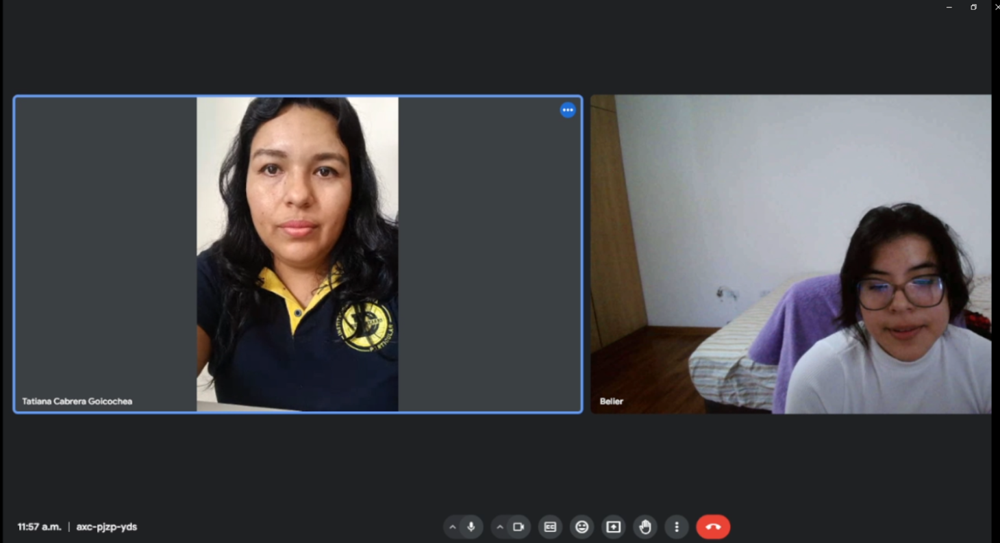

**Nombre:** Tatiana Cabrera Goicoechea

**Edad:** 33 años

**Ubicación:** Vive en el distrito de Paiján, provincia de Ascope, departamento de la Libertad

**Ocupación:** Docente del nivel secundario

**Time-stamp:** (Comienzo 20:34 - Fin 27:34) 

**Experiencia con Herramientas Digitales:**
Tatiana describe su experiencia con las herramientas digitales en el ámbito educativo como positiva. Destaca cómo estas herramientas facilitan una clase más interactiva, permiten una mejor comunicación con los estudiantes y contribuyen a que las clases sean más fluidas. Valora el uso de aplicaciones, transmisiones en vivo y proyectores multimedia para presentar material didáctico de manera eficiente.

**Canales y Herramientas Digitales Utilizados:**
- Excel: Para el registro de notas, aprovechando su capacidad para insertar fórmulas y calcular promedios automáticamente.
- PowerPoint: Para la transmisión de clases, buscando formas de hacer las presentaciones más interactivas para los estudiantes.
- Menciona también la importancia de dispositivos tecnológicos en el aula, como laptops o tablets, para facilitar el acceso a recursos educativos.

**Expectativas sobre Soluciones Tecnológicas:**
Espera una mayor integración de herramientas tecnológicas en las aulas, incluyendo dispositivos como laptops o tablets de manera permanente. Aspira a soluciones que permitan a los docentes gestionar su trabajo de manera más eficiente sin tener que transportar equipos de un lugar a otro.

**Desafíos Actuales y Visión Futura:**
Uno de los principales desafíos es la transición de los registros manuales a sistemas digitales, como pasar la información de registros auxiliares a aplicaciones específicas. Enfatiza la necesidad de una aplicación que facilite este proceso, integrando fórmulas para el cálculo de notas de manera automática y que soporte la gestión académica de manera integral.

**Segmento objetivo #2: Equipo Administrativo**

#### Entrevista #1:
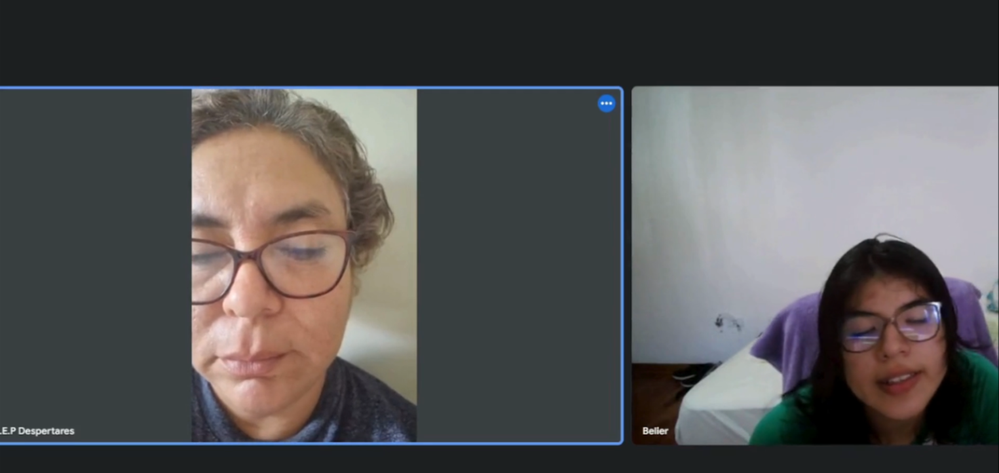

**Nombre:** Graciela del Rocío Ríos Alza

**Edad:** 51 años
Ubicación: La Libertad, Trujillo

**Ocupación:** Promotora de una institución educativa

**Time-stamp:** (Comienzo 00:00 - Fin 7:54) 

**Experiencia con Herramientas Digitales:**
Rocío ha tenido una experiencia positiva con las herramientas digitales, especialmente durante y después de la pandemia, que obligó a su institución a adoptar nuevas tecnologías. Destaca el uso de libros digitales proyectados en las aulas, lo que ha permitido continuar utilizando algunas de estas herramientas en el presente para hacer las clases más interactivas y eficientes.

**Canales y Herramientas Digitales Utilizados:**
- Libros Digitales: Utilizados para proyección en las aulas, facilitando el acceso al material didáctico y haciendo la enseñanza más interactiva.
- Excel: Empleado para la gestión de infraestructura escolar, permitiendo una organización más eficiente de los recursos y facilidades del colegio.
- Laptop, Computadora y Celular: Herramientas esenciales en su trabajo diario para acceder a recursos educativos, gestionar la administración escolar y comunicarse.
- WhatsApp, Facebook e Instagram: Utilizados como medios de comunicación para promocionar el colegio, mantener informados a los padres de familia y la comunidad escolar sobre eventos, noticias y logros del instituto.

**Expectativas sobre Soluciones Tecnológicas:**
Rocío expresa su interés en soluciones tecnológicas que faciliten la gestión de la asistencia de los estudiantes, sugiriendo un sistema que notifique a los padres sobre los horarios de entrada y salida de sus hijos. Esta funcionalidad ayudaría a mejorar la comunicación con las familias y garantizaría una mayor tranquilidad respecto al cumplimiento de los horarios escolares por parte de los alumnos.

**Desafíos Actuales en la Gestión Educativa:**
Uno de los principales retos es la gestión manual del inventario de útiles escolares y materiales de clase, así como la supervisión de la infraestructura escolar para asegurar el bienestar de los estudiantes, especialmente de los más pequeños. Rocío menciona el desafío de pasar de registros auxiliares manuales a un sistema digitalizado que pueda integrarse fácilmente con herramientas como Excel.

**Implementación de Soluciones Tecnológicas:**
Recientemente, se ha implementado el uso de marcadores electrónicos para la asistencia, reemplazando los registros manuales por un sistema que genera automáticamente un archivo Excel. Esto ha representado un avance significativo en la administración escolar. Además, se contempla la posibilidad de desarrollar una página web donde los padres puedan consultar notas, tareas e incidencias relacionadas con sus hijos.

**Funciones Deseadas en una Aplicación para la Gestión Educativa:**
Para el equipo administrativo, sería ideal contar con una aplicación que permita a los docentes ingresar sus actividades diarias y comentarios sobre el desarrollo de las clases, facilitando así que la dirección tenga un panorama completo de lo que sucede en la institución. Además, para mejorar la eficiencia operativa y la experiencia educativa, Rocío sugiere una solución digital que centralice la información relevante sobre notas, asistencias, tardanzas y comportamiento de los estudiantes, manteniendo así informados a los padres de familia.

**Reflexiones Finales:**
La entrevista con Graciela del Rocío Ríos subraya la importancia de integrar tecnología en la gestión educativa para simplificar procesos administrativos y fortalecer la comunicación con las familias. La adopción de herramientas digitales, como los libros digitales y los marcadores electrónicos para la asistencia, representa pasos hacia una educación más interactiva y eficiente. 

#### Entrevista #2:

**Nombre:** Paul Ramos Chumpitazi

**Edad:** 54 años

**Ubicación:** la Libertad, Paijan

**Ocupación:** Docente del nivel secundario, además de desempeñarse en la parte administrativa de una institución educativa

**Time-stamp:** (Comienzo 08:10 - Fin 19:19) 

**Expectativas sobre Soluciones Tecnológicas para la Gestión Educativa:**
Paul espera integrar más tecnología en el colegio, permitiendo a los padres de familia interactuar constantemente con la institución para obtener información sobre asistencias, notas y otros aspectos relevantes de sus hijos. La meta es reducir la brecha digital y ofrecer servicios comparables a los de colegios en grandes ciudades, pero ajustados a la realidad de una institución en provincia.

**Canales y Herramientas Digitales Utilizados:**
- Proyectores Multimedia y Televisores Android: Utilizados para la presentación de contenido educativo de manera dinámica e interactiva, facilitando un aprendizaje más interactivo.
- Photoshop Electrónicos y Marcadores: Implementados en la entrada del colegio para registrar asistencias de forma eficiente, tanto de estudiantes como de docentes.
- Cámaras de Video: Con aproximadamente 60 cámaras instaladas en la institución, se emplea la aplicación Verisure para la gestión y monitoreo a través de celulares, aumentando la seguridad y supervisión dentro del colegio.
- WhatsApp: Utilizado para la comunicación rápida y efectiva tanto con el personal de la institución como con los padres de familia, facilitando el intercambio de información importante de manera instantánea.
- Excel: Empleado para la gestión y organización de horarios, seguimiento de alumnos, y control de inventarios, entre otros aspectos administrativos y educativos.
- Navegador Google Chrome: Preferido para el acceso a recursos en línea, búsqueda de información y uso de aplicaciones web educativas y administrativas.

**Desafíos Actuales en la Gestión Educativa:**
Los retos incluyen cambiar el manejo manual de asistencias por un sistema electrónico y mejorar el control del personal docente a través de la tecnología. También se menciona la necesidad de un software para gestionar inventarios de útiles y equipos escolares, así como la capacidad de las aulas según los requerimientos de defensa civil.

**Implementación de Soluciones Tecnológicas:**
Hasta el momento, se han utilizado plantillas en Excel para horarios y seguimiento de alumnos. Sin embargo, Paul subraya la urgencia de adoptar soluciones tecnológicas más avanzadas para la gestión administrativa, de inventario y de infraestructura tecnológica, preferentemente alojadas en la nube para un acceso fácil y remoto.

**Funciones Deseadas en una Aplicación para la Gestión Educativa:**
La gestión del alumno es vista como la función más importante. Paul enfatiza en proporcionar a los padres herramientas que les permitan estar constantemente informados sobre la educación de sus hijos, incluyendo accesos, notas, fechas de exámenes y presentación de trabajos, buscando así una participación activa de los padres en el proceso educativo.

#### Entrevista #3:

**Nombre:** Juliana Gisela Chávez Pozo

**Edad:** 31 años

**Ubicación:** Distrito de Paiján, provincia de Ascope, La Libertad

**Ocupación:** Docente y directora de un colegio privado

**Time-stamp:** (Comienzo 19:30 - Fin 29:48)
 

**Canales y Herramientas Digitales Utilizados:**
- Proyectores en Aulas: En el nivel secundario, para presentaciones y lecciones interactivas.
- Televisores: Utilizados inicialmente antes de la implementación de proyectores.
- Excel: Empleado para la gestión y organización de horarios, seguimiento de alumnos, y control de inventarios, entre otros aspectos administrativos y educativos.
- Grupos de WhatsApp: Para comunicación rápida y eficiente con padres de familia y docentes, facilitando el envío de comunicados y documentos importantes.

**Desafíos Actuales en la Gestión Educativa:**
Un reto significativo es la ausencia de un sistema digital para el inventario de materiales educativos, lo que dificulta la localización y gestión de recursos disponibles. La experiencia de buscar materiales sin un sistema organizado ha demostrado la necesidad de mejorar este aspecto.

**Funciones Deseadas en una Aplicación para la Gestión Educativa:**
La interactividad es vista como una característica crucial, con la capacidad de enviar y recibir documentos e información instantáneamente a través de internet siendo particularmente útil. La tecnología, especialmente aplicaciones que facilitan la comunicación, se considera un complemento esencial para la enseñanza presencial.

**Reflexiones Finales:**
Juliana subraya la importancia de la tecnología como apoyo en la educación, pero insiste en que no puede reemplazar la interacción humana y la presencia física del docente en el aula. La tecnología debe usarse para complementar y enriquecer la experiencia educativa, facilitando la comunicación y el acceso a la información, pero siempre dentro del marco de una educación presencial de calidad.

### 2.2.3. Análisis de entrevistas
#### Segmento Objetivo #1: Profesores

Basándonos en las entrevistas realizadas, se pueden extraer varias características comunes y expectativas hacia soluciones tecnológicas en el ámbito educativo. 

**Experiencia con herramientas digitales y las herramientas más utilizadas:**
Todos los entrevistados han adoptado herramientas digitales en su metodología de enseñanza. Esto se vio acelerado durante la pandemia, destacando un cambio positivo hacia una enseñanza más dinámica e interactiva.

Las herramientas digitales usadas son las siguientes:

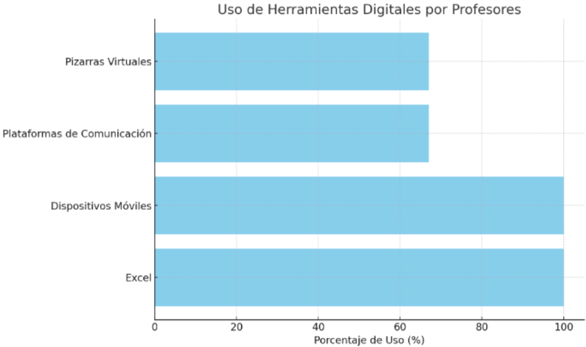

- Excel para la gestión de calificaciones y asistencias (100% de los entrevistados).
- Dispositivos móviles y laptops para flexibilidad y acceso a recursos (100%).
- Plataformas de comunicación directa (Gmail y WhatsApp) con padres de familia (67%).
- Pizarras virtuales y aplicaciones educativas para presentar material didáctico (67%)

**Expectativas sobre Soluciones Tecnológicas**

Simplificación y optimización de la administración escolar: Un deseo común es contar con soluciones tecnológicas que centralicen y faciliten la gestión escolar, desde calificaciones hasta la comunicación con todos los actores educativos (100%).
*Intuitividad y accesibilidad:* Las herramientas deben ser fáciles de usar, accesibles para todos los usuarios, y diseñadas teniendo en cuenta la realidad de cada colegio (100%).

**Desafíos Actuales**

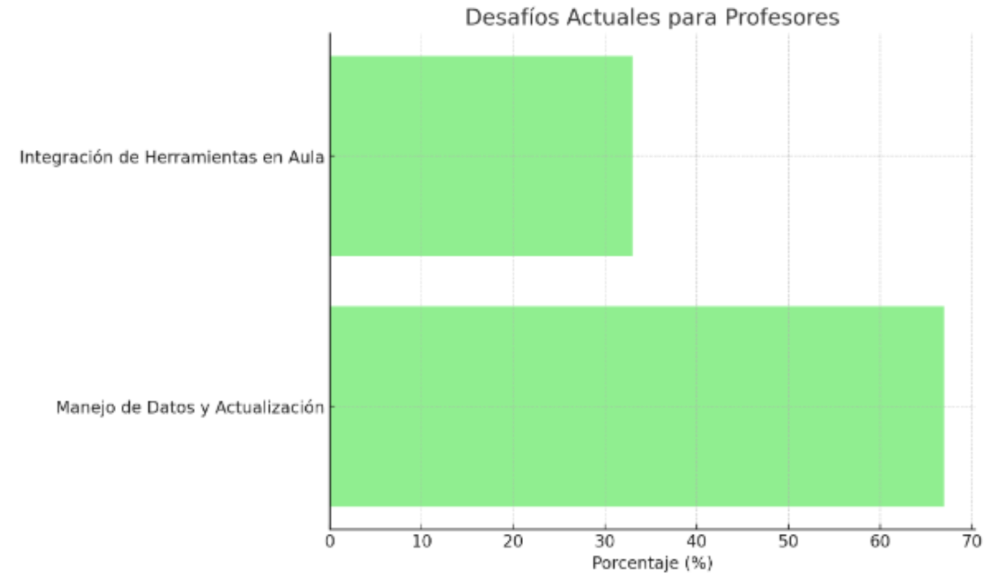

- Manejo del volumen de datos de estudiantes y actualización en tiempo real: La necesidad de sistemas que permitan una gestión eficiente y confidencial de la información de los estudiantes es un desafío destacado (67%).
- Integración de herramientas en el aula: La transición de registros manuales a sistemas digitales, y la inclusión de dispositivos como laptops o tablets en el aula de manera permanente, se ve como un reto importante (33%).

#### Segmento objetivo #2: Equipo Administrativo

Las entrevistas realizadas al equipo administrativo de instituciones educativas revelan una clara visión hacia la integración y la optimización de la gestión educativa mediante el uso de tecnologías digitales.

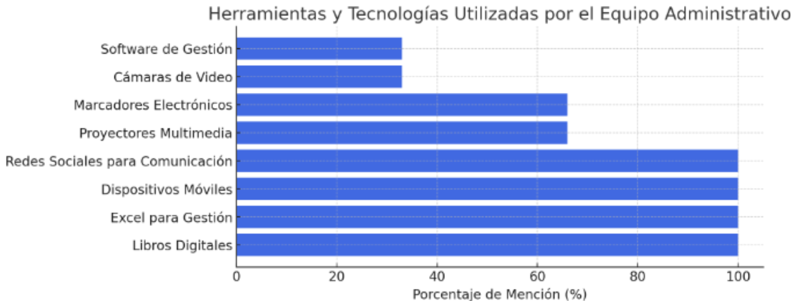

- Libros Digitales, Excel para Gestión, Dispositivos Móviles, y Redes Sociales para Comunicación tienen una mención del 100%, lo que indica su adopción universal entre los entrevistados.
- Proyectores Multimedia y Marcadores Electrónicos se mencionan en dos tercios de las entrevistas, sugiriendo una adopción significativa.
- Cámaras de Video y Software de Gestión se mencionan en un tercio de las entrevistas, indicando una adopción más limitada o específica.

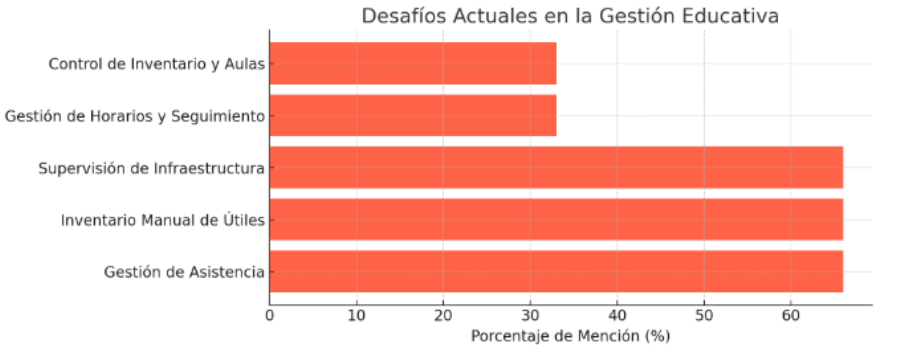

- Gestión de Asistencia, Inventario Manual de Útiles, y Supervisión de Infraestructura son desafíos destacados por dos tercios de los entrevistados, resaltando áreas claves para mejoras tecnológicas.
- Gestión de Horarios y Seguimiento, Control de Inventario y Aulas son mencionados por un tercio, lo que muestra otros retos importantes, aunque con una mención menos frecuente.

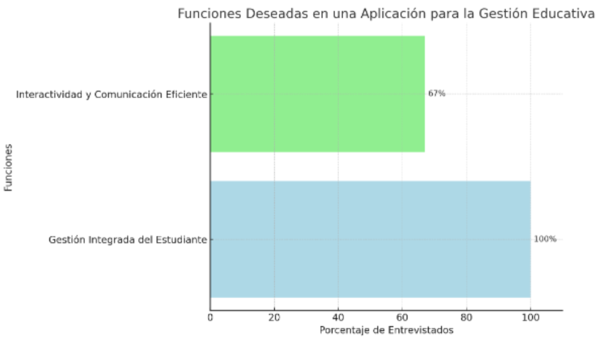

- Gestión Integrada del Estudiante: 100% de los entrevistados subrayaron la necesidad de una herramienta que centralice la información académica relevante, lo que sugiere una demanda universal de soluciones integradas de gestión del estudiante.
- Interactividad y Comunicación Eficiente: 67% de los entrevistados enfatizaron la importancia de la interactividad y la comunicación eficiente a través de tecnología digital.

## 2.3. Needfinding. 

En nuestro análisis de los segmentos objetivos, hemos identificado las siguientes necesidades principales que deben ser resueltos:

**Segmento 1: Profesores**

Herramientas que les permitan automatizar tareas como el registro de calificaciones y asistencias para reducir la carga de trabajo manual y liberar tiempo para centrarse en la enseñanza.

Acceso rápido y fácil a datos sobre el bienestar psicológico de los estudiantes para poder proporcionar apoyo individualizado de manera oportuna.

Las herramientas deben ser intuitivas y fáciles de usar, con interfaces que permitan a los profesores realizar sus tareas de manera eficiente y sin complicaciones.

**Segmento 2: Equipo Administrativo**

Herramientas que les permitan optimizar el uso de aulas y recursos escolares, incluyendo la gestión del mantenimiento de la infraestructura y el control de inventarios.

Garantizar un entorno escolar seguro, por lo que necesitan soluciones que les ayuden a monitorear y mejorar la seguridad en la escuela.

Simplificar las tareas administrativas y mejorar la eficiencia operativa de la institución, permitiéndo centrarse en la mejora continua de los procesos educativos.

### 2.3.1. User Personas

Para poder conseguir una comprensión más completa de nuestra audiencia, hemos elaborado dos User Persona, que representan de manera ficticia a un usuario dentro de cada uno de nuestros segmentos. Este perfil incluye detalles sobre su experiencia de vida, motivaciones, frustraciones y objetivos. Esta herramienta nos permitirá establecer una conexión más sólida con el cliente ideal de nuestro producto. Facilitando el desarrollo de mejoras que satisfagan de manera óptima las necesidades de nuestros usuarios.

**Segmento 1: Profesores**

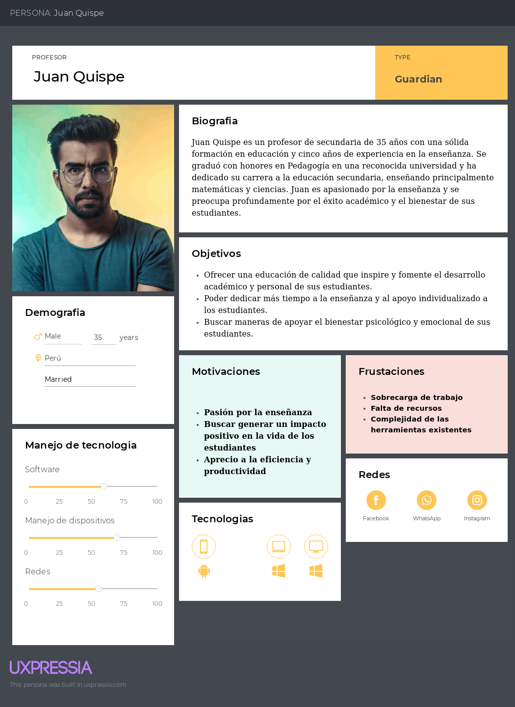

**Segmento 2: Equipo Administrativo**

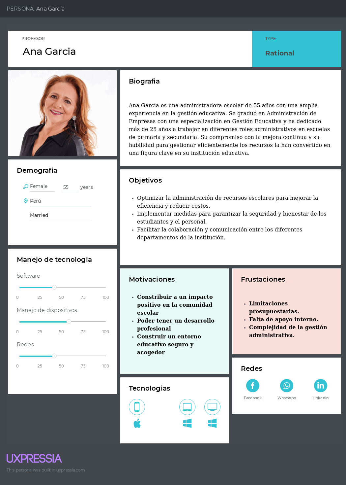

### 2.3.2. User Task Matrix
<html>
<body>
    <h2>User Task Matrix</h2>
    <table>
        <tr>
            <th rowspan="2">User Task</th>
            <th colspan="2">Henry Silva (Contratista)</th>
            <th colspan="2">Danilo Alves (Remodelador)</th>
        </tr>
        <tr>
            <th>Frecuencia</th>
            <th>Importancia</th>
            <th>Frecuencia</th>
            <th>Importancia</th>
        </tr>
        <tr>
            <td>Registro de calificaciones</td>
            <td>Siempre</td>
            <td>Alta</td>
            <td>Poco</td>
            <td>Media</td>
        </tr>
        <tr>
            <td>Seguimiento del bienestar psicológico de los estudiantes</td>
            <td>A menudo</td>
            <td>Alta</td>
            <td>A menudo</td>
            <td>Alta</td>
        </tr>
        <tr>
            <td>Preparación de material didáctico</td>
            <td>Muy a menudo</td>
            <td>Media</td>
            <td>Poco</td>
            <td>Media</td>
        </tr>
        <tr>
            <td>Atención a necesidades individuales de estudiantes</td>
            <td>A menudo</td>
            <td>Alta</td>
            <td>Siempre</td>
            <td>Alta</td>  
        </tr>
        <tr>
            <td>Reuniones con padres y tutores</td>
            <td>A menudo</td>
            <td>Media</td>
            <td>Poco</td>
            <td>Media</td>  
        </tr>
        <tr>
            <td>Gestión de recursos escolares</td>
            <td>A menudo</td>
            <td>Media</td>
            <td>A menudo</td>
            <td>Alta</td>  
        </tr>
        <tr>
            <td>Implementación de medidas de seguridad</td>
            <td>A menudo</td>
            <td>Alta</td>
            <td>Muy a menudo</td>
            <td>Alta</td>  
        </tr>
        <tr>
            <td>Coordinación de actividades extracurriculares</td>
            <td>Poco</td>
            <td>Media</td>
            <td>Muy a menudo</td>
            <td>Media</td>  
        </tr>
        <tr>
            <td>Comunicación con padres y personal docente</td>
            <td>Muy a menudo</td>
            <td>Alta</td>
            <td>A menudo</td>
            <td>Alta</td>  
        </tr>
        <tr>
            <td>Seguimiento de presupuesto</td>
            <td>A menudo</td>
            <td>Media</td>
            <td>Siempre</td>
            <td>Alta</td>  
        </tr>
    </table>
</body>
</html>

### 2.3.3. User Journey Mapping

En esta seccion, presentamos dos User Journey Maps que representan las experiencias actuales de dos segmentos.

**Juan Quispe**

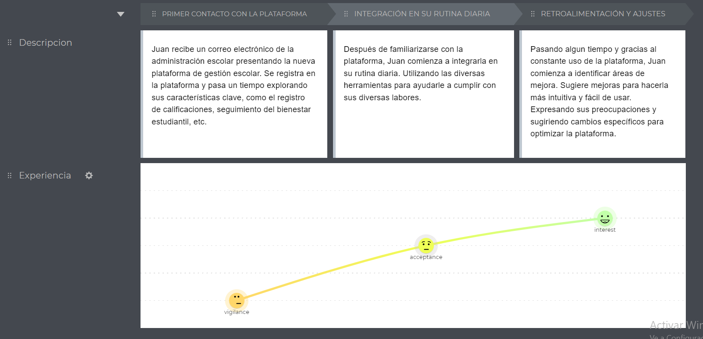

**Ana Garcia**

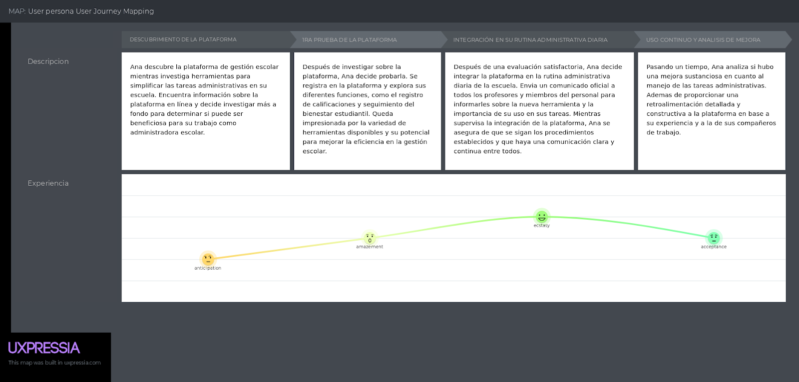

### 2.3.4. Empathy Mapping

**Juan Quispe**

**Ana Garcia**

### 2.3.5. As-is Scenario Mapping

En esta sección, presentamos los "As-Is Scenario Maps" para dos User Personas.

**Segmento 1:**
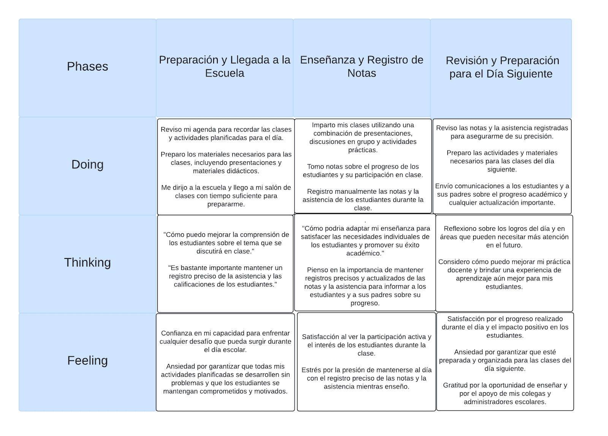

**Segmento 2:**

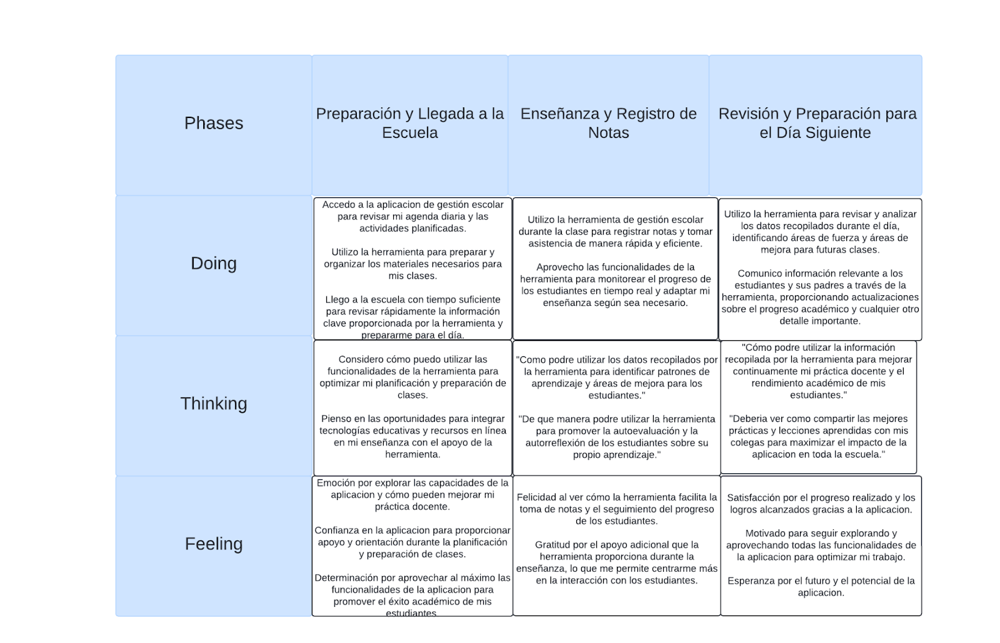

## 2.4. Ubiquitous Language.

El **lenguaje ubicuo**, es una parte fundamental de la estrategia de UX. Se refiere al conjunto de términos y frases que se utilizan de manera consistente en toda la aplicación para referirse a conceptos, acciones y elementos clave.
El lenguaje ubicuo tiene los siguientes beneficios:

- **Mejora la usabilidad:** Los usuarios pueden comprender fácilmente la aplicación y navegar por ella sin confusiones.
- **Aumenta la accesibilidad:** El uso de un lenguaje claro y conciso facilita el uso de la aplicación para personas con diferentes niveles de alfabetización y habilidades cognitivas.
- **Refuerza la marca:** Un lenguaje único y consistente ayuda a crear una identidad de marca fuerte y memorable.
- **Promueve la colaboración:** Facilita la comunicación entre los equipos de diseño, desarrollo y marketing.

**Glosario:**
- **Teacher(profesor):** a cada profesor se le asignan secciones sobre las cuales puede pasar asistencia, además cuenta con poder de solicitar inventario y crear salidas para los alumnos de las secciones asignadas
- **Administrador(administrador):** los administradores aprueban las solicitudes de inventario hechas por los profesores, pueden además crear salidas para cualquier alumno y tienen acceso a información de matrícula, tienen poder de asignar alumnos, cursos, secciones y grados
- **Student(estudiante):** los estudiantes son asignados una sección por cada curso qué lleven, además de un profesor tutor, los cursos y secciones son modificados según grado. Los alumnos no son usuarios del sistema
- **Item:** objeto de inventario solicitado
- **Assistance(asistencia):** la asistencia es pasada diariamente por los profesores tutores para cada alumno
- **Grade (grado):** grupo de alumnos por edad
- **Course(curso):** curso de materia de aprendizaje, varía por grado
- **Section(salón):** división de curso
- **Guardian(apoderado):** padre o apoderado del alumno, información importante sobre este debe ser comunicada con urgencia, incluyendo confirmación de salidas y estados de matrícula
- **Tuition(matrícula):** monto cobrado mensualmente a cada alumno, el estado depende de cuánto tiempo ha pasado desde el cobro
- **Excused departure(salidas):** salidas de los alumnos de clase monitoreadas por profesores o administrativos, razones válidas podrían ser, visita con el psicólogo del colegio, salidas solicitadas por apoderados con propósito de visita médica o salidas a la enfermería
