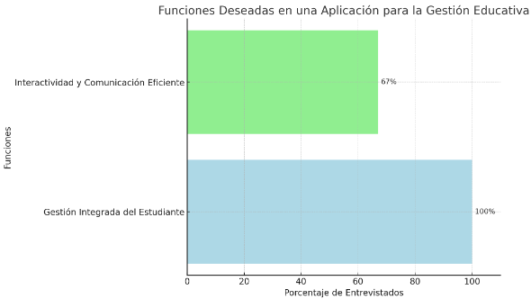
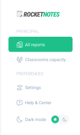
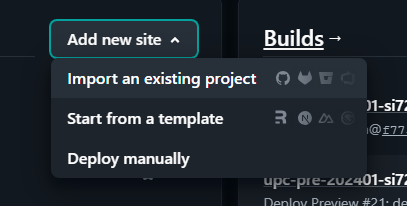



`  `

**Universidad Peruana de Ciencias Aplicadas**

Ingeniería de software

Aplicaciones web

SW51

**Informe del Trabajo Final**

Alex Humberto Sánchez Ponce

Rocket

*“RocketOrganize”*

|**Integrantes**|**Código**|
| :-: | :-: |
|Ayquipa Ubaldo, Abraham Israel|U202218475|
|Mayuri Armas, Jose Carlo |U2020111437|
|Vilchez Rios, Mateo Alejandro |U202210059|
|Ramos Rios, Belen del Rocio|U202216246|
|Vargas Revollé, Ariana|U20221A928|

Marzo de 2024-01

**Registro de Versiones del Informe**
**

|**Versión**|**Fecha**|**Autor**|**Descripción de modificación**|
| :-: | :-: | :-: | :-: |
|#01|08/04/2024|Todos los participantes|Elaboración del capítulo 1: Introducción|

**Student Outcome**

|**Criterio Específico**|**Acciones Realizadas**|**Conclusiones**|
| :- | :- | :- |
|La capacidad de identificar, formular y resolver problemas complejos de ingeniería aplicando los principios de ingeniería, ciencia y matemática.|
**Mateo Vilchez Rios**

**TB1**

** En esta etapa del proyecto de ingeniería, comuniqué eficazmente ajustes y hallazgos clave a un público diverso, tras realizar impact mapping y needfinding. Adapté nuestras estrategias para reflejar estas revisiones, asegurando comprensión y cohesión en el equipo, y promoviendo una ejecución alineada y efectiva del proyecto.

**Belen Ramos Rios**

**TB1**

Tras aplicar Lean UX Canvas, realizar entrevistas y definir User Personas, comuniqué estrategias y ajustes claves al equipo y stakeholders, asegurando alineación y adaptabilidad en nuestro proyecto de ingeniería, facilitando así una ejecución cohesiva y orientada al usuario.

**Jose Mayuri Armas**

**TB1**

Después de elaborar los diagramas C4, crear el Product Backlog, realizar un análisis competitivo y diseñar wireflows, comuniqué efectivamente los resultados y estrategias al equipo y stakeholders, fortaleciendo la dirección y cohesión del proyecto con una visión clara y un enfoque competitivo.  **Ariana Vargas Revollé**

**TB1**

Habiendo desarrollado el diagrama de clases, estructurado la base de datos y definido el lenguaje ubicuo, comuniqué avances y estrategias claras al equipo, asegurando una base sólida y un entendimiento común para la implementación efectiva y cohesiva de nuestro proyecto tecnológico.

**Abraham Ayquipa Ubaldo**

**TB1**

Tras diseñar la landing page, crear wireframes y mockups, y organizar sprints, comuniqué progresos y ajustes al equipo y stakeholders, asegurando una visión compartida y fomentando la colaboración efectiva para avanzar ágilmente en el desarrollo y refinamiento de nuestro proyecto.

|Se identificó un problema y se trabaja en su solución.|
|Elaborar una propuesta de solución a una problemática o lograr mejora de una solución ya existente a través de la innovación.** |
**Mateo Vilchez Rios**

**TB1:** En esta etapa del proyecto, identifiqué una problemática central en la interacción usuario-sistema, proponiendo una innovadora solución de interfaz gráfica. Esta propuesta se basa en el uso de tecnologías emergentes para mejorar la accesibilidad y la experiencia del usuario. La solución fue validada mediante prototipos de alta fidelidad, sometidos a pruebas de usabilidad que demostraron una mejora significativa en la eficiencia y satisfacción de los usuarios.

**Belen Ramos Rios**

**TB1:** Mi contribución se centró en la identificación de una brecha en la experiencia de usuario dentro de nuestro sistema actual. Diseñé una solución innovadora que involucra una plataforma colaborativa que facilita la interacción entre los usuarios y el sistema, promoviendo un enfoque más personalizado y dinámico. Esta solución se validó a través de iteraciones de diseño centradas en el usuario, mejorando significativamente la engagement y la retención de usuarios.

**Jose Mayuri Armas**

**TB1:** Detecté una deficiencia en la manera en que nuestro sistema gestionaba y presentaba la información a los usuarios. Desarrollé una solución basada en algoritmos de aprendizaje automático para personalizar la presentación de contenido, aumentando la relevancia y la utilidad para el usuario final. La implementación de esta solución resultó en una mejora notable en la satisfacción del usuario y en la eficiencia de la navegación dentro de la plataforma.

**Ariana Vargas Revollé**

**TB1:** Identifiqué un reto significativo en el rendimiento y escalabilidad de nuestro sistema. Propuse una solución innovadora mediante la optimización de nuestra arquitectura de backend y la implementación de microservicios, lo que resultó en una mejora sustancial en la capacidad de respuesta y la escalabilidad del sistema. Esta solución fue crucial para soportar un mayor volumen de usuarios simultáneos sin comprometer la experiencia del usuario.

**Abraham Ayquipa Ubaldo**

**TB1:** Mi enfoque estuvo en la mejora de la interfaz de usuario para nuestra landing page, identificando oportunidades de innovación en el diseño y la usabilidad. Implementé una serie de mejoras visuales y funcionales basadas en principios de UX modernos, lo que llevó a un aumento en la tasa de conversión y la satisfacción del usuario. Este trabajo subraya la importancia de un diseño centrado en el usuario para el éxito de proyectos digitales

|Cuando llegue el momento, estaremos listos para programar y darle un correcto funcionamiento.|

**Capítulo I: Introducción** 

1\.1. Startup Profile 
#### **1.1.1. Descripción de la Startup** 

En un entorno educativo que se vuelve cada vez más complejo, con instituciones lidiando con desafíos tanto operativos como pedagógicos, surge una necesidad evidente: simplificar la gestión académica y administrativa. Nuestra aplicación atiende directamente esta demanda, ofreciendo una solución que reduce la sobrecarga de tareas administrativas y facilita la atención a las necesidades individuales de cada estudiante.

Diseñada para hacer el día a día de los profesores más manejable, nuestra plataforma permite un registro eficiente y detallado de calificaciones y asistencia, así como el seguimiento del bienestar psicológico de los estudiantes. Por otro lado, ofrece herramientas para una gestión integral de la infraestructura escolar, abarcando desde el mantenimiento de equipos hasta la optimización del uso de aulas, incluyendo el monitoreo de seguridad. Además, integra un sistema de inventario para útiles escolares y una base de datos para materiales de clase, asegurando que los recursos necesarios estén siempre al alcance.

Misión: Empoderar a las instituciones educativas con una herramienta que aligera la carga administrativa del personal, mejora la gestión académica y promueve un ambiente educativo saludable y productivo.

Visión: Convertirnos en el aliado indispensable para educadores y administrativos, proporcionando la solución definitiva para una gestión educativa eficiente que mejore la experiencia de enseñanza y aprendizaje.

1\.1.2. Perfiles de integrantes del equipo

***Ayquipa Ubaldo Abraham Israel - U202218475***

Soy estudiante de la carrera de ingeniería de software, actualmente cursando el 5to ciclo de carrera. Aunque soy fullstack developer, tengo más inclinación por el desarrollo frontend. Mi stack arranca con Next.js(Framework de React) + Typescript para el front y Node.js + Express.js + MongoDB para el back. Como todo buen programador, me considero un eterno estudiante, por lo que me encuentro en este momento estudiando Docker y Redis.

`  	`***Mayurí Armas, Jose Carlo - U202011437***

Mi nombre es Jose, tengo 20 años. Elegí esta carrera ya que desde pequeño me fascinaba la tecnología y los diseños tanto de app, web, etc. Además, considero que tengo buenas habilidades para trabajar en grupo. Entre mis principales habilidades se encuentra la capacidad de guardar información, la empatía, el ser resiliente y tengo conocimiento en los lenguajes de C++,C#, python,JS,Kotlin y en frameworks como vue y angular.

***Vargas Revollé, Ariana - U200221A928***

Soy estudiante de la carrera de Ingeniería de Software cursando actualmente el 5to ciclo. Me interesa el rubro de ciberseguridad y me gusta leer sobre nuevas tecnologías y su impacto en la vida de las personas. Me gusta trabajar en equipo y aprender de otras personas. Conocimientos en HTML, CSS, C++, Python, SQL y MongoDB, JavaScript y familiar con los ambientes de POO, Lean UX, Agile Frameworks y Máquinas Virtuales

`	`***Vilchez Rios, Mateo Alejandro - U202210059***

Soy estudiante de la carrera de Ingeniería de Software cursando actualmente el 5to ciclo. Me considero una persona eficiente, disciplinada y responsable. Poseo conocimientos básicos en C++, Java y JavaScript. Manejo de Base de Datos relacionales. Me comprometo a brindar todo el apoyo necesario para cumplir con todos los requerimientos.

***Ramos Rios, Belén del Rocio- U202216246***

Actualmente estoy cursando el quinto ciclo de la carrera de Ingeniería de Software, etapa que ha reforzado mi sentido de responsabilidad y mi capacidad para colaborar eficazmente en equipo. Además de mis habilidades interpersonales, poseo conocimiento en lenguajes de programación como JavaScript (JS), C++, y SQL Estoy siempre en busca de nuevas oportunidades de aprendizaje que me permitan expandir mis conocimientos y contribuir de manera significativa en cualquier proyecto en el que participe

**1.2. Solution Profile** 
#### **1.2.1 Antecedentes y problemática** 

**Antecedentes**

En el ámbito educativo actual, las instituciones enfrentan una creciente complejidad operativa y pedagógica, agravada por la sobrecarga de tareas administrativas y el desafío de atender las necesidades individuales de cada estudiante. Este escenario exige una gestión eficiente que no solo aborde los aspectos académicos sino también la infraestructura, el bienestar de los estudiantes, y la optimización de recursos.

Tradicionalmente, la falta de herramientas integradas ha resultado en procesos ineficientes y una gestión fragmentada, lo que impacta negativamente en la calidad de la educación y en el ambiente laboral de los profesores y administrativos.

**Problemática**

La necesidad de simplificar la gestión académica y administrativa en las instituciones educativas es evidente. Los procesos manuales o sistemas desarticulados conducen a una gestión ineficaz, sobrecarga de trabajo para el personal, y un seguimiento insuficiente del progreso y bienestar de los estudiantes. Esto no solo afecta la calidad de la educación sino que también genera un ambiente laboral estresante y poco productivo para profesores y administrativos. La falta de una solución integral que abarque desde la gestión de calificaciones y asistencia hasta la infraestructura escolar y el bienestar estudiantil limita significativamente la capacidad de las instituciones para ofrecer una educación de calidad y un ambiente saludable y productivo. 

La aplicación que proponemos aborda directamente estos desafíos al ofrecer una solución integrada para la gestión académica y administrativa, permitiendo un registro eficiente de calificaciones y asistencia, así como un seguimiento proactivo del bienestar psicológico de los estudiantes.

- Who?

¿Quiénes enfrentan desafíos en la gestión académica y administrativa?

Los profesores y personal administrativo de instituciones educativas que lidian con procesos manuales o sistemas desarticulados.

- What? 

¿Qué aspectos de la gestión educativa se buscan mejorar con nuestra solución?

La eficiencia en el registro de calificaciones y asistencia, el seguimiento del bienestar de los estudiantes, y la gestión integral de la infraestructura escolar.

- Where?

¿Dónde se implementará esta solución para abordar la problemática?

En instituciones educativas de todo nivel y tamaño, buscando una cobertura geográfica amplia.

- When? 

¿Cuándo es el momento ideal para implementar nuestra solución en las instituciones educativas?

Tan pronto como las instituciones identifiquen la necesidad de mejorar su gestión educativa y estén dispuestas a adoptar tecnología innovadora.

- Why?

¿Por qué es crítica la necesidad de una solución como la nuestra en el contexto educativo actual?

Debido a la creciente complejidad y las demandas de un entorno educativo moderno que requiere atención personalizada y eficiencia administrativa.

- How? 

¿Cómo facilita nuestra solución la gestión académica y administrativa de las instituciones educativas?

Mediante una plataforma integrada que automatiza y optimiza los procesos, desde el seguimiento académico hasta la gestión de recursos, aliviando la carga administrativa y promoviendo un enfoque más centrado en el estudiante.

- How Much? 

La gestión eficiente de los recursos académicos y administrativos es crucial para el éxito de las instituciones educativas. Este estudio propone analizar cómo una aplicación integral de gestión académica puede transformar la operatividad de dichas instituciones, mejorando la comunicación, optimizando la gestión del tiempo y recursos, potenciando el seguimiento y evaluación del rendimiento estudiantil.

"Enhancing Efficiency in Education through Learning Management Systems: A Case Study of the Blackboard System" por Smith, John y Doe, Jane. Este artículo de investigación examina cómo un sistema de gestión del aprendizaje específico, Blackboard, puede aumentar la eficiencia y facilitar la gestión del aprendizaje para profesores y administradores en una universidad. El estudio presenta datos sobre la reducción de tiempo en tareas administrativas y la mejora en la distribución de materiales de curso.

#### **1.2.2 Lean UX Process**

### **1.2.2.1. Lean UX Problem Statements**  

`	`Nuestra aplicación ofrece soporte en la gestión del bienestar y rendimiento de los estudiantes y en los procesos administrativos de las instituciones educativas de educación básica.

Hemos observado que los factores principales que afectan a las escuelas son la dificultad que tienen para registrar y acceder a información fundamental sobre el mantenimiento de los equipos e infraestructura, capacidad de aforo en las instalaciones y el monitoreo de los escolares. Esto causa un empleo ineficaz del tiempo y del personal de la institución, lo cual resulta un proceso de la toma de decisiones poco eficiente.

¿Cómo podemos mejorar los procesos administrativos y de gestión estudiantil para que los colegios tengan más éxito basándonos en el tiempo y la cantidad de personal empleado en el proceso de la toma de decisiones?

**1.2.2.2. Lean UX Assumptions**

**Business Assumptions:**

1\. Creo que mis clientes necesitan optimizar los procesos administrativos y de gestión estudiantil.

2\. Estas necesidades se pueden resolver con una aplicación que ofrezca soporte en la gestión del bienestar  y rendimiento de los estudiantes, así como los procesos administrativos de las instituciones educativas.

3\. Mis clientes iniciales serán instituciones educativas públicas y privadas de educación básica.

4\. El valor #1 que un cliente quiere obtener de mi servicio es el soporte inmediato y eficaz en los procesos administrativos y de gestión estudiantil.

5\. El cliente también puede obtener beneficios adicionales como la mejora de la supervisión de los estudiantes y el uso óptimo de la capacidad en las instalaciones.

6\. Voy a adquirir la mayoría de mis clientes a través de estrategias de marketing a través de email y redes sociales.

7\. Voy a ganar dinero mediante un modelo de suscripción.

8\. Mi competencia principal en el mercado será aplicaciones con funcionalidades similares enfocadas en el sector educativo.

9\. Los venceremos debido a que nuestra aplicación se enfoca en optimizar los recursos de tiempo y personal mediante el soporte de procesos administrativos únicamente del sector educativo.

10\. Mi mayor riesgo es la resistencia al uso de nuevas tecnologías por parte de las instituciones educativas.

11\. Resolveremos esto mediante servicios de capacitación y una interfaz intuitiva para el usuario.

**User Assumptions:**

¿Quién es el usuario?

El usuario es principalmente el personal administrativo y docente de instituciones educativas de educación básica, como directores, secretarios, maestros y personal de apoyo.

¿Dónde encaja nuestro producto en su trabajo o vida?

Nuestro producto se integra en su vida laboral al proporcionar una herramienta centralizada para gestionar eficientemente los procesos administrativos y de gestión estudiantil en la escuela. Ayuda a simplificar tareas como el seguimiento de mantenimiento, la gestión de la capacidad de las instalaciones y el monitoreo del rendimiento de los estudiantes.

¿Qué problemas resuelve nuestro producto?

Nuestro producto resuelve problemas de ineficiencia en la gestión escolar al facilitar el acceso y la gestión de información relevante. Aborda la dificultad para registrar y acceder a datos sobre mantenimiento, capacidad y rendimiento estudiantil, lo que permite una toma de decisiones más informada y eficiente.

¿Cuándo y cómo se utiliza nuestro producto?

Nuestro producto se utiliza de manera regular durante la jornada laboral en la escuela, tanto por el personal administrativo para gestionar datos y realizar informes, como por los maestros para acceder a información sobre el rendimiento de los estudiantes y planificar sus actividades educativas.

¿Qué características son importantes?

Las características importantes incluyen un diseño intuitivo y fácil de usar, capacidad de personalización para adaptarse a las necesidades específicas de cada institución educativa, acceso rápido a información relevante sobre mantenimiento, capacidad y rendimiento estudiantil.

¿Cómo debería lucir y comportarse nuestro producto?

Nuestro producto debe tener una apariencia limpia y profesional, con una interfaz de usuario intuitiva que permita una navegación fácil y rápida. Debe comportarse de manera ágil y eficiente, ofreciendo respuestas rápidas y confiables a las consultas y acciones del usuario. Además, debe ofrecer notificaciones y alertas pertinentes para mantener a los usuarios informados sobre cambios importantes o eventos relevantes en la escuela.

**Business Outcomes:**

Aumento en la Retención de Clientes: 

Observaremos una mayor retención de clientes a largo plazo, lo que se refleja en una disminución de la tasa de abandono del producto y un aumento en los ingresos recurrentes.

Mejora en la reputación y confianza:

Observaremos una mejora en la confianza y la percepción de las instituciones educativas en el mercado hacia nuestro startup, reflejado en el aumento de suscripciones con una validez de 1 año.

Aumento en los ingresos:

Veremos un aumento en los ingresos debido al aumento de suscripciones a nuestra aplicación.

Mayor visibilidad en el mercado:

Observaremos que tenemos una mayor visibilidad en el mercado, lo que se refleja en la cantidad de instituciones que solicitan información y pruebas de la aplicación.

**User Outcomes:**

Mayor Eficiencia en el Trabajo:

Los usuarios podrán completar tareas administrativas y de gestión estudiantil de manera más eficiente, lo que les permitirá dedicar más tiempo a actividades educativas y estratégicas.

Toma de Decisiones Informada:

Los usuarios tendrán acceso rápido y fácil a información relevante sobre mantenimiento, capacidad y rendimiento estudiantil, lo que les permitirá tomar decisiones informadas y basadas en datos.

Reducción del Estrés Laboral:

Los usuarios experimentarán una reducción en el estrés relacionado con la gestión escolar al utilizar una plataforma intuitiva que simplifica sus tareas diarias y les brinda mayor control sobre los procesos.

Satisfacción Personal y Laboral:

Los usuarios experimentarán una mayor satisfacción personal y laboral al ver cómo nuestra solución mejora la eficiencia y efectividad de su trabajo, lo que podría conducir a una mayor motivación y compromiso con su labor educativa.

**Features:**

La implementación de un sistema de gestión de información centralizado y fácil de usar será valorado por los usuarios, ya que mejorará significativamente la accesibilidad y la eficiencia en la recuperación de datos relevantes sobre mantenimiento, capacidad y rendimiento estudiantil.

La creación de paneles de control personalizables será apreciada por los usuarios, ya que les permitirá visualizar y analizar rápidamente la información clave para la toma de decisiones, adaptándose a sus necesidades específicas y preferencias de presentación de datos.

La capacidad de personalización del sistema será un aspecto importante para los usuarios, ya que les permitirá adaptar la plataforma a las particularidades de su institución educativa y a sus propios flujos de trabajo, mejorando así la utilidad y la satisfacción general del producto.

La inclusión de herramientas de seguimiento de la asistencia y el comportamiento de los estudiantes será apreciada por los usuarios, ya que les ayudará a identificar tendencias y patrones relevantes para la intervención temprana y el apoyo personalizado a los estudiantes.

**1.2.2.3. Lean UX Hypothesis Statements**

**Hypothesis 1: Business outcomes.**

Creemos que, mejorando el acceso y la eficiencia en el seguimiento de mantenimiento, capacidad y rendimiento estudiantil, para el uso del personal administrativo y profesores de los colegios, nosotros lograremos obtener una mayor tasa de retención y aceptación por parte de las instituciones. Sabremos que es verdad cuando veamos un incremento en la cantidad de suscripciones y observemos que estas se mantienen activas al pasar los meses.

` `**Hypothesis 2:** **User outcomes.**

Creemos que, ofreciendo funcionalidades enfocadas en el soporte de los procesos necesarios para la gestión del bienestar y rendimiento del alumno y de la infraestructura del colegio, para el uso del personal administrativo y los profesores, nosotros lograremos que nuestros usuarios aumenten su productividad y motivación. Sabremos que es verdad cuando veamos reflejado en las encuestas hacia el personal un aumento de bienestar y satisfacción.

**Hypothesis 3: Business Assumption.**

Creemos que al ofrecer soporte inmediato y eficaz en los procesos administrativos y de gestión estudiantil, nosotros lograremos cubrir la necesidad principal de nuestros usuarios. Sabremos que es cierto cuando veamos que el 20% de los clientes que usen la prueba gratis se unen al plan de suscripción durante un periodo mínimo de 12 meses.

**Hypothesis 4: User Assumptions.**

Creemos que implementando una interfaz intuitiva y simple para el personal administrativo y profesores. Nosotros lograremos que los usuarios puedan registrar y acceder a datos sobre mantenimiento, capacidad y rendimiento estudiantil de forma rápida y eficaz. Sabremos que hemos tenido éxito  cuando se vea una disminución en la cantidad de personal y tiempo que requiere para realizar un procedimiento relacionado a la gestión estudiantil y de la infraestructura.

**Hypothesis 5: Features.**

Creemos que al ofrecer características altamente personalizables que cubren directamente las necesidades del personal administrativo y los profesores en la gestión escolar, lograremos una mayor aceptación y uso del producto. Sabremos que es cierto cuando veamos un aumento en la frecuencia de uso de las características recientemente implementadas y cuando los usuarios expresen su satisfacción con la capacidad de personalización de la aplicación.

**1.2.2.4. Lean UX Canvas**

**Link del Lean UX Canvas: [https://miro.com/welcomeonboard/NEdsWTNwa0FKdWVGUmlFUEJ6R3dldkpBRHNxRmNIeEdhNWVDNHhoRnBlZENuSElYbm1hN3JjNFNwOUJpdUIzWHwzNDU4NzY0NTIzMzkyNDUwNjk1fDI=?share_link_id=776423401253**](https://miro.com/welcomeonboard/NEdsWTNwa0FKdWVGUmlFUEJ6R3dldkpBRHNxRmNIeEdhNWVDNHhoRnBlZENuSElYbm1hN3JjNFNwOUJpdUIzWHwzNDU4NzY0NTIzMzkyNDUwNjk1fDI=?share_link_id=776423401253)**
## **1.3. Segmentos objetivo**

**Segmento objetivo #1: Profesores**

Aspectos demográficos:

- Sexo: Masculino y femenino.
- Edad: 30-60 años.
- Estado civil: Variado.
- Tamaño de la familia: Diverso, desde individuos solos hasta familias grandes.

Aspectos geográficos:

- Ubicación: Principalmente en ciudades con universidades y colegios.

Aspectos psicográficos:

- Valores: Alta valoración de la educación continua y el desarrollo profesional.
- Intereses: Fuerte interés en tecnologías y plataformas que faciliten la enseñanza y la investigación.
- Comportamiento: Compromiso con la calidad educativa y la mentoría estudiantil. Buscan constantemente mejorar la experiencia de aprendizaje y mantenerse actualizados en su campo.

**Segmento objetivo #2: Equipo Administrativo**

Aspectos demográficos:

- Sexo: Masculino y femenino.
- Edad: 25-55 años.
- Estado civil: Variado.
- Tamaño de la familia:  Diverso, desde individuos solos hasta familias grandes.

Aspectos geográficos:

- Ubicación: Mayormente ubicados en ciudades o áreas suburbanas.

Aspectos psicográficos:

- Valores: Importancia a la eficiencia, organización y optimización de procesos.
- Intereses: Altamente interesados en sistemas y software que simplifiquen la gestión administrativa y académica, reduciendo la carga de trabajo manual y automatizando procesos rutinarios.
- Comportamiento: El equipo administrativo busca optimizar procesos administrativos y la infraestructura educativa, valorando soluciones que les liberen tiempo para enfocarse en tareas estratégicas. Prefieren herramientas intuitivas, confiables y que faciliten la toma de decisiones a través de reportes detallados.

**Capítulo II: Requirements Elicitation & Analysis** 

2\.1. Competidores. 

En la industria educativa hay diferentes propuestas innovadoras que ayudan a modernizar la gestión educativa. Para afrontar nuestra startup se decidió realizar un análisis competitivo con tres competidores relevantes y conocidos en la industria que ofrecen diferentes herramientas y representan un soporte vital en múltiples entidades educativas.  

1\. Schoology

Es una plataforma de gestión educativa ampliamente reconocida que ofrece una variedad de herramientas para facilitar la enseñanza y el aprendizaje en entornos escolares. Su plataforma integra funciones de gestión de cursos, comunicación, colaboración y evaluación, proporcionando a profesores, estudiantes y padres una experiencia educativa en línea cohesionada.

2\. PowerSchool

Plataforma de gestión escolar líder en el mercado que ofrece soluciones integrales para la administración de datos académicos y organizativos. Su suite de productos incluye herramientas para el seguimiento de asistencia, calificaciones, programación de clases y comunicación con padres y estudiantes.

3\. Classe365

Plataforma educativa integral diseñada para satisfacer las necesidades de instituciones educativas en todo el mundo. Ofrece herramientas para la gestión de estudiantes, profesores, cursos, evaluaciones y comunicaciones, todo en un solo lugar.

2\.1.1. Análisis competitivo.

<table><tr><th colspan="6" valign="top"><b>Competitive Analysis Landscape</b></th></tr>
<tr><td valign="top">¿Por qué llevar a cabo este análisis?</td><td colspan="5" valign="top">El objetivo de este análisis es comprender el panorama competitivo del mercado educativo y evaluar las fortalezas, debilidades, oportunidades y amenazas de MiStartup frente a sus competidores.</td></tr>
<tr><td colspan="2" valign="top">Competidores</td><td valign="top">Rocket</td><td valign="top">Schoology</td><td valign="top">PowerSchool</td><td valign="top">Classe365</td></tr>
<tr><td rowspan="2" valign="top">Perfil</td><td valign="top">Overview</td><td valign="top">Plataforma integral para la gestión educativa en colegios, incluyendo registro de notas, seguimiento psicológico, gestión de infraestructura y monitoreo de instalaciones.</td><td valign="top">Plataforma de gestión educativa que ofrece funcionalidades similares a MiStartup.</td><td valign="top">Sistema de gestión escolar con enfoque en la administración de datos académicos y organizativos.</td><td valign="top">Plataforma educativa que proporciona herramientas de gestión escolar, incluyendo seguimiento de asistencia y calificaciones.</td></tr>
<tr><td valign="top">Ventaja competitiva ` `¿Qué valor ofrece a los clientes?</td><td valign="top">Ofrece una solución completa e integrada que aborda diversas necesidades de gestión educativa en un solo lugar.</td><td valign="top">Experiencia consolidada en el mercado y una amplia gama de funcionalidades personalizables.</td><td valign="top">Enfoque especializado en la gestión de datos académicos con herramientas de análisis y reportes avanzados.</td><td valign="top">Ofrece una plataforma intuitiva y fácil de usar para la gestión escolar con enfoque en la interacción estudiante-maestro.</td></tr>
<tr><td rowspan="2" valign="top">Perfil de Marketing</td><td valign="top">Mercado objetivo</td><td valign="top">Personal administrativo de colegios y profesores.</td><td valign="top">Personal educativo en instituciones de enseñanza de todos los niveles.</td><td valign="top">Colegios y distritos escolares en busca de una solución integral de gestión educativa.</td><td valign="top">Instituciones educativas interesadas en una plataforma flexible y fácil de usar.</td></tr>
<tr><td valign="top">Estrategias de marketing</td><td valign="top">Campañas dirigidas a resaltar la integralidad y eficiencia de la plataforma, destacando su capacidad para simplificar las tareas diarias de profesores y personal administrativo.</td><td valign="top">Marketing de contenido, demostraciones y testimonios de clientes para demostrar la eficacia y versatilidad de la plataforma.</td><td valign="top">Enfoque en la capacidad analítica y la generación de informes para respaldar la toma de decisiones educativas.</td><td valign="top">Promoción de una interfaz amigable y herramientas de colaboración para mejorar la comunicación en el entorno educativo.</td></tr>
<tr><td rowspan="3" valign="top">Perfil de producto</td><td valign="top">Productos & Servicios</td><td valign="top">Plataforma integral de gestión educativa, incluyendo registro de notas, seguimiento psicológico, gestión de infraestructura y monitoreo de instalaciones.</td><td valign="top">Plataforma de gestión educativa con herramientas de colaboración, seguimiento académico y gestión de contenido.</td><td valign="top">Sistema de gestión escolar con enfoque en la administración de datos académicos y organizativos.</td><td valign="top">Plataforma educativa con énfasis en la interacción estudiante-maestro, incluyendo seguimiento de asistencia y calificaciones.</td></tr>
<tr><td valign="top">Precios & Costos</td><td valign="top">Modelo de suscripción mensual escalable según el tamaño de la institución educativa.</td><td valign="top">Varía según el tamaño de la institución y el conjunto de características seleccionadas.</td><td valign="top">Basado en licencias de usuario o institución con opciones de personalización.</td><td valign="top">Modelo de suscripción anual o mensual basado en el número de estudiantes y personal.</td></tr>
<tr><td valign="top">Canales de distribución ` `(Web y/o Móvil)</td><td valign="top">Disponible en versión web y móvil.</td><td valign="top">Plataforma web con aplicación móvil complementaria.</td><td valign="top">Acceso a través de plataforma web con aplicaciones móviles adicionales.</td><td valign="top">Disponible en versión web y móvil.</td></tr>
<tr><td rowspan="4" valign="top">Análisis SWOT</td><td valign="top">Fortalezas</td><td valign="top">Amplia gama de funcionalidades integradas y enfoque en la simplificación de tareas educativas.</td><td valign="top">Experiencia consolidada y versatilidad de la plataforma.</td><td valign="top">Herramientas analíticas avanzadas y capacidad de personalización.</td><td valign="top">Interfaz intuitiva y enfoque en la experiencia del usuario.</td></tr>
<tr><td valign="top">Debilidades</td><td valign="top">Puede carecer de algunas características específicas ofrecidas por competidores más establecidos.</td><td valign="top">Posible complejidad en la curva de aprendizaje para usuarios nuevos.</td><td valign="top">Dependencia de la infraestructura tecnológica y posibles problemas de escalabilidad.</td><td valign="top">Limitaciones en la profundidad de las herramientas analíticas comparadas con competidores.</td></tr>
<tr><td valign="top">Oportunidades</td><td valign="top">Expansión a nuevos mercados y adición de características innovadoras.</td><td valign="top">Personalización y adaptación continua para satisfacer las necesidades cambiantes de los usuarios.</td><td valign="top">Integración con sistemas educativos existentes y expansión global.</td><td valign="top">Desarrollo de herramientas de colaboración y enfoque en la enseñanza remota.</td></tr>
<tr><td valign="top">Amenazas</td><td valign="top">Competencia creciente y posibilidad de obsolescencia tecnológica.</td><td valign="top">Entrada de nuevos competidores y cambios en las regulaciones educativas.</td><td valign="top">Vulnerabilidades de seguridad y riesgos de privacidad de datos.</td><td valign="top">Expectativas cambiantes de los usuarios y demanda de características adicionales.</td></tr>
</table>

2\.1.2. Estrategias y tácticas frente a competidores.

**Para capitalizar nuestras fortalezas, implementaremos las siguientes estrategias y tácticas:**

Destacaremos la amplia gama de funcionalidades integradas de nuestra plataforma, resaltando cómo simplifica las tareas educativas diarias de profesores y personal administrativo. Utilizaremos demostraciones en vivo, estudios de caso y testimonios de clientes para ilustrar cómo nuestra solución aborda múltiples aspectos de la gestión educativa en un solo lugar.

**En las debilidades:**

Identificaremos las características específicas ofrecidas por competidores más establecidos que podrían ser percibidas como carencias en nuestra plataforma. Luego, asignaremos recursos para desarrollar estas capacidades faltantes, ya sea mediante desarrollo interno o asociaciones estratégicas.

Dada la posible complejidad en la curva de aprendizaje para nuevos usuarios, nos enfocaremos en mejorar la experiencia del usuario a través de una interfaz intuitiva, tutoriales detallados y un sólido servicio de atención al cliente. 

**En cuanto a las oportunidades y amenazas externas, adoptaremos las siguientes estrategias y tácticas:**

Aprovecharemos la oportunidad de expansión a nuevos mercados y adaptamos nuestra plataforma para satisfacer las necesidades específicas de diferentes regiones. 

Dada la creciente preocupación por la seguridad y la privacidad de los datos, implementaremos medidas de seguridad para garantizar la protección de la información confidencial de nuestros usuarios. 
## **2.2. Entrevistas**
2\.2.1. Diseño de entrevistas. 

**Preguntas Generales para Ambos Segmentos:**

- ¿Cómo te llamas?
- ¿Qué edad tienes?
- ¿Dónde vives?
- ¿Cuál es tu ocupación actual?
- ¿Cómo describirías tu experiencia con las herramientas digitales en el ámbito educativo?
- ¿Qué expectativas tienes respecto a las soluciones tecnológicas para la gestión educativa?

**Preguntas Específicas para Profesores:**

- ¿Cuáles son los principales desafíos que enfrentas al llevar un registro eficiente de calificaciones y asistencia de tus estudiantes?

- ¿Cómo manejas actualmente el seguimiento del bienestar psicológico de tus estudiantes?

- ¿Has utilizado alguna plataforma o herramienta que te haya ayudado en la gestión académica? Si es así, ¿qué aspectos de esta herramienta encontraste más valiosos?

- ¿Qué funciones crees que son más importantes en una app para hacerte el trabajo más fácil?

**Preguntas Específicas para el Equipo Administrativo:**

- ¿Cuáles son los mayores retos que enfrentas en la gestión diaria de la infraestructura escolar?

- ¿Cómo gestionas actualmente el inventario de útiles escolares y la base de datos para materiales de clase?
- ¿Has implementado alguna solución tecnológica previamente para la administración escolar? ¿Cuál ha sido tu experiencia?

- ¿Qué funciones crees que son más importantes en una app para hacerte el trabajo más fácil?

- ¿Cómo crees que una solución digital podría mejorar la eficiencia operativa y la experiencia educativa en tu institución?

2\.2.2. Registro de entrevistas.

**Segmento objetivo #1: Profesores**

**Entrevista #1:** 

**Nombre:** Andrés Segovia Maya

**Edad:** 39 años

**Ubicación:**  Paiján, provincia de Ascope, en la Libertad

**Ocupación:** Profesor de matemáticas en una institución privada de Paiján

**URL: [Entrevistas_Segmento1 Profesores .mp4](https://upcedupe-my.sharepoint.com/:v:/g/personal/u202216246_upc_edu_pe/EZ6_iJ4S0bVMoKbp2HJlzqwBGmW-p9StM6YwnA0dAUdwJA?nav=eyJyZWZlcnJhbEluZm8iOnsicmVmZXJyYWxBcHAiOiJTdHJlYW1XZWJBcHAiLCJyZWZlcnJhbFZpZXciOiJTaGFyZURpYWxvZy1MaW5rIiwicmVmZXJyYWxBcHBQbGF0Zm9ybSI6IldlYiIsInJlZmVycmFsTW9kZSI6InZpZXcifX0%3D&e=XMFx2G)**  (Comienzo 00:00 - Fin 10:00)

**Experiencia con Herramientas Digitales:**

Andrés inició su experiencia con las herramientas digitales en la educación, principalmente durante la pandemia, calificándola como positiva y satisfactoria. Menciona que, aunque la integración de estas tecnologías ha sido beneficiosa, todavía hay margen para ampliar su uso en el entorno educativo.

**Canales y Herramientas Digitales Utilizados:**

- Excel: Para la gestión de calificaciones y asistencia de forma más eficiente.
- Browser: Google Chrome, utilizado en la preparación de clases.
- Zoom: Para la realización de clases virtuales de reforzamiento, permitiendo la interacción en tiempo real con los estudiantes.
- Pizarras Virtuales: Para dinamizar las lecciones y fomentar la participación activa, facilitando la explicación de conceptos complejos de manera visual e interactiva.
- Dispositivos: Laptop y celulares, esenciales para el desarrollo de su trabajo docente, permitiéndole flexibilidad y acceso inmediato a recursos y comunicaciones.
- Gmail y WhatsApp: Como medios de comunicación directa con los padres de familia, facilitando el seguimiento y apoyo constante, así como la distribución de anuncios y material educativo

.

**Expectativas sobre Soluciones Tecnológicas:**

Espera que las soluciones tecnológicas simplifiquen y optimicen la administración escolar, abarcando desde la gestión de horarios y calificaciones hasta la comunicación entre todos los stakeholders del entorno educativo. Subraya la importancia de que estas soluciones sean intuitivas, accesibles y fáciles de manejar.

**Desafíos Actuales y Visión Futura:**

Identifica como principales desafíos el manejo del volumen de datos de estudiantes, la necesidad de una actualización en tiempo real de calificaciones y asistencias, y el acceso confidencial a esta información. Ve la necesidad de una aplicación que centralice y facilite estos procesos, así como la importancia de herramientas que permitan la personalización según las necesidades específicas de cada institución y la fácil organización de recursos educativos.

**Reflexiones Finales:**

Andrés resalta la importancia de que las soluciones tecnológicas en educación sean diseñadas teniendo en cuenta la realidad y las necesidades específicas de cada colegio. Hace énfasis en la necesidad de que estas herramientas sean intuitivas para no complicar su uso y realmente faciliten la labor educativa, mejorando la comunicación y el seguimiento académico y psicológico de los estudiantes.

**Entrevista #2:** 

**Nombre:** Juan Carlos Rodríguez Carrion

**Edad:** 35 años

**Ubicación:** La Libertad, Casa Grande, provincia de Ascope

**Ocupación:** Docente en un colegio particular de Paiján

**URL: [Entrevistas_Segmento1 Profesores .mp4**](https://upcedupe-my.sharepoint.com/:v:/g/personal/u202216246_upc_edu_pe/EZ6_iJ4S0bVMoKbp2HJlzqwBGmW-p9StM6YwnA0dAUdwJA?nav=eyJyZWZlcnJhbEluZm8iOnsicmVmZXJyYWxBcHAiOiJTdHJlYW1XZWJBcHAiLCJyZWZlcnJhbFZpZXciOiJTaGFyZURpYWxvZy1MaW5rIiwicmVmZXJyYWxBcHBQbGF0Zm9ybSI6IldlYiIsInJlZmVycmFsTW9kZSI6InZpZXcifX0%3D&e=XMFx2G)** (Comienzo 10:06 - Fin 20:28)

**Experiencia con Herramientas Digitales:**

Juan Carlos testimonia una transformación positiva en la educación gracias al uso de herramientas digitales, que han hecho la enseñanza más dinámica y atractiva para los estudiantes. Señala cómo estas tecnologías han sustituido con ventaja las clases tradicionales, promoviendo un aprendizaje más interactivo.

**Canales y Herramientas Digitales Utilizados:**

- Jamboard: Para dinamizar las lecciones y fomentar la participación activa.
- Excel: Para la gestión de calificaciones y asistencia de forma más eficiente.
- WhatsApp: Como medio de comunicación directa con los padres de familia, facilitando el seguimiento y apoyo constante.
- Browser: Google Chrome, utilizado en la preparación de clases.
- Dispositivos: Laptop y móvil, esenciales para el desarrollo de su trabajo docente, permitiéndole flexibilidad y acceso inmediato a recursos y comunicaciones.

**Expectativas sobre Soluciones Tecnológicas:**

Con la llegada de la pandemia y el auge del aprendizaje en línea, Juan Carlos ha visto en las soluciones tecnológicas un pilar fundamental para la continuidad educativa. Valora la capacidad de estas herramientas para extender el alcance de la enseñanza más allá de las fronteras tradicionales, haciendo hincapié en la importancia de las clases virtuales.

**Desafíos Actuales y Visión Futura:**

Resalta los desafíos de la gestión manual de asistencias y calificaciones, apreciando las soluciones digitales actuales pero destacando la necesidad de sistemas más integrados. Imagina una plataforma integral que no solo mejore la gestión académica, sino que también facilite la comunicación con los padres, mediante notificaciones automáticas sobre el rendimiento y asistencia de los estudiantes.

**Entrevista #3:** 

**Nombre:** Tatiana Cabrera Goicoechea

**Edad:** 33 años

**Ubicación:** Vive en el distrito de Paiján, provincia de Ascope, departamento de la Libertad

**Ocupación:** Docente del nivel secundario

**URL: [Entrevistas Segmento 1 Profesores .mp4](https://upcedupe-my.sharepoint.com/:v:/g/personal/u202216246_upc_edu_pe/EZ6_iJ4S0bVMoKbp2HJlzqwBGmW-p9StM6YwnA0dAUdwJA?nav=eyJyZWZlcnJhbEluZm8iOnsicmVmZXJyYWxBcHAiOiJTdHJlYW1XZWJBcHAiLCJyZWZlcnJhbFZpZXciOiJTaGFyZURpYWxvZy1MaW5rIiwicmVmZXJyYWxBcHBQbGF0Zm9ybSI6IldlYiIsInJlZmVycmFsTW9kZSI6InZpZXcifX0%3D&e=XMFx2G)** (Comienzo 20:34 - Fin 27:34)

**Experiencia con Herramientas Digitales:**

Tatiana describe su experiencia con las herramientas digitales en el ámbito educativo como positiva. Destaca cómo estas herramientas facilitan una clase más interactiva, permiten una mejor comunicación con los estudiantes y contribuyen a que las clases sean más fluidas. Valora el uso de aplicaciones, transmisiones en vivo y proyectores multimedia para presentar material didáctico de manera eficiente.

**Canales y Herramientas Digitales Utilizados:**

- Excel: Para el registro de notas, aprovechando su capacidad para insertar fórmulas y calcular promedios automáticamente.
- PowerPoint: Para la transmisión de clases, buscando formas de hacer las presentaciones más interactivas para los estudiantes.
- Menciona también la importancia de dispositivos tecnológicos en el aula, como laptops o tablets, para facilitar el acceso a recursos educativos.

**Expectativas sobre Soluciones Tecnológicas:**

Espera una mayor integración de herramientas tecnológicas en las aulas, incluyendo dispositivos como laptops o tablets de manera permanente. Aspira a soluciones que permitan a los docentes gestionar su trabajo de manera más eficiente sin tener que transportar equipos de un lugar a otro.

**Desafíos Actuales y Visión Futura:**

Uno de los principales desafíos es la transición de los registros manuales a sistemas digitales, como pasar la información de registros auxiliares a aplicaciones específicas. Enfatiza la necesidad de una aplicación que facilite este proceso, integrando fórmulas para el cálculo de notas de manera automática y que soporte la gestión académica de manera integral.

**Segmento objetivo #2: Equipo Administrativo**

**Entrevista #1:** 

**Nombre:** Graciela del Rocío Ríos Alza

**Edad:** 51 años

**Ubicación:** La Libertad, Trujillo

**Ocupación:** Promotora de una institución educativa

**URL: [Entrevistas_Segmento2 Equipo Administrativo.mp4](https://upcedupe-my.sharepoint.com/:v:/g/personal/u202216246_upc_edu_pe/ET1SAV2zRHdEpOvQ03zXIzUBxwkD8ifZVKJqMl_9IQDA4g?nav=eyJyZWZlcnJhbEluZm8iOnsicmVmZXJyYWxBcHAiOiJTdHJlYW1XZWJBcHAiLCJyZWZlcnJhbFZpZXciOiJTaGFyZURpYWxvZy1MaW5rIiwicmVmZXJyYWxBcHBQbGF0Zm9ybSI6IldlYiIsInJlZmVycmFsTW9kZSI6InZpZXcifX0%3D&e=6K6Mcu)** (Comienzo 00:00 - Fin 7:54)

**Experiencia con Herramientas Digitales:**

Rocío ha tenido una experiencia positiva con las herramientas digitales, especialmente durante y después de la pandemia, que obligó a su institución a adoptar nuevas tecnologías. Destaca el uso de libros digitales proyectados en las aulas, lo que ha permitido continuar utilizando algunas de estas herramientas en el presente para hacer las clases más interactivas y eficientes.

**Canales y Herramientas Digitales Utilizados:**

- Libros Digitales: Utilizados para proyección en las aulas, facilitando el acceso al material didáctico y haciendo la enseñanza más interactiva.
- Excel: Empleado para la gestión de infraestructura escolar, permitiendo una organización más eficiente de los recursos y facilidades del colegio.
- Laptop, Computadora y Celular: Herramientas esenciales en su trabajo diario para acceder a recursos educativos, gestionar la administración escolar y comunicarse.
- WhatsApp, Facebook e Instagram: Utilizados como medios de comunicación para promocionar el colegio, mantener informados a los padres de familia y la comunidad escolar sobre eventos, noticias y logros del instituto.

**Expectativas sobre Soluciones Tecnológicas:**

Rocío expresa su interés en soluciones tecnológicas que faciliten la gestión de la asistencia de los estudiantes, sugiriendo un sistema que notifique a los padres sobre los horarios de entrada y salida de sus hijos. Esta funcionalidad ayudaría a mejorar la comunicación con las familias y garantizaría una mayor tranquilidad respecto al cumplimiento de los horarios escolares por parte de los alumnos.

**Desafíos Actuales en la Gestión Educativa:**

Uno de los principales retos es la gestión manual del inventario de útiles escolares y materiales de clase, así como la supervisión de la infraestructura escolar para asegurar el bienestar de los estudiantes, especialmente de los más pequeños. Rocío menciona el desafío de pasar de registros auxiliares manuales a un sistema digitalizado que pueda integrarse fácilmente con herramientas como Excel.

**Implementación de Soluciones Tecnológicas:**

Recientemente, se ha implementado el uso de marcadores electrónicos para la asistencia, reemplazando los registros manuales por un sistema que genera automáticamente un archivo Excel. Esto ha representado un avance significativo en la administración escolar. Además, se contempla la posibilidad de desarrollar una página web donde los padres puedan consultar notas, tareas e incidencias relacionadas con sus hijos.

**Funciones Deseadas en una Aplicación para la Gestión Educativa:**

Para el equipo administrativo, sería ideal contar con una aplicación que permita a los docentes ingresar sus actividades diarias y comentarios sobre el desarrollo de las clases, facilitando así que la dirección tenga un panorama completo de lo que sucede en la institución. Además, para mejorar la eficiencia operativa y la experiencia educativa, Rocío sugiere una solución digital que centralice la información relevante sobre notas, asistencias, tardanzas y comportamiento de los estudiantes, manteniendo así informados a los padres de familia.

**Reflexiones Finales:**

La entrevista con Graciela del Rocío Ríos subraya la importancia de integrar tecnología en la gestión educativa para simplificar procesos administrativos y fortalecer la comunicación con las familias. La adopción de herramientas digitales, como los libros digitales y los marcadores electrónicos para la asistencia, representa pasos hacia una educación más interactiva y eficiente. 

**Entrevista #2:** 

**Nombre:** Paul Ramos Chumpitazi

**Edad: 54** años

**Ubicación:** la Libertad, Paijan

**Ocupación:** Docente del nivel secundario, además de desempeñarse en la parte administrativa de una institución educativa

**URL:[Entrevistas_Segmento2 Equipo Administrativo.mp4**](https://upcedupe-my.sharepoint.com/:v:/g/personal/u202216246_upc_edu_pe/ET1SAV2zRHdEpOvQ03zXIzUBxwkD8ifZVKJqMl_9IQDA4g?nav=eyJyZWZlcnJhbEluZm8iOnsicmVmZXJyYWxBcHAiOiJTdHJlYW1XZWJBcHAiLCJyZWZlcnJhbFZpZXciOiJTaGFyZURpYWxvZy1MaW5rIiwicmVmZXJyYWxBcHBQbGF0Zm9ybSI6IldlYiIsInJlZmVycmFsTW9kZSI6InZpZXcifX0%3D&e=6K6Mcu)** (Comienzo 08:10 - Fin 19:19)

**Expectativas sobre Soluciones Tecnológicas para la Gestión Educativa:**

Paul espera integrar más tecnología en el colegio, permitiendo a los padres de familia interactuar constantemente con la institución para obtener información sobre asistencias, notas y otros aspectos relevantes de sus hijos. La meta es reducir la brecha digital y ofrecer servicios comparables a los de colegios en grandes ciudades, pero ajustados a la realidad de una institución en provincia.

**Canales y Herramientas Digitales Utilizados:**

- Proyectores Multimedia y Televisores Android: Utilizados para la presentación de contenido educativo de manera dinámica e interactiva, facilitando un aprendizaje más interactivo.
- Photoshop Electrónicos y Marcadores: Implementados en la entrada del colegio para registrar asistencias de forma eficiente, tanto de estudiantes como de docentes.
- Cámaras de Video: Con aproximadamente 60 cámaras instaladas en la institución, se emplea la aplicación Verisure para la gestión y monitoreo a través de celulares, aumentando la seguridad y supervisión dentro del colegio.
- WhatsApp: Utilizado para la comunicación rápida y efectiva tanto con el personal de la institución como con los padres de familia, facilitando el intercambio de información importante de manera instantánea.
- Excel: Empleado para la gestión y organización de horarios, seguimiento de alumnos, y control de inventarios, entre otros aspectos administrativos y educativos.
- Navegador Google Chrome: Preferido para el acceso a recursos en línea, búsqueda de información y uso de aplicaciones web educativas y administrativas.

**Desafíos Actuales en la Gestión Educativa:**

Los retos incluyen cambiar el manejo manual de asistencias por un sistema electrónico y mejorar el control del personal docente a través de la tecnología. También se menciona la necesidad de un software para gestionar inventarios de útiles y equipos escolares, así como la capacidad de las aulas según los requerimientos de defensa civil.

**Implementación de Soluciones Tecnológicas:**

Hasta el momento, se han utilizado plantillas en Excel para horarios y seguimiento de alumnos. Sin embargo, Paul subraya la urgencia de adoptar soluciones tecnológicas más avanzadas para la gestión administrativa, de inventario y de infraestructura tecnológica, preferentemente alojadas en la nube para un acceso fácil y remoto.

**Funciones Deseadas en una Aplicación para la Gestión Educativa:**

La gestión del alumno es vista como la función más importante. Paul enfatiza en proporcionar a los padres herramientas que les permitan estar constantemente informados sobre la educación de sus hijos, incluyendo accesos, notas, fechas de exámenes y presentación de trabajos, buscando así una participación activa de los padres en el proceso educativo.

**Entrevista #3:** 

**Nombre:** Juliana Gisela Chávez Pozo

**Edad:** 31 años

**Ubicación:** Distrito de Paiján, provincia de Ascope, La Libertad

**Ocupación:** Docente y directora de un colegio privado

**URL:** [**Entrevistas_Segmento2 Equipo Administrativo.mp4**](https://upcedupe-my.sharepoint.com/:v:/g/personal/u202216246_upc_edu_pe/ET1SAV2zRHdEpOvQ03zXIzUBxwkD8ifZVKJqMl_9IQDA4g?nav=eyJyZWZlcnJhbEluZm8iOnsicmVmZXJyYWxBcHAiOiJTdHJlYW1XZWJBcHAiLCJyZWZlcnJhbFZpZXciOiJTaGFyZURpYWxvZy1MaW5rIiwicmVmZXJyYWxBcHBQbGF0Zm9ybSI6IldlYiIsInJlZmVycmFsTW9kZSI6InZpZXcifX0%3D&e=6K6Mcu) (Comienzo 19:30 - Fin 29:48)

**Canales y Herramientas Digitales Utilizados:**

- Proyectores en Aulas: En el nivel secundario, para presentaciones y lecciones interactivas.
- Televisores: Utilizados inicialmente antes de la implementación de proyectores.
- Excel: Empleado para la gestión y organización de horarios, seguimiento de alumnos, y control de inventarios, entre otros aspectos administrativos y educativos.
- Grupos de WhatsApp: Para comunicación rápida y eficiente con padres de familia y docentes, facilitando el envío de comunicados y documentos importantes.

**Desafíos Actuales en la Gestión Educativa:**

Un reto significativo es la ausencia de un sistema digital para el inventario de materiales educativos, lo que dificulta la localización y gestión de recursos disponibles. La experiencia de buscar materiales sin un sistema organizado ha demostrado la necesidad de mejorar este aspecto.

**Funciones Deseadas en una Aplicación para la Gestión Educativa:**

La interactividad es vista como una característica crucial, con la capacidad de enviar y recibir documentos e información instantáneamente a través de internet siendo particularmente útil. La tecnología, especialmente aplicaciones que facilitan la comunicación, se considera un complemento esencial para la enseñanza presencial.

**Reflexiones Finales:**

Juliana subraya la importancia de la tecnología como apoyo en la educación, pero insiste en que no puede reemplazar la interacción humana y la presencia física del docente en el aula. La tecnología debe usarse para complementar y enriquecer la experiencia educativa, facilitando la comunicación y el acceso a la información, pero siempre dentro del marco de una educación presencial de calidad.

### **2.2.3. Análisis de entrevistas**

**Segmento Objetivo #1: Profesores**

Basándonos en las entrevistas realizadas, se pueden extraer varias características comunes y expectativas hacia soluciones tecnológicas en el ámbito educativo. 

**Experiencia con herramientas digitales y las herramientas más utilizadas:**

Todos los entrevistados han adoptado herramientas digitales en su metodología de enseñanza. Esto se vio acelerado durante la pandemia, destacando un cambio positivo hacia una enseñanza más dinámica e interactiva.

Las herramientas digitales usadas son las siguientes: 

- Excel para la gestión de calificaciones y asistencias (100% de los entrevistados).
- Dispositivos móviles y laptops para flexibilidad y acceso a recursos (100%).
- Plataformas de comunicación directa (Gmail y WhatsApp) con padres de familia (67%).
- Pizarras virtuales y aplicaciones educativas para presentar material didáctico (67%).

**Expectativas sobre Soluciones Tecnológicas**

Simplificación y optimización de la administración escolar: Un deseo común es contar con soluciones tecnológicas que centralicen y faciliten la gestión escolar, desde calificaciones hasta la comunicación con todos los actores educativos (100%).

Intuitividad y accesibilidad: Las herramientas deben ser fáciles de usar, accesibles para todos los usuarios, y diseñadas teniendo en cuenta la realidad de cada colegio (100%).

**Desafíos Actuales**

- Manejo del volumen de datos de estudiantes y actualización en tiempo real: La necesidad de sistemas que permitan una gestión eficiente y confidencial de la información de los estudiantes es un desafío destacado (67%).
- Integración de herramientas en el aula: La transición de registros manuales a sistemas digitales, y la inclusión de dispositivos como laptops o tablets en el aula de manera permanente, se ve como un reto importante (33%).

**Segmento objetivo #2: Equipo Administrativo**

Las entrevistas realizadas al equipo administrativo de instituciones educativas revelan una clara visión hacia la integración y la optimización de la gestión educativa mediante el uso de tecnologías digitales.

**Herramientas y Tecnologías Utilizadas por el Equipo Administrativo**

- Libros Digitales, Excel para Gestión, Dispositivos Móviles, y Redes Sociales para Comunicación tienen una mención del 100%, lo que indica su adopción universal entre los entrevistados.
- Proyectores Multimedia y Marcadores Electrónicos se mencionan en dos tercios de las entrevistas, sugiriendo una adopción significativa.
- Cámaras de Video y Software de Gestión se mencionan en un tercio de las entrevistas, indicando una adopción más limitada o específica.

**Desafíos Actuales en la Gestión Educativa**

- Gestión de Asistencia, Inventario Manual de Útiles, y Supervisión de Infraestructura son desafíos destacados por dos tercios de los entrevistados, resaltando áreas claves para mejoras tecnológicas.
- Gestión de Horarios y Seguimiento, Control de Inventario y Aulas son mencionados por un tercio, lo que muestra otros retos importantes, aunque con una mención menos frecuente.

**Funciones Deseadas en una Aplicación para la Gestión Educativa**

- Gestión Integrada del Estudiante: 100% de los entrevistados subrayan la necesidad de una herramienta que centralice la información académica relevante, lo que sugiere una demanda universal de soluciones integradas de gestión del estudiante.
- Interactividad y Comunicación Eficiente: 67% de los entrevistados enfatizaron la importancia de la interactividad y la comunicación eficiente a través de tecnología digital.

**2.3. Needfinding.** 

En nuestro análisis de los segmentos objetivos, hemos identificado las siguientes necesidades principales que deben ser resueltos:

**Segmento 1: Profesores**

Herramientas que les permitan automatizar tareas como el registro de calificaciones y asistencias para reducir la carga de trabajo manual y liberar tiempo para centrarse en la enseñanza.

Acceso rápido y fácil a datos sobre el bienestar psicológico de los estudiantes para poder proporcionar apoyo individualizado de manera oportuna.

Las herramientas deben ser intuitivas y fáciles de usar, con interfaces que permitan a los profesores realizar sus tareas de manera eficiente y sin complicaciones.

**Segmento 2: Equipo Administrativo**

Herramientas que les permitan optimizar el uso de aulas y recursos escolares, incluyendo la gestión del mantenimiento de la infraestructura y el control de inventarios.

Garantizar un entorno escolar seguro, por lo que necesitan soluciones que les ayuden a monitorear y mejorar la seguridad en la escuela.

Simplificar las tareas administrativas y mejorar la eficiencia operativa de la institución, permitiéndo centrarse en la mejora continua de los procesos educativos.

**2.3.1. User Personas.** 

Para poder conseguir una comprensión más completa de nuestra audiencia, hemos elaborado dos User Persona, que representan de manera ficticia a un usuario dentro de cada uno de nuestros segmentos. Este perfil incluye detalles sobre su experiencia de vida, motivaciones, frustraciones y objetivos. Esta herramienta nos permitirá establecer una conexión más sólida con el cliente ideal de nuestro producto. Facilitando el desarrollo de mejoras que satisfagan de manera óptima las necesidades de nuestros usuarios.

**Segmento 1: Profesores**

**Segmento 2: Equipo Administrativo**

2\.3.2. User Task Matrix. 

|Tareas / User Persona|Frecuencia (Juan Quispe)|Importancia (Juan Quispe)|Frecuencia (Ana Garcia)|Importancia (Ana Garcia)|
| :- | :- | :- | :- | :- |
|Registro de calificaciones|Siempre|Alta|Poco|Media|
|Seguimiento del bienestar psicológico de los estudiantes|A menudo|Alta|A menudo|Alta|
|Preparación de material didáctico|Muy a menudo|Media|Poco|Media|
|Atención a necesidades individuales de estudiantes|A menudo|Alta|Siempre|Alta|
|Reuniones con padres y tutores|A menudo|Media|Poco|Media|
|Gestión de recursos escolares|A menudo|Media|A menudo|Alta|
|Implementación de medidas de seguridad|A menudo|Alta|Muy a menudo|Alta|
|Coordinación de actividades extracurriculares|Poco|Media|Muy a menudo|Media|
|Comunicación con padres y personal docente|Muy a menudo|Alta|A menudo|Alta|
|Seguimiento de presupuesto|A menudo|Media|Siempre|Alta|

2\.3.3. User Journey Mapping. 

En este documento, presentamos dos User Journey Maps que representan las experiencias actuales de dos segmentos.

**Juan Quispe**

**Ana Garcia**

`	`

2\.3.4. Empathy Mapping. 

**Juan Quispe	**

**Ana Garcia**

2\.3.5. As-is Scenario Mapping. 

En esta sección, presentamos los "As-Is Scenario Maps" para dos User Personas.

**Segmento 1:**

**Segmento 2:**

2\.4. Ubiquitous Language.

El lenguaje ubicuo, es una parte fundamental de la estrategia de UX. Se refiere al conjunto de términos y frases que se utilizan de manera consistente en toda la aplicación para referirse a conceptos, acciones y elementos clave.

El lenguaje ubicuo tiene los siguientes beneficios:

- Mejora la usabilidad: Los usuarios pueden comprender fácilmente la aplicación y navegar por ella sin confusiones.
- Aumenta la accesibilidad: El uso de un lenguaje claro y conciso facilita el uso de la aplicación para personas con diferentes niveles de alfabetización y habilidades cognitivas.
- Refuerza la marca: Un lenguaje único y consistente ayuda a crear una identidad de marca fuerte y memorable.
- Promueve la colaboración: Facilita la comunicación entre los equipos de diseño, desarrollo y marketing.

Glosario:

- Teacher(profesor): a cada profesor se le asignan secciones sobre las cuales puede pasar asistencia, además cuenta con poder de solicitar inventario y crear salidas para los alumnos de las secciones asignadas
- Administrador(administrador): los administradores aprueban las solicitudes de inventario hechas por los profesores, pueden además crear salidas para cualquier alumno y tienen acceso a información de matrícula, tienen poder de asignar alumnos, cursos, secciones y grados
- student(estudiante): los estudiantes son asignados una sección por cada curso qué lleven, además de un profesor tutor, los cursos y secciones son modificados según grado. Los alumnos no son usuarios del sistema
- Item: objeto de inventario solicitado
- Assistance(asistencia): la asistencia es pasada diariamente por los profesores tutores para cada alumno
- Grade (grado): grupo de alumnos por edad
- Course(curso): curso de materia de aprendizaje, varía por grado
- Section(salón): división de curso
- Guardian(apoderado): padre o apoderado del alumno, información importante sobre este debe ser comunicada con urgencia, incluyendo confirmación de salidas y estados de matrícula
- tuition(matrícula): monto cobrado mensualmente a cada alumno, el estado depende de cuánto tiempo ha pasado desde el cobro
- Excused departure(salidas): salidas de los alumnos de clase monitoreadas por profesores o administrativos, razones válidas podrían ser, visita con el psicólogo del colegio, salidas solicitadas por apoderados con propósito de visita médica o salidas a la enfermería

**Capítulo III: Requirements Specification** 
## **3.1. To-Be Scenario Mapping.**
En esta parte, expondremos los "To-Be Scenario Map" para cada segmento.

## **3.2. User Stories**

En esta sección, para estructurar nuestro proceso de desarrollo y asegurar que cubrimos todos los aspectos necesarios para nuestros usuarios, clasificamos las historias de usuario en epics. Cada epic captura un conjunto de funcionalidades relacionadas que, en conjunto, proporcionan un valor significativo a un segmento particular de usuarios o abordan una necesidad operativa crítica de la institución educativa.

A continuación, se detalla la relación entre las epics definidas y las historias de usuario asociadas, delineando claramente los objetivos, las funcionalidades esperadas y los beneficios tangibles que cada una trae a nuestra aplicación RocketNotes.

|Epic / Story ID|Título|Descripción|Criterios de Aceptación|Relación Epic ID|
| :- | :- | :- | :- | :- |
|

E1: Gestión de Aforo y Espacio

Como miembro del equipo administrativo o profesor,

Quiero administrar y optimizar el uso de aulas y espacios educativos,

Para garantizar un entorno de aprendizaje adecuado y cumplir con normativas de seguridad y salud.

|||||
|E1-US01|Gestión del aforo de las aulas.|
Como miembro del equipo administrativo,

Quiero gestionar de manera efectiva el aforo de las aulas,

Para optimizar el espacio disponible y asegurar un entorno de aprendizaje adecuado.
|

*Escenario 1: Visualización de aulas y su capacidad*

Dado que el usuario con permisos administrativos accede al sistema para gestionar el aforo de las aulas,

Cuando se solicita la visualización de la infraestructura actual,

Entonces, el sistema proporciona un listado de las aulas, con detalles como el nombre del aula (indicativo de su ubicación y número del aula), capacidad máxima permitida, estudiantes matriculados, piso y pabellón.

*Escenario 2: Añadir una nueva aula*

Dado que el usuario desea añadir una nueva aula al sistema.

Cuando envía los datos del aula, incluyendo nombre (siguiendo la nomenclatura establecida), capacidad máxima permitida, estudiantes matriculados y ubicación (piso y pabellón)

Y confirma la adición,

Entonces el sistema agrega el nuevo salón a la lista de aulas, permitiendo su gestión dentro de la plataforma.

*Escenario 3: Actualización de la información de un aula*

Dado que una aula existente necesita una actualización en su información de capacidad o disponibilidad.

Cuando el usuario proporciona los nuevos datos a actualizar,

Entonces el sistema aplica los cambios y verifica la actualización reflejando los nuevos datos del aula.

*Escenario 4: Consulta de aulas por piso o pabellón*

Dado que el usuario necesita encontrar aulas en una ubicación específica,

Cuando solicita aulas filtradas por piso o pabellón,

Entonces el sistema presenta únicamente las aulas que cumplen con el criterio de filtrado.

|E01|
|E1-US02|Facilitación de la comunicación entre profesores y padres|
Como profesor,

Quiero comunicarme con los padres de mis estudiantes mediante un sistema de mensajería,

Para enviar correos electrónicos que informen sobre el progreso académico y asuntos relevantes relacionados con sus hijos.
|
*Escenario 1: Redacción del mensaje*

Dado que el profesor necesita enviar un correo a los padres de familia,

Cuando el profesor accede a la funcionalidad de mensajería 

Y redacta un mensaje dirigido a los padres de los estudiantes especificados,

Entonces, el sistema ofrece una interfaz donde el profesor puede ingresar el contenido del mensaje

` `Y adjuntar cualquier documento relevante antes de enviarlo a los correos electrónicos asociados con los padres de los estudiantes seleccionados.

*Escenario 2: Confirmación de envío exitoso*

Dado que el profesor ha enviado un correo electrónico a través del sistema de mensajería,

Cuando el mensaje ha sido enviado exitosamente,

Entonces el sistema notifica al profesor la entrega exitosa del correo electrónico.

*Escenario 3: Registro de comunicaciones enviadas*

Dado que un correo electrónico ha sido enviado a los padres,

Cuando el envío se completa,

Entonces el sistema registra el correo electrónico en el historial de comunicaciones del estudiante para referencia futura.
|E01|
|E1-US03|Registro de asistencias|
Como profesor,

Quiero registrar la asistencia de mis estudiantes

Para tener el registro de cada clase y un control eficiente de la presencia estudiantil. 
|
*Escenario 1: Acceso a registro de asistencias por aula*

Dado que un profesor necesita registrar la asistencia en una clase específica,

Cuando accede a la función de asistencia dentro del sistema

Y solicita la lista de estudiantes de un aula determinada,

Entonces el sistema proporciona la lista actual de estudiantes asignados a esa aula.

*Escenario 2: Registro de asistencia de estudiantes*

Dado que el profesor accede a la lista de estudiantes de un aula específica,

Cuando marca la asistencia de los estudiantes

Y finaliza el proceso de registro,

Entonces, el sistema registra la asistencia de los estudiantes y confirma al profesor que el registro fue exitoso.

*Escenario 3: Edición de asistencias registradas*

Dado que un profesor identifica la necesidad de corregir un registro de asistencia previamente completado,

Cuando accede al registro específico y realiza los ajustes necesarios,

Y solicita realizar los cambios,

Entonces el sistema actualiza el registro de asistencia con la información corregida.

*Escenario 4: Visualización de historial de asistencias*

Dado que un profesor desea revisar el historial de asistencias de una clase o período específico,

Cuando solicita un informe de asistencias a través del sistema,

Entonces el sistema compila y muestra un reporte de las asistencias registradas.
|E01|
|E1-US04|Gestión de las notas por aula|
Como profesor,

` `Quiero gestionar y registrar las notas de mis estudiantes de manera eficiente en cada evaluación. 

Para asegurar un seguimiento preciso del rendimiento académico en las aulas asignadas
|
*Escenario 1: Acceso a evaluaciones y creación de nuevas*

Dado que un profesor necesita gestionar las notas en un aula designada,

Cuando accede a la sección de gestión de notas del sistema

` `Y consulta las evaluaciones para un aula específica,

Entonces el sistema muestra un listado de las evaluaciones existentes y ofrece la funcionalidad para añadir nuevas evaluaciones.

*Escenario 2: Registro de notas en una evaluación*

Dado que el profesor ha accedido a una evaluación específica,

Cuando ingresa las notas de cada estudiante 

Y solicita el registro de las notas,

Entonces el sistema actualiza los registros de las nuevas notas de cada estudiante 

Y notifica al profesor que las notas han sido guardadas exitosamente.

*Escenario 3: Actualización de notas existentes*

Dado que un profesor identifica la necesidad de modificar las notas de una evaluación previa,

Cuando accede a la evaluación, realiza las modificaciones necesarias y confirma los cambios,

Entonces el sistema actualiza los registros con las notas ajustadas y verifica la correcta aplicación de los cambios.

*Escenario 4: Consulta de historial académico de un estudiante*

Dado que el profesor desea revisar el desempeño académico de un estudiante,

Cuando solicita el historial de notas de un estudiante específico dentro de un aula,

Entonces, el sistema proporciona un resumen detallado de todas las evaluaciones y notas registradas para ese estudiante, permitiendo un análisis completo de su rendimiento académico.
|E01|
|E1-US07|Exportación de Reportes de Rendimiento Estudiantil|
Como personal administrativo

Quiero exportar reportes de rendimiento estudiantil en formatos compatibles con otras herramientas de análisis

Para facilitar la revisión y el análisis de datos a nivel institucional.
|
*Escenario 1: Elección de formato para exportación*

Dado que el administrador necesita exportar un reporte de rendimiento estudiantil,

Cuando solicita la función de exportación de reportes,

Entonces el sistema presenta las opciones de formato disponibles y procesa la solicitud para preparar el reporte en el formato elegido.

*Escenario 2: Inicio de la descarga del reporte*

Dado que el administrador ha solicitado un reporte en un formato específico,

Cuando el sistema ha completado la preparación del reporte,

Entonces notifica al administrador que el reporte está listo para la descarga 

Y procede con la descarga automática en la ubicación de almacenamiento designada.

*Escenario 3: Validación de contenido en el reporte descargado*

Dado que el reporte de rendimiento estudiantil se ha descargado,

Cuando el administrador consulta el reporte en su dispositivo,

Entonces verifica que el contenido del reporte refleja de manera precisa y completa el rendimiento estudiantil, según los criterios establecidos, en el formato de archivo seleccionado.

*Escenario 4: Generación de reporte con filtros aplicados*

Dado que el administrador busca un análisis detallado que requiere la aplicación de filtros específicos (como rango de fechas o categorías de rendimiento),

Cuando realiza la solicitud de exportación aplicando estos filtros,

Entonces el sistema genera y ofrece el reporte que coincide con los criterios de filtrado especificados, listo para su revisión y análisis posterior.
|E01|
|E1-US08|Seguimiento de progreso individual del estudiante|
Como profesor,

` `Quiero realizar un seguimiento del progreso académico de cada uno de mis estudiantes a lo largo del año

Para identificar áreas de mejora y proporcionar apoyo adicional según sea necesario.

|
*Escenario 1: Consulta de lista de estudiantes por aula*

Dado que un profesor requiere revisar la composición de sus clases,

Cuando realiza una solicitud de información sobre una aula específica,

Entonces el sistema muestra un listado completo de los estudiantes matriculados en esa aula.

*Escenario 2: Acceso al historial académico para seguimiento individual:*

Dado que un profesor necesita evaluar el rendimiento de un estudiante individualmente,

Cuando solicita el perfil académico del estudiante dentro del sistema,

Entonces el sistema proporciona un resumen detallado del progreso académico, incluyendo evaluaciones y observaciones relevantes. 

*Escenario 3: Identificación de estudiantes que requieren atención adicional:*

Dado que el profesor necesita identificar estudiantes que puedan necesitar apoyo adicional basado en su rendimiento académico,

Cuando revisa el rendimiento general de la clase a través del sistema,

Entonces el sistema resalta a los estudiantes que muestran signos de dificultades académicas

|E01|
|E1-US10|Alertas de Indicadores de Rendimiento Bajo|
Como personal administrativo,

` `Quiero recibir alertas automáticas sobre estudiantes con rendimiento por debajo de lo esperado

Para facilitar intervenciones y apoyo adicional de manera oportuna.
|
*Escenario 1: Identificación de estudiantes con rendimiento bajo por grado*

Dado que el personal administrativo accede a la funcionalidad de rendimiento académico 

Cuando el personal administrativo consulta los indicadores de rendimiento académico,

Entonces el sistema identifica y notifica sobre estudiantes con rendimientos bajos, proporcionando detalles específicos para facilitar el seguimiento.

*Escenario 2:Generación y envío de alertas de rendimiento:*

Dado la identificación de estudiantes que requieren atención adicional,

Cuando se alcanza un punto crítico que sugiere la necesidad de acciones correctivas,

Entonces el sistema genera y envía alertas automáticas al personal administrativo y docente correspondiente, detallando los pasos recomendados para apoyo.
|E01|
|
E2: Mantenimiento y Operaciones de Infraestructura

Como miembro del equipo administrativo

Quiero gestionar y programar el mantenimiento de la infraestructura educativa

Para asegurar que las instalaciones y equipos se mantengan en óptimas condiciones y garantizar un entorno seguro para estudiantes y personal.

|||||
|E02-US11|Gestión del aforo de las instalaciones escolares.|
Como personal administrativo,

Quiero gestionar eficientemente la capacidad de las instalaciones escolares,

Para optimizar el espacio disponible, garantizar la seguridad y prevenir la sobrecarga en áreas comunes.
|
*Escenario 1: Acceso a información sobre aforo de instalaciones*

Dado que el personal administrativo requiere información actualizada sobre el aforo de las instalaciones,

Cuando accede a la herramienta de gestión de aforo dentro del sistema,

Entonces obtiene un listado actualizado de todas las instalaciones, incluyendo detalles sobre su capacidad máxima.

*Escenario 2: Modificación del aforo para una instalación*

Dado que se necesitan ajustes en la capacidad máxima permitida de una instalación debido a nuevas políticas o cambios estructurales,

Cuando el personal realiza y confirma los cambios en el sistema,

Entonces el sistema actualiza la información reflejando los nuevos límites de capacidad.

*Escenario 3: Incorporación de nueva instalación con su capacidad*

Dado que la institución cuenta con nuevas instalaciones que deben ser incorporadas al registro escolar,

Cuando el personal administrativo ingresa la información y capacidad de aforo de estas nuevas áreas,

Entonces el sistema agrega las nuevas instalaciones al listado, asegurando su gestión dentro del entorno escolar.

|E02|
|E02-US14|Gestión de la frecuencia con la que se realiza el mantenimiento de infraestructuras.|
Como personal administrativo

Quiero administrar y configurar la frecuencia del mantenimiento de la infraestructura escolar

Para asegurar su óptimo estado y tomar decisiones basadas en un calendario de mantenimiento eficiente.
|
*Escenario 1: Acceso a configuración de mantenimiento*

Dado que el personal administrativo necesita gestionar el calendario de mantenimiento,

Cuando accede a la sección de gestión de infraestructuras,

Entonces puede consultar y ajustar la programación del mantenimiento regular para cada instalación escolar.

*Escenario 2: Registro y documentación de mantenimiento*

Dado que se ha completado una actividad de mantenimiento en una de las infraestructuras,

Cuando el personal administrativo ingresa los detalles de esta actividad, incluyendo la fecha, el alcance y cualquier observación relevante,

Entonces el sistema actualiza el registro de mantenimiento, asociando esta nueva entrada con la infraestructura correspondiente.

*Escenario 3: Generación de reportes de mantenimiento*

Dado que el personal administrativo necesita revisar el historial de mantenimiento de una infraestructura,

Cuando solicita un reporte de mantenimientos para esa infraestructura,

Entonces el sistema compila y muestra un reporte detallando todas las sesiones de mantenimiento realizadas, incluyendo fechas, horas y descripciones.

|E02|
|E02-US15|Programación de mantenimiento preventivo de la infraestructura.|
Como personal administrativo,

Quiero programar y gestionar el mantenimiento preventivo de la infraestructura escolar,

Para asegurar su funcionamiento eficiente y prolongar su durabilidad.
|
*Escenario 1: Planificación de mantenimiento preventivo*

Dado que el personal administrativo necesita organizar el mantenimiento preventivo,

Cuando accede a la sección de gestión de mantenimiento y selecciona una infraestructura,

Entonces puede visualizar las opciones para programar y gestionar las actividades de mantenimiento preventivo para esa infraestructura.

*Escenario 2: Programación de una actividad de mantenimiento preventivo específica*

Dado que es necesario programar una nueva actividad de mantenimiento preventivo,

Cuando el personal administrativo detalla y agenda esta actividad, especificando la fecha, responsable y descripción de las tareas,

Entonces el sistema registra la actividad, asegurando su inclusión en el calendario de mantenimiento preventivo.

*Escenario 3: Establecimiento de intervalos para mantenimientos preventivos*

Dado que el mantenimiento preventivo requiere ser realizado en intervalos regulares,

Cuando el personal administrativo establece y programa estos intervalos para una infraestructura específica, incluyendo una descripción de las tareas de mantenimiento,

Entonces el sistema organiza automáticamente las actividades de mantenimiento preventivo para ejecutarse en los intervalos designados.

|E02|
|
E03: Control efectivo del inventario de útiles escolares

Como miembro del personal administrativo,

Quiero implementar un control y gestión detallados sobre el mantenimiento y equipos escolares,

Para asegurar su óptimo funcionamiento y administrar eficientemente los recursos.

|||||
|E3-US05|Control del inventario de útiles escolares|
Como miembro del equipo administrativo,

Quiero administrar y actualizar el inventario de útiles escolares de forma efectiva,

Para asegurar la disponibilidad de recursos para estudiantes y profesores y gestionar las solicitudes de forma eficiente.
|
*Escenario 1: Registro de nuevos ítems en el inventario*

Dado que se han adquirido nuevos útiles escolares,

Cuando el personal administrativo registra estos ítems en el sistema con su información correspondiente,

Entonces el sistema actualiza el inventario para incluir estas nuevas adiciones.

*Escenario 2: Actualización de la cantidad de ítems existentes*

Dado que es necesario modificar la cantidad disponible de un ítem en el inventario,

Cuando el personal administrativo realiza ajustes en las cifras de los ítems específicos,

Entonces el sistema refleja las cantidades actualizadas en el inventario.

*Escenario 3: Recepción y registro de solicitudes de útiles escolares*

Dado que un profesor solicita útiles escolares para su aula,

Cuando realiza una solicitud de útiles a través del sistema, indicando los ítems y cantidades requeridas,

Entonces el sistema registra la solicitud y notifica al equipo administrativo para su revisión.

*Escenario 4: Confirmación de la solicitud*

Dado que una solicitud de útiles escolares ha sido aprobada por el equipo administrativo,

Cuando los útiles son asignados para su entrega al profesor solicitante,

Entonces el sistema actualiza el inventario reflejando la salida de los ítems y notifica al profesor sobre la confirmación de la solicitud y la fecha estimada de entrega.
|E03|
|E3-US12|Registro y Gestión del Mantenimiento de la Infraestructura|
Como personal administrativo,

Quiero registrar y actualizar el estado del mantenimiento de la infraestructura escolar,

Para mantener un entorno seguro y funcional para todos en la institución.
|
*Escenario 1: Consulta de infraestructuras con mantenimiento pendiente*

Dado que el personal administrativo busca información sobre el estado actual del mantenimiento de infraestructuras,

Cuando accede a la sección de "Mantenimiento" y luego a "Infraestructura",

Entonces visualiza una lista detallada de todas las infraestructuras con mantenimiento pendiente.

*Escenario 2: Registro de nueva necesidad de mantenimiento*

Dado que se identifica una nueva necesidad de mantenimiento en alguna infraestructura,

Cuando el personal administrativo procede a registrar esta infraestructura, especificando el nombre y los detalles del mantenimiento necesario

Entonces la infraestructura se agrega a la lista de pendientes con toda la información relevante.

*Escenario 3: Actualización del estado de mantenimiento*

Dado que se requiere actualizar la información de mantenimiento de una infraestructura específica,

Cuando el personal selecciona esta infraestructura y modifica los detalles necesarios,

Entonces el sistema actualiza el registro para reflejar los cambios aplicados.

*Escenario 4: Confirmación de mantenimiento completado*

Dado que se ha completado el mantenimiento de una infraestructura,

Cuando el personal administrativo marca la tarea como completada en el sistema,

Entonces el sistema actualiza el estado de la infraestructura a "Mantenimiento Completado" y notifica al personal correspondiente.
|E03|
|E3-US13|Presupuestos para el Mantenimiento de la Infraestructura|
Como personal administrativo,

Quiero crear y gestionar presupuestos para el mantenimiento de la infraestructura,

Para asegurar una planificación financiera y la disponibilidad de fondos para las actividades de mantenimiento.
|
*Escenario 1: Consulta de gestión de presupuestos*

Dado que el personal administrativo busca administrar los recursos financieros destinados al mantenimiento,

Cuando accede a la sección de presupuestos de mantenimiento en el sistema y selecciona una infraestructura,

Entonces visualiza y puede crear nuevos presupuestos, además de gestionar los existentes para la infraestructura elegida.

*Escenario 2: Registro de un nuevo presupuesto de mantenimiento*

Dado que hay una necesidad de establecer un nuevo presupuesto para mantenimiento específico,

Cuando el personal introduce y envía los detalles del nuevo presupuesto, incluyendo su propósito, el monto asignado, y la duración,

Entonces el sistema registra este nuevo presupuesto, facilitando su seguimiento y la asignación efectiva de recursos.

*Escenario 3: Actualización de presupuestos de mantenimiento*

Dado que es necesario ajustar los detalles de un presupuesto de mantenimiento ya existente,

Cuando el personal administrativo selecciona el presupuesto específico y actualiza la información necesaria,

Entonces el sistema aplica los cambios, asegurando que la planificación financiera se mantenga al día con las necesidades actuales.

Escenario 4: Aprobación y seguimiento de presupuestos

Dado que se ha creado o modificado un presupuesto de mantenimiento,

Cuando el personal administrativo revisa y aprueba este presupuesto,

Entonces el sistema actualiza el estado del presupuesto a "Aprobado" y permite el seguimiento del gasto en comparación con el presupuesto asignado.

|E03|
|E3-US16|Registro y Mantenimiento del Equipo Escolar|
Como personal administrativo,

Quiero registrar y gestionar el mantenimiento del equipo escolar dentro de la plataforma,

Para asegurar un seguimiento efectivo y mantener los activos de la institución en óptimo estado.
|
*Escenario 1: Consulta del inventario de equipo escolar*

Dado que el personal administrativo necesita gestionar el equipo escolar,

Cuando accede a la sección correspondiente dentro del sistema,

Entonces visualiza el inventario completo, incluyendo detalles sobre el estado actual de mantenimiento de cada equipo.

*Escenario 2: Registro de nuevo equipo escolar*

Dado que se ha adquirido nuevo equipo necesario para la institución,

Cuando el personal introduce la información del equipo, como el nombre y los requisitos de mantenimiento, en la plataforma,

Entonces el sistema añade el equipo al inventario, facilitando su futuro seguimiento y mantenimiento.

*Escenario 3: Actualización de información sobre el equipo*

Dado que existe la necesidad de actualizar la información de mantenimiento para cierto equipo,

Cuando el personal selecciona el equipo y modifica los datos pertinentes,

Entonces el sistema actualiza la información, asegurando que el registro se mantenga al día.

*Escenario 4: Verificación del mantenimiento completado*

Dado que se ha completado una actividad de mantenimiento para un equipo específico,

Cuando el personal marca la actividad como finalizada en el sistema,

Entonces el sistema actualiza el estado de mantenimiento del equipo, reflejando que está en condiciones óptimas para su uso.
|E03|
|E3-US17|Presupuestos para el mantenimiento del equipo escolar|
Como personal administrativo,

Quiero crear y gestionar presupuestos para el mantenimiento de los equipos escolares,

Para asegurar una planificación financiera adecuada y la disponibilidad de fondos necesarios para el mantenimiento.
|
*Escenario 1: Consulta y gestión de presupuestos para mantenimiento*

Dado que el personal administrativo está planificando las actividades de mantenimiento,

Cuando accede a la sección para gestionar el mantenimiento de equipos escolares,

Entonces el sistema le ofrece una interfaz clara para visualizar, generar y ajustar presupuestos para cada equipo escolar.

*Escenario 2: Creación de un nuevo presupuesto de mantenimiento*

Dado que se identifica la necesidad de un nuevo presupuesto para el mantenimiento de un equipo específico,

Cuando el personal administrativo ingresa la información necesaria y confirma la creación del nuevo presupuesto,

Entonces el sistema registra el nuevo presupuesto, mostrando detalles como descripción, período de validez y monto asignado, facilitando así su seguimiento y ejecución.

*Escenario 3: Actualización de presupuestos de mantenimiento existentes*

Dado que es necesario actualizar un presupuesto debido a cambios en los requisitos o costos estimados,

Cuando el personal administrativo selecciona un presupuesto existente y edita su información,

Entonces el sistema actualiza los detalles del presupuesto para reflejar los cambios, asegurando así que la planificación financiera se mantenga precisa y relevante.

*Escenario 4: Confirmación y seguimiento de presupuestos asignados*

Dado que se ha finalizado la asignación o actualización de un presupuesto para el mantenimiento,

Cuando el proceso de creación o edición concluye,

Entonces el sistema notifica al personal administrativo que el presupuesto ha sido correctamente actualizado, ofreciendo herramientas para el seguimiento y la implementación efectiva del presupuesto en las actividades de mantenimiento planificadas.
|E03|
|E3-US18|Gestión de la frecuencia con la que se realiza mantenimiento del equipo|
Como personal administrativo, 

Quiero gestionar la frecuencia y el registro de mantenimientos realizados al equipo escolar

Para asegurar su funcionamiento eficiente y prolongar su vida útil, facilitando así la continuidad en el uso de recursos esenciales para el aprendizaje.
|
*Escenario 1: Configuración de la Frecuencia de Mantenimiento*

Dado que el personal administrativo necesita establecer rutinas de mantenimiento para el equipo escolar,

Cuando acceden al sistema para definir o actualizar la frecuencia de mantenimiento de equipos específicos,

Entonces el sistema permite programar y visualizar dicha frecuencia, asegurando una gestión efectiva del mantenimiento.

*Escenario 2: Registro de Actividades de Mantenimiento Realizadas*

Dado que se ha completado un mantenimiento en particular para el equipo escolar,

Cuando el personal administrativo registra esta actividad en el sistema, proporcionando detalles como fecha, hora y acciones realizadas,

Entonces el sistema actualiza el historial de mantenimiento del equipo, reflejando la nueva entrada y manteniendo un registro accesible y detallado.

*Escenario 3: Generación de Reportes de Mantenimiento*

Dado que el personal administrativo requiere revisar el historial de mantenimientos para realizar seguimientos o auditorías,

Cuando solicitan un informe de mantenimientos realizados para un período específico o para equipos determinados,

Entonces el sistema genera un reporte detallado que incluye todas las actividades de mantenimiento, ofreciendo así una herramienta útil para la planificación y evaluación de la gestión de equipos.
|E03|
|E3-US19|Programación de mantenimiento preventivo del equipo|
Como personal administrativo, 

Quiero establecer y gestionar un calendario de mantenimiento preventivo para el equipo escolar, 

Para prevenir interrupciones y asegurar la operatividad continua y eficiente de los recursos educativos.
|
*Escenario 1: Programar Mantenimiento Preventivo*

Dado que el personal administrativo busca prevenir fallos o daños en el equipo escolar mediante un mantenimiento oportuno,

Cuando acceden a la plataforma para programar nuevas actividades de mantenimiento preventivo especificando el equipo, fecha y detalles relevantes,

Entonces el sistema permite la creación de estas actividades de mantenimiento preventivo, asegurando su registro y seguimiento adecuados.

*Escenario 2: Consulta de Programaciones de Mantenimiento*

Dado que es necesario verificar las programaciones de mantenimiento preventivo establecidas para asegurar la cobertura de todos los equipos,

Cuando el personal administrativo consulta el calendario de mantenimiento en el sistema,

Entonces el sistema muestra todas las actividades de mantenimiento programadas, facilitando la gestión y ajuste de las mismas según sea necesario.

*Escenario 3: Establecimiento de Intervalos Regulares para Mantenimiento Preventivo*

Dado que algunos equipos requieren mantenimientos en intervalos regulares para su óptimo funcionamiento,

Cuando el personal administrativo establece intervalos de mantenimiento preventivo para equipos específicos,

Entonces el sistema automatiza la programación de estas actividades de mantenimiento basándose en los intervalos definidos, mejorando así la eficiencia en la gestión del mantenimiento.
|E03|
|
E4: Interfaz de Usuario y Experiencia de Cliente

Como personal administrativo o profesor,

Quiero interactuar con una plataforma intuitiva y gestionar eficientemente horarios y asignaciones,

Para optimizar las operaciones diarias y mejorar la experiencia educativa.
|||||
|E4-US06|Interfaz de Usuario Eficiente y Accesible|
Como personal administrativo,

Quiero interactuar con una interfaz intuitiva y organizada,

Para acceder eficientemente a la información y herramientas necesarias en la gestión escolar.
|
*Escenario 1: Acceso Inmediato a Herramientas Clave*

Dado que el personal administrativo ha iniciado sesión en la plataforma,

Cuando ingresa al panel principal,

Entonces encuentra una disposición clara de herramientas y accesos directos esenciales, organizados para facilitar su uso cotidiano.

*Escenario 2: Navegación Eficaz por la Plataforma*

Dado que el personal administrativo requiere gestionar variados aspectos de la escuela,

Cuando explora las secciones disponibles a través del menú de navegación,

Entonces experimenta una transición fluida y directa a la sección deseada, promoviendo una experiencia de uso sin complicaciones.
|E04|
|E4-US09|Optimización de la Asignación de Horarios y Profesores|
Como personal administrativo,

Quiero estructurar y asignar horarios detallados para cada nivel educativo, así como asignar profesores específicos a cada curso,

Para asegurar una organización eficaz que respalde tanto la instrucción académica como el bienestar estudiantil.
|
*Escenario 1: Configuración de Horarios por Nivel Educativo*

Dado que el personal administrativo está habilitado en el sistema,

Cuando realiza la configuración de nuevos horarios, detallando el nivel educativo, el grado y la sección correspondiente,

Entonces el sistema habilita la distribución de cursos, la lista de alumnos matriculados y la designación de profesores

*Escenario 2: Asignación Efectiva de Profesores*

Dado que se ha creado un horario para un nivel, grado y sección específicos,

Cuando el personal administrativo procede a asignar profesores a los cursos designados,

Entonces el sistema confirma la asignación y actualiza la información del curso con los detalles pertinentes, incluyendo la relación de estudiantes inscritos.

*Escenario 3: Notificación a profesores sobre asignaciones*

Dado que un profesor ha sido asignado a un curso específico,

Cuando la asignación es finalizada en el sistema,

Entonces el profesor recibe una notificación, con todos los detalles necesarios sobre el curso, grado, sección y estudiantes asignados, facilitando su preparación para el inicio de clases.

*Escenario 4: Preparativos para el Nuevo Ciclo Escolar*

Dado que se prepara el inicio de un nuevo ciclo escolar,

Cuando el personal administrativo planifica y confirma las asignaciones de horarios, grados, secciones y profesores de acuerdo a la nueva estructura académica,

Entonces el sistema actualiza y comunica todas las asignaciones a los profesores implicados, permitiéndoles una preparación adecuada para el nuevo ciclo.
|E04|
|
E5: Landing Page y Adquisición de Usuarios

Como visitante interesado en la plataforma,

Quiero navegar por una Landing Page informativa y accesible,

Para comprender las características principales del producto, evaluar su credibilidad a través de testimonios, entender las opciones de precios y facilidades de contacto.
|||||
|E5-US20|Características del Producto|
Como visitante interesado,

Quiero conocer las características principales de RocketNotes,

Para entender cómo puede facilitar la gestión en mi institución educativa.
|
*Escenario 1:Acceso a Información sobre el Producto*

Dado que un visitante accede a la Landing Page buscando información,

` `cuando consulta la sección "About our product", 

entonces descubre descripciones detalladas de características como "Quality Products", "Optimized platform", y "Purchase insurance".
|05|
|E5-US21|Confirmación de la Confiabilidad a través de Reseñas|
Como potencial cliente,

Quiero ver testimonios y calificaciones de otros usuarios,

Para evaluar la credibilidad de RocketNotes.
|
*Escenario 1:Confirmación de la Confiabilidad a través de Reseñas*

Dado que un potencial cliente visita la Landing Page y desea validar la confiabilidad de RocketNotes, 

cuando explora la sección "What our clients say about us",

` `Entonces encuentra testimonios y calificaciones positivas de usuarios actuales.
|05|
|E5-US22|Evaluación de Planes y Precios|
Como administrador escolar,

Quiero comprender las opciones de precios y sus beneficios,

Para seleccionar el mejor plan para mi escuela.
|
*Escenario 1: Consulta de Opciones de Planes*

Dado que el administrador escolar busca información sobre los planes disponibles, 

Cuando accede a la sección "Affordable pricing" de la Landing Page, 

Entonces visualiza una comparativa clara de los planes "Basic", "Premium", y "Expert", destacando precios y características incluidas.
|05|
|E5-US23|Facilidad de Contacto con la Empresa|
Como potencial cliente interesado en el producto,

Quiero contactar fácilmente a RocketNotes,

Para resolver mis dudas o recibir asesoramiento personalizado.

|
*Escenario 1: Acceso a Información de Contacto*

Dado que un visitante tiene preguntas o necesita asistencia, cuando busca cómo contactar a RocketNotes en la sección "Contact Us" de la Landing Page, entonces encuentra fácilmente datos de contacto como número de teléfono, dirección de correo electrónico y dirección física.
|05|
|E5-US24|Navegación Intuitiva en la Landing Page|
Como visitante interesado,

Quiero tener una navegación intuitiva en la Landing Page,

Para explorar fácilmente la información sobre RocketNotes.
|
*Diseño Claro y Accesible*

Dado que un visitante accede a RocketNotes por primera vez, 

Cuando navega por la Landing Page, 

Entonces se encuentra con un diseño que intuitivamente guía su atención hacia elementos clave como la barra de navegación, destacando secciones de información esenciales como características, precios y contacto, mediante el uso de iconografía familiar y etiquetas claras.

*Feedback Visual al Interactuar:* 

Dado que un visitante interactúa con la barra de navegación o menús desplegables

Cuando elige una opción, 

Entonces recibe feedback visual inmediato, como cambios de color o subrayado, que confirma su selección y le ayuda a navegar por la página sin confusión*.*
|05|
|E5-US25|Selección de Idioma en la Landing Page|
Como visitante internacional,

Quiero seleccionar mi idioma preferido en la Landing Page,

Para entender mejor la información sobre RocketNotes y sentirme más cómodo navegando
|
*Escenario 1:Visualización del Idioma Predeterminado*

*Dado que un visitante accede a la Landing Page de RocketNotes por primera vez,*

*Cuando este visitante observa la interfaz de usuario,*

*Entonces el sitio deberá mostrar el contenido en inglés por defecto, ofreciendo claramente la opción de cambiar el idioma a través de un selector visible.*

*Escenario 2:Cambio de Idioma a Español:*

*Dado que un visitante desea leer la información en su idioma preferido,*

*Cuando selecciona "Español" del selector de idioma en la Landing Page,*

*Entonces el contenido de la página, incluidas todas las secciones y menús, cambiará instantáneamente al español.*

|05|

3\.3. Impact Mapping.

En esta sección, presentamos el Impact Mapping como herramienta estratégica para conectar las acciones de los User Personas con los objetivos del negocio digital. A través de fichas para cada persona, se identifican objetivos de negocio y se define cómo los User Personas deben cambiar o actuar para alcanzarlos. Las acciones del negocio para influir en estos cambios se detallan, y las Historias de Usuario resultantes orientan el desarrollo de las características del producto.

**Profesores**

Brindar un servicio de gestión, registro de notas y asistencia de los alumnos

Incrementar la eficiencia un 10% en la gestión, registro de notas y asistencia de los alumnos

**Administradores**

Brindar un servicio de gestión administrativa

Incrementar en un 10%  la cantidad de administradores interesado en la aplicación

3\.4. Product Backlog. 

En este apartado del informe, nos adentramos en el concepto y la relevancia del Product Backlog en la metodología ágil. Descubrimos que el Product Backlog es una lista en constante cambio y priorizada de elementos que representan el trabajo futuro necesario para desarrollar un producto. Analizamos cómo se organiza y prioriza esta lista según el valor y las necesidades del negocio, así como su función esencial en la planificación de sprints y la toma de decisiones estratégicas para el desarrollo ágil de productos.

A continuación, presentamos nuestro Product Backlog detallado:

![ref1]

Enlace a nuestro trabajo elaborado en Trello [RocketOrganize](https://trello.com/invite/b/oJkn7AQk/ATTI4439c33eb497436177277d54025d9114015E5CF7/product-backlog)[ | Product Backlog](https://trello.com/invite/b/oJkn7AQk/ATTI4439c33eb497436177277d54025d9114015E5CF7/product-backlog)

|#Orden|User Story ID|Título|Descripción|
Story Points

(1 / 2 / 3 / 5 / 8)
|
| :-: | :-: | :-: | :-: | :-: |
|1|E1-US01|Gestión del aforo de las aulas.|
Como miembro del equipo administrativo,

Quiero gestionar de manera efectiva el aforo de las aulas,

Para optimizar el espacio disponible y asegurar un entorno de aprendizaje adecuado.

|1|
|2|E1-US02|Facilitación de la comunicación entre profesores y padres|
Como profesor,

Quiero comunicarme con los padres de mis estudiantes mediante un sistema de mensajería,

Para enviar correos electrónicos que informen sobre el progreso académico y asuntos relevantes relacionados con sus hijos.
|1|
|3|E1-US03|Registro de asistencias|
Como profesor,

Quiero registrar la asistencia de mis estudiantes

Para tener el registro de cada clase y un control eficiente de la presencia estudiantil.
|1|
|4|E1-US04|Gestión de las notas por aula|
Como profesor,

Quiero gestionar y registrar las notas de mis estudiantes de manera eficiente en cada evaluación.

Para asegurar un seguimiento preciso del rendimiento académico en las aulas asignadas.

|8|
|7|E1-US07|Exportación de Reportes de Rendimiento Estudiantil|
Como personal administrativo

Quiero exportar reportes de rendimiento estudiantil en formatos compatibles con otras herramientas de análisis

Para facilitar la revisión y el análisis de datos a nivel institucional.
|8|
|8|E1-US08|Seguimiento de progreso individual del estudiante|
Como profesor,

Quiero realizar un seguimiento del progreso académico de cada uno de mis estudiantes a lo largo del año

Para identificar áreas de mejora y proporcionar apoyo adicional según sea necesario.
|1|
|10|E1-US10|Alertas de Indicadores de Rendimiento Bajo|
Como personal administrativo,

Quiero recibir alertas automáticas sobre estudiantes con rendimiento por debajo de lo esperado

Para facilitar intervenciones y apoyo adicional de manera oportuna.

|1|
|11|E02-US11|Gestión del aforo de las instalaciones escolares.|
Como usuario

Quiero visualizar un Footer al final de la página

Para ver las redes sociales asociadas a la empresa
|1|
|14|E02-US14|Gestión de la frecuencia con la que se realiza el mantenimiento de infraestructuras.|
Como personal administrativo

Quiero administrar y configurar la frecuencia del mantenimiento de la infraestructura escolar

Para asegurar su óptimo estado y tomar decisiones basadas en un calendario de mantenimiento eficiente.

|3|
|15|E02-US15|` `Programación de mantenimiento preventivo de la infraestructura.|
Como personal administrativo,

Quiero programar y gestionar el mantenimiento preventivo de la infraestructura escolar,

Para asegurar su funcionamiento eficiente y prolongar su durabilidad.

|3|
|5|E3-US05|Control del inventario de útiles escolares|
Como miembro del equipo administrativo,

Quiero administrar y actualizar el inventario de útiles escolares de forma efectiva,

Para asegurar la disponibilidad de recursos para estudiantes y profesores y gestionar las solicitudes de forma eficiente.
|1|
|12|E3-US12|Registro y Gestión del Mantenimiento de la Infraestructura|
Como personal administrativo,

Quiero registrar y actualizar el estado del mantenimiento de la infraestructura escolar,

Para mantener un entorno seguro y funcional para todos en la institución.

|1|
|13|E3-US13|Presupuestos para el Mantenimiento de la Infraestructura|
Como personal administrativo,

Quiero crear y gestionar presupuestos para el mantenimiento de la infraestructura,

Para asegurar una planificación financiera y la disponibilidad de fondos para las actividades de mantenimiento.

|1|
|16|E3-US16|Registro y Mantenimiento del Equipo Escolar|
Como personal administrativo,

Quiero registrar y gestionar el mantenimiento del equipo escolar dentro de la plataforma,

Para asegurar un seguimiento efectivo y mantener los activos de la institución en óptimo estado.

|1|
|17|E3-US17 |Presupuestos para el mantenimiento del equipo escolar|
Como personal administrativo,

Quiero crear y gestionar presupuestos para el mantenimiento de los equipos escolares,

Para asegurar una planificación financiera adecuada y la disponibilidad de fondos necesarios para el mantenimiento.
|3|
|18|E3-US18|Gestión de la frecuencia con la que se realiza mantenimiento del equipo|
Como personal administrativo,

Quiero gestionar la frecuencia y el registro de mantenimientos realizados al equipo escolar

Para asegurar su funcionamiento eficiente y prolongar su vida útil, facilitando así la continuidad en el uso de recursos esenciales para el aprendizaje.
|3|
|19|E3-US19|Programación de mantenimiento preventivo del equipo|
Como personal administrativo,

Quiero establecer y gestionar un calendario de mantenimiento preventivo para el equipo escolar,

Para prevenir interrupciones y asegurar la operatividad continua y eficiente de los recursos educativos.
|3|
|6|E4-US06|Interfaz de Usuario Eficiente y Accesible|
Como personal administrativo,

Quiero interactuar con una interfaz intuitiva y organizada,

Para acceder eficientemente a la información y herramientas necesarias en la gestión escolar.
|3|
|9|E4-US09|Optimización de la Asignación de Horarios y Profesores|
Como personal administrativo,

Quiero estructurar y asignar horarios detallados para cada nivel educativo, así como asignar profesores específicos a cada curso,

Para asegurar una organización eficaz que respalde tanto la instrucción académica como el bienestar estudiantil.
|3|
|20|E5-US20|Características del Producto|
Como visitante interesado,

Quiero conocer las características principales de RocketNotes,

Para entender cómo puede facilitar la gestión en mi institución educativa.
|3|
|21|E5-US21|Confirmación de la Confiabilidad a través de Reseñas|
Como potencial cliente,

Quiero ver testimonios y calificaciones de otros usuarios,

Para evaluar la credibilidad de RocketNotes.
|5|
|22|E5-US22|Evaluación de Planes y Precios|
Como administrador escolar,

Quiero comprender las opciones de precios y sus beneficios,

Para seleccionar el mejor plan para mi escuela.

|5|
|23|E5-US23|Facilidad de Contacto con la Empresa|
Como potencial cliente interesado en el producto,

Quiero contactar fácilmente a RocketNotes,

Para resolver mis dudas o recibir asesoramiento personalizado.
|5|
|24|E5-US24|Navegación Intuitiva en la Landing Page|
Como visitante interesado,

Quiero tener una navegación intuitiva en la Landing Page,

Para explorar fácilmente la información sobre RocketNotes.
|5|
|25|E5-US25|Selección de Idioma en la Landing Page|
Como visitante internacional,

Quiero seleccionar mi idioma preferido en la Landing Page,

Para entender mejor la información sobre RocketNotes y sentirme más cómodo navegando
|3|

**Capítulo IV: Product Design** 

4\.1. Style Guidelines.

4\.1.1. General Style Guidelines.

**Branding:** 

Aunque en un principio optamos por la creación de un isotipo, sentimos que saturaba la esencia de la aplicación, por lo que al final optamos por un diseño minimalista y moderno representado en un imagotipo con los colores representativos de nuestra marca.

**Tipografías:**

Para las tipografías optamos por usar 3 variaciones de Roboto(regular, italic semibold, black) y 2 variaciones de Plus Jakarta Sans(light, regular).

**Colores:**

En cuanto a nuestra paleta de colores, esta consta únicamente de 2, los cuales son un azul(#5766F5) y un verde con un matiz claro(#1EC089).

**Margin:**

Se optó por hacer uso de Margin de elementos pequeños: verticalmente: 32px, horizontalmente 32px y para elementos grandes: verticalmente: 32px, horizontalmente 48px.

` 	`4.1.2. Web Style Guidelines. 

Como se mencionó anteriormente se buscó que la landing fuese mucho más limpia por lo que el navbar no tiene iconos y el Margin de 40px entre elementos ul y li mejora la UI.

Se tiene a su vez un “article” con algunas características acerca de nuestro producto.

![ref2]

En la sección de Costumers presentamos un “article” con las opiniones de algunos de nuestros clientes con los que ya hayamos trabajado.

![ref3]

Y finalmente se puede ver un “article”en la sección de pricing con algunos de nuestros planes de suscripción. Sin olvidar otro “article”con información acerca de donde nos encontramos e información de contacto y el footer.

Importante: la web está diseñada a su vez para ser responsive, con plena compatibilidad con Android e IOS.

4\.2. Information Architecture. 

4\.2.1. Organization Systems. 

En lo referente a la organización visual del contenido, se optará por aplicar el patrón de jerarquía visual para estructurar las secciones. La relevancia de las oraciones se determinará según el tamaño de la fuente, siendo las frases u oraciones de 48px (3 rem) las más destacadas, seguidas por aquellas de 32px (2 rem), luego 24px (1.5 rem), y finalmente 16px (1 rem). Además, se implementará una organización matricial ordenada para presentar las características del producto y los planes de pago.

En otro aspecto, en cuanto a los esquemas de categorización, se emplea la categorización basada en la audiencia, dado que se cuenta con dos segmentos objetivo: Los profesores y los estudiantes. Cada uno de estos segmentos contará con secciones específicas y funciones pertinentes

4\.2.2. Labeling Systems.

En la landing page, se ha tratado de minimizar el uso de iconos demasiado llamativos para mantener la naturaleza simple de la aplicación. Asi como una librería open source de los mismo:

![ref4]![ref5]![ref6]![ref7]![ref8]![ref9]

` `4.2.3. SEO Tags and Meta Tags

**Landing Page**

<meta charset="UTF-8">

`    `<meta name="viewport" content="width=device-width, initial-scale=1.0">

`    `<meta name="description"

`        `content="Application that seeks to simplify and centralize both academic and administrative management tasks.">

`    `<meta name="keywords" content="Rocket, RocketOrganize, Rocket Organize, Rocket App, Rocket Web">

`    `<meta name="author" content="Rocket">

`    `<meta name="lang" content="en-EN" />

`    `<meta name="organization" content="Rocket" />

`    `<meta name="copyright" content="Rocket©">

` 	`4.2.4. Searching Systems. 

En cuanto a nuestro sistema de búsquedas este será uno minimalista que permitirá al usuario poder mostrar todas las coincidencias dependiendo de lo que el usuario ponga en el input.

4\.2.5. Navigation Systems. 

Nuestra navegación se basará en un elemento muy popular de UI, el cual es un sidebar con todas las opciones existentes en la aplicación, ordenadas jerárquicamente. Cabe recalcar que el sidebar cambiará dependiendo el tipo de usuario que acceda a la aplicación.

4\.3. Landing Page UI Design. 

4\.3.1. Landing Page Wireframe. 

A continuación diseñamos el cómo sería el wireframe de nuestra landing page usando Figma

4\.3.2. Landing Page Mock-up. 

Link del FIGMA: <https://www.figma.com/file/KSPnhnWKuR0DeKh6xT17pr/Untitled?type=design&node-id=0%3A1&mode=design&t=GLiiLddrfcsz88mN-1>

Link de la Landing Page: 

<https://upc-pre-202401-si729-sw53-rocket-land.netlify.app>

## 4.4. Web Applications UX/UI Design. 
### 4.4.1. Web Applications Wireframes.** 

` `User goal: El usuario se registra, restablecer su contraseña o inicia sesión en la aplicación

Inicio de sesión

Registro de nueva cuenta

Restablecer la contraseña

Aplicación para profesores

User goal: Presentación del home de la aplicación

Aplicación para profesores

User goal: Registro de asistencia

Aplicación para profesores

User goal: Agregar estudiante a la lista de asistencia

Aplicación para profesores

User goal: Eliminar estudiante a la lista de asistencia

Aplicación para profesores

User goal: Registro de notas

Aplicación para profesores

User goal: Reporte de control psicológico

Aplicación para profesores

User goal: Generar un reporte al staff del colegio

User goal: Pasarela de pagos

Aplicación para profesores

User goal: Enviar correo electrónico

Aplicación para profesores

User goal: Calendario

User goal: Configuraciones del perfil

Aplicación para staff

User goal: Registro de suscripciones

User goal: Dashboard de todos los reportes

Aplicación para staff

User goal: Enviar notificaciones a profesores

Aplicación para staff

User goal: Lista de salones y su respectiva información

Aplicación para staff

User goal: Agregar salon

Aplicación para staff

User goal: Eliminar salon

### 4.4.2. Web Applications Wireflow Diagrams.** 

User goal: Registro de un nuevo usuario, recuperación de contraseña o inicia sesión a la aplicación.

**Descripción**:

El usuario tiene la intención de realizar acciones relacionadas con la autenticación y la gestión de cuentas dentro de la aplicación. Esto puede incluir el registro de un nuevo usuario para obtener acceso a la aplicación, la recuperación de una contraseña perdida o el inicio de sesión en una cuenta existente.

User goal: Visualización de clases, creación de clases y borrado de clases.

**Descripción**:

El objetivo del usuario es realizar operaciones relacionadas con la gestión de clases dentro de la aplicación. Esto incluye la visualización de clases existentes, la creación de nuevas clases según sea necesario y la capacidad de eliminar clases previamente creadas. 

User goal: Visualización de lista de asistencia, donde se muestran estudiantes y se pueden tanto agregar y eliminar estudiantes.

**Descripción**:

El objetivo del usuario es interactuar con una lista de asistencia dentro de la aplicación. Esto implica la visualización de una lista de estudiantes inscritos, así como la capacidad de agregar nuevos estudiantes a la lista o eliminar estudiantes existentes según sea necesario.

User goal: Hacer uso del dashboard con el fin de acceder a configuración,  calendario, envío de correo, control psicológico.

**Descripción**:

El objetivo del usuario es utilizar el panel de control (dashboard) para acceder a varias funcionalidades dentro de la aplicación como acceder a la configuración para ajustar las preferencias o configuraciones de la aplicación, consultar el calendario para ver fechas importantes, enviar correos electrónicos directamente desde el dashboard.

Además, acceder a herramientas relacionadas con el control psicológico.

User goal: Hacer uso del Home para visualizar, crear y notificar algún reporte. Además, se puede acceder al centro de ayuda.

Descripción:

El objetivo del usuario es utilizar la página de inicio como punto de partida para diversas actividades relacionadas con la gestión de informes. Esto incluye la capacidad de visualizar informes existentes, crear nuevos informes según sea necesario y recibir notificaciones pertinentes relacionadas con los mismos. Además, el usuario busca acceder fácilmente al centro de ayuda desde la página de inicio para obtener asistencia adicional o resolver cualquier duda que pueda surgir.

User goal: Elegir una suscripción y realizar el pago.

Descripción:

El usuario tiene la intención de seleccionar una suscripción dentro de la aplicación y completar el proceso de pago asociado a dicha suscripción. Esto implica la elección de un plan de suscripción que se ajuste a las necesidades del usuario y la finalización del pago correspondiente para activar la suscripción seleccionada.

4\.4.2. Web Applications Mock-ups.

` `User goal: El usuario se registra, restablecer su contraseña o inicia sesión en la aplicación

Inicio de sesión

Registro de nueva cuenta

Restablecer la contraseña

Aplicación para profesores

User goal: Presentación del home de la aplicación

Aplicación para profesores

User goal: Registro de asistencia

Aplicación para profesores

User goal: Agregar estudiante a la lista de asistencia

Aplicación para profesores

User goal: Eliminar estudiante a la lista de asistencia

Aplicación para profesores

User goal: Registro de notas

Aplicación para profesores

User goal: Reporte de control psicologico

Aplicación para profesores

User goal: Generar un reporte al staff del colegio

User goal: Registro de suscripciones

User goal: Pasarela de pagos

Aplicación para profesores

User goal: Enviar correo electrónico

Aplicación para profesores

User goal: Calendario

User goal: Configuraciones del perfil

Aplicación para staff

User goal: Dashboard de todos los reportes

Aplicación para staff

User goal: Enviar notificaciones a profesores

Aplicación para staff

User goal: Lista de salones y su respectiva información

Aplicación para staff

User goal: Agregar salon

Aplicación para staff

User goal: Eliminar salon

4\.4.3. Web Applications User Flow Diagrams. 

###
###   4.5. Web Applications Prototyping. 

link: [upc-pre-202401- si730-SW53-Rocket-expo-tb1.mp4](https://upcedupe-my.sharepoint.com/:v:/g/personal/u202215164_upc_edu_pe/EYU24oh3FT5PtPw_xOYqKHIBAEPgTv1eh0UPpGLjxR62MQ?e=Sn1AMT&nav=eyJyZWZlcnJhbEluZm8iOnsicmVmZXJyYWxBcHAiOiJTdHJlYW1XZWJBcHAiLCJyZWZlcnJhbFZpZXciOiJTaGFyZURpYWxvZy1MaW5rIiwicmVmZXJyYWxBcHBQbGF0Zm9ybSI6IldlYiIsInJlZmVycmFsTW9kZSI6InZpZXcifX0%3D)

4\.6. Domain-Driven Software Architecture.

4\.6.1. Software Architecture Context Diagram. 

4\.6.2. Software Architecture Container Diagrams. 

4\.6.3. Software Architecture Components Diagrams. 

4\.7. Software Object-Oriented Design. 

4\.7.1. Class Diagrams

4\.7.2. Class Dictionary. 

Clase: Estudiante

Descripción: Representa a un estudiante matriculado en un curso.

Atributos:

\- id (int): Identificador único del estudiante.

\- nombre (str): Nombre del estudiante.

\- edad (int): Edad del estudiante.

\- curso\_actual (Curso): Curso en el que está actualmente matriculado el estudiante.

Clase: Profesor

Descripción: Representa a un profesor que imparte cursos.

Atributos:

\- id (int): Identificador único del profesor.

\- nombre (str): Nombre del profesor.

\- especialidad (str): Especialidad del profesor.

Clase: Curso

Descripción: Representa un curso ofrecido por la institución educativa.

Atributos:

\- id (int): Identificador único del curso.

\- nombre (str): Nombre del curso.

\- código (str): Código identificador del curso.

\- nivel (str): Nivel del curso.

Clase: Asistencia

Descripción: Representa la asistencia de un estudiante en un curso en una fecha específica.

Atributos:

\- id (int): Identificador único de la asistencia.

\- fecha (date): Fecha de la asistencia.

\- estado (str): Estado de la asistencia (presente, ausente, etc.).

\- estudiante (Estudiante): Estudiante asociado a la asistencia.

\- curso (Curso): Curso asociado a la asistencia.

Clase: Nota

Descripción: Representa una nota asociada a un estudiante en un curso.

Atributos:

\- id (int): Identificador único de la nota.

\- valor (float): Valor de la nota.

\- fecha (date): Fecha de la nota.

\- estudiante (Estudiante): Estudiante asociado a la nota.

\- curso (Curso): Curso asociado a la nota.

Clase: Equipo

Descripción: Representa un equipo ubicado en un aula.

Atributos:

\- id (int): Identificador único del equipo.

\- nombre (str): Nombre del equipo.

\- aula (Aula): Aula en la que se encuentra ubicado el equipo.

Clase: Aula

Descripción: Representa un aula en la institución educativa.

Atributos:

\- id (int): Identificador único del aula.

\- capacidad (int): Capacidad máxima de estudiantes del aula.

\- equipos (lista de Equipos): Lista de equipos ubicados en el aula.

Clase: Inventario

Descripción: Representa el inventario de materiales de la institución educativa.

Atributos:

\- id (int): Identificador único del ítem en el inventario.

\- nombre (str): Nombre del ítem en el inventario.

\- cantidad (int): Cantidad disponible del ítem en el inventario.

\- equipo (Equipo): Equipo asociado al ítem en el inventario.

4\.8. Database Design. 

4\.8.1. Database Diagram.

Capítulo V: Product Implementation, Validation & Deployment

` `5.1. Software Configuration Management. 

5\.1.1. Software Development Environment Configuration. 

Project Management: 

●       Para el manejo de nuestro proyecto utilizamos el software de Discord para realizar reuniones y coordinaciones. También, utilizamos Google Documents para realizar nuestro informe.

Project UI/ UX Design:

●       Figma: nos ayudó a poder diseñar los diferentes modelos de nuestros wireframes, mockups y Landing Page

●   	Miro: nos ayudó a poder desarrollar los apartados de Journey Map, Empathy Map, Impact Map y los As-is y To-Be Map. 

Software development:

●       VSCode: Visual Studio Code (VSCode) es un IDE desarrollado por Microsoft, el cual nos da la facilidad de poder realizar proyectos web.

●       HTML: Este lenguaje de marcas se utiliza para la creación de páginas web. El cual permite detallar la estructura y los elementos del sitio web.

●       CSS: Este lenguaje de estilos se utiliza para la implementación de diseños o estilos en una página web.

●       JavaScript: Nos permite realizar contenido dinámico o crear las interacciones que estarán en la página web.

Software Testing:

●       Lenguaje Gherkin: Este lenguaje nos permite realizar los escenarios y especificaciones de nuestros User Stories, el cual sigue una estructura en código predefinida en inglés: Feature, Scenario, Given, When, And, Then y Examples

5\.1.2. Source Code Management. 

La administración y estructuración de las múltiples modificaciones se realizaron mediante la creación de un repositorio en GitHub para el proyecto. Nuestra organización se estructuró de la siguiente manera:

Organización: <https://github.com/upc-pre-202401-si729-sw53-rocket>

Repositorio de la Landing page: <https://upc-pre-202401-si729-sw53-rocket-land.netlify.app>

Además, con el objetivo de mejorar el control sobre la creación de ramas y la implementación de cambios en el código fuente, se procedió a utilizar Gitflow.

De esta forma, se establecieron 3 ramas principales: main y develop.

**Ramas principales:**

Rama “main”: En esta rama se almacenan las versiones oficiales de nuestro repositorio para pasarlas a producción. Rama “develop”: Esta rama se utilizará como punto de integración para las ramas de “feature”. Una vez que el  “head” sea estable y el equipo lo considere listo para el lanzamiento, se fusionará con la rama “release”.

**Ramas auxiliares:**

- Rama “release”: La rama “release” se emplea para la preparación del lanzamiento de una nueva versión en la rama “main” ayudando a controlar las versiones de código. Aquí se pueden solucionar errores menores y preparar los datos para la versión. Esta rama permitirá liberar a la rama “develop” de estas tareas preparatorias y evita demoras en el desarrollo mientras se prepara para el lanzamiento. 
- Rama “feature”: En las ramas “feature” se desarrollan las características generales que se integrarán en la rama “develop”. Estas características son aquellas funcionalidades solicitadas por los usuarios tanto en la página de inicio como en la aplicación web. Por ejemplo, la rama feature/navbar.
- Rama “hotfix”: Esta rama se utiliza para corregir urgentemente errores en la última versión de la rama “main” que no pueden esperar hasta el próximo lanzamiento para ser solucionados.

5\.1.3. Source Code Style Guide & Conventions. 

●        Utilizaremos el lenguaje de etiquetas HTML para el desarrollo principal de nuestra Landing page.

●        Utilizaremos el lenguaje CSS, que nos permitirá realizar los estilos de la estructura de nuestra Landing Page

●        Implementaremos el lenguaje de JavaScript para brindar las funcionalidades a nuestra Landing page. 

●        Utilizaremos el lenguaje Gherkin que se usará para realizar los diseños de prueba de cada historia de usuario contando con su estructura básica. 

5\.1.4. Software Deployment Configuration. 

Entrar a Netlify y presionar la opción de “Import an existing project”

Después seleccionar la opcion de “Deploy con github”

Tras haber hecho eso tenemos que seleccionar nuestra organización y dentro de ella buscar el repositorio del proyecto que deseamos subir a producción

Para finalmente agregar la data necesaria para el despliegue

Y final solo presionar el botón con el nombre de proyecto a desplegar

\-       Link de la Landing page:https://upc-pre-202401-si729-sw53-rocket-land.netlify.app

5\.2. Landing Page, Services & Applications Implementation.

5\.2.1. Sprint 1

5\.2.1.1. Sprint Planning 1. 

A continuación, se detalla el sprint planning número uno, en el que se expondrán las pruebas de planificación y ejecución de la landing page. Además, se mostrarán los progresos del proyecto y los conocimientos adquiridos sobre la colaboración en equipo, obtenidos a través de la utilización de GitHub.

|Sprint#|Sprint 1|
| :- | :- |
|Sprint Planning Background||
|Date|Domingo 8 de abril del 2024|
|Time|19:00|
|Location|Videoconferencia Discord|
|Prepared By|Rocket|
|Attendees|Todo el equipo|
|
Sprint n - 0

Review Summary
|Al ser el primer sprint, no hay review summary previo.|
|
Sprint n - 1 

Retrospective Summary
|Durante este sprint, nos centraremos en el desarrollo de la landing page utilizando Tailwind, un framework de estilos familiar para todos los miembros del equipo. Además, abordaremos la definición del contenido textual de la página y la integración de los diseños previamente creados en Figma. Una vez completado este sprint, publicaremos la landing page a través de Netlify, lo que permitirá que cualquier usuario acceda y visualice la página mediante el enlace correspondiente.|
|Sprint 1 Velocity|8|
|Sum of Story Points|8|

5\.2.1.2. Sprint Backlog 1. 

En esta sección se presentan los tasks realizados durante el actual sprint, acompañadas de una captura del tablero correspondiente y el enlace al tablero en Trello.

A continuación, presentamos nuestro Product Backlog detallado:

![ref1]

Enlace a nuestro trabajo elaborado en Trello [RocketOrganize](https://trello.com/invite/b/oJkn7AQk/ATTI4439c33eb497436177277d54025d9114015E5CF7/product-backlog)[ | Product Backlog](https://trello.com/invite/b/oJkn7AQk/ATTI4439c33eb497436177277d54025d9114015E5CF7/product-backlog)

<table><tr><th colspan="2" valign="top"><b>Sprint #</b></th><th colspan="5" valign="top"><b>Sprint 1</b></th></tr>
<tr><td colspan="2" valign="top"><b>User Story</b></td><td colspan="5" valign="top"><b>Work-item / Task</b></td></tr>
<tr><td>ID</td><td>Title</td><td>Id</td><td>Descripción</td><td>Estimación (horas)</td><td>Asignado a:</td><td>Status (pendiente/en proceso/en revisión/hecho)</td></tr>
<tr><td rowspan="6" valign="top">E5-US20</td><td rowspan="6" valign="top">Características del Producto</td><td>T1</td><td valign="top">Hacer el navbar</td><td rowspan="6">1h</td><td rowspan="6">Abraham</td><td rowspan="6">hecho</td></tr>
<tr><td>T2</td><td valign="top">Hacer el navbar responsive</td></tr>
<tr><td>T3</td><td valign="top">Hacer el Home</td></tr>
<tr><td>T4</td><td valign="top">Hacer el Home</td></tr>
<tr><td>T5</td><td valign="top">Hacer el article de características del producto</td></tr>
<tr><td>T6</td><td valign="top">Hacer el article de características del producto responsive</td></tr>
<tr><td rowspan="2" valign="top">E5-US21</td><td rowspan="2" valign="top">Confirmación de la Confiabilidad a través de Reseñas</td><td rowspan="2">T7</td><td valign="top">Hacer el article de reviews</td><td rowspan="2">0\.2h</td><td rowspan="2">Belén</td><td rowspan="2">hecho</td></tr>
<tr><td valign="top">Hacer el article de reviews responsive</td></tr>
<tr><td rowspan="2" valign="top">E5-US22</td><td rowspan="2" valign="top">Evaluación de Planes y Precios</td><td>T8</td><td valign="top">Hacer el article de pricing</td><td rowspan="2">0\.3h</td><td rowspan="2">José</td><td rowspan="2">hecho</td></tr>
<tr><td>T9</td><td valign="top">Hacer el article de pricing responsive</td></tr>
<tr><td rowspan="2" valign="top">E5-US23</td><td rowspan="2" valign="top">Facilidad de Contacto con la Empresa</td><td>T10</td><td valign="top">Hacer el article de contact</td><td rowspan="2">0\.3h</td><td rowspan="2">Mateo</td><td rowspan="2">hecho</td></tr>
<tr><td>T11</td><td valign="top">Hacer el article de contact responsive</td></tr>
<tr><td valign="top">E5-US24</td><td valign="top">Navegación Intuitiva en la Landing Page</td><td>T12</td><td valign="top">Optimización de elementos UI de la landing page</td><td>0\.5h</td><td rowspan="2">Ariana</td><td>hecho</td></tr>
<tr><td valign="top">E5-US25</td><td valign="top">Selección de Idioma en la Landing Page</td><td>T13</td><td valign="top">` `Cambiar algunos detalles de la web de español a ingles</td><td>0\.4h</td><td>hecho</td></tr>
</table>

5\.2.1.3. Development Evidence for Sprint Review. 

<table><tr><th valign="top"><b>Repository</b></th><th valign="top"><b>Branch</b></th><th valign="top"><b>Commit Id</b></th><th valign="top"><b>Commit Message</b></th><th valign="top"><b>Commit Message Body</b></th><th valign="top"><b>Committed on (Date)</b></th></tr>
<tr><td rowspan="36" valign="top">upc-pre-202401-si729-sw53-rocket-landing-page</td><td rowspan="20" valign="top">main</td><td valign="top">8a254e3e5aa9b7e80ab10b6b733bc88a29a4c6b3</td><td valign="top">[chore: add the main structure](https://github.com/upc-pre-202401-si729-sw53-rocket/upc-pre-202401-si729-sw53-rocket-landing-page/commit/8a254e3e5aa9b7e80ab10b6b733bc88a29a4c6b3)</td><td valign="top">-</td><td valign="top">
<h3>Mar 29, 2024</h3>

</td></tr>
<tr><td valign="top">4609e24d14ae216d33f5c5509fb5600f96a46051</td><td valign="top">[docs: update README.md file](https://github.com/upc-pre-202401-si729-sw53-rocket/upc-pre-202401-si729-sw53-rocket-landing-page/commit/4609e24d14ae216d33f5c5509fb5600f96a46051)</td><td valign="top">-</td><td valign="top">
<h3>Mar 29, 2024</h3>

</td></tr>
<tr><td valign="top">7322cebef484c6da94f2ae67098a9bd93b139a8a</td><td valign="top">[feat: add meta tags](https://github.com/upc-pre-202401-si729-sw53-rocket/upc-pre-202401-si729-sw53-rocket-landing-page/commit/7322cebef484c6da94f2ae67098a9bd93b139a8a)</td><td valign="top">-</td><td valign="top">
<h3>Mar 29, 2024</h3>

</td></tr>
<tr><td valign="top">76e5efdd479daf87234a1b23be6adf1f577aed58</td><td valign="top">[Merge pull request](https://github.com/upc-pre-202401-si729-sw53-rocket/upc-pre-202401-si729-sw53-rocket-landing-page/commit/76e5efdd479daf87234a1b23be6adf1f577aed58) [#1](https://github.com/upc-pre-202401-si729-sw53-rocket/upc-pre-202401-si729-sw53-rocket-landing-page/pull/1) [from upc-pre-202401-si729-sw53-rocket/develop](https://github.com/upc-pre-202401-si729-sw53-rocket/upc-pre-202401-si729-sw53-rocket-landing-page/commit/76e5efdd479daf87234a1b23be6adf1f577aed58)</td><td valign="top">-</td><td valign="top">
<h3>Mar 29, 2024</h3>

</td></tr>
<tr><td valign="top">43161a7335cf6889bf83695371da72acffc50c1a</td><td valign="top">[feat: add the navbar](https://github.com/upc-pre-202401-si729-sw53-rocket/upc-pre-202401-si729-sw53-rocket-landing-page/commit/43161a7335cf6889bf83695371da72acffc50c1a)</td><td valign="top">-</td><td valign="top"><h3>Mar 29, 2024</h3></td></tr>
<tr><td valign="top">1bbf106ac3e457b32ef97563caeebb84f8f70528</td><td valign="top">[Merge pull request](https://github.com/upc-pre-202401-si729-sw53-rocket/upc-pre-202401-si729-sw53-rocket-landing-page/commit/1bbf106ac3e457b32ef97563caeebb84f8f70528) [#2](https://github.com/upc-pre-202401-si729-sw53-rocket/upc-pre-202401-si729-sw53-rocket-landing-page/pull/2) [from upc-pre-202401-si729-sw53-rocket/feature/navbar](https://github.com/upc-pre-202401-si729-sw53-rocket/upc-pre-202401-si729-sw53-rocket-landing-page/commit/1bbf106ac3e457b32ef97563caeebb84f8f70528)</td><td valign="top">-</td><td valign="top">
<h3>Mar 29, 2024</h3>

</td></tr>
<tr><td valign="top">f2e7e348e3da7e62cd815f0c318fae574f3b0bcd</td><td valign="top">[Merge pull request](https://github.com/upc-pre-202401-si729-sw53-rocket/upc-pre-202401-si729-sw53-rocket-landing-page/commit/f2e7e348e3da7e62cd815f0c318fae574f3b0bcd) [#3](https://github.com/upc-pre-202401-si729-sw53-rocket/upc-pre-202401-si729-sw53-rocket-landing-page/pull/3) [from upc-pre-202401-si729-sw53-rocket/develop](https://github.com/upc-pre-202401-si729-sw53-rocket/upc-pre-202401-si729-sw53-rocket-landing-page/commit/f2e7e348e3da7e62cd815f0c318fae574f3b0bcd)</td><td valign="top">-</td><td valign="top">
<h3>Mar 29, 2024</h3>

</td></tr>
<tr><td valign="top">6920a1d0f035eaf7a47121afb08f9f9011c795f3</td><td valign="top">[feat: add the main section](https://github.com/upc-pre-202401-si729-sw53-rocket/upc-pre-202401-si729-sw53-rocket-landing-page/commit/6920a1d0f035eaf7a47121afb08f9f9011c795f3)</td><td valign="top">-</td><td valign="top">
<h3>Mar 29, 2024</h3>

</td></tr>
<tr><td valign="top">2481b48fcb76c921ebe0cc53f8418345839b9646</td><td valign="top">[feat: update the main section](https://github.com/upc-pre-202401-si729-sw53-rocket/upc-pre-202401-si729-sw53-rocket-landing-page/commit/2481b48fcb76c921ebe0cc53f8418345839b9646)</td><td valign="top">-</td><td valign="top">
<h3>Commits on Mar 30, 2024</h3>

<h3></h3>
</td></tr>
<tr><td valign="top">27f7c088da8bcc9a32d0de69c2060f641becd13f</td><td valign="top">[Merge pull request](https://github.com/upc-pre-202401-si729-sw53-rocket/upc-pre-202401-si729-sw53-rocket-landing-page/commit/27f7c088da8bcc9a32d0de69c2060f641becd13f) [#4](https://github.com/upc-pre-202401-si729-sw53-rocket/upc-pre-202401-si729-sw53-rocket-landing-page/pull/4) [from upc-pre-202401-si729-sw53-rocket/feature/main-section](https://github.com/upc-pre-202401-si729-sw53-rocket/upc-pre-202401-si729-sw53-rocket-landing-page/commit/27f7c088da8bcc9a32d0de69c2060f641becd13f)</td><td valign="top">-</td><td valign="top">
<h3>Mar 31, 2024</h3>

<h3></h3>
</td></tr>
<tr><td valign="top">2655602ba5e0ab4c177241b81aa8474ccb8869b2</td><td valign="top">
[Merge pull request](https://github.com/upc-pre-202401-si729-sw53-rocket/upc-pre-202401-si729-sw53-rocket-landing-page/commit/2655602ba5e0ab4c177241b81aa8474ccb8869b2) [#5](https://github.com/upc-pre-202401-si729-sw53-rocket/upc-pre-202401-si729-sw53-rocket-landing-page/pull/5) [from upc-pre-202401-si729-sw53-rocket/develop](https://github.com/upc-pre-202401-si729-sw53-rocket/upc-pre-202401-si729-sw53-rocket-landing-page/commit/2655602ba5e0ab4c177241b81aa8474ccb8869b2)

<h4></h4>
</td><td valign="top">-</td><td valign="top">
<h3>Mar 31, 2024</h3>

<h3></h3>
</td></tr>
<tr><td valign="top">cff64663ba32cbdc86c3f1fd64ed70b5d1e26a40</td><td valign="top">[feat: update the main section](https://github.com/upc-pre-202401-si729-sw53-rocket/upc-pre-202401-si729-sw53-rocket-landing-page/commit/cff64663ba32cbdc86c3f1fd64ed70b5d1e26a40)</td><td valign="top">-</td><td valign="top">
<h3>Mar 31, 2024</h3>

<h3></h3>
</td></tr>
<tr><td valign="top">589c73176a3976dbcf163b57ce493706c8c35717</td><td valign="top">
[Merge pull request](https://github.com/upc-pre-202401-si729-sw53-rocket/upc-pre-202401-si729-sw53-rocket-landing-page/commit/589c73176a3976dbcf163b57ce493706c8c35717) [#6](https://github.com/upc-pre-202401-si729-sw53-rocket/upc-pre-202401-si729-sw53-rocket-landing-page/pull/6) [from upc-pre-202401-si729-sw53-rocket/feature/main-section](https://github.com/upc-pre-202401-si729-sw53-rocket/upc-pre-202401-si729-sw53-rocket-landing-page/commit/589c73176a3976dbcf163b57ce493706c8c35717)

<h4></h4>

</td><td valign="top">-</td><td valign="top">
<h3>Mar 31, 2024</h3>

<h3></h3>
</td></tr>
<tr><td valign="top">c97d4d44c72a42f9c83f750d2c9c337519a2bbf8</td><td valign="top">[feat: add the complementary section](https://github.com/upc-pre-202401-si729-sw53-rocket/upc-pre-202401-si729-sw53-rocket-landing-page/commit/c97d4d44c72a42f9c83f750d2c9c337519a2bbf8)</td><td valign="top">-</td><td valign="top">
<h3>Mar 31, 2024</h3>

<h3></h3>
</td></tr>
<tr><td valign="top">17af11d000b5999a535cf95865f2d7af9fbfaaec</td><td valign="top">[Merge pull request](https://github.com/upc-pre-202401-si729-sw53-rocket/upc-pre-202401-si729-sw53-rocket-landing-page/commit/17af11d000b5999a535cf95865f2d7af9fbfaaec) [#7](https://github.com/upc-pre-202401-si729-sw53-rocket/upc-pre-202401-si729-sw53-rocket-landing-page/pull/7) [from upc-pre-202401-si729-sw53-rocket/feature/main-section](https://github.com/upc-pre-202401-si729-sw53-rocket/upc-pre-202401-si729-sw53-rocket-landing-page/commit/17af11d000b5999a535cf95865f2d7af9fbfaaec)</td><td valign="top">-</td><td valign="top">
<h3>Mar 31, 2024</h3>

<h3></h3>
</td></tr>
<tr><td valign="top">2e97772d58ad75fdc1f0a004cf4f12b7b3a4345a</td><td valign="top">[Merge pull request](https://github.com/upc-pre-202401-si729-sw53-rocket/upc-pre-202401-si729-sw53-rocket-landing-page/commit/2e97772d58ad75fdc1f0a004cf4f12b7b3a4345a) [#8](https://github.com/upc-pre-202401-si729-sw53-rocket/upc-pre-202401-si729-sw53-rocket-landing-page/pull/8) [from upc-pre-202401-si729-sw53-rocket/develop](https://github.com/upc-pre-202401-si729-sw53-rocket/upc-pre-202401-si729-sw53-rocket-landing-page/commit/2e97772d58ad75fdc1f0a004cf4f12b7b3a4345a)</td><td valign="top">-</td><td valign="top">
<h3>Mar 31, 2024</h3>

<h3></h3>
</td></tr>
<tr><td valign="top">72854cdf8af1e187528f8127afb638761d4696bf</td><td valign="top">[feat: add the about product section](https://github.com/upc-pre-202401-si729-sw53-rocket/upc-pre-202401-si729-sw53-rocket-landing-page/commit/72854cdf8af1e187528f8127afb638761d4696bf)</td><td valign="top">-</td><td valign="top">
<h3>Mar 31, 2024</h3>

<h3></h3>
</td></tr>
<tr><td valign="top">2edf3314c8446c4b378dbb2631b1729d5cdaf5a8</td><td valign="top">[Merge pull request](https://github.com/upc-pre-202401-si729-sw53-rocket/upc-pre-202401-si729-sw53-rocket-landing-page/commit/2edf3314c8446c4b378dbb2631b1729d5cdaf5a8) [#9](https://github.com/upc-pre-202401-si729-sw53-rocket/upc-pre-202401-si729-sw53-rocket-landing-page/pull/9) [from upc-pre-202401-si729-sw53-rocket/feature/about-the-product](https://github.com/upc-pre-202401-si729-sw53-rocket/upc-pre-202401-si729-sw53-rocket-landing-page/commit/2edf3314c8446c4b378dbb2631b1729d5cdaf5a8)</td><td valign="top">-</td><td valign="top">
<h3>Mar 31, 2024</h3>

<h3></h3>
</td></tr>
<tr><td valign="top">cf823d0834194f0e6a0f40b6baaa241d3feb7090</td><td valign="top">[Merge pull request](https://github.com/upc-pre-202401-si729-sw53-rocket/upc-pre-202401-si729-sw53-rocket-landing-page/commit/cf823d0834194f0e6a0f40b6baaa241d3feb7090) [#10](https://github.com/upc-pre-202401-si729-sw53-rocket/upc-pre-202401-si729-sw53-rocket-landing-page/pull/10) [from upc-pre-202401-si729-sw53-rocket/develop](https://github.com/upc-pre-202401-si729-sw53-rocket/upc-pre-202401-si729-sw53-rocket-landing-page/commit/cf823d0834194f0e6a0f40b6baaa241d3feb7090)</td><td valign="top">-</td><td valign="top">
<h3>Mar 31, 2024</h3>

<h3></h3>
</td></tr>
<tr><td valign="top">2ef6377668fc1b215846aa78ecaf20abd8fd3e3b</td><td valign="top">[feat: add the contact section](https://github.com/upc-pre-202401-si729-sw53-rocket/upc-pre-202401-si729-sw53-rocket-landing-page/commit/2ef6377668fc1b215846aa78ecaf20abd8fd3e3b)</td><td valign="top">-</td><td valign="top">
<h3>Mar 31, 2024</h3>

<h3></h3>
</td></tr>
<tr><td rowspan="16" valign="top"></td><td valign="top">a19d3bea1859178ba71d51c769a0e719bf13c680</td><td valign="top">[Merge pull request](https://github.com/upc-pre-202401-si729-sw53-rocket/upc-pre-202401-si729-sw53-rocket-landing-page/commit/a19d3bea1859178ba71d51c769a0e719bf13c680) [#11](https://github.com/upc-pre-202401-si729-sw53-rocket/upc-pre-202401-si729-sw53-rocket-landing-page/pull/11) [from upc-pre-202401-si729-sw53-rocket/feature/contact](https://github.com/upc-pre-202401-si729-sw53-rocket/upc-pre-202401-si729-sw53-rocket-landing-page/commit/a19d3bea1859178ba71d51c769a0e719bf13c680)</td><td valign="top">-</td><td valign="top">
<h3>Mar 31, 2024</h3>

<h3></h3>
</td></tr>
<tr><td valign="top">58b669906b2f0bd48d7d4339290baa912687b511</td><td valign="top">
[Merge pull request](https://github.com/upc-pre-202401-si729-sw53-rocket/upc-pre-202401-si729-sw53-rocket-landing-page/commit/58b669906b2f0bd48d7d4339290baa912687b511) [#12](https://github.com/upc-pre-202401-si729-sw53-rocket/upc-pre-202401-si729-sw53-rocket-landing-page/pull/12) [from upc-pre-202401-si729-sw53-rocket/develop](https://github.com/upc-pre-202401-si729-sw53-rocket/upc-pre-202401-si729-sw53-rocket-landing-page/commit/58b669906b2f0bd48d7d4339290baa912687b511)

<h4></h4>

</td><td valign="top">-</td><td valign="top">
<h3>Mar 31, 2024</h3>

<h3></h3>
</td></tr>
<tr><td valign="top">3fc53f46614cba424eb84a47466ea50642f19814</td><td valign="top">[feat: add the footer](https://github.com/upc-pre-202401-si729-sw53-rocket/upc-pre-202401-si729-sw53-rocket-landing-page/commit/3fc53f46614cba424eb84a47466ea50642f19814)</td><td valign="top">-</td><td valign="top">
<h3>Mar 31, 2024</h3>

<h3></h3>
</td></tr>
<tr><td valign="top">d59e3a988941ae4c3d7877f36a236c1394d0f3e5</td><td valign="top">
[Merge pull request](https://github.com/upc-pre-202401-si729-sw53-rocket/upc-pre-202401-si729-sw53-rocket-landing-page/commit/d59e3a988941ae4c3d7877f36a236c1394d0f3e5) [#13](https://github.com/upc-pre-202401-si729-sw53-rocket/upc-pre-202401-si729-sw53-rocket-landing-page/pull/13) [from upc-pre-202401-si729-sw53-rocket/feature/footer](https://github.com/upc-pre-202401-si729-sw53-rocket/upc-pre-202401-si729-sw53-rocket-landing-page/commit/d59e3a988941ae4c3d7877f36a236c1394d0f3e5)

<h4></h4>

</td><td valign="top">-</td><td valign="top"><h3>Mar 31, 2024</h3></td></tr>
<tr><td valign="top">f25a895a784e151c96759ace87db2fa310a5d906</td><td valign="top">[feat: add the reviews section](https://github.com/upc-pre-202401-si729-sw53-rocket/upc-pre-202401-si729-sw53-rocket-landing-page/commit/f25a895a784e151c96759ace87db2fa310a5d906)</td><td valign="top">-</td><td valign="top"><h3>Mar 31, 2024</h3></td></tr>
<tr><td valign="top">50f57be2bc939eb7cf6786892def5cc397a19bbb</td><td valign="top">
[Merge pull request](https://github.com/upc-pre-202401-si729-sw53-rocket/upc-pre-202401-si729-sw53-rocket-landing-page/commit/50f57be2bc939eb7cf6786892def5cc397a19bbb) [#14](https://github.com/upc-pre-202401-si729-sw53-rocket/upc-pre-202401-si729-sw53-rocket-landing-page/pull/14) [from upc-pre-202401-si729-sw53-rocket/feature/reviews](https://github.com/upc-pre-202401-si729-sw53-rocket/upc-pre-202401-si729-sw53-rocket-landing-page/commit/50f57be2bc939eb7cf6786892def5cc397a19bbb)

<h4></h4>

</td><td valign="top">-</td><td valign="top">
<h3>Mar 31, 2024</h3>

<h3></h3>
</td></tr>
<tr><td valign="top">157496b43fa3593ef22637e29ec58bce994e9d89</td><td valign="top">[Merge pull request](https://github.com/upc-pre-202401-si729-sw53-rocket/upc-pre-202401-si729-sw53-rocket-landing-page/commit/157496b43fa3593ef22637e29ec58bce994e9d89) [#15](https://github.com/upc-pre-202401-si729-sw53-rocket/upc-pre-202401-si729-sw53-rocket-landing-page/pull/15) [from upc-pre-202401-si729-sw53-rocket/develop](https://github.com/upc-pre-202401-si729-sw53-rocket/upc-pre-202401-si729-sw53-rocket-landing-page/commit/157496b43fa3593ef22637e29ec58bce994e9d89)</td><td valign="top">-</td><td valign="top">
<h3>Mar 31, 2024</h3>

<h3></h3>
</td></tr>
<tr><td valign="top">6f2eaf06e3bde7018b833364a262176aaec4be2b</td><td valign="top">[feat: add the pricing section](https://github.com/upc-pre-202401-si729-sw53-rocket/upc-pre-202401-si729-sw53-rocket-landing-page/commit/6f2eaf06e3bde7018b833364a262176aaec4be2b)</td><td valign="top">-</td><td valign="top"><h3>Apr 2, 2024</h3></td></tr>
<tr><td valign="top">4eb3a9cdec5fa3cd5fd1d90b8a0bd63ff17df471</td><td valign="top">[Merge pull request](https://github.com/upc-pre-202401-si729-sw53-rocket/upc-pre-202401-si729-sw53-rocket-landing-page/commit/4eb3a9cdec5fa3cd5fd1d90b8a0bd63ff17df471) [#16](https://github.com/upc-pre-202401-si729-sw53-rocket/upc-pre-202401-si729-sw53-rocket-landing-page/pull/16) [from upc-pre-202401-si729-sw53-rocket/feature/pricing](https://github.com/upc-pre-202401-si729-sw53-rocket/upc-pre-202401-si729-sw53-rocket-landing-page/commit/4eb3a9cdec5fa3cd5fd1d90b8a0bd63ff17df471)</td><td valign="top">-</td><td valign="top"><h3>Apr 2, 2024</h3></td></tr>
<tr><td valign="top">f2190808665f6d58fa61ed3d6b8c4611c9c2b598</td><td valign="top">[Merge pull request](https://github.com/upc-pre-202401-si729-sw53-rocket/upc-pre-202401-si729-sw53-rocket-landing-page/commit/f2190808665f6d58fa61ed3d6b8c4611c9c2b598) [#17](https://github.com/upc-pre-202401-si729-sw53-rocket/upc-pre-202401-si729-sw53-rocket-landing-page/pull/17) [from upc-pre-202401-si729-sw53-rocket/develop](https://github.com/upc-pre-202401-si729-sw53-rocket/upc-pre-202401-si729-sw53-rocket-landing-page/commit/f2190808665f6d58fa61ed3d6b8c4611c9c2b598)</td><td valign="top">-</td><td valign="top"><h3>Apr 2, 2024</h3></td></tr>
<tr><td valign="top">77bf651ee3feba7507a7047c16f09b198f276e06</td><td valign="top">[refactor: update the pricing section](https://github.com/upc-pre-202401-si729-sw53-rocket/upc-pre-202401-si729-sw53-rocket-landing-page/commit/77bf651ee3feba7507a7047c16f09b198f276e06)</td><td valign="top">-</td><td valign="top"><h3>Apr 2, 2024</h3></td></tr>
<tr><td valign="top">6c5857f6a1c5d7966726a26c40733f9e091aef0b</td><td valign="top">[Merge pull request](https://github.com/upc-pre-202401-si729-sw53-rocket/upc-pre-202401-si729-sw53-rocket-landing-page/commit/6c5857f6a1c5d7966726a26c40733f9e091aef0b) [#18](https://github.com/upc-pre-202401-si729-sw53-rocket/upc-pre-202401-si729-sw53-rocket-landing-page/pull/18) [from upc-pre-202401-si729-sw53-rocket/release/v0.1.0](https://github.com/upc-pre-202401-si729-sw53-rocket/upc-pre-202401-si729-sw53-rocket-landing-page/commit/6c5857f6a1c5d7966726a26c40733f9e091aef0b)</td><td valign="top">-</td><td valign="top"><h3>Apr 2, 2024</h3></td></tr>
<tr><td valign="top">f417c5d5c28ba0b91292f9f06fcc88b9f6229c5b</td><td valign="top">[Merge pull request](https://github.com/upc-pre-202401-si729-sw53-rocket/upc-pre-202401-si729-sw53-rocket-landing-page/commit/f417c5d5c28ba0b91292f9f06fcc88b9f6229c5b) [#19](https://github.com/upc-pre-202401-si729-sw53-rocket/upc-pre-202401-si729-sw53-rocket-landing-page/pull/19) [from upc-pre-202401-si729-sw53-rocket/develop](https://github.com/upc-pre-202401-si729-sw53-rocket/upc-pre-202401-si729-sw53-rocket-landing-page/commit/f417c5d5c28ba0b91292f9f06fcc88b9f6229c5b)</td><td valign="top">-</td><td valign="top"><h3>Apr 2, 2024</h3></td></tr>
<tr><td valign="top">b848ef2a41ee0dd2a99a39dade8f86bcdaaf7206</td><td valign="top">[refactor: update the reviews section](https://github.com/upc-pre-202401-si729-sw53-rocket/upc-pre-202401-si729-sw53-rocket-landing-page/commit/b848ef2a41ee0dd2a99a39dade8f86bcdaaf7206)</td><td valign="top">-</td><td valign="top"><h3>Apr 2, 2024</h3></td></tr>
<tr><td valign="top">d317eae9bb4013aa5c319549edeba233e661f9ba</td><td valign="top">[Merge pull request](https://github.com/upc-pre-202401-si729-sw53-rocket/upc-pre-202401-si729-sw53-rocket-landing-page/commit/d317eae9bb4013aa5c319549edeba233e661f9ba) [#20](https://github.com/upc-pre-202401-si729-sw53-rocket/upc-pre-202401-si729-sw53-rocket-landing-page/pull/20) [from upc-pre-202401-si729-sw53-rocket/release/v0.1.0](https://github.com/upc-pre-202401-si729-sw53-rocket/upc-pre-202401-si729-sw53-rocket-landing-page/commit/d317eae9bb4013aa5c319549edeba233e661f9ba)</td><td valign="top">-</td><td valign="top"><h3>Apr 2, 2024</h3></td></tr>
<tr><td valign="top">f775eadd72dfe6264f6b553c5d77d461640a4678</td><td valign="top">[Merge pull request](https://github.com/upc-pre-202401-si729-sw53-rocket/upc-pre-202401-si729-sw53-rocket-landing-page/commit/f775eadd72dfe6264f6b553c5d77d461640a4678) [#21](https://github.com/upc-pre-202401-si729-sw53-rocket/upc-pre-202401-si729-sw53-rocket-landing-page/pull/21) [from upc-pre-202401-si729-sw53-rocket/develop](https://github.com/upc-pre-202401-si729-sw53-rocket/upc-pre-202401-si729-sw53-rocket-landing-page/commit/f775eadd72dfe6264f6b553c5d77d461640a4678)</td><td valign="top">-</td><td valign="top">
<h3>Apr 2, 2024</h3>

<h3></h3>
</td></tr>
</table>

5.2.1.4. Testing Suite Evidence for Sprint Review. 

|**Repository**|**Branch**|**Commit Id**|**Commit Message**|**Commit Message Body**|**Commited on (Date)**|
| :- | :- | :- | :- | :- | :- |
|acceptance-test|main|0701053c5600588af3a967a786327b7c2ba5404a|feat: add all the epics|-|<h3>Apr 3, 2024</h3>|

5\.2.1.5. Execution Evidence for Sprint Review. 

Esta sección inicia con un resumen que explique lo alcanzado en este Sprint y presenta screenshots de las principales vistas implementadas, junto con un enlace a un video que ilustre y explique la visualización y navegación logrados en este Sprint.

5\.2.1.6. Services Documentation Evidence for Sprint Review. 

En el alcance del sprint 1 se logró desarrollar la landing page, por lo que no se evidencia el empleo de web services.

5\.2.1.7. Software Deployment Evidence for Sprint Review. 

Para el primer sprint hicimos la landing page. Para su respectivo despliegue utilizamos:

- Git: Sistema de control de versiones para trabajar de forma colaborativa entre los integrantes de nuestro grupo.
- Gitflow: flujo de las ramas de nuestro repositorio en github.
- Conventional commits: estándar textual de los commits.
- Github: plataforma en el que almacenamos todos los repositorios de nuestro proyecto.
- Netlify: plataforma en la que se aloja la landing page.

  5\.2.1.8. Team Collaboration Insights during Sprint. 

Durante este sprint para proteger la rama “main” creamos una rama “develop” de la que cada integrante de nuestro grupo creó su propia sub-rama “feature“ para subir un capítulo del reporte siguiendo las convenciones antes señaladas(conventional commit y git flow).

# **Conclusiones:**
- Nuestro análisis comparativo resaltó la necesidad de destacarnos claramente en el mercado. Identificamos nuestras ventajas competitivas, como ofrecer una solución integral que abarca tanto la gestión académica como la administrativa, lo cual nos permite satisfacer las necesidades de las instituciones educativas de manera más completa que nuestros competidores.

- Dada la diversidad de instituciones educativas en términos de tamaño, ubicación y necesidades específicas, es crucial que nuestra solución sea adaptable y escalable. Esto requerirá un enfoque flexible en el diseño y desarrollo de nuestro producto, así como la capacidad de ajustarnos a medida que el mercado evoluciona.

- Las entrevistas realizadas nos han proporcionado una comprensión más profunda de las necesidades, desafíos y prioridades de los profesores y el personal administrativo en las instituciones educativas. Esto nos ha permitido identificar áreas de mejora potenciales en nuestro enfoque, producto o estrategias de comercialización, como la personalización de la experiencia del usuario o la integración de funcionalidades adicionales.

- La comunicación y colaboración entre los diferentes actores en las instituciones educativas son clave para el éxito de las operaciones. Nuestra plataforma busca facilitar esta comunicación directa entre profesores, personal administrativo, estudiantes y padres, fomentando así la coordinación y el intercambio de información para mejorar la experiencia educativa.
# **Bibliografía:** 

Smith, J., & Doe, J. "Enhancing Efficiency in Education through Learning Management Systems: A Case Study of the Blackboard System." Educational Technology Research and Development, vol. 65, no. 4, 2017, pp. 1023-1039.
# **Anexos:**
Product Backlog: <https://trello.com/invite/b/oJkn7AQk/ATTI4439c33eb497436177277d54025d9114015E5CF7/product-backlog>

Landing Page Wireframe y Mock-up: <https://www.figma.com/file/KSPnhnWKuR0DeKh6xT17pr/RocketNotes-vFinal?type=design&node-id=0-1&mode=design&t=EscbJdReBHxPcM4R-0>

Web Applications Wireframes y Mock-up: <https://www.figma.com/file/KSPnhnWKuR0DeKh6xT17pr/RocketNotes-vFinal?type=design&node-id=0-1&mode=design&t=EscbJdReBHxPcM4R-0>

Web Applications Prototyping: <https://www.figma.com/file/KSPnhnWKuR0DeKh6xT17pr/RocketNotes-vFinal?type=design&node-id=0-1&mode=design&t=EscbJdReBHxPcM4R-0>

Class Diagrams: <https://lucid.app/lucidchart/efcf0a82-8b7d-4bad-9b32-f7cd9ef240af/edit?viewport_loc=-2464%2C-1521%2C4344%2C2051%2C0_0&invitationId=inv_2d95ad6e-141a-451b-938d-ce8677d30cdf>

Database Diagram:

Sprint Backlog 1: <https://trello.com/invite/b/oJkn7AQk/ATTI4439c33eb497436177277d54025d9114015E5CF7/product-backlog>

Segmento objetivo:  **Profesores y equipo administrativo**

[ref1]: Aspose.Words.d817aba1-80cf-4a07-b907-c5d7840bbb13.033.png
[ref2]: Aspose.Words.d817aba1-80cf-4a07-b907-c5d7840bbb13.040.png
[ref3]: Aspose.Words.d817aba1-80cf-4a07-b907-c5d7840bbb13.041.png
[ref4]: Aspose.Words.d817aba1-80cf-4a07-b907-c5d7840bbb13.048.png
[ref5]: Aspose.Words.d817aba1-80cf-4a07-b907-c5d7840bbb13.050.png
[ref6]: Aspose.Words.d817aba1-80cf-4a07-b907-c5d7840bbb13.051.png
[ref7]: Aspose.Words.d817aba1-80cf-4a07-b907-c5d7840bbb13.052.png
[ref8]: Aspose.Words.d817aba1-80cf-4a07-b907-c5d7840bbb13.053.png
[ref9]: Aspose.Words.d817aba1-80cf-4a07-b907-c5d7840bbb13.054.png
