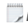
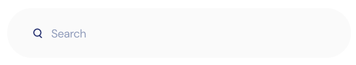

## **Capítulo IV: Product Design** 

## *4.1. Style Guidelines.*

### *4.1.1. General Style Guidelines.*

**Branding:** 

Aunque en un principio optamos por la creación de un isotipo, sentimos que saturaba la esencia de la aplicación, por lo que al final optamos por un diseño minimalista y moderno representado en un imagotipo con los colores representativos de nuestra marca.

**Tipografías:**

Para las tipografías optamos por usar 3 variaciones de Roboto(regular, italic semibold, black) y 2 variaciones de Plus Jakarta Sans(light, regular).

**Colores:**

En cuanto a nuestra paleta de colores, esta consta únicamente de 2, los cuales son un azul(#5766F5) y un verde con un matiz claro(#1EC089).

**Margin:**

Se optó por hacer uso de Margin de elementos pequeños: verticalmente: 32px, horizontalmente 32px y para elementos grandes: verticalmente: 32px, horizontalmente 48px.

### *4.1.2. Web Style Guidelines.* 

Como se mencionó anteriormente se buscó que la landing fuese mucho más limpia por lo que el navbar no tiene iconos y el Margin de 40px entre elementos ul y li mejora la UI.

Se tiene a su vez un “article” con algunas características acerca de nuestro producto.

![ref1]

En la sección de Costumers presentamos un “article” con las opiniones de algunos de nuestros clientes con los que ya hayamos trabajado.

![ref2]

Y finalmente se puede ver un “article”en la sección de pricing con algunos de nuestros planes de suscripción. Sin olvidar otro “article”con información acerca de donde nos encontramos e información de contacto y el footer.

Importante: la web está diseñada a su vez para ser responsive, con plena compatibilidad con Android e IOS.

## *4.2. Information Architecture.*

### *4.2.1. Organization Systems.*

En lo referente a la organización visual del contenido, se optará por aplicar el patrón de jerarquía visual para estructurar las secciones. La relevancia de las oraciones se determinará según el tamaño de la fuente, siendo las frases u oraciones de 48px (3 rem) las más destacadas, seguidas por aquellas de 32px (2 rem), luego 24px (1.5 rem), y finalmente 16px (1 rem). Además, se implementará una organización matricial ordenada para presentar las características del producto y los planes de pago.

En otro aspecto, en cuanto a los esquemas de categorización, se emplea la categorización basada en la audiencia, dado que se cuenta con dos segmentos objetivo: Los profesores y los estudiantes. Cada uno de estos segmentos contará con secciones específicas y funciones pertinentes

### *4.2.2. Labeling Systems.*

En la landing page, se ha tratado de minimizar el uso de iconos demasiado llamativos para mantener la naturaleza simple de la aplicación. Asi como una librería open source de los mismo:

![ref3]![ref4]![ref5]![ref6]![ref7]![ref8]

### *4.2.3. SEO Tags and Meta Tags*

**Landing Page**

<meta charset="UTF-8">

<meta name="viewport" content="width=device-width, initial-scale=1.0">

<meta name="description"

content="Application that seeks to simplify and centralize both academic and administrative management tasks.">

<meta name="keywords" content="Rocket, RocketOrganize, Rocket Organize, Rocket App, Rocket Web">

<meta name="author" content="Rocket">

<meta name="lang" content="en-EN" />

<meta name="organization" content="Rocket" />

<meta name="copyright" content="Rocket©">

### *4.2.4. Searching Systems.* 

En cuanto a nuestro sistema de búsquedas este será uno minimalista que permitirá al usuario poder mostrar todas las coincidencias dependiendo de lo que el usuario ponga en el input.

### *4.2.5. Navigation Systems.*

Nuestra navegación se basará en un elemento muy popular de UI, el cual es un sidebar con todas las opciones existentes en la aplicación, ordenadas jerárquicamente. Cabe recalcar que el sidebar cambiará dependiendo el tipo de usuario que acceda a la aplicación.

## *4.3. Landing Page UI Design.*

### *4.3.1. Landing Page Wireframe.*

A continuación diseñamos el cómo sería el wireframe de nuestra landing page usando Figma

### *4.3.2. Landing Page Mock-up.*

Link del FIGMA: <https://www.figma.com/file/KSPnhnWKuR0DeKh6xT17pr/Untitled?type=design&node-id=0%3A1&mode=design&t=GLiiLddrfcsz88mN-1>

Link de la Landing Page: 

<https://upc-pre-202401-si729-sw53-rocket-land.netlify.app>

## 4.4. Web Applications UX/UI Design. 
### 4.4.1. Web Applications Wireframes.** 

User goal: El usuario se registra, restablecer su contraseña o inicia sesión en la aplicación

Inicio de sesión

Registro de nueva cuenta

Restablecer la contraseña

Aplicación para profesores

User goal: Presentación del home de la aplicación

Aplicación para profesores

User goal: Registro de asistencia

Aplicación para profesores

User goal: Agregar estudiante a la lista de asistencia

Aplicación para profesores

User goal: Eliminar estudiante a la lista de asistencia

Aplicación para profesores

User goal: Registro de notas

Aplicación para profesores

User goal: Reporte de control psicológico

Aplicación para profesores

User goal: Generar un reporte al staff del colegio

User goal: Pasarela de pagos

Aplicación para profesores

User goal: Enviar correo electrónico

Aplicación para profesores

User goal: Calendario

User goal: Configuraciones del perfil

Aplicación para staff

User goal: Registro de suscripciones

User goal: Dashboard de todos los reportes

Aplicación para staff

User goal: Enviar notificaciones a profesores

Aplicación para staff

User goal: Lista de salones y su respectiva información

Aplicación para staff

User goal: Agregar salon

Aplicación para staff

User goal: Eliminar salon

### 4.4.2. Web Applications Wireflow Diagrams.** 

User goal: Registro de un nuevo usuario, recuperación de contraseña o inicia sesión a la aplicación.

**Descripción**:

El usuario tiene la intención de realizar acciones relacionadas con la autenticación y la gestión de cuentas dentro de la aplicación. Esto puede incluir el registro de un nuevo usuario para obtener acceso a la aplicación, la recuperación de una contraseña perdida o el inicio de sesión en una cuenta existente.

User goal: Visualización de clases, creación de clases y borrado de clases.

**Descripción**:

El objetivo del usuario es realizar operaciones relacionadas con la gestión de clases dentro de la aplicación. Esto incluye la visualización de clases existentes, la creación de nuevas clases según sea necesario y la capacidad de eliminar clases previamente creadas. 

User goal: Visualización de lista de asistencia, donde se muestran estudiantes y se pueden tanto agregar y eliminar estudiantes.

**Descripción**:

El objetivo del usuario es interactuar con una lista de asistencia dentro de la aplicación. Esto implica la visualización de una lista de estudiantes inscritos, así como la capacidad de agregar nuevos estudiantes a la lista o eliminar estudiantes existentes según sea necesario.

User goal: Hacer uso del dashboard con el fin de acceder a configuración,  calendario, envío de correo, control psicológico.

**Descripción**:

El objetivo del usuario es utilizar el panel de control (dashboard) para acceder a varias funcionalidades dentro de la aplicación como acceder a la configuración para ajustar las preferencias o configuraciones de la aplicación, consultar el calendario para ver fechas importantes, enviar correos electrónicos directamente desde el dashboard.

Además, acceder a herramientas relacionadas con el control psicológico.

User goal: Hacer uso del Home para visualizar, crear y notificar algún reporte. Además, se puede acceder al centro de ayuda.

Descripción:

El objetivo del usuario es utilizar la página de inicio como punto de partida para diversas actividades relacionadas con la gestión de informes. Esto incluye la capacidad de visualizar informes existentes, crear nuevos informes según sea necesario y recibir notificaciones pertinentes relacionadas con los mismos. Además, el usuario busca acceder fácilmente al centro de ayuda desde la página de inicio para obtener asistencia adicional o resolver cualquier duda que pueda surgir.

User goal: Elegir una suscripción y realizar el pago.

Descripción:

El usuario tiene la intención de seleccionar una suscripción dentro de la aplicación y completar el proceso de pago asociado a dicha suscripción. Esto implica la elección de un plan de suscripción que se ajuste a las necesidades del usuario y la finalización del pago correspondiente para activar la suscripción seleccionada.

### *4.4.2. Web Applications Mock-ups.*

User goal: El usuario se registra, restablecer su contraseña o inicia sesión en la aplicación

Inicio de sesión

Registro de nueva cuenta

Restablecer la contraseña

Aplicación para profesores

User goal: Presentación del home de la aplicación

Aplicación para profesores

User goal: Registro de asistencia

Aplicación para profesores

User goal: Agregar estudiante a la lista de asistencia

Aplicación para profesores

User goal: Eliminar estudiante a la lista de asistencia

Aplicación para profesores

User goal: Registro de notas

Aplicación para profesores

User goal: Reporte de control psicologico

Aplicación para profesores

User goal: Generar un reporte al staff del colegio

User goal: Registro de suscripciones

User goal: Pasarela de pagos

Aplicación para profesores

User goal: Enviar correo electrónico

Aplicación para profesores

User goal: Calendario

User goal: Configuraciones del perfil

Aplicación para staff

User goal: Dashboard de todos los reportes

Aplicación para staff

User goal: Enviar notificaciones a profesores

Aplicación para staff

User goal: Lista de salones y su respectiva información

Aplicación para staff

User goal: Agregar salon

Aplicación para staff

User goal: Eliminar salon

4\.4.3. Web Applications User Flow Diagrams. 

###
###   4.5. Web Applications Prototyping. 

link:  [video1029781576 2.mp4](https://upcedupe-my.sharepoint.com/:v:/g/personal/u202215164_upc_edu_pe/EYU24oh3FT5PtPw_xOYqKHIBAEPgTv1eh0UPpGLjxR62MQ?e=dXAxBO&nav=eyJyZWZlcnJhbEluZm8iOnsicmVmZXJyYWxBcHAiOiJTdHJlYW1XZWJBcHAiLCJyZWZlcnJhbFZpZXciOiJTaGFyZURpYWxvZy1MaW5rIiwicmVmZXJyYWxBcHBQbGF0Zm9ybSI6IldlYiIsInJlZmVycmFsTW9kZSI6InZpZXcifX0%3D)

## *4.6. Domain-Driven Software Architecture.*

### *4.6.1. Software Architecture Context Diagram. !*

### *4\.6.2. Software Architecture Container Diagrams. !*

### *4.6.3. Software Architecture Components Diagrams.* 

## *4.7. Software Object-Oriented Design.*

### *4.7.1. Class Diagrams*

### *4.7.2. Class Dictionary.*

Clase: Estudiante

Descripción: Representa a un estudiante matriculado en un curso.

Atributos:

\- id (int): Identificador único del estudiante.

\- nombre (str): Nombre del estudiante.

\- edad (int): Edad del estudiante.

\- curso\_actual (Curso): Curso en el que está actualmente matriculado el estudiante.

Clase: Profesor

Descripción: Representa a un profesor que imparte cursos.

Atributos:

\- id (int): Identificador único del profesor.

\- nombre (str): Nombre del profesor.

\- especialidad (str): Especialidad del profesor.

Clase: Curso

Descripción: Representa un curso ofrecido por la institución educativa.

Atributos:

\- id (int): Identificador único del curso.

\- nombre (str): Nombre del curso.

\- código (str): Código identificador del curso.

\- nivel (str): Nivel del curso.

Clase: Asistencia

Descripción: Representa la asistencia de un estudiante en un curso en una fecha específica.

Atributos:

\- id (int): Identificador único de la asistencia.

\- fecha (date): Fecha de la asistencia.

\- estado (str): Estado de la asistencia (presente, ausente, etc.).

\- estudiante (Estudiante): Estudiante asociado a la asistencia.

\- curso (Curso): Curso asociado a la asistencia.

Clase: Nota

Descripción: Representa una nota asociada a un estudiante en un curso.

Atributos:

\- id (int): Identificador único de la nota.

\- valor (float): Valor de la nota.

\- fecha (date): Fecha de la nota.

\- estudiante (Estudiante): Estudiante asociado a la nota.

\- curso (Curso): Curso asociado a la nota.

Clase: Equipo

Descripción: Representa un equipo ubicado en un aula.

Atributos:

\- id (int): Identificador único del equipo.

\- nombre (str): Nombre del equipo.

\- aula (Aula): Aula en la que se encuentra ubicado el equipo.

Clase: Aula

Descripción: Representa un aula en la institución educativa.

Atributos:

\- id (int): Identificador único del aula.

\- capacidad (int): Capacidad máxima de estudiantes del aula.

\- equipos (lista de Equipos): Lista de equipos ubicados en el aula.

Clase: Inventario

Descripción: Representa el inventario de materiales de la institución educativa.

Atributos:

\- id (int): Identificador único del ítem en el inventario.

\- nombre (str): Nombre del ítem en el inventario.

\- cantidad (int): Cantidad disponible del ítem en el inventario.

\- equipo (Equipo): Equipo asociado al ítem en el inventario.

## *4.8. Database Design.* 

### *4.8.1. Database Diagram.!*

[ref1]: Aspose.Words.d6b7eb44-6e0f-4db5-bace-cb12f5d5411d.007.png
[ref2]: Aspose.Words.d6b7eb44-6e0f-4db5-bace-cb12f5d5411d.008.png
[ref3]: Aspose.Words.d6b7eb44-6e0f-4db5-bace-cb12f5d5411d.015.png
[ref4]: Aspose.Words.d6b7eb44-6e0f-4db5-bace-cb12f5d5411d.017.png
[ref5]: Aspose.Words.d6b7eb44-6e0f-4db5-bace-cb12f5d5411d.018.png
[ref6]: Aspose.Words.d6b7eb44-6e0f-4db5-bace-cb12f5d5411d.019.png
[ref7]: Aspose.Words.d6b7eb44-6e0f-4db5-bace-cb12f5d5411d.020.png
[ref8]: Aspose.Words.d6b7eb44-6e0f-4db5-bace-cb12f5d5411d.021.png
