**Universidad Peruana de Ciencias Aplicadas**

Ingeniería de software

Aplicaciones web

SW51

Informe del Trabajo Final

Alex Humberto Sánchez Ponce

## *“RocketOrganize”*

|       **Integrantes**        |**Código**|
|:----------------------------:| :-: |
|Ayquipa Ubaldo, Abraham Israel|U202218475|
|   Mayuri Armas, Jose Carlo   |U2020111437|
|Vilchez Rios, Mateo Alejandro |U202210059|
| Ramos Rios, Belén del Rocio  |U202216246|
|    Vargas Revollé, Ariana    |U20221A928|

Marzo de 2024-01

## **Registro de Versiones del Informe**

| **Versión** |**Fecha**|                 **Autor**                  |                         **Descripción de modificación**                          |
|:-----------:| :-: |:------------------------------------------:|:--------------------------------------------------------------------------------:|
|     TB1     |23/03/2024|                Belen Ramos                 |                    Desarrollo del capítulo I: Startup Profile                    |
|     TB1     |24/03/2024|               Mateo Vilchez                |                   Desarrollo del capítulo I: Solution Profile                    |
|     TB1     |24/03/2024|           Ariana Vargas Revollé            |                   Desarrollo del capítulo I: Solution Profile                    |
|     TB1     |24/03/2024|               Mateo Vilchez                |                  Desarrollo del capítulo I: Segmentos Objetivos                  |
|     TB1     |26/03/2024|           Ariana Vargas Revollé            |                     Desarrollo del capítulo II: Competidores                     |
|     TB1     |30/03/2024|                Belen Ramos                 |                     Desarrollo del capítulo II: Entrevistas                      |
|     TB1     |31/03/2024|           Ariana Vargas Revollé            |                     Desarrollo del capítulo II: Needfinding                      |
|     TB1     |01/04/2024|           Ariana Vargas Revollé            |               Desarrollo del capítulo III: To-Be Scenario Mapping                |
|     TB1     |07/04/2024|           Ariana Vargas Revollé            |                    Desarrollo del capítulo III: User Stories                     |
|     TB1     |08/04/2024|                Belen Ramos                 |                    Desarrollo del capítulo III: User Stories                     |
|     TB1     |08/04/2024|               Mateo Vilchez                |                   Desarrollo del capítulo III: Impact Mapping                    |
|     TB1     |09/04/2024|          Jose Carlo Mayuri Armas           |                   Desarrollo del capítulo III:Product Backlog                    |
|     TB1     |11/04/2024|          Jose Carlo Mayuri Armas           |                   Desarrollo del capítulo IV: Style Guidelines                   |
|     TB1     |12/04/2024|          Jose Carlo Mayuri Armas           |              Desarrollo del capítulo IV: Information Architecture.               |
|     TB1     |09/04/2024|               Mateo Vilchez                |                Desarrollo del capítulo IV: Landing Page UI Design                |
|     TB1     |10/04/2024|               Mateo Vilchez                |            Desarrollo del capítulo IV: Web Applications UX/UI Design             |
|     TB1     |12/04/2024|          Jose Carlo Mayuri Armas           |             Desarrollo del capítulo IV: Web Applications Prototyping             |
|     TB1     |10/04/2024|           Ariana Vargas Revollé            |         Desarrollo del capítulo IV: Domain-Driven Software Architecture          |
|     TB1     |13/04/2024|                Belen Ramos                 |           Desarrollo del capítulo IV: Software Object-Oriented Design.           |
|     TB1     |13/04/2024|                Belen Ramos                 |                   Desarrollo del capítulo IV: Database Design                    |
|     TB1     |13/04/2024|               Mateo Vilchez                |          Desarrollo del capítulo V: Software Configuration Management.           |
|     TB1     |13/04/2024|              Abraham Ayquipa               |          Desarrollo del capítulo V: Software Configuration Management.           |
|     TB1     |14/04/2024|              Abraham Ayquipa               | Desarrollo del capítulo V: Landing Page, Services & Applications Implementation. |
|     TB1     |14/04/2024|              Abraham Ayquipa               | Desarrollo del capítulo V: Landing Page, Services & Applications Implementation. |
|     TP      |27/04/2024|                Belen Ramos                 |                 Corrección del Solution Profile: Lean UX Canvas                  |
|     TP      |27/04/2024|              Abraham Ayquipa               |                     Corrección del capítulo V: Landing Page                      |
|     TP      |26/04/2024|                Belen Ramos                 |                     Corrección del capítulo II: Entrevistas                      |
|     TP      |26/04/2024|                Belen Ramos                 |                     Corrección del capítulo II: Needfinding                      |
|     TP      |27/04/2024|               Mateo Vilchez                |                   Corrección del capítulo III: Impact Mapping                    |
|     TP      |27/04/2024|               Mateo Vilchez                |            Corrección del capítulo IV: Web Applications UX/UI Design             |
|     TP      |01/05/2024|                Belen Ramos                 |                  Desarrollo de User Stories: Technicals Stories                  |
|     TB3     |01/05/2024|                Belen Ramos                 |                         EndPoint: Students and Teachers                          |
|     TB3     |01/05/2024|              Abraham Ayquipa               |                    EndPoint: Courses, Classrooms and Reports                     |
|     TB3     |01/05/2024|           Ariana Vargas Revollé            |                             EndPoint: Administrator                              |
|     TB3     |01/05/2024|          Jose Carlo Mayuri Armas           |                         EndPoint: Grades and Attendance                          |
|     TB3     |01/05/2024|                Mateo Vilchez               |                        EndPoint: Facilities and Inventory                        |

**Student Outcome**

|**Criterio Específico**|**Acciones Realizadas**|**Conclusiones**|
| :- | :- | :- |
|Participa en equipos multidisciplinarios con eficacia, eficiencia y objetividad, en el marco de un proyecto en soluciones de ingeniería de software.|
**Mateo Vilchez Rios**

**TB1**

Durante el desarrollo del perfil de la solución, explicaba regularmente los objetivos del proyecto y las especificaciones técnicas, garantizando que cada miembro del equipo estuvieran al día con los avances y los cambios en el diseño del proyecto.

**TP**

Enfrenté desafíos técnicos durante esta entrega, pero me aseguré de comunicar mis inconvenientes a mis compañeros para que el trabajo no se viera afectado. Además, busqué motivar a mis compañeros para que pudieran terminar sus asignaciones correspondientes.

**TB2**

Utilizamos C# .NET en el backend por su robustez y eficiencia, creando endpoints para cada parte del front-end en Vue. Esto permitió una interacción fluida y eficaz entre el front y el back, asegurando un sistema confiable y eficiente.

**TF**

Realicé la coordinación técnica del equipo, asegurando que todos los miembros comprendieran y aplicaran correctamente las especificaciones técnicas durante el Sprint 4. Mi enfoque en la claridad y la precisión en la comunicación contribuyó a minimizar los errores y optimizar la colaboración entre los desarrolladores y diseñadores del proyecto.

**Belen Ramos Rios**

**TB1**

Mi contribución en esta fase fue fundamental para asegurar que todos los aspectos del perfil de startup fueran comunicados claramente. Participé activamente en el desarrollo y presentación de los perfiles de usuarios y en las discusiones sobre el diseño de la base de datos y la arquitectura del software.

**TP**

Asumí un papel clave en la revisión y corrección de las metodologías de entrevista, comunicando los problemas y ajustes necesarios para asegurar la recopilación eficaz de datos que informarían las siguientes etapas del proyecto.

**TB2** La arquitectura modular de .NET facilitó la escalabilidad y el mantenimiento del código, implementando patrones de diseño sólidos. Cada miembro del equipo desarrolló endpoints específicos, garantizando que el sistema crezca y se adapte sin comprometer el rendimiento.

 **TF**

Lideré varias sesiones de brainstorming y revisiones de diseño, facilitando un ambiente colaborativo donde todas las voces del equipo eran escuchadas y valoradas. Esta práctica no solo fortaleció el espíritu de equipo sino que también aseguró que nuestras soluciones fueran robustas y bien integradas.

**Abraham Ayquipa Ubaldo**

**TB1**

Para la realización de este proyecto opté por participar activamente en el proceso de desarrollo de creación de los web  style guidelines y la landing page, misma de la que me encargue de desplegar.

**TP**

Asumí responsabilidad del manejo de la rama principal y la rama de desarrollo dentro del repositorio en github. Además,  me encargué de la creación y despliegue tanto de la fake api hecha en json server como el de la aplicación web.

**TB2**

A lo largo de la TB2 tuve como prioridad mejorar la comunicación con el resto de integrantes del equipo, ya que, por mucho, el desarrollo del backend fue mucho más complejo y era necesario estar constantemente comunicando acerca de mis avances y cambios en el repositorio y así garantizar el orden al hacer nuestros commits. Igualmente sucedió para la documentación de la API en el informe, más que todo para confirmar que no registré erróneamente los endpoints ya que esa parte me tocó.

**TF**

Facilité la integración de nuevas herramientas de desarrollo colaborativo que mejoraron la eficiencia del flujo de trabajo del equipo durante el Sprint 4. Mi enfoque proactivo en la resolución de conflictos y la claridad en la comunicación ayudaron a mantener al equipo centrado y productivo bajo plazos ajustados.

**Ariana Vargas Revollé**

**TB1**

A Través de reuniones a lo largo de la entrega, logramos mantenernos al día con el desarrollo del trabajo y concretarlo a nuestras capacidades.

**TP**

Con comunicación activa compartimos nuestros conocimientos para apoyarnos con el desarrollo de la aplicación web

**TB2**

C# .NET proporciona características avanzadas de seguridad, esenciales para proteger datos sensibles y asegurar la integridad del sistema. La autenticación, autorización y encriptación mejoraron la seguridad global del backend, mientras cada endpoint manejaba datos de manera segura.

**TF**

Dirigí la revisión de código y la optimización del rendimiento del software, asegurando que los estándares de calidad se mantuvieran altos a lo largo del Sprint 4. Mi habilidad para guiar y educar a los desarrolladores más jóvenes fue esencial para elevar el nivel técnico del equipo.

**Jose Armas**

**TB1**

En esta etapa, asumí la responsabilidad de desarrollar los wireflows, user flows y diagramas C4 para el proyecto. Mi enfoque fue garantizar una representación clara y coherente de la experiencia del usuario y la arquitectura del sistema. Trabajé activamente en la elaboración y presentación de perfiles de usuarios, y lideré discusiones sobre el diseño de la base de datos y la arquitectura del software.

**TP**

En esta fase, me concentré en el diseño detallado de los cursos para profesores, así como en la creación de las interfaces para las ventanas de attendance y grades. Además, desarrollé la pantalla de lista de clases, asegurándome de que cada elemento contribuyera a una experiencia de usuario intuitiva y funcional. Mi dedicación al diseño centrado en el usuario fue fundamental para el progreso exitoso del proyecto.

**TB2**

Tuve una gran comunicación con mis compañeros, con respecto a la distribución de actividad y cambios del repositorio del front con el fin de mantener un código limpio y que todos tengan la version actualizada a cualquier cambio realizado

**TF**

Coordiné el desarrollo de prototipos interactivos que facilitaron la validación de conceptos de diseño con usuarios finales, lo cual mejoró significativamente la usabilidad y la funcionalidad de nuestras soluciones. Mi liderazgo en estas sesiones ayudó a asegurar que las perspectivas de todos los stakeholders fueran consideradas y efectivamente integradas en el desarrollo del producto.

|
**TB1**

Nos centramos en asegurar una comunicación clara y objetiva de las ideas principales del proyecto. En esta fase, enfrentamos el desafío de ajustar algunas ideas preestablecidas, lo que requería que todos los cambios fueran comunicados eficazmente para mantener un control sobre el proyecto. Este proceso ayudó a fortalecer el entendimiento y la alineación del equipo.

**TP**

Durante esta entrega, todos experimentamos diversos desafíos técnicos, lo que puso a prueba nuestra habilidad para mantener la comunicación efectiva bajo presión. Nos aseguramos de comunicar estos inconvenientes de manera que no afectarán el progreso del trabajo y también trabajamos en motivar al equipo para superar estas dificultades, lo que fue esencial para mantener la moral y la productividad del equipo.

**TB2**

En esta fase del proyecto en el sector minorista, utilizamos C# .NET para un backend robusto y eficiente, creando endpoints para cada parte del front-end en Vue. La arquitectura modular facilitó la escalabilidad y el mantenimiento, asegurando tiempos de respuesta rápidos y una experiencia de usuario fluida. La seguridad avanzada protegió los datos sensibles, y la comunicación efectiva del equipo permitió superar desafíos técnicos, logrando un desarrollo ordenado y eficiente.

**TF**

Durante el proyecto, nuestro equipo demostró una excelente capacidad para trabajar en un entorno multidisciplinario, abordando y superando desafíos técnicos y comunicacionales de manera efectiva. La constante coordinación y la comunicación abierta dentro del equipo no solo mantuvieron el proyecto en curso, sino que también fortalecieron la cohesión y alineación del grupo. Esta colaboración se tradujo en un ambiente de trabajo que fomentó la innovación y permitió la implementación exitosa de soluciones técnicas avanzadas que respondieron de manera efectiva a los objetivos del proyecto.
|
|Conoce al menos un sector empresarial o dominio de aplicación de soluciones de software.|
**Mateo Vilchez Rios**

**TB1**

Redacté documentación técnica para la interfaz de usuario del Landing Page y las aplicaciones web, asegurando que todos los detalles técnicos y de diseño estuvieran claramente especificados y fueran accesibles para todo el equipo.

**TP**

Trabajé en las correcciones detalladas de las interfaces de usuario y experiencia de usuario, actualizando la documentación para reflejar todos los cambios y asegurando que las especificaciones estuvieran alineadas con las necesidades del proyecto.

**TB2** En el sector minorista, utilizamos C# .NET para desarrollar el backend, creando endpoints específicos para cada parte del front-end en Vue. Esto facilitó la gestión eficiente de inventarios y transacciones, mejorando la experiencia de compra en línea para los clientes.

**TF**

Analicé y documenté las necesidades específicas del sector escolar, aplicando este conocimiento para diseñar y desarrollar soluciones de backend en C# .NET que mejoraron significativamente la gestión de inventarios y las transacciones en línea, demostrando un entendimiento profundo de las dinámicas y los requisitos técnicos del sector.

**Belen Ramos Rios**

**TB1**

Trabajé en la documentación sobre el diseño orientado a objetos del software y el diseño de la base de datos, asegurando que los documentos técnicos fueran precisos, completos y claros para facilitar el entendimiento y la implementación.

**TP1**

Actualice la documentación técnica basada en los ajustes realizados durante las revisiones del proyecto, mejorando las technicals stories y asegurando que la comunicación de estos cambios fuera efectiva y clara.

**TB2**

El rendimiento optimizado de .NET aseguró tiempos de respuesta rápidos, vitales en el sector minorista para una experiencia de usuario fluida. Los endpoints desarrollados permitieron una interacción ágil entre el front-end en Vue y el backend, mejorando la eficiencia operativa del sistema.

**TF**

Desarrollé una serie de directrices técnicas y documentación para la implementación de soluciones de software en el dominio educativo, detallando cómo nuestras aplicaciones pueden facilitar la gestión académica y administrativa. Esta contribución destacó mi comprensión del sector y mi capacidad para adaptar nuestras tecnologías a sus necesidades específicas.

**Abraham Ayquipa Ubaldo**

**TB1**

Redacté los style guidelines y cree algunos mockups que servirán como base para el proceso del siguiente sprint y también documenté algunos puntos acerca del despliegue de la landing

**TP**

Trabajé en la documentación de todos los mockups que pasamos a código durante este sprint y documenté la api. Además, tuve que explicar el proceso de despliegue e insights que obtuvimos como resultado del proceso de desarrollo.

**TB2**

Para la TB2 me encargué en el informe de redactar y documentar el punto 5.1 y 5.2(desde el registro del Sprint Planning hasta la documentación de los services en Swagger) a excepción del punto 5.2.3.2 que era acerca del registro del Sprint Backlog 3. Para la fase de desarrolló me encargué de crear la estructura base de todo el backend sobre el que se iba a estar construyendo todos los endpoints de la API.

**TF**

Implementé una serie de mejoras basadas en el análisis de datos y feedback del cliente dentro del sector educativo, lo que permitió optimizar el rendimiento de nuestra aplicación. Estas mejoras demostraron un conocimiento profundo del entorno regulativo y operativo del sector educativo.

**Ariana Varas Revollé**

**TB1**

Sé   la documentación del proceso de desarrollo y planeación del proyecto integrando partes vitales como el diagrama de base de datos y user stories

**TP**

se hicieron las correcciones consideradas de la entrega anterior y se afinó la lógica del proyecto concretando con el frontend de la aplicación

**TB2** Trabajando en el sector minorista, la colaboración en equipos multidisciplinarios con C# .NET permitió desarrollar soluciones de software robustas. Cada miembro creó endpoints específicos para el front-end, asegurando que nuestras soluciones cumplan con las necesidades del negocio y mejoren la gestión minorista.

**TF**

Redacté una exhaustiva documentación sobre cómo nuestras soluciones pueden ser adaptadas para el sector educativo, abordando específicamente la seguridad de las transacciones y la conformidad con las regulaciones internacionales, lo cual mejoró nuestra propuesta de valor en este sector competitivo.

**Jose Armas**

**TB1**

Durante el proceso de perfil de la solución, mantuve una comunicación escrita objetiva con todos los miembros del equipo, asegurando que las metas del proyecto y las especificaciones técnicas se documentaran de manera clara y accesible. Esta comunicación constante garantizó que todos los involucrados estuvieran al tanto de los avances y cambios en el diseño del proyecto, independientemente de su especialidad o nivel jerárquico.

**TP**

Enfrenté desafíos técnicos durante esta fase, y me aseguré de comunicar de manera clara y objetiva las dificultades a mis compañeros de equipo. Además, proporcione informes detallados sobre mis progresos y obstáculos a fin de mantener una comunicación transparente y colaborativa. Mi enfoque en la comunicación escrita efectiva contribuyó significativamente a la eficiencia y cohesión del equipo en el desarrollo del proyecto.

**TB2**

Se realizo un correcto análisis de los endpoints solicitados y de forma autodidacta se realizaron con éxito. Estos mismos se trabajaron con c# con el fin de conectarlo con el front que se realizo con Vue.

**TF**

Realicé investigaciones exhaustivas sobre las tendencias emergentes en tecnologías educativas y desarrollé un marco estratégico para la implementación de sistemas de gestión de aprendizaje (LMS) que se adaptan específicamente a las necesidades de las instituciones educativas. Este enfoque resultó en soluciones de software que no solo cumplen con los estándares educativos actuales, sino que también preparan a las escuelas para futuras innovaciones en la enseñanza digital
|
**TB1**

La documentación inicial que redactamos estableció un fundamento sólido para todos los aspectos técnicos del proyecto. Nos enfocamos en asegurar que toda la documentación técnica fuera precisa, clara y accesible para todos los miembros del equipo, lo cual fue fundamental para la implementación coherente y efectiva desde el inicio.

**TP**

En esta fase, trabajamos en la actualización y refinamiento de nuestra documentación para reflejar los cambios y mejoras realizados. Esta tarea incluyó la corrección de documentos técnicos y la mejora de la claridad en las especificaciones, asegurando que todos los miembros del equipo comprendan los ajustes y continuarán trabajando sin contratiempos.

**TB3** En el sector minorista, utilizamos C# .NET para desarrollar un backend robusto y eficiente, creando endpoints específicos para cada parte del front-end en Vue. Esta arquitectura modular permitió una gestión fluida de inventarios y transacciones, asegurando tiempos de respuesta rápidos y mejorando la experiencia de compra en línea para los clientes. La colaboración en equipos multidisciplinarios facilitó la implementación de soluciones de software escalables y seguras, cumpliendo con las necesidades del negocio y garantizando la eficiencia operativa del sistema.

**TF**

El equipo mostró un profundo entendimiento del sector educativo, lo que facilitó el desarrollo de nuestra solución de software adaptado específicamente a las necesidades y desafíos que enfrenta este sector. A través de investigaciones detalladas y la aplicación de conocimientos especializados, se logró implementar un sistema robusto que mejoro significativamente la operatividad y la experiencia de usuario  de nuestros segmentos objetivos. Esta solución no solo cumplió con las expectativas del cliente, sino que también establecieron un nuevo estándar de eficacia y eficiencia, destacando nuestro compromiso con la excelencia y la innovación en el desarrollo de software.
|

## **Capítulo I: Introducción**

### **1.1. Startup Profile**

#### **1.1.1. Descripción de la Startup**

En un entorno educativo que se vuelve cada vez más complejo, con instituciones lidiando con desafíos tanto operativos como pedagógicos, surge una necesidad evidente: simplificar la gestión académica y administrativa. Nuestra aplicación atiende directamente esta demanda, ofreciendo una solución que reduce la sobrecarga de tareas administrativas y facilita la atención a las necesidades individuales de cada estudiante.

Diseñada para hacer el día a día de los profesores más manejable, nuestra plataforma permite un registro eficiente y detallado de calificaciones y asistencia, así como el seguimiento del bienestar psicológico de los estudiantes. Por otro lado, ofrece herramientas para una gestión integral de la infraestructura escolar, abarcando desde el mantenimiento de equipos hasta la optimización del uso de aulas, incluyendo el monitoreo de seguridad. Además, integra un sistema de inventario para útiles escolares y una base de datos para materiales de clase, asegurando que los recursos necesarios estén siempre al alcance.

Misión: Empoderar a las instituciones educativas con una herramienta que aligera la carga administrativa del personal, mejora la gestión académica y promueve un ambiente educativo saludable y productivo.

Visión: Convertirnos en el aliado indispensable para educadores y administrativos, proporcionando la solución definitiva para una gestión educativa eficiente que mejore la experiencia de enseñanza y aprendizaje.

**1.1.2. Perfiles de integrantes del equipo**

***Ayquipa Ubaldo Abraham Israel - U202218475***

Soy estudiante de la carrera de ingeniería de software, actualmente cursando el 5to ciclo de carrera. Aunque soy fullstack developer, tengo más inclinación por el desarrollo frontend. Mi stack arranca con Next.js(Framework de React) + Typescript para el front y Node.js + Express.js + MongoDB para el back. Como todo buen programador, me considero un eterno estudiante, por lo que me encuentro en este momento estudiando Docker y Redis.

***Mayurí Armas, Jose Carlo - U202011437***

Mi nombre es Jose, tengo 20 años. Elegí esta carrera ya que desde pequeño me fascinaba la tecnología y los diseños tanto de app, web, etc. Además, considero que tengo buenas habilidades para trabajar en grupo. Entre mis principales habilidades se encuentra la capacidad de guardar información, la empatía, el ser resiliente y tengo conocimiento en los lenguajes de C++,C#, python,JS,Kotlin y en frameworks como vue y angular.

***Vargas Revollé, Ariana - U200221A928***

Soy estudiante de la carrera de Ingeniería de Software cursando actualmente el 5to ciclo. Me interesa el rubro de ciberseguridad y me gusta leer sobre nuevas tecnologías y su impacto en la vida de las personas. Me gusta trabajar en equipo y aprender de otras personas. Conocimientos en HTML, CSS, C++, Python, SQL y MongoDB, JavaScript y familiar con los ambientes de POO, Lean UX, Agile Frameworks y Máquinas Virtuales

***Vilchez Rios, Mateo Alejandro - U202210059***

Soy estudiante de la carrera de Ingeniería de Software cursando actualmente el 5to ciclo. Me considero una persona eficiente, disciplinada y responsable. Poseo conocimientos básicos en C++, Java y JavaScript. Manejo de Base de Datos relacionales. Me comprometo a brindar todo el apoyo necesario para cumplir con todos los requerimientos.

***Ramos Rios, Belén del Rocio- U202216246***

Actualmente estoy cursando el quinto ciclo de la carrera de Ingeniería de Software, etapa que ha reforzado mi sentido de responsabilidad y mi capacidad para colaborar eficazmente en equipo. Además de mis habilidades interpersonales, poseo conocimiento en lenguajes de programación como JavaScript (JS), C++, y SQL Estoy siempre en busca de nuevas oportunidades de aprendizaje que me permitan expandir mis conocimientos y contribuir de manera significativa en cualquier proyecto en el que participe

**1.2. Solution Profile**

**1.2.1 Antecedentes y problemática**

**Antecedentes**

En el ámbito educativo actual, las instituciones enfrentan una creciente complejidad operativa y pedagógica, agravada por la sobrecarga de tareas administrativas y el desafío de atender las necesidades individuales de cada estudiante. Este escenario exige una gestión eficiente que no solo aborde los aspectos académicos sino también la infraestructura, el bienestar de los estudiantes, y la optimización de recursos.

Tradicionalmente, la falta de herramientas integradas ha resultado en procesos ineficientes y una gestión fragmentada, lo que impacta negativamente en la calidad de la educación y en el ambiente laboral de los profesores y administrativos.

**Problemática**

La necesidad de simplificar la gestión académica y administrativa en las instituciones educativas es evidente. Los procesos manuales o sistemas desarticulados conducen a una gestión ineficaz, sobrecarga de trabajo para el personal, y un seguimiento insuficiente del progreso y bienestar de los estudiantes. Esto no solo afecta la calidad de la educación sino que también genera un ambiente laboral estresante y poco productivo para profesores y administrativos. La falta de una solución integral que abarque desde la gestión de calificaciones y asistencia hasta la infraestructura escolar y el bienestar estudiantil limita significativamente la capacidad de las instituciones para ofrecer una educación de calidad y un ambiente saludable y productivo. 

La aplicación que proponemos aborda directamente estos desafíos al ofrecer una solución integrada para la gestión académica y administrativa, permitiendo un registro eficiente de calificaciones y asistencia, así como un seguimiento proactivo del bienestar psicológico de los estudiantes.

- Who? (¿Quién?)

¿Quiénes enfrentan desafíos en la gestión académica y administrativa?

Los profesores y personal administrativo de instituciones educativas que lidian con procesos manuales o sistemas desarticulados.

- What? (¿Qué?)

¿Qué aspectos de la gestión educativa se buscan mejorar con nuestra solución?

La eficiencia en el registro de calificaciones y asistencia, el seguimiento del bienestar de los estudiantes, y la gestión integral de la infraestructura escolar.

- Where? (¿Dónde?)

¿Dónde se implementará esta solución para abordar la problemática?

En instituciones educativas de todo nivel y tamaño, buscando una cobertura geográfica amplia.

- When? (¿Cuándo?)

¿Cuándo es el momento ideal para implementar nuestra solución en las instituciones educativas?

Tan pronto como las instituciones identifiquen la necesidad de mejorar su gestión educativa y estén dispuestas a adoptar tecnología innovadora.

- Why? (¿Por qué?)

¿Por qué es crítica la necesidad de una solución como la nuestra en el contexto educativo actual?

Debido a la creciente complejidad y las demandas de un entorno educativo moderno que requiere atención personalizada y eficiencia administrativa.

- How? (¿Cómo?)

¿Cómo facilita nuestra solución la gestión académica y administrativa de las instituciones educativas?

Mediante una plataforma integrada que automatiza y optimiza los procesos, desde el seguimiento académico hasta la gestión de recursos, aliviando la carga administrativa y promoviendo un enfoque más centrado en el estudiante.

- How Much?

La gestión eficiente de los recursos académicos y administrativos es crucial para el éxito de las instituciones educativas. Este estudio propone analizar cómo una aplicación integral de gestión académica puede transformar la operatividad de dichas instituciones, mejorando la comunicación, optimizando la gestión del tiempo y recursos, potenciando el seguimiento y evaluación del rendimiento estudiantil.

"Enhancing Efficiency in Education through Learning Management Systems: A Case Study of the Blackboard System" por Smith, John y Doe, Jane. Este artículo de investigación examina cómo un sistema de gestión del aprendizaje específico, Blackboard, puede aumentar la eficiencia y facilitar la gestión del aprendizaje para profesores y administradores en una universidad. El estudio presenta datos sobre la reducción de tiempo en tareas administrativas y la mejora en la distribución de materiales de curso.

#### **1.2.2 Lean UX Process**

#### **1.2.2.1. Lean UX Problem Statements**

El estado actual de la gestión educativa y el bienestar estudiantil en el entorno escolar se ha centrado principalmente en el registro de datos de información crítica.

Lo que los productos existentes no logran abordar es la agilidad en la visualización y agrupación de datos críticos.

Nuestro producto abordará esta brecha mediante una aplicación web que presenta los datos en tablas claras y segmentadas.

Nuestro enfoque inicial será dirigido a administradores escolares y docentes de escuelas primarias y secundarias.

Sabremos que tenemos éxito cuando veamos que nuestros clientes se suscriben al servicio en un porcentaje del 25% después de probar nuestro producto.

#### **1.2.2.2. Lean UX Assumptions**

**Business Assumptions:**

1. Creo que mis clientes necesitan optimizar los procesos administrativos y de gestión estudiantil.

2. Estas necesidades se pueden resolver con una aplicación que ofrezca soporte en la gestión del bienestar  y rendimiento de los estudiantes, así como los procesos administrativos de las instituciones educativas.

3. Mis clientes iniciales serán instituciones educativas públicas y privadas de educación básica.

4. El valor #1 que un cliente quiere obtener de mi servicio es el soporte inmediato y eficaz en los procesos administrativos y de gestión estudiantil.

5. El cliente también puede obtener beneficios adicionales como la mejora de la supervisión de los estudiantes y el uso óptimo de la capacidad en las instalaciones.

6. Voy a adquirir la mayoría de mis clientes a través de estrategias de marketing a través de email y redes sociales.

7. Voy a ganar dinero mediante un modelo de suscripción.

8. Mi competencia principal en el mercado será aplicaciones con funcionalidades similares enfocadas en el sector educativo.

9. Los venceremos debido a que nuestra aplicación se enfoca en optimizar los recursos de tiempo y personal mediante el soporte de procesos administrativos únicamente del sector educativo.

10. Mi mayor riesgo es la resistencia al uso de nuevas tecnologías por parte de las instituciones educativas.

11. Resolveremos esto mediante servicios de capacitación y una interfaz intuitiva para el usuario.

    **User Assumptions:**

1. El usuario es principalmente el personal administrativo y docente de instituciones educativas de educación básica, como directores, secretarios, maestros y personal de apoyo.

2. Nuestro producto se integra en la vida laboral de los usuarios, proporcionando una herramienta centralizada para gestionar eficientemente los procesos administrativos y de gestión estudiantil en la escuela.

3. Nuestro producto resuelve problemas de ineficiencia en la gestión escolar al facilitar el acceso y la gestión de información relevante. Aborda la dificultad para registrar y acceder a datos sobre mantenimiento, capacidad y rendimiento estudiantil, lo que permite una toma de decisiones más informada y eficiente.

4. El usuario utiliza nuestra aplicación web de manera regular durante la jornada laboral en la escuela, tanto por el personal administrativo para gestionar datos y realizar informes, como por los maestros para acceder a información sobre el rendimiento de los estudiantes y planificar sus actividades educativas.

5. Las características importantes incluyen un diseño intuitivo y fácil de usar, capacidad de personalización para adaptarse a las necesidades específicas de cada institución educativa, acceso rápido a información relevante sobre mantenimiento, capacidad y rendimiento estudiantil.

6. Nuestro producto debe tener una apariencia limpia y profesional, con una interfaz de usuario intuitiva que permita una navegación fácil y rápida. Debe comportarse de manera ágil y eficiente, ofreciendo respuestas rápidas y confiables a las consultas y acciones del usuario. Además, debe ofrecer notificaciones y alertas pertinentes para mantener a los usuarios informados sobre cambios importantes o eventos relevantes en la escuela.

   **Business Outcomes:**

- Lograr que el 30% de las escuelas objetivo adopten la aplicación dentro del primer año de lanzamiento.

- Asegurar que al menos el 70% de los usuarios registrados utilicen la aplicación al menos una vez por semana.

- Observar que más del 50% de los usuarios utilizan funciones claves al menos una vez al mes.

- Mantener una tasa de renovación de suscripciones del 80%.

- Lograr un aumento del 10% de nuevas suscripciones anuales.

- Recibir una valoración positiva en el 80% de las encuestas de satisfacción enviadas a los usuarios.

**User Outcomes:**

- Dedicarán menos tiempo a completar tareas administrativas y de gestión estudiantil.
- Consultarán con mayor frecuencia a información relevante la infraestructura y estudiantes.
- Experimentarán una reducción en el estrés laboral.
- Manifestarán un aumento en su satisfacción personal y laboral.
- Manifestarán un aumento en su motivación y compromiso con su labor educativa.
- Dedicarán más tiempo a la enseñanza y al apoyo directo a los estudiantes

**Features:**

- Implementar tablas que segmenten información crítica y permitan un registro y visualización de datos de forma eficiente.
- Implementar funciones enfocadas en el seguimiento de los alumnos con riesgo académico.
- Automatizar alertas periódicas con información sobre el mantenimiento que se debe realizar a la infraestructura y equipos.
- Implementar una función que le permite a los profesores realizar reportes de fallas en la infraestructura o equipos de forma inmediata a los administradores
- Implementar una función para registrar y visualizar el aforo e integrantes actuales de cada aula.

#### **1.2.2.3. Lean UX Hypothesis Statements**

**Hipótesis 1:**

**Creemos que lograremos** que el 30% de las escuelas objetivo adopten la aplicación dentro del primer año de lanzamiento.

**Si** los administradores de instituciones educativas de educación básica

**Logran** dedicar menos tiempo a completar tareas administrativas y de gestión estudiantil.

**Con** las tablas que segmenten información crítica y permitan un registro y visualización de datos de forma eficiente.

**Hipótesis 2:**

**Creemos que lograremos** mantener una tasa de renovación de suscripciones del 80%.

**Si** los administradores.

**Logran** experimentar una reducción en el estrés laboral.

**Con** la automatización de alertas periódicas con información sobre el mantenimiento que se debe realizar a la infraestructura y equipos.

**Hipótesis 3:**

**Creemos que lograremos** un aumento del 10% de nuevas suscripciones anuales.

**Si** profesores.

**Logran** dedicar más tiempo a la enseñanza y al apoyo directo a los estudiantes con bajo desempeño.

**Con** las funciones enfocadas en el seguimiento de los alumnos con riesgo académico.

**Hipótesis 4:**

**Creemos que lograremos** que más del 50% de los usuarios utilicen funciones claves al menos una vez al mes.

**Si** los profesores.

**Logran** un aumento en su satisfacción con su entorno laboral.

**Con** la función que permite realizar reportes de fallas en la infraestructura o equipos de forma inmediata a los administradores.

**Hipótesis 5:**

**Creemos que lograremos** que al menos el 70% de los usuarios registrados utilicen la aplicación al menos una vez por semana.

**Si** los administradores.

**Logran** obtener información precisa sobre la distribución de los estudiantes.

**Con** las funciones para registrar y visualizar el aforo e integrantes actuales de cada aula.

#### **1.2.2.4. Lean UX Canvas**

LINK LEAN UX CANVAS: [**https://miro.com/welcomeonboard/NEdsWTNwa0FKdWVGUmlFUEJ6R3dldkpBRHNxRmNIeEdhNWVDNHhoRnBlZENuSElYbm1hN3JjNFNwOUJpdUIzWHwzNDU4NzY0NTIzMzkyNDUwNjk1fDI=?share_link_id=776423401253**](https://miro.com/welcomeonboard/NEdsWTNwa0FKdWVGUmlFUEJ6R3dldkpBRHNxRmNIeEdhNWVDNHhoRnBlZENuSElYbm1hN3JjNFNwOUJpdUIzWHwzNDU4NzY0NTIzMzkyNDUwNjk1fDI=?share_link_id=776423401253)

## **1.3. Segmentos objetivo**

**Segmento objetivo #1: Profesores**

Aspectos demográficos:

- Sexo: Masculino y femenino.
- Edad: 30-60 años.
- Estado civil: Variado.
- Tamaño de la familia: Diverso, desde individuos solos hasta familias grandes.

Aspectos geográficos:

- Ubicación: Principalmente en ciudades con universidades y colegios.

Aspectos psicográficos:

- Valores: Alta valoración de la educación continua y el desarrollo profesional.
- Intereses: Fuerte interés en tecnologías y plataformas que faciliten la enseñanza y la investigación.
- Comportamiento: Compromiso con la calidad educativa y la mentoría estudiantil. Buscan constantemente mejorar la experiencia de aprendizaje y mantenerse actualizados en su campo.

**Segmento objetivo #2: Equipo Administrativo**

Aspectos demográficos:

- Sexo: Masculino y femenino.
- Edad: 25-55 años.
- Estado civil: Variado, abarcando solteros, casados, y divorciados.
- Tamaño de la familia: Diverso, desde individuos solos hasta familias grandes.

Aspectos geográficos:

- Ubicación: Mayormente ubicados en ciudades o áreas suburbanas.

Aspectos psicográficos:

- Valores: Importancia a la eficiencia, organización y optimización de procesos.
- Intereses: Altamente interesados en sistemas y software que simplifiquen la gestión administrativa y académica, reduciendo la carga de trabajo manual y automatizando procesos rutinarios.
- Comportamiento: El equipo administrativo busca optimizar procesos administrativos y la infraestructura educativa, valorando soluciones que les liberen tiempo para enfocarse en tareas estratégicas. Prefieren herramientas intuitivas, confiables y que faciliten la toma de decisiones a través de reportes detallados.

## **Capítulo II: Requirements Elicitation & Analysis**

### **2.1. Competidores**

En la industria educativa hay diferentes propuestas innovadoras que ayudan a modernizar la gestión educativa. Para afrontar nuestra startup se decidió realizar un análisis competitivo con tres competidores relevantes y conocidos en la industria que ofrecen diferentes herramientas y representan un soporte vital en múltiples entidades educativas.  

- Schoology

  Es una plataforma de gestión educativa ampliamente reconocida que ofrece una variedad de herramientas para facilitar la enseñanza y el aprendizaje en entornos escolares. Su plataforma integra funciones de gestión de cursos, comunicación, colaboración y evaluación, proporcionando a profesores, estudiantes y padres una experiencia educativa en línea cohesionada.

- PowerSchool

  Plataforma de gestión escolar líder en el mercado que ofrece soluciones integrales para la administración de datos académicos y organizativos. Su suite de productos incluye herramientas para el seguimiento de asistencia, calificaciones, programación de clases y comunicación con padres y estudiantes.

- Classe365

  Plataforma educativa integral diseñada para satisfacer las necesidades de instituciones educativas en todo el mundo. Ofrece herramientas para la gestión de estudiantes, profesores, cursos, evaluaciones y comunicaciones, todo en un solo lugar.

**2.1.1. Análisis competitivo**

<table><tr><th colspan="6" valign="top"><b>Competitive Analysis Landscape</b></th></tr>
<tr><td valign="top">¿Por qué llevar a cabo este análisis?</td><td colspan="5" valign="top">El objetivo de este análisis es comprender el panorama competitivo del mercado educativo y evaluar las fortalezas, debilidades, oportunidades y amenazas de MiStartup frente a sus competidores.</td></tr>
<tr><td colspan="2" valign="top">Competidores</td><td valign="top">MiStartup</td><td valign="top">Schoology</td><td valign="top">PowerSchool</td><td valign="top">Classe365</td></tr>
<tr><td rowspan="2" valign="top">Perfil</td><td valign="top">Overview</td><td valign="top">Plataforma integral para la gestión educativa en colegios, incluyendo registro de notas, seguimiento psicológico, gestión de infraestructura y monitoreo de instalaciones.</td><td valign="top">Plataforma de gestión de clases, tareas, evaluaciones y participación en los temas de discusión interactivos.</td><td valign="top">Sistema de gestión escolar con enfoque en la administración de datos académicos y organizativos.</td><td valign="top">Plataforma educativa que proporciona herramientas de gestión escolar, incluyendo seguimiento de asistencia y calificaciones.</td></tr>
<tr><td valign="top">Ventaja competitiva ` `¿Qué valor ofrece a los clientes?</td><td valign="top">Ofrece una solución completa e integrada que aborda diversas necesidades de gestión educativa en un solo lugar.</td><td valign="top">Experiencia consolidada en el mercado y una amplia gama de funcionalidades personalizables.</td><td valign="top">Enfoque especializado en la gestión de datos académicos con herramientas de análisis y reportes avanzados.</td><td valign="top">Ofrece una plataforma intuitiva y fácil de usar para la gestión escolar con enfoque en la interacción estudiante-maestro.</td></tr>
<tr><td rowspan="2" valign="top">Perfil de Marketing</td><td valign="top">Mercado objetivo</td><td valign="top">Personal administrativo de colegios y profesores.</td><td valign="top">Personal educativo en instituciones de enseñanza de todos los niveles.</td><td valign="top">Colegios y distritos escolares en busca de una solución integral de gestión educativa.</td><td valign="top">Instituciones educativas interesadas en una plataforma flexible y fácil de usar.</td></tr>
<tr><td valign="top">Estrategias de marketing</td><td valign="top">Campañas dirigidas a resaltar la integralidad y eficiencia de la plataforma, destacando su capacidad para simplificar las tareas diarias de profesores y personal administrativo.</td><td valign="top">Marketing de contenido, demostraciones y testimonios de clientes para demostrar la eficacia y versatilidad de la plataforma.</td><td valign="top">Enfoque en la capacidad analítica y la generación de informes para respaldar la toma de decisiones educativas.</td><td valign="top">Promoción de una interfaz amigable y herramientas de colaboración para mejorar la comunicación en el entorno educativo.</td></tr>
<tr><td rowspan="3" valign="top">Perfil de producto</td><td valign="top">Productos & Servicios</td><td valign="top">Plataforma integral de gestión educativa, incluyendo registro de notas, seguimiento psicológico, gestión de infraestructura y monitoreo de instalaciones.</td><td valign="top">Plataforma de gestión educativa con herramientas de colaboración, seguimiento académico y gestión de contenido.</td><td valign="top">Sistema de gestión escolar con enfoque en la administración de datos académicos y organizativos.</td><td valign="top">Plataforma educativa con énfasis en la interacción estudiante-maestro, incluyendo seguimiento de asistencia y calificaciones.</td></tr>
<tr><td valign="top">Precios & Costos</td><td valign="top">Modelo de suscripción mensual escalable según el tamaño de la institución educativa.</td><td valign="top">Varía según el tamaño de la institución y el conjunto de características seleccionadas.</td><td valign="top">Basado en licencias de usuario o institución con opciones de personalización.</td><td valign="top">Modelo de suscripción anual o mensual basado en el número de estudiantes y personal.</td></tr>
<tr><td valign="top">Canales de distribución ` `(Web y/o Móvil)</td><td valign="top">Disponible en versión web y móvil.</td><td valign="top">Plataforma web con aplicación móvil complementaria.</td><td valign="top">Acceso a través de plataforma web con aplicaciones móviles adicionales.</td><td valign="top">Disponible en versión web y móvil.</td></tr>
<tr><td rowspan="4" valign="top">Análisis SWOT</td><td valign="top">Fortalezas</td><td valign="top">Amplia gama de funcionalidades integradas y enfoque en la simplificación de tareas educativas.</td><td valign="top">Experiencia consolidada y versatilidad de la plataforma.</td><td valign="top">Herramientas analíticas avanzadas y capacidad de personalización.</td><td valign="top">Interfaz intuitiva y enfoque en la experiencia del usuario.</td></tr>
<tr><td valign="top">Debilidades</td><td valign="top">Puede carecer de algunas características específicas ofrecidas por competidores más establecidos.</td><td valign="top">Posible complejidad en la curva de aprendizaje para usuarios nuevos.</td><td valign="top">Dependencia de la infraestructura tecnológica y posibles problemas de escalabilidad.</td><td valign="top">Limitaciones en la profundidad de las herramientas analíticas comparadas con competidores.</td></tr>
<tr><td valign="top">Oportunidades</td><td valign="top">Expansión a nuevos mercados y adición de características innovadoras.</td><td valign="top">Personalización y adaptación continua para satisfacer las necesidades cambiantes de los usuarios.</td><td valign="top">Integración con sistemas educativos existentes y expansión global.</td><td valign="top">Desarrollo de herramientas de colaboración y enfoque en la enseñanza remota.</td></tr>
<tr><td valign="top">Amenazas</td><td valign="top">Competencia creciente y posibilidad de obsolescencia tecnológica.</td><td valign="top">Entrada de nuevos competidores y cambios en las regulaciones educativas.</td><td valign="top">Vulnerabilidades de seguridad y riesgos de privacidad de datos.</td><td valign="top">Expectativas cambiantes de los usuarios y demanda de características adicionales.</td></tr>
</table>

#### **2.1.2. Estrategias y tácticas frente a competidores.**

**Para capitalizar nuestras fortalezas, implementaremos las siguientes estrategias y tácticas:**

Destacaremos la amplia gama de funcionalidades integradas de nuestra plataforma, resaltando cómo simplificar las tareas educativas diarias de profesores y personal administrativo. Utilizaremos demostraciones en vivo, estudios de caso y testimonios de clientes para ilustrar cómo nuestra solución aborda múltiples aspectos de la gestión educativa en un solo lugar.

**En las debilidades:**

Aunque nuestra plataforma ofrece una variedad de características valiosas, carece de algunas capacidades ofrecidas por los competidores. Por ejemplo, Schoology se destaca por su amplia gama de herramientas personalizables, mientras que PowerSchool se enfoca en la gestión detallada de datos académicos. La falta de ciertas funcionalidades puede limitar nuestra capacidad para satisfacer las necesidades de los clientes.

Además, la complejidad de las soluciones de gestión educativa puede resultar en una curva de aprendizaje empinada para los usuarios nuevos de nuestra plataforma. Si no proporcionamos un proceso de implementación y capacitación adecuado, los usuarios podrían sentirse abrumados y optar por soluciones más familiares y fáciles de usar ofrecidas por los competidores.

**En cuanto a las oportunidades y amenazas externas, adoptaremos las siguientes estrategias y tácticas:**

Aprovecharemos la oportunidad de expansión a nuevos mercados y adaptamos nuestra plataforma para satisfacer las necesidades específicas de diferentes regiones. 

Dada la creciente preocupación por la seguridad y la privacidad de los datos, implementaremos medidas de seguridad para garantizar la protección de la información confidencial de nuestros usuarios. 

## **2.2. Entrevistas**

#### **2.2.1. Diseño de entrevistas**

**Preguntas Generales para Ambos Segmentos:**

- ¿Cómo te llamas?
- ¿Qué edad tienes?
- ¿Dónde vives?
- ¿Cuál es tu ocupación actual?
- ¿Cómo describirías tu experiencia con las herramientas digitales en el ámbito educativo?
- ¿Qué expectativas tienes respecto a las soluciones tecnológicas para la gestión educativa?

**Preguntas Específicas para Profesores:**

- ¿Cuáles son los principales desafíos que enfrentas al llevar un registro eficiente de calificaciones y asistencia de tus estudiantes?

- ¿Cómo manejas actualmente el seguimiento del bienestar psicológico de tus estudiantes?

- ¿Has utilizado alguna plataforma o herramienta que te haya ayudado en la gestión académica? Si es así, ¿qué aspectos de esta herramienta encontraste más valiosos?

- ¿Qué funciones crees que son más importantes en una app para hacerte el trabajo más fácil?

**Preguntas Específicas para el Equipo Administrativo:**

- ¿Cuáles son los mayores retos que enfrentas en la gestión diaria de la infraestructura escolar?

- ¿Cómo gestionas actualmente el inventario de útiles escolares y la base de datos para materiales de clase?
- ¿Has implementado alguna solución tecnológica previamente para la administración escolar? ¿Cuál ha sido tu experiencia?

- ¿Qué funciones crees que son más importantes en una app para hacerte el trabajo más fácil?

- ¿Cómo crees que una solución digital podría mejorar la eficiencia operativa y la experiencia educativa en tu institución?

#### **2.2.2. Registro de entrevistas**

En esta sección, se proporciona el registro detallado de las entrevistas realizadas de cada segmento objetivo. Para acceder a las entrevistas completas, se facilita el enlace correspondiente para su visualización en Microsoft Stream:

<https://lc.cx/upc-pre-202401-si729-CC54-RocketNotes-needfinding-sprint-1>

**Segmento objetivo #1: Profesores**

**Entrevista #1:**

**Nombres y apellidos:** Andrés Segovia Maya

**Edad:** 39 años

**Ubicación:** Paiján, provincia de Ascope, en la Libertad

**Ocupación:** Profesor de matemáticas en una institución privada de Paiján

**URL:<https://lc.cx/upc-pre-202401-si729-CC54-RocketNotes-needfinding-sprint-1>**** 

**Tiempo de la Entrevista:** Comienzo: 00:00 - Fin: 09:58

**Experiencia con Herramientas Digitales:**

Andrés inició su experiencia con las herramientas digitales en la educación, principalmente durante la pandemia, calificándola como positiva y satisfactoria.

**Herramientas y Plataformas Digitales Usadas:**

- Excel: Utilizado para la gestión de calificaciones y asistencia.
- Browser: Google Chrome, navegador principal utilizado para la preparación de clases.
- Zoom: Utilizado para realizar clases virtuales y sesiones de reforzamiento.
- Pizarras Virtuales: Usadas para mejorar la dinámica de las lecciones y la visualización de conceptos complejos

**Dispositivos Usados:**

- Ordenador portátil con sistema operativo windows: Su uso es esencial para el desarrollo de su labor docente, facilitando el acceso a recursos y comunicaciones.
- Teléfono móvil con sistema operativo android: Clave para la comunicación móvil y acceso a aplicaciones educativas en movimiento.

**Canales de Comunicación:**

- Gmail y WhatsApp: Medios preferidos para la comunicación directa con los padres, utilizados para el seguimiento estudiantil, distribución de anuncios y material educativo.

**Personalidad y Estilo de Interacción:**

Andrés se muestra como un educador dedicado y consciente de la importancia de la tecnología en la educación moderna. Es receptivo a la innovación y busca activamente soluciones que faciliten y mejoren su labor docente.

**Expectativas sobre Soluciones Tecnológicas:**

Espera que las soluciones tecnológicas simplifiquen y optimicen la administración escolar, abarcando desde la gestión de horarios y calificaciones hasta la comunicación entre todos los stakeholders del entorno educativo. 

**Desafíos Actuales y Visión Futura:**

Enfrenta desafíos relacionados con el manejo de grandes volúmenes de datos estudiantiles y la necesidad de actualizaciones en tiempo real. Expresa la necesidad de una aplicación centralizada que integre y facilite la gestión de recursos y procesos educativos.

**Entrevista #2:**

**Nombres y Apellidos:** Juan Carlos Rodríguez Carrion

**Edad:** 35 años

**Ubicación:** La Libertad, Casa Grande, provincia de Ascope

**Ocupación:** Docente en un colegio particular de Paiján

**URL:<https://lc.cx/upc-pre-202401-si729-CC54-RocketNotes-needfinding-sprint-1>**** 

**Tiempo de la Entrevista:** Comienzo: 09:59 - Fin: 20:22

**Experiencia con Herramientas Digitales:**

Juan Carlos ha experimentado una transformación positiva en su metodología docente gracias al uso de herramientas digitales, las cuales han reemplazado las metodologías tradicionales por un enfoque más interactivo y atractivo para los estudiantes.

**Herramientas y Plataformas Digitales Utilizadas:**

- Jamboard: Para dinamizar las lecciones y fomentar la participación activa.
- Excel: Para la gestión de calificaciones y asistencia de forma más eficiente.
- Browser: Google Chrome, utilizado en la preparación de clases.

**Dispositivos Utilizados:**

- Ordenador portátil con sistema operativo windows: Esencial para el desarrollo de su labor educativa, proporcionando acceso a recursos y herramientas de gestión.
- Teléfono Móvil con sistema operativo iOS: Crucial para mantener comunicaciones fluidas y acceso a aplicaciones educativas en cualquier momento y lugar.

**Canales de Comunicación:**

- WhatsApp y Gmail: utiliza estos medios para comunicarse directamente con los padres de los estudiantes, ofreciendo un canal eficiente para el intercambio de información y la gestión de consultas. 

**Personalidad y Estilo de Interacción:**

Juan Carlos demuestra ser un educador comprometido y adaptable, con un claro enfoque hacia la innovación en la educación. Su entusiasmo por las herramientas digitales y su implementación proactiva sugieren un estilo de interacción dinámico y moderno. Él valora la comunicación efectiva y directa, como evidencia su uso de WhatsApp para mantenerse en contacto con los padres, mostrando su dedicación a mantener un ambiente de apoyo y colaborativo tanto con los estudiantes como con sus familias.

**Expectativas sobre Soluciones Tecnológicas:**

Valora la importancia de que las tecnologías educativas amplíen el alcance del aprendizaje, extendiendo las fronteras de la enseñanza tradicional. Aspira a que las soluciones tecnológicas ofrezcan mayor integración y automatización para simplificar la gestión académica.

**Desafíos Actuales y Visión Futura:**

Destaca los desafíos en la gestión manual de datos y la comunicación efectiva con los padres. Espera el desarrollo de una plataforma integral que no solo mejore la gestión académica, sino que también optimice la comunicación con herramientas como notificaciones automáticas sobre el rendimiento y la asistencia de los estudiantes.

**Entrevista #3:**

**Nombre:** Tatiana Cabrera Goicoechea

**Edad:** 33 años

**Ubicación:** Vive en el distrito de Paiján, provincia de Ascope, departamento de la Libertad

**Ocupación:** Docente del nivel secundario

**URL:<https://lc.cx/upc-pre-202401-si729-CC54-RocketNotes-needfinding-sprint-1>**** 

**Tiempo de la Entrevista:** Comienzo: 20:23 - Fin: 27:21

**Experiencia con Herramientas Digitales:**

Tatiana habla positivamente sobre su experiencia con las herramientas digitales, destacando cómo estas facilitan la interactividad en las aulas, mejoran la comunicación con los estudiantes y hacen las clases más fluidas. Valora el uso de aplicaciones, transmisiones en vivo y proyectores multimedia para presentar material didáctico de manera eficiente.

**Herramientas y Plataformas Digitales Utilizadas:**

- Excel: Empleado para el registro de notas, aprovechando funciones avanzadas como la inserción de fórmulas y el cálculo automático de promedios.
- PowerPoint: Utilizado para hacer presentaciones de clase más dinámicas e interactivas.
- Dispositivos Tecnológicos en el Aula: Subraya la importancia de contar con laptops o tablets para acceder a recursos educativos de manera directa y efectiva.

**Dispositivos Utilizados:**

- Desktop con Sistema Operativo Windows: Utilizado para la preparación de material didáctico y la gestión de información académica.
- Teléfono Móvil con Sistema Operativo Android: Fundamental para mantener comunicación constante con estudiantes y colegas, y para el acceso a aplicaciones educativas en cualquier lugar.

**Canales de Comunicación:**

- WhatsApp y Telegram: Tatiana emplea estos medios para mantener una comunicación fluida y constante con los estudiantes y sus padres, permitiendo un acceso rápido y efectivo a información importante y facilitando el intercambio de materiales y anuncios educativos.

**Personalidad y Estilo de Interacción:**

Tatiana se muestra como una educadora innovadora y adaptativa, siempre en búsqueda de mejorar la eficacia y la interacción en sus clases mediante el uso de tecnología. Es pragmática y visionaria, reconociendo las ventajas de integrar soluciones digitales que simplifiquen las operaciones cotidianas y mejoren los resultados de aprendizaje.

**Expectativas sobre Soluciones Tecnológicas:**

Espera una mayor integración de herramientas tecnológicas en las aulas, incluyendo dispositivos como laptops o tablets de manera permanente. Aspira a soluciones que permitan a los docentes gestionar su trabajo de manera más eficiente sin tener que transportar equipos de un lugar a otro.

**Desafíos Actuales y Visión Futura:**

Enfrenta el reto de modernizar los registros manuales hacia sistemas digitales más integrados. Aboga por el desarrollo de una aplicación que simplifique la transición, ofrezca funciones automáticas para el cálculo de notas y respalde de manera integral la gestión académica.

**Segmento objetivo #2: Equipo Administrativo**

**Entrevista #1:**

**Nombre:** Graciela del Rocío Ríos Alza

**Edad:** 51 años

**Ubicación:** La Libertad, Trujillo

**Ocupación:** Promotora de una institución educativa

**URL:<https://lc.cx/upc-pre-202401-si729-CC54-RocketNotes-needfinding-sprint-1>****  

**Tiempo de la Entrevista:** Comienzo: 27:22 - Fin: 35:16

**Experiencia con Herramientas Digitales:**

Rocío relata una experiencia positiva con la digitalización, especialmente notable durante y después de la pandemia, lo que llevó a su institución a adoptar rápidamente nuevas tecnologías. Destaca el uso continuado de libros digitales para hacer las clases más interactivas y eficientes.

**Herramientas y Plataformas Digitales Utilizadas:**

- Libros Digitales: Implementados para proyectar material didáctico en las aulas, enriqueciendo la experiencia de aprendizaje.
- Excel: Utilizado para la organización y gestión de la infraestructura escolar, lo que permite una administración más eficiente de los recursos.

**Dispositivos Utilizados:**

- Laptop con sistema operativo Windows: Utilizada en su hogar para tareas administrativas y planificación.
- Desktop con sistema operativo Windows: Empleada en el colegio para gestionar tareas administrativas y acceder a recursos educativos.
- Teléfono Móvil con Android: Esencial para comunicaciones rápidas y acceso a información en movimiento.

**Canales de Comunicación:**

- WhatsApp, Facebook, e Instagram: Estratégicamente utilizados para promocionar el colegio y mantener a la comunidad escolar informada sobre eventos, noticias y logros.

**Personalidad y Estilo de Interacción:**

Graciela del Rocío Ríos Alza es práctica y proactiva, enfocada en la innovación tecnológica para la mejora de la gestión educativa. Su estilo de interacción es directo y solucionador, destacándose por su compromiso en optimizar la comunicación entre la institución y las familias y en enriquecer el ambiente de aprendizaje. Consciente de la importancia de la tecnología en la educación, Rocío busca constantemente implementar soluciones que incrementen la eficiencia y la calidad educativa.

**Expectativas sobre Soluciones Tecnológicas:**

Expresa interés en soluciones que faciliten la gestión de asistencia, con un sistema que notifique a los padres sobre los horarios de entrada y salida de sus hijos, mejorando la comunicación y proporcionando tranquilidad a las familias.

**Desafíos Actuales en la Gestión Educativa:**

Enfrenta retos con la gestión manual del inventario y la supervisión de la infraestructura escolar. Destaca la necesidad de digitalizar estos procesos para integrarlos con herramientas como Excel.

**Implementación de Soluciones Tecnológicas:**

Destaca la reciente implementación de marcadores electrónicos para la asistencia, que generan automáticamente archivos en Excel, representando un avance significativo en la administración escolar. También se considera el desarrollo de una página web para que los padres consulten notas y otras informaciones académicas de sus hijos.

**Funciones Deseadas en una Aplicación para la Gestión Educativa:**

Aboga por una aplicación que permita a los docentes ingresar sus actividades diarias y observaciones, proporcionando una visión completa de las operaciones diarias a la dirección. Sugiere una solución digital que centralice datos sobre notas, asistencias, tardanzas y comportamiento de los estudiantes.

**Entrevista #2:**

**Nombre:** Paul Ramos Chumpitazi

**Edad: 54** años

**Ubicación:** la Libertad, Paijan

**Ocupación:** Docente del nivel secundario, además de desempeñarse en la parte administrativa de una institución educativa

**URL:<https://lc.cx/upc-pre-202401-si729-CC54-RocketNotes-needfinding-sprint-1>****  

**Tiempo de la Entrevista:** Comienzo: 35:17 - Fin: 46:30

**Experiencia con Herramientas Digitales:**

Paul expresa su deseo de integrar más tecnología en el colegio para facilitar la interacción constante entre los padres y la institución. Su visión es reducir la brecha digital y ofrecer servicios avanzados adaptados a la realidad de una institución en provincia.

**Herramientas y Plataformas Digitales Utilizadas:**

- Proyectores Multimedia y Televisores Android: Para presentaciones dinámicas e interactivas.
- Marcadores electrónicos: Para el registro eficiente de asistencias.
- Cámaras de Video: Uso de la aplicación Verisure para la gestión y monitoreo de seguridad.
- Excel: Gestión de horarios, seguimiento de alumnos y control de inventarios.
- Google Chrome: Acceso a recursos en línea y aplicaciones web educativas y administrativas.

**Dispositivos Utilizados:**

- Celular con sistema operativo iOS: Comunicación y gestión mediante aplicaciones móviles.
- Desktop con sistema operativo Windows: Empleada en el colegio para tareas administrativas.
- Laptop con sistema operativo Windows: Usada para administración y planificación.

**Canales de Comunicación:**

- WhatsApp: Principal herramienta de comunicación para intercambiar información importante de manera instantánea con el personal y los padres.

**Personalidad y Estilo de Interacción:**

Paul es proactivo y visionario, destacando por su compromiso con la integración de tecnología en la educación para mejorar la eficiencia y la comunicación. Su enfoque es práctico y orientado a soluciones que atienden las necesidades específicas de su comunidad educativa.

**Expectativas sobre Soluciones Tecnológicas para la Gestión Educativa:**

Paul aspira a implementar soluciones tecnológicas que permitan a los padres estar constantemente informados sobre asistencias, notas y otros aspectos relevantes de la educación de sus hijos.

**Desafíos Actuales en la Gestión Educativa:**

Los retos incluyen cambiar el manejo manual de asistencias por un sistema electrónico y mejorar el control del personal docente a través de la tecnología. También se menciona la necesidad de un software para gestionar inventarios de útiles y equipos escolares, así como la capacidad de las aulas según los requerimientos de defensa civil.

**Implementación de Soluciones Tecnológicas:**

Hasta el momento, se han utilizado plantillas en Excel para horarios y seguimiento de alumnos. Sin embargo, Paul subraya la urgencia de adoptar soluciones tecnológicas más avanzadas para la gestión administrativa, de inventario y de infraestructura tecnológica, preferentemente alojadas en la nube para un acceso fácil y remoto.

**Funciones Deseadas en una Aplicación para la Gestión Educativa:**

La gestión del alumno es vista como la función más importante. Paul enfatiza en proporcionar a los padres herramientas que les permitan estar constantemente informados sobre la educación de sus hijos, incluyendo accesos, notas, fechas de exámenes y presentación de trabajos, buscando así una participación activa de los padres en el proceso educativo.

**Entrevista #3:**

**Nombre:** Juliana Gisela Chávez Pozo

**Edad:** 31 años

**Ubicación:** Distrito de Paiján, provincia de Ascope, La Libertad

**Ocupación:** Docente y directora de un colegio privado

**URL:<https://lc.cx/upc-pre-202401-si729-CC54-RocketNotes-needfinding-sprint-1>****  

**Tiempo de la Entrevista:** Comienzo: 46:31 - Fin: 56:56

**Herramientas y Plataformas Digitales Utilizadas:**

- Proyectores en Aulas: En el nivel secundario, para presentaciones y lecciones interactivas.
- Televisores: Utilizados inicialmente antes de la implementación de proyectores.
- Excel: Empleado para la gestión y organización de horarios, seguimiento de alumnos, y control de inventarios, entre otros aspectos administrativos y educativos.

**Dispositivos Utilizados:**

- Teléfono móvil con sistema operativo Android: Utilizado para comunicaciones rápidas y gestión a través de aplicaciones móviles.
- Ordenador portátil con sistema operativo windows: Empleada para tareas administrativas más complejas y planificación educativa.

**Canales de Comunicación:**

- Grupos de WhatsApp: Principal herramienta de comunicación para intercambiar información importante de manera instantánea con el personal y los padres.

**Personalidad y Estilo de Interacción:**

Juliana se muestra como una líder educativa proactiva y reflexiva, comprometida con la integración de la tecnología en el aula. Sin embargo, valora profundamente la interacción humana en la educación, buscando un equilibrio entre el uso de nuevas tecnologías y la calidad de la enseñanza presencial. Su enfoque es pragmático y orientado a soluciones que atiendan las necesidades específicas de su comunidad educativa.

**Desafíos Actuales en la Gestión Educativa:**

Juliana enfrenta el reto de la ausencia de un sistema digital para el inventario de materiales educativos, lo que dificulta la localización y gestión eficiente de los recursos disponibles.

**Funciones Deseadas en una Aplicación para la Gestión Educativa:**

Destaca la necesidad de una aplicación que permita una interactividad robusta, con funcionalidades para enviar y recibir documentos e información de manera instantánea, facilitando así una mejor comunicación.

**Reflexiones Finales:**

Juliana subraya la importancia de la tecnología como apoyo en la educación, pero insiste en que no puede reemplazar la interacción humana y la presencia física del docente en el aula. La tecnología debe usarse para complementar y enriquecer la experiencia educativa, facilitando la comunicación y el acceso a la información, pero siempre dentro del marco de una educación presencial de calidad.

**2.2.3. Análisis de entrevistas**

**Segmento Objetivo #1: Profesores**

Basándonos en las entrevistas realizadas, se pueden extraer varias características comunes y expectativas hacia soluciones tecnológicas en el ámbito educativo. 

**Experiencia con herramientas digitales y las herramientas más utilizadas:**

Todos los entrevistados han adoptado herramientas digitales en su metodología de enseñanza. Esto se vio acelerado durante la pandemia, destacando un cambio positivo hacia una enseñanza más dinámica e interactiva.

Las herramientas digitales usadas son las siguientes:

- Excel:

  Utilizado por: 100% de los entrevistados.

  Propósito: Gestión de calificaciones y asistencia.

- Navegadores y Plataformas para Clases Virtuales:

  Google Chrome: Utilizado por 67%

  Zoom: Utilizado por 33%

  Jamboard: Utilizado por 33%

- Aplicaciones de Presentación y Pizarras Virtuales:

  Pizarras Virtuales: Usadas por 67%

  PowerPoint: Utilizado por 33%

**Dispositivos Utilizados:**

Este gráfico muestra que el 75% de los profesores, prefieren utilizar un ordenador portátil con sistema operativo Windows para sus actividades educativas, lo cual sugiere una tendencia hacia la movilidad y la flexibilidad en el uso de la tecnología. Solo un 25% usa un ordenador de escritorio con Windows, lo que indica que los profesores valoran la portabilidad sobre la estación de trabajo fija.

El gráfico ilustra la preferencia de dispositivos móviles entre los profesores, con una significativa mayoría, el 66.7%, utilizando Android sobre iOS, que es preferido por el 33.3%. Esto puede reflejar la accesibilidad y diversidad de aplicaciones educativas disponibles en dispositivos Android o una mayor prevalencia de estos dispositivos en la población docente.

**Canales de Comunicación**

- WhatsApp y Gmail: Utilizados para la comunicación con padres: 67%.
- Telegram: Utilizado para comunicación fluida con estudiantes y padres: 33%.

**Expectativas sobre Soluciones Tecnológicas**

Simplificación y optimización de la administración escolar: Un deseo común es contar con soluciones tecnológicas que centralicen y faciliten la gestión escolar, desde calificaciones hasta la comunicación con todos los actores educativos.

Intuitividad y accesibilidad: Las herramientas deben ser fáciles de usar, accesibles para todos los usuarios, y diseñadas teniendo en cuenta la realidad de cada colegio.

**Desafíos Actuales**

- Manejo del volumen de datos de estudiantes y actualización en tiempo real: La necesidad de sistemas que permitan una gestión eficiente y confidencial de la información de los estudiantes es un desafío destacado (67%).
- Integración de herramientas en el aula: La transición de registros manuales a sistemas digitales, y la inclusión de dispositivos como laptops o tablets en el aula de manera permanente, se ve como un reto importante (33%).

**Segmento objetivo #2: Equipo Administrativo**

Las entrevistas realizadas al equipo administrativo de instituciones educativas revelan una clara visión hacia la integración y la optimización de la gestión educativa mediante el uso de tecnologías digitales.

**Herramientas y Tecnologías Utilizadas por el Equipo Administrativo**

- Libros Digitales y Excel: Utilizados por el 100% de los entrevistados, lo que indica su adopción universal y la importancia de la digitalización en la administración y en el aula
- Proyectores Multimedia y Marcadores Electrónicos mencionados por el 66% de los entrevistados, sugiriendo una adopción significativa para la interacción educativa y la gestión de asistencias. se mencionan en dos tercios de las entrevistas, sugiriendo una adopción significativa.
- Las Cámaras de Video y Software de Gestión se mencionan en un tercio de las entrevistas, indicando una adopción más limitada o específica.

**Dispositivos Utilizados:**

Este gráfico de pastel muestra que la mayoría del equipo administrativo entrevistado prefiere usar ordenadores portátiles con sistema operativo Windows, representando el 59.9% de los usuarios. Mientras tanto, el 40.1% prefiere usar Desktops con sistema operativo Windows. Estas preferencias destacan la importancia de los sistemas y dispositivos basados en Windows en las operaciones administrativas diarias.

En cuanto a los dispositivos móviles, el 67% del equipo administrativo se inclina por teléfonos móviles con Android, mientras que el 33% prefiere dispositivos con iOS. Esta distribución refleja una mayor tendencia hacia Android en el entorno administrativo educativo, lo que puede deberse a la variedad de aplicaciones disponibles y la accesibilidad de estos dispositivos

**Canales de comunicacón:**

Este gráfico muestra el uso de canales de comunicación por parte del equipo administrativo. WhatsApp es universalmente utilizado por todos los entrevistados para comunicaciones importantes, mientras que Facebook e Instagram son usados, aunque en menor medida, principalmente para promocionar el colegio y mantener a la comunidad escolar informada.

**Desafíos Actuales en la Gestión Educativa**

- Gestión de Asistencia, Inventario Manual de Útiles, y Supervisión de Infraestructura son desafíos destacados por dos tercios de los entrevistados, resaltando áreas claves para mejoras tecnológicas.
- Gestión de Horarios y Seguimiento, Control de Inventario y Aulas son mencionados por un tercio, lo que muestra otros retos importantes, aunque con una mención menos frecuente.

**Funciones Deseadas en una Aplicación para la Gestión Educativa**

- Gestión Integrada del Estudiante: 100% de los entrevistados subrayan la necesidad de una herramienta que centralice la información académica relevante, lo que sugiere una demanda universal de soluciones integradas de gestión del estudiante.
- Interactividad y Comunicación Eficiente: 67% de los entrevistados enfatizaron la importancia de la interactividad y la comunicación eficiente a través de tecnología digital.

### **2.3. Needfinding**

En nuestro análisis de los segmentos objetivos, hemos identificado las siguientes necesidades principales que deben ser resueltos:

**Segmento 1: Profesores**

Herramientas que les permitan automatizar tareas como el registro de calificaciones y asistencias para reducir la carga de trabajo manual y liberar tiempo para centrarse en la enseñanza.

Acceso rápido y fácil a datos sobre el bienestar psicológico de los estudiantes para poder proporcionar apoyo individualizado de manera oportuna.

Las herramientas deben ser intuitivas y fáciles de usar, con interfaces que permitan a los profesores realizar sus tareas de manera eficiente y sin complicaciones.

**Segmento 2: Equipo Administrativo**

Herramientas que les permitan optimizar el uso de aulas y recursos escolares, incluyendo la gestión del mantenimiento de la infraestructura y el control de inventarios.

Garantizar un entorno escolar seguro, por lo que necesitan soluciones que les ayuden a monitorear y mejorar la seguridad en la escuela.

Simplificar las tareas administrativas y mejorar la eficiencia operativa de la institución, permitiéndo centrarse en la mejora continua de los procesos educativos.

#### **2.3.1. User Personas**

Para poder conseguir una comprensión más completa de nuestra audiencia, hemos elaborado dos User Persona, que representan de manera ficticia a un usuario dentro de cada uno de nuestros segmentos. Este perfil incluye detalles sobre su experiencia de vida, motivaciones, frustraciones y objetivos. Esta herramienta nos permitirá establecer una conexión más sólida con el cliente ideal de nuestro producto. Facilitando el desarrollo de mejoras que satisfagan de manera óptima las necesidades de nuestros usuarios.

**Segmento 1: Profesores**

**Segmento 2: Equipo Administrativo**

#### **2.3.2. User Task Matrix.**

En esta sección, hemos creado un User Task Matrix que se centra en las tareas que realizan nuestros dos User Personas. Cada uno de estos segmentos tiene necesidades y objetivos específicos en relación con la orientación vocacional y el acceso a servicios de apoyo emocional y profesional.

|Tareas / User Persona|Frecuencia (Juan Quispe)|Importancia (Juan Quispe)|Frecuencia (Ana Garcia)|Importancia (Ana Garcia)|
| :- | :- | :- | :- | :- |
|Registro de calificaciones|Siempre|Alta|Poco|Media|
|Seguimiento del bienestar psicológico de los estudiantes|A menudo|Alta|A menudo|Alta|
|Preparación de material didáctico|Muy a menudo|Media|Poco|Media|
|Atención a necesidades individuales de estudiantes|A menudo|Alta|Siempre|Alta|
|Reuniones con padres y tutores|A menudo|Media|Poco|Media|
|Gestión de recursos escolares|A menudo|Media|A menudo|Alta|
|Implementación de medidas de seguridad|A menudo|Alta|Muy a menudo|Alta|
|Coordinación de actividades extracurriculares|Poco|Media|Muy a menudo|Media|
|Comunicación con padres y personal docente|Muy a menudo|Alta|A menudo|Alta|
|Seguimiento de presupuesto|A menudo|Media|Siempre|Alta|

#### **2.3.3. User Journey Mapping**

En este documento, presentamos dos User Journey Maps que ilustran las experiencias actuales de dos segmentos clave dentro del contexto educativo: los profesores y los administradores de instituciones educativas.

**Juan Quispe:**

**Ana Garcia:**

`	`

#### **2.3.4. Empathy Mapping.**

Este ejercicio de empatía nos ayuda a comprender las necesidades, preocupaciones y expectativas de Juan Quispe, representando al segmento de profesores, y Ana García, del segmento de administradores.

**Juan Quispe:**

**

**Ana Garcia:**

**2.3.5. As-is Scenario Mapping.**

En esta sección, presentamos los "As-Is Scenario Maps" para dos User Personas clave: Juan Quispe y Ana García. Estos mapas reflejan las situaciones actuales y las experiencias de ambos individuos en sus respectivas circunstancias profesionales.

**Juan Quispe:**

**Ana Garcia:**

### **2.4. Ubiquitous Language**

El lenguaje ubicuo es una parte fundamental de la estrategia de UX. Se refiere al conjunto de términos y frases que se utilizan de manera consistente en toda la aplicación para referirse a conceptos, acciones y elementos clave.

El lenguaje ubicuo tiene los siguientes beneficios:

- Mejora la usabilidad: Los usuarios pueden comprender fácilmente la aplicación y navegar por ella sin confusiones.
- Aumenta la accesibilidad: El uso de un lenguaje claro y conciso facilita el uso de la aplicación para personas con diferentes niveles de alfabetización y habilidades cognitivas.
- Refuerza la marca: Un lenguaje único y consistente ayuda a crear una identidad de marca fuerte y memorable.
- Promueve la colaboración: Facilita la comunicación entre los equipos de diseño, desarrollo y marketing.

**Glosario:**

- Teacher(profesor): a cada profesor se le asignan secciones sobre las cuales puede pasar asistencia, además cuenta con poder de solicitar inventario y crear salidas para los alumnos de las secciones asignadas
- Administrador(administrador): los administradores aprueban las solicitudes de inventario hechas por los profesores, pueden además crear salidas para cualquier alumno y tienen acceso a información de matrícula, tienen poder de asignar alumnos, cursos, secciones y grados
- student(estudiante): los estudiantes son asignados una sección por cada curso qué lleven, además de un profesor tutor, los cursos y secciones son modificados según grado. Los alumnos no son usuarios del sistema
- Item: objeto de inventario solicitado
- Assistance(asistencia): la asistencia es pasada diariamente por los profesores tutores para cada alumno
- Grade (grado): grupo de alumnos por edad
- Course(curso): curso de materia de aprendizaje, varía por grado
- Section(salón): división de curso
- Guardian(apoderado): padre o apoderado del alumno, información importante sobre este debe ser comunicada con urgencia, incluyendo confirmación de salidas y estados de matrícula
- tuition(matrícula): monto cobrado mensualmente a cada alumno, el estado depende de cuánto tiempo ha pasado desde el cobro
- Excused departure(salidas): salidas de los alumnos de clase monitoreadas por profesores o administrativos, razones válidas podrían ser, visita con el psicólogo del colegio, salidas solicitadas por apoderados con propósito de visita médica o salidas a la enfermería

## **Capítulo III: Requirements Specification**

### **3.1. To-Be Scenario Mapping.**

En esta sección, presentamos los "To-Be Scenario Maps" para nuestros User Personas clave: Juan Quispe y Ana García. Estos mapas muestran la experiencia de usuario ideal para cada segmento, abordando los puntos de insatisfacción y necesidades identificados previamente en los "As-Is Scenario Maps".

**Juan Quispe:**

**Ana Garcia:**

**3.2. User Stories**

En esta sección, para estructurar nuestro proceso de desarrollo y asegurar que cubrimos todos los aspectos necesarios para nuestros usuarios, clasificamos las historias de usuario en epics. Cada epic captura un conjunto de funcionalidades relacionadas que, en conjunto, proporcionan un valor significativo a un segmento particular de usuarios o abordan una necesidad operativa crítica de la institución educativa.

A continuación, se detalla la relación entre las epics definidas y las historias de usuario asociadas, delineando claramente los objetivos, las funcionalidades esperadas y los beneficios tangibles que cada una trae a nuestra aplicación RocketNotes.

| Epic / Story ID |Título|Descripción|Criterios de Aceptación|Relacionado con (Epic ID)|
|:----------------| :- | :- | :- | :- |
| 

E1
|Registro e Inicio de Sesión de Usuarios|
Como administrador o profesor,

Quiero poder registrarme e iniciar sesión,

Para acceder a las funcionalidades del sistema que corresponden a mi rol.
||  |
| E2              |Gestión de Profesores|
Como administrador,

Quiero poder agregar, actualizar y eliminar profesores desde una interfaz administrativa,

Para reflejar cambios precisos y actuales en la plantilla docente.
|||
| E3              |Gestión de Estudiantes|
Como administrador, Quiero registrar, editar y eliminar estudiantes en el sistema, Para gestionar la información de los alumnos del colegio.

|||
| E4              |Gestión de Salones|
Como administrador,

Quiero organizar y gestionar los salones escolares,

Para que la asignación de espacios sea adecuada y verificable a través del sistema.
|||
| E5              |Mantenimiento de Infraestructura|
Como administrador,

Quiero registrar actividades de mantenimiento dentro del sistema,

Para que las operaciones de mantenimiento se realicen en los tiempos programados y sean fácilmente auditables.
|||
| E6              |Creación y Gestión de Cursos|
Como administrador,

Quiero tener herramientas para añadir, modificar y eliminar cursos en el sistema,

Para asegurar que el catálogo de cursos refleje siempre la oferta educativa actual del colegio.
|||
| E7              |Registro de Asistencia y Notas|
Como profesor,

Quiero registrar y actualizar la asistencia y calificaciones de los estudiantes,

Para que los registros estén siempre actualizados al final de cada clase.
|||
| E8              |Visualización de Cursos por Profesores|
Como profesor,

Quiero acceder a una lista de mis cursos asignados,

Para verificar y confirmar mi carga docente semestralmente.
|||
| E9              |
Landing Page y Adquisición de Usuarios

|
Como visitante interesado en la plataforma,

Quiero navegar por una Landing Page informativa,

Para comprender las características principales del producto.
|||
| E10             |Asset and Inventory Management|
Como desarrollador,

Quiero implementar endpoints en la API para añadir y gestionar instalaciones y equipos,

Para que se pueda gestionar el inventario a través de la aplicación.
|||
| E11             |Admins Management|
Como desarrollador,

Quiero desarrollar y mantener endpoints API para gestionar estudiantes, profesores, cursos y administradores,

Para permitir a los administradores realizar operaciones de creación, consulta, actualización y eliminación a través de una interfaz programática.
|||
| E12             |Students records management|
Como desarrollador,

Quiero desarrollar endpoints en la API para registrar asistencia y calificaciones de estudiantes,

Para integrar estos registros en aplicaciones que procesan y visualizan datos académicos.
|||
| E13             |Profiles management|
Como desarrollador,

Quiero crear endpoints en la API para gestionar perfiles de usuario,

Para facilitar la administración de perfiles de usuario desde diversas aplicaciones.
|||
| E14             |Sobre el Equipo y el Producto en la Página de Inicio|
Como visitante del sitio web

Quiero poder ver vídeos informativos sobre el equipo que desarrolló la aplicación y sobre lo que hace la aplicación

Para que pueda comprender mejor quién está detrás del desarrollo y qué funcionalidades y beneficios ofrece el producto.
|||
| E15             |` `Internacionalización para la aplicación|
Como desarrollador de una aplicación multi-idioma

Quiero implementar soporte para el español en la interfaz de usuario

Para que los usuarios de habla hispana puedan interactuar completamente con la aplicación en su idioma nativo, mejorando así su experiencia de usuario y accesibilidad.
|||
| US01            |Registro de un Nuevo Usuario|
**Como** administrador o profesor **Quiero** poder registrarme en el sistema **Para** acceder a las funcionalidades apropiadas según mi rol.

|
***Escenario 1: Registro exitoso de un nuevo usuario***

Dado que el administrador o profesor no está registrado en el sistema y se encuentra en la página de inicio del sitio web de la aplicación en el formulario de registro.

Cuando completa un conjunto válido de datos personales (nombre, correo electrónico, contraseña) y selecciona un rol de 'administrador' o 'profesor'.

Entonces el sistema crea la cuenta y redirige al usuario a una página de confirmación que muestra el mensaje "Su registro ha sido exitoso".

***Escenario 2: Intento de registro con un correo electrónico ya registrado***

Dado que el administrador o profesor intenta registrarse utilizando un correo electrónico que ya está asociado con una cuenta existente y se encuentra en la página de registro.

Cuando completa el formulario de registro con este correo electrónico y lo envía.

Entonces el sistema no crea la cuenta y muestra un mensaje en la página de registro que dice "El correo electrónico ya está registrado. Por favor, utilice otro correo electrónico o inicie sesión".

***Escenario 3: Registro con datos incompletos***

Dado que el administrador o profesor se encuentra en la página de registro.

Cuando intenta enviar el formulario sin completar todos los campos obligatorios (por ejemplo, omitiendo el campo de contraseña).

Entonces el sistema no procesa el formulario y muestra mensajes directamente debajo de los campos incompletos indicando "Este campo es obligatorio".
|E1|
| US02            |Inicio de Sesión de Usuario Registrado|
**Como** administrador o profesor **Quiero** poder iniciar sesión en el sistema **Para** acceder a mi panel de control y funcionalidades específicas según mi rol.

|
***Escenario 1: Inicio de sesión exitoso***

Dado que el administrador o profesor está registrado en el sistema y se encuentra en la página de inicio de sesión.

Cuando introduce su correo electrónico y contraseña correctamente.

Entonces el sistema verifica las credenciales, y el usuario es redirigido a su panel de control específico del rol con acceso a las funcionalidades correspondientes.

***Escenario 2: Inicio de sesión con credenciales incorrectas***

Dado que el administrador o profesor se encuentra en la página de inicio de sesión.

Cuando introduce un correo electrónico o contraseña incorrectos.

Entonces el sistema no permite el acceso y muestra un mensaje en la página de inicio de sesión que indica "Correo electrónico o contraseña incorrecta, intente de nuevo".

***Escenario 3: Intento de inicio de sesión con campos vacíos***

Dado que el administrador o profesor se encuentra en la página de inicio de sesión.

Cuando intenta iniciar sesión sin completar los campos de correo electrónico o contraseña.

Entonces el sistema no procesa la solicitud de inicio de sesión y muestra mensajes en la página que indican "Este campo es obligatorio" para los campos incompletos.
|E1|
| US03            |Registro de un Nuevo Profesor|

**Como** administrador **Quiero** registrar un nuevo profesor en el sistema **Para** gestionar eficientemente el cuerpo docente del colegio.
|
***Escenario 1: Acceso al módulo de gestión de profesores***

Dado que el administrador ha iniciado sesión y se encuentra en el dashboard principal de la aplicación.

Cuando selecciona la opción de 'Gestión de Profesores' desde el menú principal.

Entonces es redirigido al módulo de gestión de profesores donde puede ver opciones para 'Agregar', 'Editar' y 'Eliminar' profesores.

***Escenario 2: Registro exitoso de un nuevo profesor***

Dado que el administrador está en el módulo de gestión de profesores y accede a la opción de 'Agregar Nuevo Profesor'.

Cuando introduce información válida del profesor (nombre, correo electrónico, dirección, teléfono) y selecciona la opción para confirmar el registro.

Entonces el sistema registra al profesor y muestra un mensaje de confirmación que indica "Profesor registrado exitosamente".

***Escenario 3: Intento de registro de profesor con correo electrónico ya existente***

Dado que el administrador está en el módulo de gestión de profesores y selecciona la opción de 'Agregar Nuevo Profesor'.

Cuando ingresa un correo electrónico que ya está registrado para otro profesor y selecciona la opción para confirmar el registro.

Entonces el sistema no registra al nuevo profesor y muestra un mensaje de error que indica "El correo electrónico ya está registrado".

***Escenario 4: Registro de profesor con datos incompletos***

Dado que el administrador está en el módulo de gestión de profesores y selecciona la opción de 'Agregar Nuevo Profesor'.

Cuando omite completar uno o más campos obligatorios y selecciona la opción para confirmar el registro.

Entonces el sistema no completa el registro y muestra mensajes de error que indican "Este campo es obligatorio" para cada campo incompleto.
|E2|
| US04            |Edición de información de un profesor|**Como** administrador **Quiero** editar la información de un profesor registrado **Para** mantener actualizados los detalles del cuerpo docente.|
***Escenario 1: Acceso al módulo de gestión de profesores para edición***

Dado que el administrador ha iniciado sesión y se encuentra en el dashboard principal de la aplicación.

Cuando selecciona la opción de 'Gestión de Profesores' desde el menú principal.

Entonces es redirigido al módulo de gestión de profesores donde puede ver opciones para 'Agregar', 'Editar' y 'Eliminar' profesores.

***Escenario 2: Edición exitosa de la información de un profesor***

Dado que el administrador está en el módulo de gestión de profesores y selecciona un profesor existente para editar su información.

Cuando actualiza los datos del profesor (como nombre, correo electrónico, dirección, teléfono) y confirma la acción de actualización.

Entonces el sistema actualiza los datos del profesor y muestra un mensaje que confirma que la información del profesor ha sido actualizada exitosamente.

***Escenario 3: Intento de actualización con correo electrónico que ya existe para otro profesor***

Dado que el administrador está en el módulo de gestión de profesores y selecciona un profesor existente para editar su información.

Cuando cambia el correo electrónico del profesor a uno que ya está registrado para otro profesor y confirma la acción de actualización.

Entonces el sistema no actualiza la información y muestra un mensaje de error que indica "El correo electrónico ya está registrado con otro profesor".

***Escenario 4: Actualización de información con datos incompletos***

Dado que el administrador está en el módulo de gestión de profesores y selecciona un profesor existente para editar su información.

Cuando intenta confirmar la actualización sin completar todos los campos obligatorios.

Entonces el sistema no actualiza la información y muestra mensajes de error que indican "Este campo es obligatorio" para cada campo incompleto
|E2|
| US05            |Eliminación de un profesor|**Como** administrador **Quiero** eliminar a un profesor del sistema **Para** asegurar que la base de datos de personal esté actualizada y refleje solo a los profesores activos.|
***Escenario 1: Acceso al módulo de gestión de profesores para eliminación***

Dado que el administrador ha iniciado sesión y se encuentra en el dashboard principal de la aplicación.

Cuando selecciona la opción de 'Gestión de Profesores' desde el menú principal.

Entonces es redirigido al módulo de gestión de profesores donde puede ver opciones para 'Agregar', 'Editar' y 'Eliminar' profesores.

***Escenario 2: Eliminación exitosa de un profesor***

Dado que el administrador está en el módulo de gestión de profesores y selecciona un profesor existente que necesita eliminar.

Cuando confirma la acción de eliminación después de seleccionar el profesor.

Entonces el sistema elimina el registro del profesor y muestra un mensaje que confirma que el profesor ha sido eliminado exitosamente del sistema.

***Escenario 3: Intento de eliminación de un profesor con dependencias activas***

Dado que el administrador intenta eliminar a un profesor que está actualmente asignado a clases activas o tiene otras dependencias.

Cuando selecciona el profesor y confirma la acción de eliminación.

Entonces el sistema no permite la eliminación y muestra un mensaje de error que indica "Este profesor no puede ser eliminado porque está asignado a clases activas o tiene otras responsabilidades pendientes".
|E2|
| US06            |Registro de un nuevo estudiante|**Como** administrador **Quiero** registrar un nuevo estudiante en el sistema **Para** gestionar eficientemente la información de los estudiantes del colegio.|
***Escenario 1: Acceso al módulo de gestión de estudiantes***

Dado que el administrador ha iniciado sesión y se encuentra en el dashboard principal de la aplicación.

Cuando selecciona la opción de 'Gestión de Estudiantes' desde el menú principal.

Entonces es redirigido al módulo de gestión de estudiantes donde puede ver opciones para 'Agregar', 'Editar' y 'Eliminar' estudiantes.

***Escenario 2: Registro exitoso de un nuevo estudiante***

Dado que el administrador está en el módulo de gestión de estudiantes y accede a la opción de 'Agregar Nuevo Estudiante'.

Cuando introduce información válida del estudiante (nombre, DNI, fecha de nacimiento, dirección, nombre de los padres, DNI de los padres, teléfono de contacto) y confirma la acción de registro.

Entonces el sistema registra al estudiante y muestra un mensaje de confirmación que indica "Estudiante registrado exitosamente".

***Escenario 3: Intento de registro de estudiante con DNI ya existente***

Dado que el administrador está intentando registrar un nuevo estudiante en el módulo de gestión de estudiantes.

Cuando utiliza un DNI que ya está registrado para otro estudiante y confirma la acción de registro.

Entonces el sistema no registra al nuevo estudiante y muestra un mensaje de error que indica "El DNI ya está registrado".

***Escenario 4: Registro de estudiante con datos incompletos***

Dado que el administrador está en el proceso de registrar un nuevo estudiante en el módulo de gestión de estudiantes.

Cuando intenta confirmar el registro sin completar todos los campos obligatorios (por ejemplo, dejando el campo de DNI vacío).

Entonces el sistema no completa el registro y muestra mensajes de error que indican "Este campo es obligatorio" para cada campo incompleto.

|E3|
| US07            |Edición de la información de un estudiante|**Como** administrador **Quiero** editar la información de un estudiante registrado **Para** mantener actualizados los detalles de los estudiantes.|
***Escenario: Acceso al módulo de gestión de estudiantes para edición***

Dado que el administrador ha iniciado sesión y se encuentra en el dashboard principal de la aplicación.

Cuando selecciona la opción de 'Gestión de Estudiantes' desde el menú principal.

Entonces es redirigido al módulo de gestión de estudiantes donde puede ver opciones para 'Agregar', 'Editar' y 'Eliminar' estudiantes.

***Escenario: Edición exitosa de la información de un estudiante***

Dado que el administrador está en el módulo de gestión de estudiantes y selecciona un estudiante existente para editar su información.

Cuando actualiza los datos del estudiante (como nombre, DNI, fecha de nacimiento, dirección, nombre de los padres, DNI de los padres, teléfono de contacto) y confirma la acción de actualización.

Entonces el sistema actualiza los datos del estudiante y muestra un mensaje que confirma que la información del estudiante ha sido actualizada exitosamente.

***Escenario: Intento de actualización con DNI que ya existe para otro estudiant***e

Dado que el administrador está en el módulo de gestión de estudiantes y selecciona un estudiante existente para editar su información.

Cuando cambia el DNI del estudiante a uno que ya está registrado para otro estudiante y confirma la acción de actualización.

Entonces el sistema no actualiza la información y muestra un mensaje de error que indica "El DNI ya está registrado con otro estudiante".

***Escenario: Actualización de información con datos incompletos***

Dado que el administrador está en el proceso de editar la información de un estudiante en el módulo de gestión de estudiantes.

Cuando intenta confirmar la actualización sin completar todos los campos obligatorios (por ejemplo, dejando el campo de DNI vacío).

Entonces el sistema no actualiza la información y muestra mensajes de error que indican "Este campo es obligatorio" para cada campo incompleto.

|E3|
| US08            |Eliminación de un estudiante|**Como** administrador **Quiero** eliminar a un estudiante del sistema **Para** asegurar que la información del estudiante esté actualizada y refleje solo a los estudiantes activos.|
***Escenario: Acceso al módulo de gestión de estudiantes para eliminación***

Dado que el administrador ha iniciado sesión y se encuentra en el dashboard principal de la aplicación.

Cuando selecciona la opción de 'Gestión de Estudiantes' desde el menú principal.

Entonces es redirigido al módulo de gestión de estudiantes donde puede ver opciones para 'Agregar', 'Editar' y 'Eliminar' estudiantes.

***Escenario: Eliminación exitosa de un estudiante***

Dado que el administrador está en el módulo de gestión de estudiantes y selecciona un estudiante existente que necesita eliminar.

Cuando confirma la acción de eliminación después de seleccionar el estudiante.

Entonces el sistema elimina el registro del estudiante y muestra un mensaje que confirma que el estudiante ha sido eliminado exitosamente del sistema.

***Escenario: Intento de eliminación de un estudiante con dependencias activas***

Dado que el administrador intenta eliminar a un estudiante que está actualmente matriculado en clases activas o tiene otras dependencias.

Cuando selecciona el estudiante y confirma la acción de eliminación.

Entonces el sistema no permite la eliminación y muestra un mensaje de error que indica "Este estudiante no puede ser eliminado porque está matriculado en clases activas o tiene otras responsabilidades pendientes".
|E3|
| US09            |Búsqueda y filtrado de estudiantes|**Como** administrador **Quiero** buscar a un estudiante usando un filtro de búsqueda **Para** localizar rápidamente la información específica de los estudiantes en el sistema.|
***Escenario: Acceso al módulo de gestión de estudiantes para buscar***

Dado que el administrador ha iniciado sesión y se encuentra en el dashboard principal de la aplicación.

Cuando selecciona la opción de 'Gestión de Estudiantes' desde el menú principal.

Entonces es redirigido al módulo de gestión de estudiantes donde puede acceder a la función de búsqueda para localizar estudiantes.

***Escenario: Búsqueda exitosa de un estudiante por nombre***

Dado que el administrador está en el módulo de gestión de estudiantes y quiere encontrar información específica.

Cuando introduce el nombre del estudiante en el campo de búsqueda y activa la búsqueda.

Entonces el sistema muestra una lista de estudiantes que coinciden con los criterios de búsqueda ingresados.

***Escenario: Búsqueda exitosa de un estudiante por código***

Dado que el administrador está en el módulo de gestión de estudiantes y quiere información detallada de un estudiante.

Cuando ingresa el código del estudiante en el campo de búsqueda y activa la búsqueda.

Entonces el sistema muestra el estudiante que coincide con el criterio de búsqueda ingresado.
|E3|
| US10            |Registro de un nuevo salón|**Como** administrador **Quiero** registrar un nuevo salón en el sistema **Para** organizar y gestionar eficientemente los espacios físicos disponibles para las clases.|
***Escenario: Acceso al módulo de gestión de salones***

Dado que el administrador ha iniciado sesión y se encuentra en el dashboard principal de la aplicación.

Cuando selecciona la opción de 'Gestión de Salones' desde el menú principal.

Entonces es redirigido al módulo de gestión de salones donde puede ver opciones para 'Agregar', 'Editar' y 'Eliminar' salones.

***Escenario: Registro exitoso de un nuevo salón***

Dado que el administrador está en el módulo de gestión de salones y accede a la opción de 'Agregar Nuevo Salón'.

Cuando introduce la información del salón (como número de salón, sección, capacidad máxima de estudiantes, y piso) y confirma la acción de registro.

Entonces el sistema registra el nuevo salón y muestra un mensaje que confirma que el salón ha sido registrado exitosamente.

***Escenario: Intento de registro de salón con información incompleta***

Dado que el administrador está intentando registrar un nuevo salón en el módulo de gestión de salones.

Cuando intenta confirmar el registro sin completar todos los campos requeridos (por ejemplo, dejando el campo de capacidad máxima vacío).

Entonces el sistema no completa el registro y muestra mensajes de error que indican "Este campo es obligatorio" para cada campo incompleto.
|E4|
| US11            |Edición de información de un salón|**Como** administrador **Quiero** editar la información de un salón registrado **Para** ajustar los detalles de los salones conforme cambian las necesidades del colegio.|
***Escenario: Acceso al módulo de gestión de salones para edición***

Dado que el administrador ha iniciado sesión y se encuentra en el dashboard principal de la aplicación.

Cuando selecciona la opción de 'Gestión de Salones' desde el menú principal.

Entonces es redirigido al módulo de gestión de salones donde puede ver opciones para 'Agregar', 'Editar' y 'Eliminar' salones.

***Escenario: Edición exitosa de la información de un salón***

Dado que el administrador está en el módulo de gestión de salones y selecciona un salón existente para editar su información.

Cuando actualiza los datos del salón (como número de salón, capacidad máxima, piso, sección) y confirma la acción de actualización.

Entonces el sistema actualiza los datos del salón y muestra un mensaje que confirma que la información del salón ha sido actualizada exitosamente.

***Escenario: Actualización de información de salón con datos incompletos***

Dado que el administrador está en el proceso de editar la información de un salón en el módulo de gestión de salones.

Cuando intenta confirmar la actualización sin completar todos los campos obligatorios (por ejemplo, dejando el campo de capacidad máxima vacío).

Entonces el sistema no actualiza la información y muestra mensajes de error que indican "Este campo es obligatorio" para cada campo incompleto.
|E4|
| US12            |Eliminación de un salón|**Como** administrador **Quiero** eliminar un salón del sistema **Para** asegurar que el inventario de espacios del colegio esté actualizado y refleje solo los salones disponibles.|
***Escenario: Acceso al módulo de gestión de mantenimiento para eliminación***

Dado que el administrador ha iniciado sesión y se encuentra en el dashboard principal de la aplicación.

Cuando selecciona la opción de 'Mantenimiento de Infraestructura' desde el menú principal.

Entonces es redirigido al módulo de mantenimiento donde puede ver y eliminar las actividades de mantenimiento registradas.

***Escenario: Eliminación exitosa de una actividad de mantenimiento***

Dado que el administrador está en el módulo de mantenimiento y selecciona una actividad de mantenimiento existente que necesita eliminar.

Cuando confirma la acción de eliminación después de seleccionar la actividad.

Entonces el sistema elimina el registro de la actividad de mantenimiento y muestra un mensaje que confirma que la actividad ha sido eliminada exitosamente del sistema.

***Escenario: Intento de eliminación de una actividad con dependencias activas***

Dado que el administrador intenta eliminar una actividad de mantenimiento que está vinculada a contratos o garantías aún activas.

Cuando selecciona la actividad y confirma la acción de eliminación.

Entonces el sistema no permite la eliminación y muestra un mensaje de error que indica "Esta actividad de mantenimiento no puede ser eliminada porque tiene contratos o garantías activas asociadas".
|E4|
| US13            |Registro de una actividad de mantenimiento|**Como** administrador **Quiero** registrar una actividad de mantenimiento en el sistema **Para** mantener un registro actualizado y gestionar las necesidades de mantenimiento del colegio.|
***Escenario: Acceso al módulo de gestión de mantenimiento***

Dado que el administrador ha iniciado sesión y se encuentra en el dashboard principal de la aplicación.

Cuando selecciona la opción de 'Mantenimiento de Infraestructura' desde el menú principal.

Entonces es redirigido al módulo de mantenimiento donde puede ver opciones para 'Registrar', 'Editar' y 'Eliminar' actividades de mantenimiento.

***Escenario: Registro exitoso de una actividad de mantenimiento***

Dado que el administrador está en el módulo de mantenimiento de infraestructura y accede a la opción de 'Registrar Nueva Actividad'.

Cuando completa el formulario con los detalles de la actividad de mantenimiento (como fecha de mantenimiento, descripción, costo estimado, y estado del progreso) y confirma la acción de registro.

Entonces el sistema registra la nueva actividad de mantenimiento y muestra un mensaje que confirma que la actividad ha sido registrada exitosamente en el sistema.

***Escenario: Registro de mantenimiento con información incompleta***

Dado que el administrador está intentando registrar una nueva actividad de mantenimiento en el módulo correspondiente.

Cuando intenta confirmar el registro sin completar todos los campos requeridos (por ejemplo, dejando el campo de costo estimado vacío).

Entonces el sistema no completa el registro y muestra mensajes de error que indican "Este campo es obligatorio" para cada campo incompleto.
|E5|
| US14            |Edición de una actividad de mantenimiento|**Como** administrador **Quiero** editar la información de una actividad de mantenimiento registrada **Para** actualizar los detalles conforme cambian las necesidades o el estado del mantenimiento.|
***Escenario: Acceso al módulo de gestión de mantenimiento para edición***

Dado que el administrador ha iniciado sesión y se encuentra en el dashboard principal de la aplicación.

Cuando selecciona la opción de 'Mantenimiento de Infraestructura' desde el menú principal.

Entonces es redirigido al módulo de mantenimiento donde puede ver y editar las actividades de mantenimiento registradas.

***Escenario: Edición exitosa de una actividad de mantenimiento***

Dado que el administrador está en el módulo de mantenimiento y selecciona una actividad de mantenimiento existente para editar.

Cuando cambia el estado de la actividad de 'En proceso' a 'Completo' o viceversa y confirma la acción de actualización.

Entonces el sistema actualiza el estado de la actividad de mantenimiento y muestra un mensaje que confirma que el estado de la actividad ha sido actualizado exitosamente.

***Escenario: Actualización de mantenimiento con datos incompletos***

Dado que el administrador está en el proceso de editar el estado de una actividad de mantenimiento en el módulo correspondiente.

Cuando intenta confirmar la actualización sin cambiar el estado actual de la actividad.

Entonces el sistema no realiza ningún cambio y muestra un mensaje que indica "No se detectaron cambios en el estado de la actividad".
|E5|
| US15            |Eliminación de una actividad de mantenimiento|**Como** administrador **Quiero** eliminar una actividad de mantenimiento del sistema **Para** asegurar que el registro de mantenimiento esté actualizado y solo refleje actividades relevantes.|
***Escenario: Acceso al módulo de gestión de mantenimiento para eliminación***

Dado que el administrador ha iniciado sesión y se encuentra en el dashboard principal de la aplicación.

Cuando selecciona la opción de 'Mantenimiento de Infraestructura' desde el menú principal.

Entonces es redirigido al módulo de mantenimiento donde puede ver y eliminar las actividades de mantenimiento registradas.

***Escenario: Eliminación exitosa de una actividad de mantenimiento***

Dado que el administrador está en el módulo de mantenimiento y selecciona una actividad de mantenimiento existente que necesite eliminar.

Cuando confirma la acción de eliminación después de seleccionar la actividad.

Entonces el sistema elimina el registro de la actividad de mantenimiento y muestra un mensaje que confirma que la actividad ha sido eliminada exitosamente del sistema.

***Escenario: Intento de eliminación de una actividad con dependencias activas***

Dado que el administrador intenta eliminar una actividad de mantenimiento que está vinculada a contratos o garantías aún activas.

Cuando selecciona la actividad y confirma la acción de eliminación.

Entonces el sistema no permite la eliminación y muestra un mensaje de error que indica "Esta actividad de mantenimiento no puede ser eliminada porque tiene contratos o garantías activas asociadas".
|E5|
| US16            |Registro de un nuevo curso|**Como** administrador **Quiero** crear un nuevo curso en el sistema **Para** organizar y gestionar eficientemente las ofertas educativas del colegio.|
***Escenario: Acceso al módulo de gestión de cursos***

Dado que el administrador ha iniciado sesión y se encuentra en el dashboard principal de la aplicación.

Cuando selecciona la opción de 'Gestión de Cursos' desde el menú principal.

Entonces es redirigido al módulo de gestión de cursos donde puede ver opciones para 'Agregar', 'Editar' y 'Eliminar' cursos.

***Escenario: Registro exitoso de un nuevo curso***

Dado que el administrador está en el módulo de gestión de cursos y accede a la opción de 'Agregar Nuevo Curso'.

Cuando completa el formulario con los detalles del curso (hora de inicio, hora final, días, sección, y asignación de profesor) y confirma la acción de registro.

Entonces el sistema registra el nuevo curso y muestra un mensaje que confirma que el curso ha sido registrado exitosamente en el sistema.

***Escenario: Registro de curso con información incompleta***

Dado que el administrador está intentando registrar un nuevo curso en el módulo de gestión de cursos.

Cuando intenta confirmar el registro sin completar todos los campos requeridos (por ejemplo, dejando el campo de hora de inicio vacío).

Entonces el sistema no completa el registro y muestra mensajes de error que indican "Este campo es obligatorio" para cada campo incompleto.
|E6|
| US17            |Modificación de información de un curso|**Como** administrador **Quiero** modificar la información de un curso registrado **Para** ajustar los detalles conforme cambian las necesidades del colegio o la disponibilidad del profesorado.|
***Escenario: Acceso al módulo de gestión de cursos para edición***

Dado que el administrador ha iniciado sesión y se encuentra en el dashboard principal de la aplicación.

Cuando selecciona la opción de 'Gestión de Cursos' desde el menú principal.

Entonces es redirigido al módulo de gestión de cursos donde puede ver opciones para 'Agregar', 'Editar' y 'Eliminar' cursos.

***Escenario: Edición exitosa de la información de un curso***

Dado que el administrador está en el módulo de gestión de cursos y selecciona un curso existente para editar.

Cuando actualiza la información del curso (hora de inicio, hora final, días, sección, y asignación de profesor) y confirma la acción de actualización.

Entonces el sistema actualiza los datos del curso y muestra un mensaje que confirma que la información del curso ha sido actualizada exitosamente.

***Escenario: Actualización de curso con datos incompletos***

Dado que el administrador está en el proceso de editar la información de un curso en el módulo de gestión de cursos.

Cuando intenta confirmar la actualización sin completar todos los campos obligatorios (por ejemplo, dejando el campo de hora de inicio vacío).

Entonces el sistema no actualiza la información y muestra mensajes de error que indican "Este campo es obligatorio" para cada campo incompleto.
|E6|
| US18            |Eliminación de un curso|**Como** administrador **Quiero** eliminar un curso del sistema **Para** asegurar que el catálogo de cursos del colegio esté actualizado y solo refleje las ofertas educativas disponibles.|
***Escenario: Acceso al módulo de gestión de cursos para eliminación***

Dado que el administrador ha iniciado sesión y se encuentra en el dashboard principal de la aplicación.

Cuando selecciona la opción de 'Gestión de Cursos' desde el menú principal.

Entonces es redirigido al módulo de gestión de cursos donde puede ver opciones para 'Agregar', 'Editar' y 'Eliminar' cursos.

***Escenario: Eliminación exitosa de un curso***

Dado que el administrador está en el módulo de gestión de cursos y selecciona un curso existente que necesita eliminar.

Cuando confirma la acción de eliminación después de seleccionar el curso.

Entonces el sistema elimina el registro del curso y muestra un mensaje que confirma que el curso ha sido eliminado exitosamente del sistema.

***Escenario: Intento de eliminación de un curso con inscripciones activas***

Dado que el administrador intenta eliminar un curso que tiene estudiantes actualmente matriculados.

Cuando selecciona el curso y confirma la acción de eliminación.

Entonces el sistema no permite la eliminación y muestra un mensaje de error que indica "Este curso no puede ser eliminado porque tiene inscripciones activas".
|E6|
| US19            |Registro de asistencia de estudiantes|**Como** profesor **Quiero** registrar la asistencia de los estudiantes **Para** mantener un seguimiento adecuado de la presencia de los estudiantes en las clases.|
***Escenario: Navegación al módulo de asistencia***

Dado que el profesor ha iniciado sesión y está visualizando las secciones que dicta en su página principal.

Cuando selecciona una sección específica y luego escoge un curso dentro de esa sección.

Entonces se le presenta la opción de 'Registrar Asistencia', donde al ingresar, ve una lista de estudiantes junto con las fechas de asistencia previamente registradas, facilitando la visión general de la asistencia pasada y actual.

***Escenario: Creación de una nueva entrada de asistencia***

Dado que el profesor está en la interfaz de 'Registrar Asistencia' y visualiza la lista de estudiantes con las fechas de asistencia anteriores.

Cuando selecciona el botón 'Crear Nueva Asistencia', lo que genera una nueva columna de asistencia con la fecha actual por defecto.

Entonces el sistema añade esta nueva columna permitiendo al profesor marcar la asistencia para cada estudiante.

***Escenario: Registro exitoso de asistencia de estudiantes***

Dado que el profesor ha generado una nueva columna de asistencia con la fecha actual y está marcando la asistencia.

Cuando selecciona los iconos verdes (indicativos de asistencia) o rojos (indicativos de ausencia) para cada estudiante y confirma la acción de registro.

Entonces el sistema registra la asistencia de los estudiantes para la fecha actual y muestra un mensaje que confirma que la asistencia ha sido registrada exitosamente.

|E7|
| US20            |Registro de calificaciones de estudiantes|**Como** profesor **Quiero** registrar y editar las calificaciones de los estudiantes **Para** mantener un seguimiento adecuado del rendimiento académico de los estudiantes en mis cursos.|
***Escenario: Acceso al módulo de calificaciones***

Dado que el profesor ha iniciado sesión y se encuentra en el dashboard principal de la aplicación.

Cuando selecciona la opción de 'Registro de Calificaciones' desde el menú principal o desde su módulo de clase.

Entonces es redirigido al módulo de calificaciones, donde ve una lista de estudiantes con nombres y fotos, y con filas y columnas claramente marcadas para cada evaluación.

***Escenario: Creación de una nueva entrada de calificación***

Dado que el profesor está en el módulo de calificaciones y visualiza la lista de estudiantes.

Cuando selecciona "Nueva Calificación" para un estudiante, confirmando la intención de registrar una nueva evaluación.

Entonces se abre la interfaz de ingreso de calificaciones donde puede ingresar o editar notas para esa evaluación.

***Escenario: Registro exitoso de calificaciones de estudiantes***

Dado que el profesor está en la interfaz de ingreso de calificaciones.

Cuando ingresa o edita las notas para cada evaluación y selecciona la opción para guardar los cambios instantáneamente.

Entonces el sistema registra las calificaciones, muestra indicadores visuales para estados como "Aprobado" (verde) y "Desaprobado" (rojo), y calcula automáticamente el promedio de calificaciones, mostrándolo al final de cada fila.

***Escenario: Intento de guardar calificaciones incompletas***

Dado que el profesor está ingresando calificaciones en el módulo correspondiente.

Cuando intenta guardar la calificación sin completar todos los campos requeridos.

Entonces el sistema no guarda la calificación y muestra un mensaje de error que indica "Todos los campos deben ser completados antes de guardar".
|E7|
| US21            |Visualización de cursos por profesores|**Como** profesor **Quiero** ver una lista de los cursos que dicto **Para** tener una visión general de mi carga docente y los detalles de cada curso.|
***Escenario: Acceso al módulo de 'Mis Cursos'***

Dado que el profesor ha iniciado sesión y se encuentra en el dashboard principal de la aplicación.

Cuando selecciona la opción de 'Mis Cursos' desde el menú principal.

Entonces es redirigido al módulo de 'Mis Cursos' donde puede ver una lista de todos los cursos que dicta, organizados por sección.

***Escenario: Visualización detallada de un curso***

Dado que el profesor está en el módulo de 'Mis Cursos' y visualiza la lista de cursos.

Cuando selecciona un curso específico de la lista.

Entonces se muestra la información detallada del curso, incluyendo el horario, los días, la sección, y los estudiantes matriculados.

***Escenario: Navegación entre diferentes cursos***

Dado que el profesor está en el módulo de 'Mis Cursos'.

Cuando navega entre diferentes cursos en la lista.

Entonces el sistema muestra la información específica de cada curso seleccionado sin necesidad de salir del módulo de 'Mis Cursos'.

***Escenario: Acceso rápido a funciones relacionadas con el curso***

Dado que el profesor está visualizando los detalles de un curso en el módulo de 'Mis Cursos'.

Cuando selecciona opciones como 'Registrar Asistencia' o 'Ingresar Calificaciones' desde el detalle del curso.

Entonces es redirigido a las respectivas funcionalidades para ese curso, permitiendo una gestión eficiente de las tareas docentes.
|E8|
| US22            |Características del Producto|
Como visitante interesado,

Quiero conocer las características principales de RocketNotes,

Para entender cómo puede facilitar la gestión en mi institución educativa.
|
*Escenario 1:Acceso a Información sobre el Producto*

Dado que un visitante accede a la Landing Page buscando información,

` `cuando consulta la sección "About our product", 

entonces descubre descripciones detalladas de características como "Quality Products", "Optimized platform", y "Purchase insurance".
|E9|
| US23            |Confirmación de la Confiabilidad a través de Reseñas|
Como potencial cliente,

Quiero ver testimonios y calificaciones de otros usuarios,

Para evaluar la credibilidad de RocketNotes.
|
*Escenario 1:Confirmación de la Confiabilidad a través de Reseñas*

Dado que un potencial cliente visita la Landing Page y desea validar la confiabilidad de RocketNotes, 

cuando explora la sección "What our clients say about us",

` `Entonces encuentra testimonios y calificaciones positivas de usuarios actuales.
|E9|
| US24            |Evaluación de Planes y Precios|
Como administrador escolar,

Quiero comprender las opciones de precios y sus beneficios,

Para seleccionar el mejor plan para mi escuela.
|
*Escenario 1: Consulta de Opciones de Planes*

Dado que el administrador escolar busca información sobre los planes disponibles, 

Cuando accede a la sección "Affordable pricing" de la Landing Page, 

Entonces visualiza una comparativa clara de los planes "Basic", "Premium", y "Expert", destacando precios y características incluidas.
|E9|
| US25            |Facilidad de Contacto con la Empresa|
Como potencial cliente interesado en el producto,

Quiero contactar fácilmente a RocketNotes,

Para resolver mis dudas o recibir asesoramiento personalizado.

|
*Escenario 1: Acceso a Información de Contacto*

Dado que un visitante tiene preguntas o necesita asistencia, cuando busca cómo contactar a RocketNotes en la sección "Contact Us" de la Landing Page, entonces la página despliega la página con datos de contacto como número de teléfono, dirección de correo electrónico y dirección física.
|E9|
| US26            |Navegación en la Landing Page|
Como visitante interesado,

Quiero poder navegar en la Landing Page,

Para obtener información sobre RocketNotes.
|
*Diseño Claro y Accesible*

Dado que un visitante accede a RocketNotes por primera vez, 

Cuando navega por la Landing Page, 

Entonces la página muestra elementos clave como la barra de navegación y secciones de información como características, precios y contacto.

*Feedback Visual al Interactuar:* 

Dado que un visitante interactúa con la barra de navegación o menús desplegables

Cuando elige una opción, 

Entonces recibe feedback visual inmediato, como cambios de color o subrayado*.*
|E9|
| US27            |Selección de Idioma en la Landing Page|
Como visitante internacional,

Quiero seleccionar mi idioma preferido en la Landing Page,

Para entender mejor la información sobre RocketNotes
|
*Escenario 1:Visualización del Idioma Predeterminado*

*Dado que un visitante accede a la Landing Page de RocketNotes por primera vez,*

*Cuando este visitante observa la interfaz de usuario,*

*Entonces el sitio deberá mostrar el contenido en inglés por defecto, ofreciendo claramente la opción de cambiar el idioma a través de un selector visible.*

*Escenario 2:Cambio de Idioma a Español:*

*Dado que un visitante desea leer la información en su idioma preferido,*

*Cuando selecciona "Español" del selector de idioma en la Landing Page,*

*Entonces el contenido de la página, incluidas todas las secciones y menús, cambiará instantáneamente al español.*

|E9|
| US28            |Vídeo Sobre el Equipo|
**Como** visitante del sitio web

**Quiero** ver un vídeo sobre el equipo que desarrolló la aplicación

**Para que** pueda conocer la composición del equipo, sus roles y sus contribuciones al proyecto.
|
***Escenario:** El visitante accede a la sección Sobre el Equipo*

***Dado** que el visitante está en la página de inicio*

***Cuando** el visitante navega a la sección "Sobre el Equipo"*

***Entonces** se muestra un vídeo que presenta a los miembros del equipo, sus roles y sus contribuciones al proyecto.*

|E13|
| US29            |Vídeo Sobre el Producto|
**Como** visitante del sitio web

**Quiero** ver un vídeo que explique qué hace la aplicación

**Para que** pueda entender las características clave y los beneficios del producto.
|
***Escenario:** El visitante accede a la sección Sobre el Producto*

***Dado** que el visitante está en la página de inicio*

***Cuando** el visitante navega a la sección "Sobre el Producto"*

***Entonces** se muestra un vídeo que explica las funcionalidades, características clave y beneficios de la aplicación.*

|E13|
| US30            |Soporte para el Idioma Español|
Como usuario de habla hispana

Quiero que la aplicación esté disponible en español

Para poder utilizar la aplicación en mi idioma nativo y entender completamente todas sus características.
|
***Escenario: El usuario selecciona el idioma español de las opciones de idioma***

*Dado que el usuario está interactuando con la aplicación*

*Cuando el usuario selecciona "Español" desde un selector de idioma en la página de inicio*

*Entonces el contenido de la aplicación se muestra en español, incluyendo todos los elementos de navegación, contenido, etiquetas, mensajes y texto de ayuda.*
|E14|
| TS01            |Add a Facility through a RESTful API|**As** a developer **I want** to add a facility through API **So that** it can be available to build features for my applications.|
***Scenario: Add facility with a unique name***

**Given** the endpoint /api/v1/facilities is available

**When** a POST request is sent with values for name, location, and capacity

**Then** a response is received with status 201

**And** the Facility Resource is included in the Response Body, with a new ID and the registered values for name, location, and capacity.

***Scenario: Add facility with an existing name***

**Given** the endpoint /api/v1/facilities is available

**When** a POST request is sent with values for name, location, and capacity

**And** a Facility Resource with the same name already exists

**Then** a response is received with status 400

**And** a message is included in the Response Body, with the value "All constraints are not satisfied for Facilities: A facility with the same name already exists."

|E10|
| TS02            |Get a Facility by ID through a RESTful API|**As** a developer **I want** to get a facility by its ID through  API **So that** I can retrieve and display specific information about a facility.|
***Scenario: Get existing facility by ID***

**Given** the endpoint /api/v1/facilities/{id} is available

**When** a GET request is sent with a valid ID

**Then** a response is received with status 200

**And** the Facility Resource corresponding to the ID is included in the Response Body.

***Scenario: Get non-existing facility by*** 

**Given** the endpoint /api/v1/facilities/{id} is available

**When** a GET request is sent with a non-existing ID

**Then** a response is received with status 404

**And** a message is included in the Response Body, with the value "Facility not found."
|E10|
| TS03            |Add Equipment through a RESTful API|**As** a developer **I want** to add equipment through API **So that** it can be available to build features for my applications.|
***Scenario: Add equipment with a unique name***

**Given** the endpoint /api/v1/equipments is available

**When** a POST request is sent with values for name, type, and serial number

**Then** a response is received with status 201

**And** the Equipment Resource is included in the Response Body, with a new ID and the registered values for name, type, and serial number.

***Scenario: Add equipment with an existing serial number***

**Given** the endpoint /api/v1/equipments is available

**When** a POST request is sent with values for name, type, and serial number

**And** an Equipment Resource with the same serial number already exists

**Then** a response is received with status 400

**And** a message is included in the Response Body, with the value "All constraints are not satisfied for Equipment: An equipment with the same serial number already exists."
|E10|
| TS04            |Get equipment by ID through a RESTful API|**As** a developer **I want** to get equipment by its ID through API **So that** I can retrieve and display specific information about the equipment.|
***Scenario: Get existing equipment by ID***

**Given** the endpoint /api/v1/equipments/{id} is available

**When** a GET request is sent with a valid ID

**Then** a response is received with status 200

**And** the Equipment Resource corresponding to the ID is included in the Response Body.

***Scenario: Get non-existing equipment by ID***

**Given** the endpoint /api/v1/equipments/{id} is available

**When** a GET request is sent with a non-existing ID

**Then** a response is received with status 404

**And** a message is included in the Response Body, with the value "Equipment not found."

|E10|
| TS05            |Add student through a RESTful API|**As** a developer **I want** to add a student through the API **So that** it can be available to build features for my applications.|
***Scenario: Add student with a unique name***

**Given** the endpoint /api/v1/students is available

**When** a POST request is sent with values for name, age, and address

**Then** a response is received with status 201

**And** the Student Resource is included in the Response Body, with a new ID and the registered values for name, age, and address.

***Scenario: Add student with an existing name***

**Given** the endpoint /api/v1/students is available

**When** a POST request is sent with values for name, age, and address

**And** a Student Resource with the same name already exists

**Then** a response is received with status 400

**And** a message is included in the Response Body, with the value "All constraints are not satisfied for Students: A student with the same name already exists."
|E11|
| TS06            |Get Student by ID through a RESTful Api|**As** a developer **I want** to get a student by their ID through the API **So that** I can retrieve and display specific information about a student.|
***Scenario: Get existing student by ID***

**Given** the endpoint /api/v1/students/{id} is available

**When** a GET request is sent with a valid ID

**Then** a response is received with status 200

**And** the Student Resource corresponding to the ID is included in the Response Body.

***Scenario: Get non-existing student by ID***

**Given** the endpoint /api/v1/students/{id} is available

**When** a GET request is sent with a non-existing ID

**Then** a response is received with status 404

**And** a message is included in the Response Body, with the value "Student not found."
|E11|
| TS07            |Add teacher through a RESTful API|**As** a developer **I want** to add a teacher through the API **So that** it can be available to build features for my applications.|
***Scenario: Add teacher with a unique email***

**Given** the endpoint /api/v1/teachers is available

**When** a POST request is sent with values for name, specialty, and email

**Then** a response is received with status 201

**And** the Teacher Resource is included in the Response Body, with a new ID and the registered values for name, specialty, and email.

***Scenario: Add teacher with an existing email***

**Given** the endpoint /api/v1/teachers is available

**When** a POST request is sent with values for name, specialty, and email

**And** a Teacher Resource with the same email already exists

**Then** a response is received with status 400

**And** a message is included in the Response Body, with the value "All constraints are not satisfied for Teachers: A teacher with the same email already exists."
|E11|
| TS08            |Get Teacher by ID through a RESTful API|**As** a developer **I want** to get a teacher by their ID through the API **So that** I can retrieve and display specific information about a teacher.|
***Scenario: Get existing teacher by ID***

**Given** the endpoint /api/v1/teachers/{id} is available

**When** a GET request is sent with a valid ID

**Then** a response is received with status 200

**And** the Teacher Resource corresponding to the ID is included in the Response Body.

***Scenario: Get non-existing teacher by ID***

**Given** the endpoint /api/v1/teachers/{id} is available

**When** a GET request is sent with a non-existing ID

**Then** a response is received with status 404

**And** a message is included in the Response Body, with the value "Teacher not found."
|E11|
| TS09            |Add course through a RESTful API|**As** a developer **I want** to add a course through the API **So that** it can be available to build features for my applications.|
***Scenario: Add course with a unique name***

**Given** the endpoint /api/v1/courses is available

**When** a POST request is sent with values for name, description, and assigned teacher

**Then** a response is received with status 201

**And** the Course Resource is included in the Response Body, with a new ID and the registered values for name, description, and assigned teacher.

***Scenario: Add course with an existing name***

**Given** the endpoint /api/v1/courses is available

**When** a POST request is sent with values for name, description, and assigned teacher

**And** a Course Resource with the same name already exists

**Then** a response is received with status 400

**And** a message is included in the Response Body, with the value "All constraints are not satisfied for Courses: A course with the same name already exists."
|E11|
| TS10            |Delete Course by ID through a RESTful API|**As** a developer **I want** to delete a course by its ID through the API **So that** I can manage courses by removing those that are no longer needed.|
***Scenario: Delete existing course by ID***

**Given** the endpoint /api/v1/courses/{id} is available

**When** a DELETE request is sent with a valid ID

**Then** a response is received with status 204

**And** the course corresponding to the ID is removed from the system.

***Scenario: Delete course with a non-existing ID***

**Given** the endpoint /api/v1/courses/{id} is available

**When** a DELETE request is sent with a non-existing ID

**Then** a response is received with status 404

**And** a message is included in the Response Body, with the value "Course not found."
|E11|
| TS11            |Add admin through a RESTful API|**As** a developer **I want** to add an admin through the API **So that** it can be available to build features for my applications.|
***Scenario: Add admin with a unique email***

**Given** the endpoint /api/v1/admins is available

**When** a POST request is sent with values for name, email, and role

**Then** a response is received with status 201

**And** the Admin Resource is included in the Response Body, with a new ID and the registered values for name, email, and role.

***Scenario: Add admin with an existing email***

**Given** the endpoint /api/v1/admins is available

**When** a POST request is sent with values for name, email, and role

**And** an Admin Resource with the same email already exists

**Then** a response is received with status 400

**And** a message is included in the Response Body, with the value "All constraints are not satisfied for Admins: An admin with the same email already exists."
|E11|
| TS12            |Get Admin by ID through a RESTful API|**As** a developer **I want** to get an admin by their ID through the API **So that** I can retrieve and display specific information about an admin.|
***Scenario: Get existing admin by ID***

**Given** the endpoint /api/v1/admins/{id} is available

**When** a GET request is sent with a valid ID

**Then** a response is received with status 200

**And** the Admin Resource corresponding to the ID is included in the Response Body.

***Scenario: Get non-existing admin by ID***

**Given** the endpoint /api/v1/admins/{id} is available

**When** a GET request is sent with a non-existing ID

**Then** a response is received with status 404

**And** a message is included in the Response Body, with the value "Admin not found."

|E11|
| TS13            |Add Classroom through a RESTful API|**As** a developer **I want** to add a classroom through the API **So that** it can be available to build features for my applications.|
***Scenario: Add classroom with a unique number***

**Given** the endpoint /api/v1/classrooms is available

**When** a POST request is sent with values for room number, capacity, and floor

**Then** a response is received with status 201

**And** the Classroom Resource is included in the Response Body, with a new ID and the registered values for room number, capacity, and floor.

***Scenario: Add classroom with an existing room number***

**Given** the endpoint /api/v1/classrooms is available

**When** a POST request is sent with values for room number, capacity, and floor

**And** a Classroom Resource with the same room number already exists

**Then** a response is received with status 400
|E11|
| TS14            |Get Classroom by Id through a RESTful API|**As** a developer **I want** to get a classroom by its ID through the API **So that** I can retrieve and display specific information about a classroom.|
***Scenario: Get existing classroom by ID***

**Given** the endpoint /api/v1/classrooms/{id} is available

**When** a GET request is sent with a valid ID

**Then** a response is received with status 200

**And** the Classroom Resource corresponding to the ID is included in the Response Body.

**Scenario: Get non-existing classroom by ID**

**Given** the endpoint /api/v1/classrooms/{id} is available

**When** a GET request is sent with a non-existing ID

**Then** a response is received with status 404

**And** a message is included in the Response Body, with the value "Classroom not found."

|E11|
| TS15            |Delete classroom by ID through a RESTful API|**As** a developer **I want** to delete a classroom by its ID through the API **So that** I can manage classrooms by removing those that are no longer needed.|
***Scenario: Delete existing classroom by ID***

**Given** the endpoint /api/v1/classrooms/{id} is available

**When** a DELETE request is sent with a valid ID

**Then** a response is received with status 204

**And** the classroom corresponding to the ID is removed from the system.

***Scenario: Delete classroom with a non-existing ID***

**Given** the endpoint /api/v1/classrooms/{id} is available

**When** a DELETE request is sent with a non-existing ID

**Then** a response is received with status 404

**And** a message is included in the Response Body, with the value "Classroom not found."

|E11|
| TS16            |
Add Attendance through a RESTful API

|
As a developer

I want to add attendance records through the API

So that it can be available to track student attendance in my applications.
|
***Scenario: Add attendance record***

**Given** the endpoint /api/v1/attendance is available

**When** a POST request is sent with values for courseId and studentId

**Then** a response is received with status 201

**And** the Attendance Resource is included in the Response Body, with a new ID and the registered values for courseId and studentId.

***Scenario: Add attendance record for an existing entry***

**Given** the endpoint /api/v1/attendance is available

**When** a POST request is sent with values for courseId and studentId

**And** an Attendance Resource with the same courseId and studentId already exists

**Then** a response is received with status 400

**And** a message is included in the Response Body, with the value "All constraints are not satisfied for Attendance: An attendance record for the same course and student already exists."
|E12|
| TS17            |Update Attendance through a RESTful API|**As** a developer **I want** to update attendance records through the API **So that** I can modify existing attendance entries.|
***Scenario: Update attendance record***

**Given** the endpoint /api/v1/attendance is available

**When** a PUT request is sent with updated values for courseId and studentId

**Then** a response is received with status 200

**And** the Attendance Resource is included in the Response Body, with the updated values for courseId and studentId.

***Scenario: Update attendance record that does not exist***

**Given** the endpoint /api/v1/attendance is available

**When** a PUT request is sent with values for courseId and studentId that do not match any existing record

**Then** a response is received with status 404

**And** a message is included in the Response Body, with the value "Attendance record not found."
|E12|
| TS18            |Get Attendance by Course ID and Student ID through a RESTful API|
As a developer

I want to get attendance records by course ID and student ID through the API

So that I can retrieve specific attendance information.
|
***Scenario: Get existing attendance record by course ID and student ID***

**Given** the endpoint /api/v1/attendance/{courseId}/{studentId} is available

**When** a GET request is sent with a valid courseId and studentId

**Then** a response is received with status 200

**And** the Attendance Resource corresponding to the courseId and studentId is included in the Response Body.

***Scenario: Get non-existing attendance record by course ID and student ID***

**Given** the endpoint /api/v1/attendance/{courseId}/{studentId} is available

**When** a GET request is sent with a non-existing courseId and studentId

**Then** a response is received with status 404

**And** a message is included in the Response Body, with the value "Attendance record not found."

|E12|
| TS19            |Delete Attendance by Course ID and Student ID through a RESTful API|
As a developer

I want to delete attendance records by course ID and student ID through the API

So that I can manage attendance records by removing those that are no longer needed.
|
***Scenario: Delete existing attendance record by course ID and student ID***

**Given** the endpoint /api/v1/attendance/{courseId}/{studentId} is available

**When** a DELETE request is sent with a valid courseId and studentId

**Then** a response is received with status 204

**And** the attendance record corresponding to the courseId and studentId is removed from the system.

***Scenario: Delete attendance record with non-existing course ID and student ID***

**Given** the endpoint /api/v1/attendance/{courseId}/{studentId} is available

**When** a DELETE request is sent with a non-existing courseId and studentId

**Then** a response is received with status 404

**And** a message is included in the Response Body, with the value "Attendance record not found."
|E12|
| TS20            |Add grade through a RESTful API|**As** a developer **I want** to add grades through the API **So that** it can be available to track student performance in my applications.|
***Scenario: Add grade record***

**Given** the endpoint /api/v1/grades is available

**When** a POST request is sent with values for courseId, studentId, and grade

**Then** a response is received with status 201

**And** the Grade Resource is included in the Response Body, with a new ID and the registered values for courseId, studentId, and grade.

***Scenario: Add grade record for an existing entry***

**Given** the endpoint /api/v1/grades is available

**When** a POST request is sent with values for courseId, studentId, and grade

**And** a Grade Resource with the same courseId and studentId already exists

**Then** a response is received with status 400

**And** a message is included in the Response Body, with the value "All constraints are not satisfied for Grades: A grade record for the same course and student already exists."

|E12|
| TS21            |Get Grade by Course ID and Student ID through a RESTful API|
As a developer

I want to get grades by course ID and student ID through the API

So that I can retrieve specific grade information.
|
***Scenario: Get existing grade record by course ID and student ID***

**Given** the endpoint /api/v1/grades/{courseId}/{studentId} is available

**When** a GET request is sent with a valid courseId and studentId

**Then** a response is received with status 200

**And** the Grade Resource corresponding to the courseId and studentId is included in the Response Body.

**Scenario: Get non-existing grade record by course ID and student ID**

**Given** the endpoint /api/v1/grades/{courseId}/{studentId} is available

**When** a GET request is sent with a non-existing courseId and studentId

**Then** a response is received with status 404

**And** a message is included in the Response Body, with the value "Grade record not found."
|E12|
| TS22            |Add Profile through a RESTful API|
As a developer

I want to add profiles through the API

So that it can be available to manage user profiles in my applications.
|
***Scenario: Add profile with unique ID***

**Given** the endpoint /api/v1/profiles is available

**When** a POST request is sent with values for profileId, name, and description

**Then** a response is received with status 201

**And** the Profile Resource is included in the Response Body, with a new ID and the registered values for profileId, name, and description.

***Scenario: Add profile with an existing ID***

**Given** the endpoint /api/v1/profiles is available

**When** a POST request is sent with values for profileId, name, and description

**And** a Profile Resource with the same profileId already exists

**Then** a response is received with status 400

**And** a message is included in the Response Body, with the value "All constraints are not satisfied for Profiles: A profile with the same profileId already exists."
|E13|
| TS23            |Get Profile by ID through a RESTful API|
As a developer

I want to get profiles by their ID through the API

So that I can retrieve specific profile information.
|
***Scenario: Get existing profile by ID***

**Given** the endpoint /api/v1/profiles/{profileId} is available

**When** a GET request is sent with a valid profileId

**Then** a response is received with status 200

**And** the Profile Resource corresponding to the profileId is included in the Response Body.

***Scenario: Get non-existing profile by ID***

**Given** the endpoint /api/v1/profiles/{profileId} is available

**When** a GET request is sent with a non-existing profileId

**Then** a response is received with status 404

**And** a message is included in the Response Body, with the value "Profile not found."
|E13|

### **3.3. Impact Mapping**

En esta sección, presentamos el Impact Mapping como herramienta estratégica para conectar las acciones de los User Personas con los objetivos del negocio digital. A través de fichas para cada persona, se identifican objetivos de negocio y se define cómo los User Personas deben cambiar o actuar para alcanzarlos. Las acciones del negocio para influir en estos cambios se detallan, y las Historias de Usuario resultantes orientan el desarrollo de las características del producto.

**Profesores**

**Identificar las principales necesidades y desafíos de 300 profesores en nuestra plataforma en los primeros 4 meses.**

**Alcanzar los 600 profesores al plan de desarrollo profesional en el lapso de 8 meses** 

**Administradores**

**Incrementar la eficiencia operativa en 100 instituciones educativas en los primeros 6 meses**

**Alcanzar una tasa de renovación del 90% entre las instituciones suscritas al cumplir el primer año**

### **3.4. Product Backlog**

En este apartado del informe, nos adentramos en el concepto y la relevancia del Product Backlog en la metodología ágil. Descubrimos que el Product Backlog es una lista en constante cambio y priorizada de elementos que representan el trabajo futuro necesario para desarrollar un producto. Analizamos cómo se organiza y prioriza esta lista según el valor y las necesidades del negocio, así como su función esencial en la planificación de sprints y la toma de decisiones estratégicas para el desarrollo ágil de productos.

A continuación, se muestra nuestro Product Backlog elaborado:

**Trello: <https://trello.com/b/fHKD9Uys/product-backlog>** 

|# Orden|User Story ID|Título|Descripción|Story Points (1 / 2 / 3 / 5/ 8)|
| :- | :- | :- | :- | :- |
|1|US24|Navegación Intuitiva en la Landing Page|
Como visitante interesado,

Quiero navegar intuitivamente en la Landing Page,

Para explorar fácilmente la información sobre RocketNotes.
|3|
|2|US22|Evaluación de Planes y Precios|
Como administrador escolar,

Quiero comprender las opciones de precios y sus beneficios,

Para seleccionar el mejor plan para mi escuela.
|3|
|3|US20|Características del Producto|
Como visitante interesado,

Quiero conocer las características principales de RocketNotes,

Para entender cómo puede facilitar la gestión en mi institución educativa.

|3|
|4|US23|Facilidad de Contacto con la Empresa|
Como potencial cliente interesado en el producto,

Quiero contactar fácilmente a RocketNotes,

Para resolver mis dudas o recibir asesoramiento personalizado.
|3|
|5|US06|Interfaz de Usuario Eficiente y Accesible|
Como administrador,

Quiero interactuar con una interfaz intuitiva y organizada,

Para acceder eficientemente a la información y herramientas necesarias en la gestión escolar.
|5|
|6|US04|Gestión de las notas por aula|
Como profesor,

` `Quiero registrar las notas de mis estudiantes de manera eficiente en cada evaluación. 

Para asegurar un seguimiento preciso del rendimiento académico en las aulas asignadas
|3|
|7|US08|Seguimiento de progreso individual del estudiante|
Como profesor,

` `Quiero realizar un seguimiento del progreso académico de cada uno de mis estudiantes a lo largo del año

Para identificar áreas de mejora y proporcionar apoyo adicional según sea necesario.

|5|
|8|US07|Exportación de Reportes de Rendimiento Estudiantil|
Como administrador

Quiero exportar reportes de rendimiento estudiantil en formatos compatibles con otras herramientas de análisis

Para facilitar la revisión y el análisis de datos a nivel institucional.
|3|
|9|US01|Gestión del aforo de las aulas|
Como miembro del equipo administrativo,

Quiero gestionar de manera efectiva el aforo de las aulas,

Para optimizar el espacio disponible y asegurar un entorno de aprendizaje adecuado.
|5|
|10|US10|Alertas de Indicadores de Rendimiento Bajo|
Como administrador,

Quiero recibir alertas automáticas sobre estudiantes con rendimiento por debajo de lo esperado

Para facilitar intervenciones y apoyo adicional de manera oportuna.
|3|
|11|US02|Facilitación de la comunicación entre profesores y padres|
Como profesor,

Quiero comunicarme con los padres de mis estudiantes mediante un sistema de mensajería,

Para enviar correos electrónicos que informen sobre el progreso académico y asuntos relevantes relacionados con sus hijos.
|3|
|12|US09|Optimización de la Asignación de Horarios y Profesores|
Como administrador,

Quiero estructurar y asignar horarios detallados para cada nivel educativo, así como asignar profesores específicos a cada curso,

Para asegurar una organización eficaz que respalde tanto la instrucción académica como el bienestar estudiantil.
|5|
|13|US03|Registro de asistencias|
Como profesor,

Quiero registrar la asistencia de mis estudiantes

Para tener el registro de cada clase y un control eficiente de la presencia estudiantil. 
|1|
|14|US05|Control del inventario de útiles escolares|
Como administrador,

Quiero gestionar el inventario de útiles escolares,

Para asegurar la disponibilidad de recursos para estudiantes y profesores, al recibir las peticiones.
|3|
|15|US16|Registro y Mantenimiento del Equipo Escolar|
Como administrador,

Quiero registrar el equipo escolar dentro de la plataforma,

Para asegurar un seguimiento efectivo y mantener los activos de la institución en óptimo estado.
|5|
|16|US12|Registro y Gestión del Mantenimiento de la Infraestructura|
Como administrador,

Quiero actualizar el estado del mantenimiento de la infraestructura escolar,

Para mantener un entorno seguro y funcional para todos en la institución.
|5|
|17|US15|Programación de mantenimiento preventivo de la infraestructura|
Como administrador,

Quiero programar el mantenimiento preventivo de la infraestructura escolar,

Para asegurar su funcionamiento y prolongar su durabilidad.
|5|
|18|US11|Gestión del aforo de las instalaciones escolares|
Como administrador,

Quiero gestionar eficientemente la capacidad de las instalaciones escolares,

Para optimizar el espacio disponible, garantizar la seguridad y prevenir la sobrecarga en áreas comunes.
|3|
|19|US14|Gestión de la frecuencia con la que se realiza el mantenimiento de infraestructuras|
Como administrador,

Quiero configurar la frecuencia del mantenimiento de la infraestructura escolar

Para asegurar su óptimo estado registrado en un calendario de mantenimiento.
|3|
|20|US19|Programación de mantenimiento preventivo del equipo|
Como administrador,

Quiero establecer y gestionar un calendario de mantenimiento preventivo para el equipo escolar,

Para prevenir interrupciones y asegurar la operatividad continua y eficiente de los recursos educativos.
|3|
|21|US18|Gestión de la frecuencia con la que se realiza mantenimiento del equipo|
Como administrador,

Quiero gestionar la frecuencia y el registro de mantenimientos realizados al equipo escolar

Para asegurar su funcionamiento eficiente y prolongar su vida útil.
|5|
|22|US17|Presupuestos para el mantenimiento del equipo escolar|
Como administrador,

Quiero crear y gestionar presupuestos para el mantenimiento de los equipos escolares,

Para asegurar una planificación financiera adecuada y la disponibilidad de fondos necesarios para el mantenimiento.
|3|
|23|US13|Presupuestos para el Mantenimiento de la Infraestructura|
Como administrador,

Quiero crear y gestionar presupuestos para el mantenimiento de la infraestructura,

Para asegurar una planificación financiera y la disponibilidad de fondos para las actividades de mantenimiento.
|3|
|24|US21|Confirmación de la Confiabilidad a través de Reseñas|
Como potencial cliente,

Quiero ver testimonios y calificaciones de otros usuarios,

Para evaluar la credibilidad de RocketNotes.
|3|
|25|US25|Selección de Idioma en la Landing Page|
Como visitante internacional,

Quiero seleccionar mi idioma preferido en la Landing Page,

Para entender mejor la información sobre RocketNotes
|1|

## **Capítulo IV: Product Design**

### **4.1. Style Guidelines**

La creación de un producto digital exitoso no solo depende de su funcionalidad sino también de su diseño y estética, que juegan un papel crucial en cómo los usuarios perciben e interactúan con la tecnología. Las guías de estilo constituyen una base fundamental para el diseño coherente y la implementación efectiva de interfaces de usuario. En esta sección, estableceremos las directrices de estilo que definirán la apariencia y el comportamiento de nuestra aplicación.

#### **4.1.1. General Style Guidelines.**

**Branding:**

Nuestra aplicación está destinada al personal administrativo y profesores de instituciones educativas de educación básica, por ello el branding de nuestra marca busca transmitir seriedad y serenidad. Adicionalmente, como nos enfocamos en brindar soporte a los procesos de gestión del bienestar de estudiantes e infraestructura escolar, necesitamos que la aplicación no cuente con elementos distractores, por ello el diseño debe de ser lo más simple e intuitivo posible.

**Logo:**

Lo primero que definimos fue el logo de nuestra marca, ya que este representa nuestra identidad. El logo usa la fuente Roboto y los colores gris oscuro (#595959) y verde (#1EC089). El tamaño del logo dependerá de la pantalla en la que se muestre, ya que si se muestra en una computadora será más grande que si se muestra en un celular.

- Fuente: Roboto.

Color palette:![ref1]

**Typography:**

1. Heading one: Roboto - 64px
1. Heading two: Roboto - 40px
1. Heading three: Roboto - 36px
1. Body: Roboto -20px
1. Body: Roboto - 14px

**Global Color Palette:**

La paleta de color que se usara en toda la aplicación estara conformada unicamente por dos colores. Esto se debe a que el usar muchos colores puede ser distractor y en nuestra aplicación eso sería contraproducente, ya que se trabaja con datos importantes y se usa para tomar decisiones.

**Los colores son los siguientes:**

![ref2]

Spacing:

Espacio entre líneas: 120%

Espacio de margen izquierdo y derecho: 160 px

Margen superior: 38 px

Margen inferior: 132 px

Espacio entre secciones:60 px

Entre las opciones del menú: 32px

Distancia entre cursos: 25.12 px

#### **4.1.2. Web Style Guidelines.**

Nuestra aplicación usará un diseño web responsivo, es decir tendremos una única versión que se adaptará a los diferentes dispositivos. Se ha tomado en cuenta las siguientes características:

Visuales:

- Redimensión de elementos: En el caso de las pantallas de menor tamaño, los textos, elementos decorativos e imágenes se ajustan para que se visualicen de forma completa y sin perder la funcionalidad.
- Flexibilidad en la disposición de los elementos: Se consideró la reorganización de los elementos en diferentes dispositivos y tamaños de pantalla. Los textos que acompañan a las imágenes de forma horizontal, al proyectarse en celulares se visualizan de forma vertical, es decir el texto se coloca arriba o abajo de la imagen según sea necesario.
- Imágenes y contenido multimedia adaptado: Se optimizaron las imágenes para que el tiempo de carga sea el menor posible.

Interacción:

- Navegación intuitiva: La navegación de nuestra aplicación es similar en todos los tamaños de pantalla, sin embargo, se toma en consideración elementos como los menús que necesitan ser flotantes para que sea más cómodo e intuitivo para los usuarios que se encuentren en el celular.
- Touch-friendly design: Realizamos un diseño con botones visibles y espaciados entre otros elementos para asegurarnos de que al pasar a pantallas de celulares se puedan usar con el touch sin dificultad.

Evidencia:

Desde una computadora:

Desde un celular:

### **4.2. Information Architecture.**

#### **4.2.1. Organization Systems.**

El sistema de organización que nosotros usaremos es jerarquía visual con el objetivo de simplificar la interacción del usuario con la aplicación web y garantizar la accesibilidad a todos los servicios ofrecidos. 

Además, se implementará una organización secuencial en procesos como el registro de usuarios y la configuración de perfiles, asegurando que los pasos a seguir sean claros y fáciles de completar.

Para la búsqueda de contenido, se utilizará una organización matricial mediante filtros, permitiendo a los usuarios buscar por nombre o fecha.

#### **4.2.2. Labeling Systems.**

Hemos desarrollado un Labeling System con un vocabulario con el que nuestros usuarios se comunican dentro del rubro de la educación. Adicionalmente, mantuvimos un lenguaje simple e intuitivo en botones que realizan acciones comunes como agregar o eliminar. A continuación, se presentan las etiquetas clave que guían la experiencia del usuario en nuestra aplicación.

- Home: Sección donde se muestran los cursos y la opción de pagar la suscripción.
- Register attendance: Se muestran los cursos que tienen los maestros y luego la lista de alumnos dentro. Se registra y visualiza la asistencia de los estudiantes.
- Grade book: Se muestran los cursos que tienen los maestros y luego la lista de alumnos dentro. Se registran y visualizan las notas de los estudiantes.
- Psychological controles: Se muestran los grados que hay en la escuela, luego los salones y por último los estudiantes. Se registran y visualizan los controles psicológicos de los estudiantes.
- Maintenance: Permite realizar reportes sobre la infraestructura o incidentes con los equipos de trabajo. 
- Send an email: Permite al usuario enviar correos desde la app.
- Calendar: Muestra el calendario.
- Settings: Se muestran las opciones de configuración.
- Help & Center: Muestra información sobre funcionalidades.

#### **4.2.3. SEO Tags and Meta Tags**

|**Tipo de Etiqueta**|**Descripción**|**Implementación**|
| :-: | :-: | :-: |
|<title>|Título de la Página|<title> RocketNotes</title>|
|<meta>|Metaetiqueta para información adicional|<meta name="description" content="Simplify the management of infrastructure and school processes with RoketNotes. Our platform offers comprehensive solutions for efficient and hassle-free administration.">|
|<meta>|Metaetiqueta para palabras clave|<meta name="keywords" content="Infrastructure Management, School Management, Management Web Application, School Administration Software, Educational Management Tools">|
|<meta>|Metaetiqueta para control de robots|<meta name="robots" content="index, follow">|
|<link>|Enlace canónico|<link rel="canonical" href="https://RocketNotes.com">|

#### *4.2.4. Searching Systems.**

La búsqueda dentro de nuestra aplicación web es fundamental para que los usuarios tengan una experiencia satisfactoria, por ello desarrollaremos una barra de búsqueda con la característica de que estas darán sugerencias de autocompletado. Esta barra se encontrará en la parte superior derecha de la aplicación web.

Respecto a la búsqueda en el landing page se hará por enlaces que se encuentran en la barra superior.

Cada uno de estos enlaces dirige al usuario a la sección deseada.

#### **4.2.5. Navigation Systems.**

El sistema de navegación que emplea nuestra aplicación web inicia en la página principal. Nuestros usuarios que ingresan como profesor cuentan con una sidebar en la que pueden ingresar a las siguientes secciones:

- Home
- Register attendance
- Grade book
- Psychological controls
- Maintenance
- Send an email
- Calendar
- Settings
- Help & Center

Al seleccionar cada una de estas secciones los usuarios se pueden dirigir a distintos apartados.

Register attendance: Se puede visualizar los cursos que dicta cada profesor. Al seleccionar un curso la página los dirige a la tabla de asistencias de los estudiantes. 

Grade book: Se tiene acceso un listado de salones por curso, que al seleccionarlos dirigen al usuario a las tablas de calificaciones de cada estudiante. En la parte superior derecha de la página hay un botón que despliega un formulario para agregar a un estudiante.

Psychological controls: Se visualizan los estudiantes que tuvieron un control psicológico con el psicólogo del colegio y en la parte superior derecha hay un botón que despliega un formulario para registrar información de un nuevo control.

Maintenance: Se despliega un formulario para agregar observaciones respecto a el estado de la infraestructura o incidentes con los equipos de trabajo. Tienen dos botones con los que cancelan o envían el reporte. 

Send an email: Despliega la página para enviar un email. Luego el usuario selecciona el botón enviar o cancelar.

Calendar: Muestra el calendario en el que al apretar una casilla el usuario registra un evento.

Settings: El usuario observa un formulario donde debe de confirmar su correo y contraseña. Luego al seleccionar save se muestran diferentes opciones de configuración.

Help & Center: Muestra información sobre funcionalidades. Solo se puede leer. 

Los usuarios que ingresan como administradores cuentan con las siguientes secciones en el sidebar:

- All reports: Se despliegan los reportes más recientes. El usuario puede eliminarlos seleccionando el icono a en la derecha de la fila.
- Classroom capacity: Se muestra una tabla de salones, estudiantes y capacidad. Presionando el icono de la derecha el usuario elimina la información de la fila. Seleccionando el botón de la derecha superior de la página el usuario puede añadir un salón.
- Settings: El usuario observa un formulario donde debe de confirmar su correo y contraseña. Luego al seleccionar save se muestran diferentes opciones de configuración.
- Help & Center: Muestra información sobre funcionalidades. Solo se puede leer. 

### **4.3. Landing Page UI Design**

#### **4.3.1. Landing Page Wireframe**

A continuación, procedemos a mostrar los wireframes correspondientes al landing page de la aplicación:

#### **4.3.2. Landing Page Mock-up**

A continuación, procedemos a mostrar los mock-up correspondientes al landing page de la aplicación:

LINK LANDING PAGE:
<https://upc-pre-202401-si729-sw53-rocket-land.netlify.app/>

### **4.4. Web Applications UX/UI Design**

#### **4.4.1. Web Applications Wireframes**

A continuación, definimos los diferentes wireframes de nuestra aplicación web desarrolladas principalmente en Figma.

Wireframes correspondientes a las interfaces de registro de usuarios, ingreso de usuarios registrados y recuperación de contraseña:

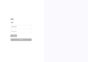

Wireframes para administradores correspondientes a las interfaces de registro de un estudiante al sistema, las opciones de búsqueda, eliminar y editar estudiante:

Wireframes para administradores correspondientes a las interfaces de registro de un profesores al sistema, las opciones de búsqueda, eliminar y editar profesor:

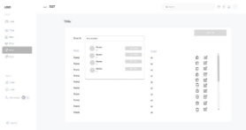

Wireframes para administradores correspondientes a las interfaces de crear un salon, las opciones de agregar o eliminar estudiantes:

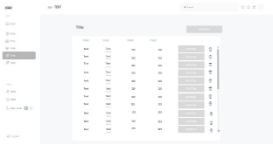

Wireframes para administradores correspondientes a las interfaces de mantenimiento de instalaciones educativas, con las opciones de editar o eliminar:

Wireframes para administradores correspondientes a las interfaces de mantenimiento del equipo educativo, con las opciones de editar o eliminar:

Wireframes para profesores correspondientes a las interfaces de toma de asistencia de un curso: 

#### **4.4.2. Web Applications Wireflow Diagrams.**

**User Goal: El usuario ingresa a la aplicación para registrarse como administrador o profesor.**

**User Goal: El usuario ingresa a la aplicación para iniciar sesión como administrador o profesor.**

**User Goal: Recuperación de contraseña**

El usuario, ya sea administrador o profesor, accede inicialmente a la aplicación mediante la página de inicio de sesión. Aquí se presenta con tres opciones principales: "Iniciar sesión", "Crear nueva cuenta" y "Olvidé mi contraseña". Al seleccionar "Iniciar sesión", el usuario puede ingresar utilizando sus credenciales existentes, lo que le permite acceder directamente a su pantalla de inicio específica.

Para los usuarios que aún no están registrados, el botón "Crear nueva cuenta" los redirige a un formulario donde pueden ingresar sus detalles para configurar una nueva cuenta. Una vez completado el registro, son llevados a una pantalla donde deben seleccionar su rol dentro de la aplicación, ya sea como administrador o profesor, mediante los botones "Admin" o "Profesor", respectivamente.

Si un usuario olvida su contraseña, puede elegir la opción "Olvidé mi contraseña", que lo lleva a un proceso para restablecerla, tras lo cual puede regresar a la pantalla de inicio de sesión para acceder con sus nuevas credenciales. Además, en las pantallas de registro y recuperación de contraseña, los usuarios tienen la opción de volver al inicio de sesión principal en cualquier momento, facilitando así la navegación entre diferentes procesos sin necesidad de cerrar la aplicación o perder el progreso.

**User Goal: El administrador desea registrar, editar o eliminar un estudiante:**

**User Goal: El administrador desea registrar, editar o eliminar un profesor:**

El administrador, tras ingresar exitosamente a la plataforma mediante la pantalla de inicio de sesión, se enfrenta a opciones específicas para gestionar las cuentas de estudiantes y profesores. Desde la interfaz principal, tiene la posibilidad de seleccionar entre "Estudiante" o "Profesor" según la tarea administrativa que desee realizar.

Al elegir "Estudiante", el administrador es redirigido a una interfaz donde puede optar por "Crear Estudiante", lo que despliega un formulario para ingresar los detalles necesarios del nuevo estudiante. Una vez que el formulario está completo, utiliza el botón "Guardar" para registrar oficialmente al estudiante en el sistema. Posteriormente, dispone de opciones para "Editar" o "Eliminar" la cuenta del estudiante. Si decide editar, puede modificar la información requerida y guardar los cambios realizados; si opta por eliminar, la cuenta del estudiante se elimina permanentemente del sistema.

De manera similar, si el administrador selecciona "Profesor", se presenta con una opción para "Crear Profesor". Al hacer clic, se muestra un formulario específico para registrar a un nuevo profesor. Después de rellenar los detalles y guardar la información, el administrador también puede decidir si desea editar o eliminar la cuenta del profesor, de acuerdo con las necesidades y requerimientos administrativos del momento.

**User Goal: El administrador desea crear un salon y agregar estudiantes a la misma:**

Una vez seleccionada la opción "Configuración del aula", el usuario es llevado a una pantalla donde puede elegir "Crear aula". Este paso despliega un formulario para introducir los detalles necesarios para establecer un nuevo aula, tales como nombre del aula, cantidad de estudiantes, y recursos disponibles. Tras rellenar los datos, el formulario se guarda, estableciendo así el nuevo aula dentro del sistema.

Además de crear aulas, el usuario tiene la capacidad de buscar estudiantes específicos. Este proceso comienza desde una interfaz donde el usuario puede ingresar criterios de búsqueda para filtrar y localizar estudiantes específicos. Una vez que los estudiantes son encontrados, el usuario puede seleccionar un estudiante en particular, lo que le permite acceder a opciones adicionales como editar la información del estudiante o eliminarlo del sistema si es necesario.

**User Goal: El administrador desea crear un curso dentro de un salon:**

El usuario, un administrador, accede a la aplicación con el objetivo de gestionar cursos dentro de las aulas asignadas. Al ingresar a la sección "Aulas", visualiza y selecciona entre las diferentes opciones disponibles.

Una vez selecciona una aula específica, procede a "Crear curso" mediante una opción disponible en la interfaz. Se le presenta un formulario para ingresar la información relevante del nuevo curso, como el nombre del curso, descripción, créditos, horarios, y otros detalles importantes que ayudan a definir la estructura del curso.

Tras completar el formulario con los datos necesarios, el administrador selecciona "Guardar" para registrar el curso en el sistema, asociándolo con el aula elegida previamente. Este proceso asegura que el curso esté correctamente configurado y disponible para ser impartido, facilitando la administración académica eficiente.

**User Goal: El administrador desea registrar mantenimiento de instalaciones:**

**User Goal: El administrador desea registrar mantenimiento del equipo escolar:**

El administrador comienza el proceso seleccionando "Mantenimiento" en la interfaz principal de la aplicación. A continuación, tiene dos opciones principales para manejar: "Equipo del aula" o "Instalaciones". Dependiendo de lo que necesite administrar, elige una de estas opciones.

Si selecciona "Equipo del aula", accede a una lista de todos los equipos disponibles en las aulas. Aquí puede agregar nuevo equipo seleccionando la opción "Crear equipo". Esto abre un formulario donde ingresa los detalles necesarios del equipo, como nombre, modelo, cantidad y la ubicación específica dentro del aula. Una vez completado el formulario, elige "Guardar" para añadir el equipo al inventario del aula.

En cualquier momento, el administrador también puede seleccionar un equipo existente de la lista para editar sus detalles o eliminarlo del sistema. Al seleccionar "Editar", modifica la información en el formulario que aparece y guarda los cambios. Si necesita eliminar el equipo, simplemente selecciona "Eliminar" y confirma la acción para remover el equipo del inventario.

**User Goal: El profesor desea tener un registro de asistencias, con la capacidad de editar o eliminar:**

**User Goal: El profesor desea tener un registro de notas académicas, con la capacidad de editar o eliminar:**

El administrador o maestro accede a la interfaz principal de la aplicación y selecciona "Ver" para acceder a diferentes tipos de información académica. Desde aquí, tiene dos opciones principales: "Asistencia" y "Calificaciones".

Si elige "Asistencia", accede a un listado donde puede ver la asistencia de los estudiantes. Si necesita hacer alguna modificación o registrar asistencia no documentada previamente, selecciona "Asistir" que abre un formulario donde puede actualizar o añadir la información de asistencia. Una vez completadas las actualizaciones, selecciona "Guardar asistencia" para asegurar que los cambios se guarden en el sistema.

Por otro lado, si elige "Calificaciones", se muestra un listado de las calificaciones de los estudiantes. Aquí, puede añadir nuevas calificaciones seleccionando "Nueva calificación". Esto le permite ingresar o modificar las calificaciones en un formulario. Después de hacer los ajustes necesarios, elige "Guardar calificación" para registrar las modificaciones o nuevas entradas en el sistema.

#### **4.4.2. Web Applications Mock-ups.**

En base a los wireframes presentados en el punto anterior, se desarrollaron los siguientes mock-ps de la aplicación.

**Mock-ups correspondientes a las interfaces de registro de usuarios, ingreso de usuarios registrados y recuperación de contraseña:**

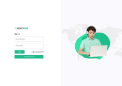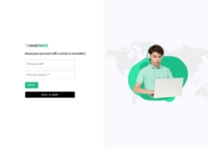

Estos mock-ups mantienen una estructura clara y simplificada que prioriza la accesibilidad, con campos de entrada amplios, etiquetas legibles y botones destacados en verde para facilitar la navegación. La consistencia visual se logra a través del uso de un esquema de colores coherente y elementos de diseño uniformes, reforzando la identidad de la marca y mejorando la experiencia del usuario. Además, el diseño inclusivo se ve reflejado en la diferenciación clara de roles y en la adaptabilidad de la interfaz para satisfacer diversas necesidades de los usuarios. Esta cohesión entre la arquitectura de la información y el sistema de diseño establecido promueve una interfaz intuitiva que mejora la interacción del usuario.

**Mock-ups para administradores correspondientes a las interfaces de registro de un estudiante al sistema, las opciones de búsqueda, eliminar y editar estudiante:**

Para los mock-ups del registro de un estudiante al sistema, el proceso comienza con la lista de estudiantes, que muestra cada entrada con opciones para editar o eliminar. Seguidamente, la interfaz de registro permite a los administradores ingresar y guardar datos esenciales de estudiantes como nombre, apellido, DNI, y detalles de contacto, a través de formularios bien estructurados con botones claros para acciones específicas. Luego, la interfaz de edición mantiene la consistencia con la de registro, facilitando actualizaciones precisas y eficientes. Por último, la interfaz de eliminación incluye confirmaciones para prevenir borrados accidentales, asegurando que cada acción sea deliberada y segura.

**Mock-ups para administradores correspondientes a las interfaces de registro de un profesores al sistema, las opciones de búsqueda, eliminar y editar profesor:**

Para los mock-ups del registro de un profesor al sistema, el proceso comienza con la lista de profesores, la cual muestra cada entrada con opciones para editar o eliminar. Seguidamente, la interfaz de registro permite a los administradores ingresar y guardar datos esenciales de profesores como nombre, apellido, DNI, teléfono, dirección y correo, a través de formularios bien estructurados con botones claros para acciones específicas. Luego tenemos la interfaz de edición la cual mantiene la consistencia con la de registro, mientras que la de eliminación incluye confirmaciones para prevenir borrados accidentales.

**Mock-ups para administradores correspondientes a las interfaces de crear un salon, las opciones de agregar o eliminar estudiantes:**

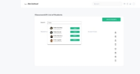

Para los mock-ups de gestión de aulas,el proceso comienza con la interfaz de 'Crear un Aula' la cual permite a los administradores definir parámetros como el nombre del salón, la sección y la capacidad, utilizando formularios simplificados con validación de entrada para asegurar la precisión de los datos. Posteriormente, la lista de aulas muestra cada aula con opciones para 'Editar', 'Agregar Estudiantes' o 'Eliminar', mejorando la eficiencia en la gestión de recursos educativos. Además, para cada aula, se pueden añadir estudiantes específicos a través de una interfaz de búsqueda rápida que filtra por nombre o código, incluyendo un proceso de confirmación para garantizar la integridad de la acción antes de realizar cambios significativos como la eliminación de un estudiante.

**Mock-ups para administradores correspondientes a la creación de un curso, con la opción de eliminar:**

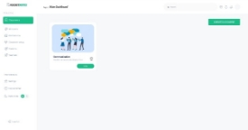

Para los mock-ups de la creación de un curso, el proceso inicia con la interfaz para seleccionar el aula donde se impartirá el curso. Seguidamente, se procede a la interfaz de "Crear un Curso", donde los administradores pueden ingresar datos clave del curso como el nombre, la sala asignada, las fechas de inicio y fin, los días que se impartirá, y el docente responsable. Esta interfaz también permite subir una imagen que represente visualmente el curso, facilitando su identificación en el sistema.

Cada curso creado es visible en la lista de cursos, donde se pueden gestionar a través de opciones para "Ver", "Editar" o "Eliminar". Estas interfaces mantienen una estructura clara y simplificada que prioriza la accesibilidad, con campos de entrada amplios, etiquetas legibles y botones destacados para facilitar la navegación.

La consistencia visual se logra a través del uso de un esquema de colores coherente y elementos de diseño uniformes, reforzando la identidad de la marca y mejorando la experiencia del usuario. Además, la inclusión de botones de acción directa y confirmaciones para operaciones críticas como la eliminación de un curso asegura que cada interacción sea precisa y segura, reflejando un diseño inclusivo y adaptativo a diversas necesidades administrativas.

**Mock-ups para administradores correspondientes a las interfaces de mantenimiento de instalaciones educativas, con las opciones de editar o eliminar:**

Estos mock-ups abordan la gestión de las instalaciones educativas de una manera estructurada y eficiente. La interfaz principal muestra una lista detallada de todas las instalaciones, proporcionando información esencial como el nombre de la instalación, una breve descripción de las tareas de mantenimiento previstas, el presupuesto asignado, la fecha de creación, el período estimado de ejecución y el estado actual del proyecto. Cada entrada en la lista ofrece también opciones operativas claramente visibles para 'Editar' o 'Eliminar', facilitando la gestión continua y la actualización de la información.

Estos mock-ups mantienen una estructura clara y simplificada que prioriza la accesibilidad y la eficiencia operativa, con campos de entrada amplios, etiquetas legibles y botones destacados en verde para facilitar la navegación. La consistencia visual se logra a través del uso de un esquema de colores coherente y elementos de diseño uniformes, reforzando la identidad de la marca y mejorando la experiencia del usuario. Además, el diseño inclusivo se ve reflejado en la diferenciación clara de opciones y en la adaptabilidad de la interfaz para satisfacer diversas necesidades de los usuarios, promoviendo una gestión efectiva y segura de las instalaciones educativas.

**Mock-ups para administradores correspondientes a las interfaces de mantenimiento del equipo educativo, con las opciones de editar o eliminar:**

Los mock-ups de esta sección están diseñados para facilitar una gestión más dinámica y detallada del equipo educativo. La interfaz permite a los administradores no solo ver y editar los detalles del equipo, como cantidad y presupuesto, sino también gestionar su uso y duración efectiva dentro del ciclo educativo.

Funcionalidad de Inventario Dinámico: Al proporcionar detalles específicos sobre el estado del equipo y permitir ajustes rápidos a través de la función de edición, la interfaz ayuda a los administradores a responder de manera flexible a las necesidades cambiantes de las aulas. Esto es esencial para evitar la escasez o el exceso de materiales.

Control Riguroso de los Recursos: Las opciones para añadir, editar o eliminar equipos están diseñadas para garantizar que cada recurso se utilice de manera óptima y se mantenga dentro de su ciclo de vida útil, ayudando a la institución a manejar su presupuesto de manera más efectiva.

Alertas y Confirmaciones: A diferencia de otras interfaces, aquí se hace énfasis en las alertas de confirmación antes de eliminar cualquier elemento, lo cual es crucial dado el impacto significativo que tiene la disponibilidad del equipo en el funcionamiento diario de las clases.

La interfaz está diseñada específicamente para facilitar una gestión efectiva y evitar errores comunes en la administración de recursos, lo cual es un desafío único en la gestión de equipos en comparación con otras áreas administrativas. Esto refleja un enfoque más personalizado y orientado a las necesidades específicas de gestión del equipo educativo.

**Mock-ups para profesores correspondientes a las interfaces de toma de asistencia de un curso:** 

Para los mock-ups de la toma de asistencia en la plataforma, se han diseñado interfaces que incorporan principios de diseño inclusivo, claridad en la arquitectura de información, y se alinean con el Design System establecido para los productos digitales. El proceso comienza con la interfaz de selección de curso, donde cada curso se representa visualmente con una imagen distintiva y el nombre claramente etiquetado, facilitando la rápida identificación por parte del profesor. Esta etapa demuestra una interfaz intuitiva y accesible que reduce la carga cognitiva y mejora la accesibilidad.

Al seleccionar "Nueva Asistencia", la interfaz muestra automáticamente la fecha actual, eliminando la necesidad de selección manual y reduciendo los errores de entrada, optimizando así la eficiencia del proceso. Los iconos de asistencia aparecen inicialmente en gris al lado de cada nombre de estudiante, permitiendo a los profesores cambiar su estado con un simple clic a verde (presente) o rojo (ausente).

Esta metodología de iconografía intuitiva y el uso de colores facilitan un registro visual rápido y claro, apoyando principios de diseño inclusivo por su claridad incluso para usuarios con distintas capacidades visuales.

Antes de guardar la asistencia, se solicita al profesor una confirmación para verificar la precisión de los datos ingresados, lo cual refuerza la seguridad de la información y evita modificaciones posteriores. Este paso crucial asegura la integridad de los registros y previene modificaciones accidentales o intencionadas, reflejando un compromiso con el diseño seguro e inclusivo.

**Mock-ups para profesores correspondientes a las interfaces de registro de notas de un curso:** 

La interfaz comienza con una lista detallada de los estudiantes, cada uno identificado por nombre y una foto, lo que facilita la identificación visual rápida por parte del profesor. Esta lista está diseñada para ser intuitiva, con filas y columnas claramente marcadas para cada evaluación, permitiendo un acceso directo y sencillo a la información necesaria para el registro de calificaciones.

En el proceso de añadir una nueva nota, al seleccionar "Nueva Calificación", se abre un diálogo que confirma la intención del profesor de registrar una nueva evaluación para el curso, minimizando errores y asegurando que las acciones sean deliberadas. 

Una vez en la interfaz de ingreso de calificaciones, el sistema permite al profesor ingresar o editar las notas para cada evaluación de manera individual. Las celdas de entrada de calificaciones están diseñadas para ser fácilmente accesibles, con campos de entrada que responden adecuadamente a dispositivos táctiles y no táctiles. Además, cada cambio realizado por el profesor se puede guardar de manera instantánea para evitar la pérdida de información, con opciones para deshacer cambios si es necesario, lo cual es una práctica de diseño inclusivo que considera diferentes escenarios de uso y necesidades del usuario.

El diseño también incluye indicadores visuales como colores diferenciados para estados como "Aprobado" (verde) y "Desaprobado" (rojo), ofreciendo un feedback visual instantáneo sobre el rendimiento del estudiante, lo cual es crucial para una navegación eficiente y una revisión rápida de las calificaciones. Además, el sistema calcula automáticamente el promedio de las calificaciones para cada estudiante, presentando estos datos de manera clara y concisa al final de cada fila, lo que ayuda a los profesores a hacer seguimiento del rendimiento académico general de manera eficiente.

#### **4.4.3. Web Applications User Flow Diagrams.**

Basado en los Wireflow Diagrams, se han definido los siguientes User Flow Diagrams para nuestro mock-up y prototipo:

**User Goal: El usuario ingresa a la aplicación para registrarse como administrador o profesor.**

**User Goal: El usuario ingresa a la aplicación para iniciar sesión como administrador o profesor.**

**User Goal: Recuperación de contraseña**

El usuario, ya sea administrador o profesor, accede inicialmente a la aplicación mediante la página de inicio de sesión. Aquí se presenta con tres opciones principales: "Iniciar sesión", "Crear nueva cuenta" y "Olvidé mi contraseña". Al seleccionar "Iniciar sesión", el usuario puede ingresar utilizando sus credenciales existentes, lo que le permite acceder directamente a su pantalla de inicio específica.

Para los usuarios que aún no están registrados, el botón "Crear nueva cuenta" los redirige a un formulario donde pueden ingresar sus detalles para configurar una nueva cuenta. Una vez completado el registro, son llevados a una pantalla donde deben seleccionar su rol dentro de la aplicación, ya sea como administrador o profesor, mediante los botones "Admin" o "Profesor", respectivamente.

Si un usuario olvida su contraseña, puede elegir la opción "Olvidé mi contraseña", que lo lleva a un proceso para restablecerla, tras lo cual puede regresar a la pantalla de inicio de sesión para acceder con sus nuevas credenciales. Además, en las pantallas de registro y recuperación de contraseña, los usuarios tienen la opción de volver al inicio de sesión principal en cualquier momento, facilitando así la navegación entre diferentes procesos sin necesidad de cerrar la aplicación o perder el progreso.

**User Goal: El administrador desea registrar, editar o eliminar un estudiante:**

**User Goal: El administrador desea registrar, editar o eliminar un profesor:**

El administrador, tras ingresar exitosamente a la plataforma mediante la pantalla de inicio de sesión, se enfrenta a opciones específicas para gestionar las cuentas de estudiantes y profesores. Desde la interfaz principal, tiene la posibilidad de seleccionar entre "Estudiante" o "Profesor" según la tarea administrativa que desee realizar.

Al elegir "Estudiante", el administrador es redirigido a una interfaz donde puede optar por "Crear Estudiante", lo que despliega un formulario para ingresar los detalles necesarios del nuevo estudiante. Una vez que el formulario está completo, utiliza el botón "Guardar" para registrar oficialmente al estudiante en el sistema. Posteriormente, dispone de opciones para "Editar" o "Eliminar" la cuenta del estudiante. Si decide editar, puede modificar la información requerida y guardar los cambios realizados; si opta por eliminar, la cuenta del estudiante se elimina permanentemente del sistema.

De manera similar, si el administrador selecciona "Profesor", se presenta con una opción para "Crear Profesor". Al hacer clic, se muestra un formulario específico para registrar a un nuevo profesor. Después de rellenar los detalles y guardar la información, el administrador también puede decidir si desea editar o eliminar la cuenta del profesor, de acuerdo con las necesidades y requerimientos administrativos del momento.

**User Goal: El administrador desea crear un salon y agregar estudiantes a la misma:**

Una vez seleccionada la opción "Configuración del aula", el usuario es llevado a una pantalla donde puede elegir "Crear aula". Este paso despliega un formulario para introducir los detalles necesarios para establecer un nuevo aula, tales como nombre del aula, cantidad de estudiantes, y recursos disponibles. Tras rellenar los datos, el formulario se guarda, estableciendo así el nuevo aula dentro del sistema.

Además de crear aulas, el usuario tiene la capacidad de buscar estudiantes específicos. Este proceso comienza desde una interfaz donde el usuario puede ingresar criterios de búsqueda para filtrar y localizar estudiantes específicos. Una vez que los estudiantes son encontrados, el usuario puede seleccionar un estudiante en particular, lo que le permite acceder a opciones adicionales como editar la información del estudiante o eliminarlo del sistema si es necesario.

**User Goal: El administrador desea crear un curso dentro de un salon:**

El usuario, un administrador, accede a la aplicación con el objetivo de gestionar cursos dentro de las aulas asignadas. Al ingresar a la sección "Aulas", visualiza y selecciona entre las diferentes opciones disponibles.

Una vez selecciona una aula específica, procede a "Crear curso" mediante una opción disponible en la interfaz. Se le presenta un formulario para ingresar la información relevante del nuevo curso, como el nombre del curso, descripción, créditos, horarios, y otros detalles importantes que ayudan a definir la estructura del curso.

Tras completar el formulario con los datos necesarios, el administrador selecciona "Guardar" para registrar el curso en el sistema, asociándolo con el aula elegida previamente. Este proceso asegura que el curso esté correctamente configurado y disponible para ser impartido, facilitando la administración académica eficiente.

**User Goal: El administrador desea registrar mantenimiento de instalaciones:**

**User Goal: El administrador desea registrar mantenimiento del equipo escolar:**

El administrador comienza el proceso seleccionando "Mantenimiento" en la interfaz principal de la aplicación. A continuación, tiene dos opciones principales para manejar: "Equipo del aula" o "Instalaciones". Dependiendo de lo que necesite administrar, elige una de estas opciones.

Si selecciona "Equipo del aula", accede a una lista de todos los equipos disponibles en las aulas. Aquí puede agregar nuevo equipo seleccionando la opción "Crear equipo". Esto abre un formulario donde ingresa los detalles necesarios del equipo, como nombre, modelo, cantidad y la ubicación específica dentro del aula. Una vez completado el formulario, elige "Guardar" para añadir el equipo al inventario del aula.

En cualquier momento, el administrador también puede seleccionar un equipo existente de la lista para editar sus detalles o eliminarlo del sistema. Al seleccionar "Editar", modifica la información en el formulario que aparece y guarda los cambios. Si necesita eliminar el equipo, simplemente selecciona "Eliminar" y confirma la acción para remover el equipo del inventario.

**User Goal: El profesor desea tener un registro de asistencias, con la capacidad de editar o eliminar:**

**User Goal: El profesor desea tener un registro de notas académicas, con la capacidad de editar o eliminar:**

El administrador o maestro accede a la interfaz principal de la aplicación y selecciona "Ver" para acceder a diferentes tipos de información académica. Desde aquí, tiene dos opciones principales: "Asistencia" y "Calificaciones".

Si elige "Asistencia", accede a un listado donde puede ver la asistencia de los estudiantes. Si necesita hacer alguna modificación o registrar asistencia no documentada previamente, selecciona "Asistir" que abre un formulario donde puede actualizar o añadir la información de asistencia. Una vez completadas las actualizaciones, selecciona "Guardar asistencia" para asegurar que los cambios se guarden en el sistema.

Por otro lado, si elige "Calificaciones", se muestra un listado de las calificaciones de los estudiantes. Aquí, puede añadir nuevas calificaciones seleccionando "Nueva calificación". Esto le permite ingresar o modificar las calificaciones en un formulario. Después de hacer los ajustes necesarios, elige "Guardar calificación" para registrar las modificaciones o nuevas entradas en el sistema.

### **4.5. Web Applications Prototyping**

Puede acceder al prototipo de nuestra aplicación por medio de este enlace:
**<https://www.figma.com/file/TjxKSpJ88E1fyVr6BmBJhD/PROTOTYPING?type=design&mode=design&t=enuSSTjm6Q1VbWCf-1>**

### **4.6. Domain-Driven Software Architecture**

La Arquitectura de Software Orientada al Dominio enfatiza comprender el dominio del problema antes de diseñar el sistema. Este enfoque alinea la tecnología con las necesidades del negocio, reduciendo complejidad y mejorando la eficacia en el desarrollo de software. 

4\.6.1. Software Architecture Context Diagram

Este diagrama proporciona una vista de alto nivel de nuestro sistema de software y su entorno externo.

4.6.2. Software Architecture Container Diagrams. 

Este diagrama se centra en descomponer el sistema en contenedores de alto nivel, que pueden ser aplicaciones, servicios web, bases de datos, etc.

#### **4.6.3. Software Architecture Components Diagrams.**

Estos diagramas profundizan en los contenedores identificados en los diagramas anteriores y descomponen cada contenedor en sus componentes individuales.

### **4.7. Software Object-Oriented Design.**

El diseño orientado a objetos es el núcleo de nuestra aplicación, estructurando el software en torno a clases que representan entidades del mundo real con propiedades y métodos definidos. Este enfoque mejora la modularidad y la reusabilidad del código, permitiendo una mayor escalabilidad y mantenimiento del sistema.

#### **4.7.1. Class Diagrams**

Los diagramas de clases proporcionan una representación visual de la estructura de la aplicación. Al visualizar las clases, sus atributos, métodos y las relaciones entre ellas, los desarrolladores pueden comprender mejor y modificar el sistema de manera eficiente. Estos diagramas son esenciales para la planificación y la implementación inicial, así como para las fases de prueba y mantenimiento.

**Identity and Access Management**

Implementación en la Aplicación: Nuestra aplicación incluye un sistema "Identity and Access Management" que controla el acceso a diversas funcionalidades y datos según el rol del usuario. Este módulo gestiona la autenticación y autorización, asegurando que las operaciones críticas sólo sean accesibles por usuarios verificados y autorizados. Implementa patrones de diseño como Singleton para la instancia de servicio de autenticación y Observer para reaccionar a cambios de estado en las sesiones de usuario.

**Student record management**

Implementación en la Aplicación: El módulo de "Student record management" administra la información académica y personal de los estudiantes. Utiliza clases para representar estudiantes, cursos y registros académicos, con métodos para añadir, modificar y eliminar registros. Este módulo es crucial para operaciones académicas, desde la inscripción hasta la graduación, asegurando un manejo eficiente y seguro de los datos estudiantiles.

**Inventory Management**

Implementación en la Aplicación: El sistema de "Inventory Management" de nuestra aplicación ayuda a monitorear recursos como libros, equipos de laboratorio, y otros materiales educativos. Utiliza un patrón de estrategia para adaptar diferentes métodos de actualización de inventario y Observer para notificar a los interesados sobre cambios críticos en el stock, optimizando la gestión y reduciendo desperdicios.

**Infrastructure management**

Implementación en la Aplicación: Nuestro módulo de **"Infrastructure management"** supervisa y administra los recursos físicos de la institución. Implementa un sistema de comandos para realizar y revertir cambios en la configuración de aulas y otros espacios educativos, permitiendo una gestión dinámica y adaptativa de la infraestructura física conforme a las necesidades educativas y administrativas.

### **4.7.1. Class Dictionary**

A continuación, se detallarán cada una de las clases de los diagramas presentados anteriormente, proporcionando una visión clara de su funcionalidad y su relación con el sistema general. 

**Identity and access management:**

**AuthenticationService class:** Esta clase es el servicio central para manejar la autenticación de los usuarios en el sistema. Provee una instancia estática, siguiendo el patrón singleton para asegurar un único punto de autenticación en toda la aplicación. Sus responsabilidades incluyen la gestión del inicio y cierre de sesión, así como la verificación de credenciales.

**Atributos:**

- Instance: Instancia estática para el acceso al servicio.

**Métodos:**

- AuthenticationService(): Constructor de la clase.
- GetInstance(): Método estático que devuelve la instancia única del servicio.
- Login(): Permite a los usuarios iniciar sesión.
- Logout(): Permite a los usuarios cerrar sesión.
- VerifyCredentials(): Verifica las credenciales de los usuarios.

**AccountFactory class:** Actúa como una fábrica para la creación de cuentas de usuario. Utiliza los detalles proporcionados por los usuarios para crear una nueva cuenta y asociarla con la entidad de User.

**Métodos:**

- CreateUserAccount(): Crea y devuelve una nueva instancia de User.

**User class:** Representa a un usuario del sistema con toda la información esencial para su identificación y gestión dentro del sistema.

**Atributos:**

- username: Nombre de usuario para el acceso.
- password: Contraseña del usuario.

**Métodos:**

- Update(): Actualiza la información del usuario.
- ChangePassword(): Permite cambiar la contraseña.
- UpdateProfile(): Actualiza el perfil del usuario.

**MessagingSystem class:** Esta clase se encarga de manejar el envío de mensajes dentro del sistema. Utiliza el patrón Decorator para modificar o extender las funcionalidades de los mensajes.

**MessageComponent interface:** Define una interfaz para los componentes del mensaje que permitirá obtener su contenido.

**Message class:** Modela un mensaje dentro del sistema con todos los detalles necesarios, incluyendo el contenido, el remitente, los destinatarios y cualquier adjunto relacionado.

**Atributos:**

- content: El contenido del mensaje.
- sender: El usuario que envía el mensaje.
- receivers: La lista de usuarios que recibirán el mensaje.
- attachments: La lista de adjuntos del mensaje.

**Métodos:**

- GetMessageContent(): Devuelve el contenido del mensaje.
- AddAttachment(): Añade un adjunto al mensaje.

**Attachment class:** Representa un adjunto dentro de un mensaje y contiene la información necesaria para su manejo.

**MessageSearchStrategy interface:** Define la estrategia de búsqueda para los mensajes, permitiendo la implementación de distintas maneras de buscar mensajes basados en diferentes criterios.

**BySenderSearchStrategy class:** Implementa la estrategia de búsqueda de mensajes por remitente, proporcionando la funcionalidad necesaria para encontrar mensajes de un remitente específico.

**Métodos:**

- Search(): Busca en la lista de mensajes aquellos que coincidan con el remitente especificado.

**ByContentSearchStrategy class:** Implementa la estrategia de búsqueda de mensajes por contenido, permitiendo encontrar mensajes que contengan un texto específico.

**Métodos:**

- Search(): Busca en la lista de mensajes aquellos que contengan el contenido especificado.

**EncryptedMessageDecorator class:** Aplica el patrón Decorator para extender los mensajes con funcionalidades de encriptación, asegurando que el contenido del mensaje se mantenga seguro y privado durante el tránsito.

**Atributos:**

- messageComponent: El componente del mensaje original que se va a decorar.

**Métodos:**

- GetMessageContent(): Devuelve el contenido encriptado del mensaje.

**Student record management:**

**IObserver interface:** Define la operación de actualización que los observadores deben implementar para recibir notificaciones de los cambios en el objeto que están observando.

**Métodos:**

- Update(student: Student): Actualiza el observador con la información más reciente del estudiante.

**CommunicationService class:** Encargada de la gestión de comunicaciones hacia los contactos parentales, maneja el envío de notificaciones por correo electrónico y SMS.

**Métodos:**

- SendEmail(message: String, contact: ParentContact): Envía un correo electrónico al contacto parental.
- SendSMS(message: String, contact: ParentContact): Envía un SMS al contacto parental.

**ProgressTracker class:** Actúa como un observador del progreso de los estudiantes, rastreando y actualizando los registros de progreso académico de los estudiantes.

**Métodos:**

- Update(student: Student): Recibe actualizaciones sobre el progreso de los estudiantes y modifica los registros correspondientes.

**StudentFactory class:** Fábrica que se especializa en la creación de objetos de la clase Student, instanciando estudiantes con detalles específicos y asociaciones necesarias.

Métodos:

- CreateStudentDetails(studentDetails: StudentDetails, parentContact: ParentContact): Crea una nueva instancia de un estudiante con los detalles proporcionados.

**Student class:** Representa a un estudiante en el sistema educativo, manteniendo información personal, académica y registros de asistencia.

**Atributos:**

- studentId: Identificador único del estudiante.
- name: Nombre del estudiante.
- level: Nivel educativo del estudiante.
- parentContact: Información de contacto del padre o tutor.
- academicRecords: Lista de registros académicos.
- attendanceRecords: Lista de registros de asistencia.

**Métodos:**

- AddAcademicRecord(record: AcademicRecord): Agrega un registro académico al estudiante.
- AddAttendanceRecord(record: AttendanceRecord): Agrega un registro de asistencia al estudiante.

**ParentContact class:** Contiene información de contacto de los padres o tutores y ofrece un método para enviarles notificaciones.

**Atributos:**

- emailAddress: Dirección de correo electrónico para enviar notificaciones.
- phoneNumber: Número de teléfono para enviar mensajes.

**Métodos:**

- SendNotification(message: String): Envía una notificación al contacto parental.

**AcademicRecord class:** Almacena información sobre el desempeño académico de un estudiante, incluyendo asignaturas y calificaciones.

**Atributos:**

- subject: Asignatura del registro académico.
- grade: Calificación obtenida en la asignatura.
- date: Fecha del registro.

**EducationalLevel class:** Representa el nivel educativo de un estudiante y contiene secciones de clases.

**Atributos:**

- name: Nombre del nivel educativo.
- sections: Lista de secciones de clase dentro del nivel educativo.

**Métodos:**

- AddSection(section: Section): Agrega una sección al nivel educativo.

**Section class:** Agrupa estudiantes en secciones o clases y gestiona sus grados.

**Atributos:**

- name: Nombre de la sección.
- grades: Lista de grados asociados a la sección.

**Métodos:**

- AddGrade(grade: Grade): Agrega un grado a la sección.

**Grade class:** Representa el grado o año escolar de los estudiantes y mantiene una lista de cursos.

**Atributos:**

- name: Nombre del grado escolar.
- courses: Lista de cursos asociados al grado.

**Métodos:**

- AddCourse(course: Course): Agrega un curso al grado.

**Course class:** Modela un curso educativo, incluyendo su nombre, código y el profesor que lo imparte.

**Atributos:**

- name: Nombre del curso.
- code: Código único del curso.
- instructor: Profesor que imparte el curso.

**Teacher class:** Representa a un profesor dentro del sistema, incluyendo los cursos que enseña.

**Atributos:**

- name: Nombre del profesor.
- courses: Lista de cursos que el profesor imparte.

**Métodos:**

TeachCourse(course: Course): Asocia un curso al profesor para enseñarlo.

**ClassSession class:** Representa una sesión de clase y administra el registro de asistencia a través de estrategias definidas.

**Atributos:**

- sessionDate: Fecha en la que ocurre la sesión de clase.
- recordedAttendances: Lista de registros de asistencia de la sesión.

**Métodos:**

- SetAttendanceStrategy(strategy: AttendanceStrategy): Establece la estrategia de registro de asistencia.

**AttendanceStrategy interface:** Define un método para registrar la asistencia de los estudiantes en una sesión de clase.

**Métodos:**

- RecordAttendance(student: Student, session: ClassSession): Registra la asistencia de un estudiante en una sesión de clase.

**ManualAttendanceStrategy class:** Implementa la interfaz AttendanceStrategy permitiendo el registro manual de la asistencia de los estudiantes.

**Métodos:**

- RecordAttendance(student: Student, session: ClassSession): Registra manualmente la asistencia de un estudiante en una sesión de clase.

**RFIDAttendanceStrategy class:** Implementa la interfaz AttendanceStrategy utilizando la tecnología RFID para registrar automáticamente la asistencia de los estudiantes.

**Métodos:**

- RecordAttendance(student: Student, session: ClassSession): Registra automáticamente la asistencia de un estudiante en una sesión de clase mediante RFID.

**Inventory management**

**InventoryService class:** Esta clase gestiona el servicio de inventario de la aplicación, siguiendo el patrón singleton para garantizar una única instancia que maneje todas las operaciones de inventario. Facilita la adición y eliminación de elementos, así como la recuperación y el informe de elementos de inventario.

**Atributos:**

- instance: Instancia estática que asegura un punto único de manejo del inventario.

**Métodos:**

- InventoryService(): Constructor de la clase.
- GetInstance(): Retorna la instancia única del servicio de inventario.
- AddItem(): Agrega un elemento al inventario.
- RemoveItem(): Elimina un elemento del inventario.
- GetItemById(): Obtiene un elemento por su identificador.
- ExportReport(): Exporta un informe del inventario.

**InventoryItemFactory class:** Funciona como una fábrica para crear elementos de inventario, simplificando el proceso de creación y asegurando que todos los elementos se construyan de manera consistente.

- **Métodos:**

  CreateItem(): Crea y devuelve una nueva instancia de InventoryItem.

**InventoryItem class:** Modela un elemento dentro del inventario, con propiedades como identificación, nombre y cantidad, y mantiene una lista de observadores para cualquier cambio en sus datos.

**Atributos:**

- id: Identificador único del elemento.
- name: Nombre del elemento.
- quantity: Cantidad del elemento en inventario.
- updateStrategy: Estrategia actual de actualización de la cantidad.

**Métodos:**

- SetUpdateStrategy(): Establece la estrategia de actualización del elemento.
- UpdateQuantity(): Actualiza la cantidad del elemento en inventario.
- Attach(): Agrega un observador a la lista de observadores.
- Detach(): Elimina un observador de la lista de observadores.
- NotifyObservers(): Notifica a todos los observadores de los cambios.

**IObserver interface:** Define la interfaz que deben implementar los observadores para recibir actualizaciones sobre los cambios en los elementos del inventario.

**Métodos:**

- Update(): Actualiza el observador con la información del elemento de inventario.

**IUpdateStrategy interface:** Establece el método que las estrategias de actualización de inventario deben implementar para cambiar la cantidad de un elemento.

**Métodos:**

- UpdateQuantity(): Actualiza la cantidad de un elemento de inventario.

**InventoryChangeLogger class:** Observador concreto que registra cualquier cambio en los elementos del inventario para propósitos de seguimiento o auditoría.

**Métodos:**

- Update(): Registra los cambios realizados en un elemento de inventario.

**IncrementalUpdateStrategy class:** Estrategia concreta que implementa la interfaz IUpdateStrategy para actualizar la cantidad de un elemento de manera incremental.

**Métodos:**

- UpdateQuantity(): Aumenta o disminuye la cantidad de un elemento del inventario según la cantidad proporcionada.

**Equipment class:**

Subclase concreta de InventoryItem que representan diferentes tipos de elementos en el inventario, como suministros escolares o equipos.

**Infrastructure management**

**ClassroomFactory class:** Esta clase es una fábrica que se especializa en la creación de instancias de la clase Classroom. Proporciona un método para crear nuevos salones de clase con un nombre y una capacidad especificada.

**Métodos:**

- CreateClassroom(name: String, capacity: Int): Crea y devuelve una nueva instancia de la clase Classroom con el nombre y la capacidad proporcionados.

**ReportGenerator class:** Es responsable de generar informes basados en la lista de aulas proporcionadas. Utiliza los datos de las aulas para compilar un informe detallado.

**Métodos:**

- GenerateReport(classrooms: List<Classroom>): Genera y devuelve un informe sobre las aulas proporcionadas.

**Classroom class:** Modela un aula dentro del sistema, manteniendo su nombre y capacidad. Ofrece métodos para agregar, actualizar y listar aulas, así como filtrarlas según estrategias de filtrado.

**Atributos:**

- name: Nombre del aula.
- capacity: Capacidad del aula en términos de número de personas que puede albergar.

**Métodos:**

- AddClassroom(): Añade un nuevo aula al sistema.
- UpdateClassroomInfo(): Actualiza la información de un aula existente.
- ListClassrooms(): Lista todas las aulas disponibles en el sistema.
- FilterClassrooms(strategy: FilterStrategy): Filtra las aulas utilizando una estrategia de filtrado proporcionada.

**FilterStrategy interface:** Define un contrato para las estrategias de filtrado que se pueden aplicar a las listas de aulas.

**Métodos:**

- Filter(classrooms: List<Classroom>): Devuelve una lista de aulas filtradas según el criterio de la estrategia.

**LocationFilterStrategy class y CapacityFilterStrategy class:** Implementaciones concretas de la interfaz FilterStrategy. Proporcionan lógica para filtrar aulas por ubicación y capacidad, respectivamente.

**Métodos:**

Filter(classrooms: List<Classroom>): Filtra y devuelve aulas basándose en la ubicación o capacidad.

**BudgetingSystem class:** Gestiona el presupuesto asociado a cada aula, permitiendo crear, actualizar y obtener presupuestos, así como aprobar presupuestos para las aulas.

**Atributos:**

- budgets: Un mapa que asocia aulas con un valor presupuestario.

**Métodos:**

- CreateBudgetForClassroom(): Crea un nuevo presupuesto para un aula.
- UpdateBudgetForClassroom(): Actualiza el presupuesto asignado a un aula.
- GetBudgetForClassroom(): Obtiene el presupuesto actual para un aula.
- ApproveBudgetForClassroom(): Aprueba el presupuesto para un aula.

**Observer interface:** Define la funcionalidad para las clases que deben ser notificadas de cambios en las aulas que están observando.

**Métodos:**

- Update(classroom: Classroom): Actualiza el observador con la información más reciente de un aula.

**ClassroomCapacityObserver class:**

Un observador concreto que monitorea los cambios en la capacidad de las aulas y reacciona ante estos cambios.

**Métodos:**

- Update(classroom: Classroom): Registra los cambios en la capacidad de un aula específica.

**Command interface:**

Define operaciones para ejecutar comandos, así como para deshacer los comandos ejecutados anteriormente.

**Métodos:**

- Execute(): Ejecuta el comando.
- Undo(): Deshace el comando.

**AddClassroomCommand class y UpdateClassroomInfoCommand class:** Clases concretas que implementan la interfaz Command. Estos comandos añaden nuevas aulas y actualizan la información de las aulas existentes, respectivamente, con la capacidad de deshacer estas operaciones.

### **4.8. Database Design**

El diseño de la base de datos es un componente crucial en el desarrollo de software que garantiza que los datos sean almacenados de manera eficiente y puedan ser recuperados y manipulados de manera efectiva. El siguiente diagrama de la base de datos muestra la estructura relacional diseñada para manejar las operaciones y el almacenamiento de datos en el sistema educativo.

#### **4.8.1. Database Diagram**

El diagrama de base de datos presentado a continuación, ilustra la organización y relaciones de las entidades que componen el sistema de gestión educativa. Las entidades clave y sus relaciones se describen para proporcionar una comprensión clara del modelo de datos y su funcionalidad en el contexto de la aplicación.

Enlace al modelado: <https://my.vertabelo.com/public-model-view/pOGF92Qrej8ON4jOc1ZvJLwV1H9yYViDPO6ppO7hmkc2om3xPQkS3tWLKbdLCtwV?x=2225&y=2354&zoom=0.3512> 

**Entidades Principales:**

- **Students:** Almacena información detallada de los estudiantes, incluyendo nombre, apellidos, y datos de contacto.
- **Guardians:** Contiene datos de los tutores de los estudiantes, facilitando la comunicación y seguimiento.
- **Courses:** Registra los cursos disponibles, incluyendo detalles como el nombre del curso y la sección.
- **Grades:** Gestiona las calificaciones de los estudiantes por curso, permitiendo un seguimiento académico efectivo.
- **Classrooms:** Detalla las aulas donde se imparten los cursos, incluyendo capacidad y recursos disponibles.
- **Teachers:** Mantiene registro de los profesores, incluyendo su asignación a cursos y datos de contacto.
- Relaciones Clave:
- **Students\_by\_grade:** Relaciona estudiantes con sus calificaciones en diferentes cursos.
- Attendance: Monitorea la asistencia de los estudiantes a cada sesión de clase, vinculada por curso y fecha.
- **Classrooms\_by\_course**: Asocia aulas específicas con los cursos que en ellas se imparten.
- **Reportes y Gestión:**
- **Inventory\_requests y Inventory:** Gestionan las solicitudes de inventario y el estado actual del mismo, respectivamente, asegurando un control adecuado de los recursos físicos y materiales.
- **Infrastructural\_reports:** Facilita la creación de informes sobre la infraestructura, permitiendo un mantenimiento proactivo de las instalaciones.

Este diagrama no solo define la estructura de almacenamiento de datos sino que también establece las conexiones lógicas entre las diferentes entidades, lo cual es vital para el desarrollo de funciones complejas y la integridad de los datos dentro del sistema.

[ref1]: assets/Aspose.Words.d258ca98-d065-4b00-bfb8-96b5633dab58.009.png
[ref2]: assets/Aspose.Words.d258ca98-d065-4b00-bfb8-96b5633dab58.010.png

## **Capítulo V: Product Implementation, Validation & Deployment**

### **5.1. Software Configuration Management.**

#### **5.1.1. Software Development Environment Configuration.**

A continuación, presentaremos los programas de software que hemos utilizado en el desarrollo de nuestro proyecto.

**Project Management**

- **Whatsapp:** <https://web.whatsapp.com/>

  Se utilizó la plataforma de WhatsApp para organizar las tareas del equipo y proporcionar apoyo mutuo durante el trabajo.

**Product UX/UI Design**

- **Miro:** <https://miro.com/es/>

  Empleamos Miro para desarrollar el Lean UX Canvas.

- **Uxpressia:** <https://uxpressia.com/>

  Utilizamos Uxpressia para crear User Personas, Empathy maps y Journey maps.

- **Figma: <https://www.figma.com>**

  Figma fue nuestra herramienta principal para diseñar wireframes, wireflows, mockups del landing page y para la creación de prototipos de aplicaciones web.

- **LucidChart:** <https://www.lucidchart.com/pages/>

  Para crear los Impact maps

**Software Development**

- **Landing Page:** Para la creación de nuestra página de inicio, hemos empleado HTML5, CSS y Javascript.

**Software Testing**

Hemos realizado pruebas de software en el landing page y la aplicación web utilizando las herramientas de desarrollo de los navegadores web como Google Chrome y Brave.

**IDE's de desarrollo**

- **Webstorm: <https://www.jetbrains.com/webstorm/>**

  Utilizamos Webstorm, un IDE centrado en el desarrollo frontend, por su variedad de herramientas que agilizan el proceso de desarrollo.

**Software Deployment**

- **Github Pages:** <https://pages.github.com/>

  Utilizamos Github Pages para desplegar nuestro landing page, vinculando el repositorio de GitHub para que se encargue automáticamente del despliegue.

**Software Documentation**

- **Google Docs: <https://docs.google.com/document/u/0/>**

  Esta plataforma fue utilizada para enviar el progreso de las tareas asignadas. Semanalmente se enviaban las asignaciones de cada integrante para el informe final.

- **Github: <https://github.com/>**

  Utilizamos GitHub para la documentación del proyecto y el landing page, aprovechando su capacidad de desarrollo colaborativo y su registro de commits para demostrar la contribución de cada miembro.

- **Visual Paradigm:** Utilizamos Visual Paradigm para crear diagramas C4 de nuestro proyecto.

- **Vertabelo:** <https://vertabelo.com/>

  Vertabelo fue utilizado para diseñar la estructura de nuestra base de datos, siendo una aplicación web colaborativa.

#### **5.1.2. Source Code Management**

La administración y estructuración de las múltiples modificaciones se realizaron mediante la creación de un repositorio en GitHub para el proyecto. Nuestra organización se estructuró de la siguiente manera:

**Organización:**

<https://github.com/orgs/upc-pre-202401-si729-sw53-rocket/repositories>

**LandinPage:**

<https://upc-pre-202401-si729-sw53-rocket-land.netlify.app>

**Ramas principales:**

**Rama “main”:** En esta rama se almacenan las versiones oficiales de nuestro repositorio para pasarlas a producción. Rama “develop”: Esta rama se utilizará como punto de integración para las ramas de “feature”. Una vez que el  “head” sea estable y el equipo lo considere listo para el lanzamiento, se fusionará con la rama “release”.

**Ramas auxiliares:**

- **Rama “release”:** La rama “release” se emplea para la preparación del lanzamiento de una nueva versión en la rama “main” ayudando a controlar las versiones de código. Aquí se pueden solucionar errores menores y preparar los datos para la versión. Esta rama permitirá liberar a la rama “develop” de est as tareas preparatorias y evita demoras en el desarrollo mientras se prepara para el lanzamiento. 
- **Rama “feature”:** En las ramas “feature” se desarrollan las características generales que se integrarán en la rama “develop”. Estas características son aquellas funcionalidades solicitadas por los usuarios tanto en la página de inicio como en la aplicación web. Por ejemplo, la rama feature/navbar.
- **Rama “hotfix”:** Esta rama se utiliza para corregir urgentemente errores en la última versión de la rama “main” que no pueden esperar hasta el próximo lanzamiento para ser solucionados.

#### **5.1.3. Source Code Style Guide & Conventions**

- Utilizaremos el lenguaje de etiquetas HTML para el desarrollo principal de nuestra Landing page.
- Utilizaremos el lenguaje CSS, que nos permitirá realizar los estilos de la estructura de nuestra Landing Page
- Implementaremos el lenguaje de JavaScript para brindar las funcionalidades a nuestra Landing page. 
- Utilizaremos el lenguaje Gherkin que se usará para realizar los diseños de prueba de cada historia de usuario contando con su estructura básica. 

#### **5.1.4. Software Deployment Configuration.**

Entrar a Netlify y presionar la opción de “Import an existing project”

]

Después seleccionar la opcion de “Deploy con github”

]

Tras haber hecho eso tenemos que seleccionar nuestra organización y dentro de ella buscar el repositorio del proyecto que deseamos subir a producción

Para finalmente agregar la data necesaria para el despliegue

![ref3]

Y final solo presionar el botón con el nombre de proyecto a desplegar

\- Link de la Landing page: <https://upc-pre-202401-si729-sw53-rocket-land.netlify.app>

### **5.2. Landing Page, Services & Applications Implementation.**

#### **5.2.1. Sprint**

#### **5.2.1.1. Sprint Planning 1**

A continuación, se mostrará el primer sprint planning, en el cual se exhibirán las pruebas de planificación e implementación del landing page. Además, de los progresos del proyecto y los insights sobre la colaboración del equipo utilizando Github.

|Sprint #|Sprint 1|
| :- | :- |
|Sprint Planning Background||
|Date|12 de abril del 2023|
|Time|11:55 horas (GMT -5)|
|Location|Modalidad remota por Whatssap|
|Prepared By|FiveStars|
|Attendees (to planning meeting)|Todos los miembros del grupo FiveStars|
|Sprint n – 1 Review Summary|Dado que se trata del primer sprint, no hay un review summary de un sprint anterior.|
|Sprint n – 1 Retrospective Summary|Dado que se trata del primer sprint, no hay un retrospective summary de un sprint anterior.|
|Sprint Goal & User Stories||
|Sprint 1 Goal|
En el presente sprint, nuestro objetivo es desarrollar nuestro landing page. Por ello, se discutió el contenido textual y el diseño previamente elaborado en Figma para el landing. Al concluir este sprint, se espera que la página esté publicada en Github Pages, permitiendo que cualquier usuario pueda visitarla mediante el enlace proporcionado.

|
|Sprint 1 Velocity|4|
|Sum of Story Points|4|

#### **5.2.1.2. Sprint Backlog 1**

En esta sección se presentan los tasks realizados durante el actual Sprint.

**Trello: <https://trello.com/b/fHKD9Uys/product-backlog>**

![ref4]

<table><tr><th colspan="2" valign="top">Sprint #</th><th colspan="6" valign="top">Sprint 1</th></tr>
<tr><td colspan="2" valign="top">User story</td><td colspan="6" valign="top">Work Item / Task</td></tr>
<tr><td valign="top">Id </td><td valign="top">Title </td><td valign="top">Id </td><td valign="top">Title </td><td valign="top">Description </td><td valign="top">Estimation (Hours)</td><td valign="top">Assigned To</td><td valign="top">Status (To-do InProcess ToReview Done)</td></tr>
<tr><td rowspan="6" valign="top">E5-US20</td><td rowspan="6" valign="top">Características del Producto</td><td>T1</td><td valign="top">Navbar </td><td valign="top">Hacer el navbar</td><td>1</td><td>Mateo</td><td valign="top">Done</td></tr>
<tr><td>T2</td><td valign="top">Navbar Responsive</td><td valign="top">Hacer el navbar responsive</td><td>0\.5</td><td></td><td valign="top">Done</td></tr>
<tr><td>T3</td><td valign="top">Home</td><td valign="top">Hacer el Home </td><td>1</td><td>Mateo</td><td valign="top">Done</td></tr>
<tr><td>T4</td><td valign="top">
Home

Responsive
</td><td valign="top">Hacer el Home responsive</td><td>0\.5</td><td></td><td valign="top">Done</td></tr>
<tr><td>T5</td><td valign="top">
Características del Producto

</td><td valign="top">Hacer el article de características del producto</td><td>0\.5</td><td></td><td valign="top">Done</td></tr>
<tr><td>T6</td><td valign="top">Article Responsive</td><td valign="top">Hacer el article de características del producto responsive</td><td>1</td><td></td><td valign="top">Done</td></tr>
<tr><td rowspan="2" valign="top">E5-US21</td><td rowspan="2" valign="top">Confirmación de la Confiabilidad a través de Reseñas</td><td rowspan="2">T7</td><td valign="top">Article Reviews</td><td valign="top">Hacer el article de reviews</td><td>0\.5</td><td></td><td valign="top">Done</td></tr>
<tr><td valign="top">
Article Reviews

Responsive
</td><td valign="top">Hacer el article de reviews responsive</td><td>0\.5</td><td></td><td valign="top">Done</td></tr>
<tr><td rowspan="2" valign="top">E5-US22</td><td rowspan="2" valign="top">Evaluación de Planes y Precios</td><td>T8</td><td valign="top">
Article 

pricing
</td><td valign="top">Hacer el article de pricing</td><td>0\.5</td><td>Belen</td><td valign="top">Done</td></tr>
<tr><td>T9</td><td valign="top">
Article

Pricing

Responsive
</td><td valign="top">Hacer el article de pricing responsive</td><td>0\.5</td><td>Belen</td><td valign="top">Done</td></tr>
<tr><td rowspan="2" valign="top">E5-US23</td><td rowspan="2" valign="top">Facilidad de Contacto con la Empresa</td><td>T10</td><td valign="top">Article Contact</td><td valign="top">Hacer el article de contact</td><td>0\.5</td><td></td><td valign="top">Done</td></tr>
<tr><td>T11</td><td valign="top">
Article Contact

Responsive

</td><td valign="top">Hacer el article de contact responsive</td><td>0\.5</td><td></td><td valign="top">Done</td></tr>
<tr><td valign="top">E5-US24</td><td valign="top">Navegación Intuitiva en la Landing Page</td><td>T12</td><td valign="top">UI Elements</td><td valign="top">Optimización de elementos UI de la landing page</td><td>1</td><td></td><td valign="top">Done</td></tr>
<tr><td valign="top">E5-US25</td><td valign="top">Selección de Idioma en la Landing Page</td><td>T13</td><td valign="top">Language</td><td valign="top">Cambiar algunos detalles de la web de español a ingles</td><td>1</td><td></td><td valign="top">Done</td></tr>
</table>

5\.2.1.3. Development Evidence for Sprint Review.

<table><tr><th valign="top">Repository</th><th valign="top">Branch</th><th valign="top">Commit Id </th><th valign="top">Commit Message</th><th valign="top">Commit Message Body</th><th valign="top">Committed on (Date)</th></tr>
<tr><td rowspan="8" valign="top">RocketNotes-Landing-page</td><td rowspan="8" valign="top">Main</td><td valign="top">01f7dd71c6e502def67d2d06307ce983f8f66f96</td><td valign="top">Initial commit</td><td valign="top">-</td><td valign="top">03/04/2024</td></tr>
<tr><td valign="top">137b258a5b503a9852d504989259caded17193c8</td><td valign="top">Added images for landing page</td><td valign="top">-</td><td valign="top">03/04/2024</td></tr>
<tr><td valign="top">7cb8081a93639e0f115f37dad8962843884d5be5</td><td valign="top">Added logo for landing page</td><td valign="top">-</td><td valign="top">03/04/2024</td></tr>
<tr><td valign="top">bceec27e93267b3572aebab8a4428fae3acb6828</td><td valign="top">Added landing page index.html structure</td><td valign="top">-</td><td valign="top">03/04/2024</td></tr>
<tr><td valign="top">297e80a10014e7f4e327e893047884102c71dd76</td><td valign="top">Added landing page styles.css</td><td valign="top">-</td><td valign="top">03/04/2024</td></tr>
<tr><td valign="top">38f7596295848c750b7e2c990433855280fbe13b</td><td valign="top">Added landing page main.js</td><td valign="top">-</td><td valign="top">03/04/2024</td></tr>
<tr><td valign="top">2f8d6526777f29392583d16185770172e55cfa3b</td><td valign="top">update</td><td valign="top">-</td><td valign="top">03/04/2024</td></tr>
<tr><td valign="top">64ddec6293d5839ad0f0416a7d1ee1cf9f7dd21f</td><td valign="top">update index.html</td><td valign="top">-</td><td valign="top">03/04/2024</td></tr>
</table>

#### **5.2.1.4. Testing Suite Evidence for Sprint Review.**

**Directo en markdown:**

Durante este sprint, se han integrado las pruebas de aceptación utilizando Gherkin. El repositorio que contiene estas pruebas están en el siguiente enlace: [https://github.com/RocketNotes-Open-Source-SW57-Grupo-3/RocketNotes-acceptance-tests](*https://github.com/RocketNotes-Open-Source-SW57-Grupo-3/RocketNotes-acceptance-tests*)

<table><tr><th valign="top">Repository</th><th valign="top">Branch</th><th valign="top">Commit Id</th><th valign="top">Commit Message</th><th valign="top">Commited on (Date)</th></tr>

<tr><td rowspan="7" valign="top">RocketNotes-acceptance-tests</td><td rowspan="7" valign="top">main</td><td valign="top">16fb4e50d6382ae6fc3d88de54610f7861915566</td><td valign="top">initial commit</td><td valign="top">14/04/2024</td></tr>

<tr><td valign="top">637809787379bd475704c9e4b2a22c71b967b8b8</td><td valign="top">feat: epic 1 added</td><td valign="top">14/04/2024</td></tr>

<tr><td valign="top">3a4e17f1c60d865e91e90b59409299c2f35a3354</td><td valign="top">feat: epic 2 added</td><td valign="top">14/04/2024</td></tr>

<tr><td valign="top">56888135b0d151a386f8709b38fea7039337baea</td><td valign="top">feat: epic 3 added</td><td valign="top">14/04/2024</td></tr>

<tr><td valign="top">89e55ba1d13bd793a55b16e7c5780ddb5f59c446</td><td valign="top">feat: epic 4 added</td><td valign="top">14/04/2024</td></tr>

<tr><td valign="top">02af9c233f465590e1aac985b58a6f5b410b1dfb</td><td valign="top">feat: epic 5 added</td><td valign="top">14/04/2024</td></tr>

</table>

#### **5.2.1.5. Execution Evidence for Sprint Review.**

A continuación se mostrarán capturas de evidencia de lo logrado para el primer sprint, que fue crear y desplegar la landing page con las secciones más importantes.

Primero el banner de presentación de nuestro servicio, diseñado en inglés y completamente responsive. 

Luego la sección donde mostramos características de producto y algunas funciones.

Una sección de comentarios de clientes. Esto ayudará a generar confianza en los nuevos usuarios.

Luego tenemos el apartado de precios, con grandes botones llamativos e información concisa de los beneficios de cada plan.

Por último, la sección de contacto con nuestra empresa. Con información concisa e intuitiva para el usuario.

#### **5.2.1.6. Services Documentation Evidence for Sprint Review.**

Para la elaboración del sprint 1, se ha desarrollado únicamente el landing page, por lo cual no se emplea el desarrollo de web services o web applications.

#### **5.2.1.7. Software Deployment Evidence for Sprint Review.**

Durante el primer sprint, desarrollamos la landing page del proyecto. El despliegue de esta página lo llevó a cabo uno de nuestros integrantes, ya que el proceso no tomaba más de 5 minutos. Utilizamos la plataforma de Netlify para el despliegue, lo cual implicó crear una cuenta e iniciar sesión en dicha plataforma. Antes de proceder con el despliegue, realizamos varias pruebas en la rama "develop" para asegurarnos de que no surgieran problemas al desplegar la rama "main".

**Pasos para este sprint:**

1. Creación de cuenta en netlify

2. Selección de la opción de “add new website” para elegir el proyecto que queremos deplegar

   

3. Finalmente, elegimos nuestra rama a desplegar y hacemos click en “Desploy”

   

#### **5.2.1.8. Team Collaboration Insights during Sprint.**

Durante este sprint para proteger la rama “main” creamos una rama “develop” de la que cada integrante de nuestro grupo creó su propia sub-rama “feature“ para subir un capítulo del reporte siguiendo las convenciones antes señaladas(conventional commit y git flow).

![ref5]

#### **5.2.2. Sprint**

#### **5.2.2.1. Sprint Planning 2**

A continuación, se mostrará el segundo sprint planning, en el cual se exhibirán las pruebas de planificación e implementación del landing page. Además, de los progresos del proyecto y los insights sobre la colaboración del equipo utilizando Github.

|Sprint #|Sprint 1|
| :- | :- |
|Sprint Planning Background||
|Date|12 de abril del 2023|
|Time|11:55 horas (GMT -5)|
|Location|Modalidad remota|
|Prepared By|Rocket|
|Attendees (to planning meeting)|Todos los miembros del grupo Rocket|
|Sprint n – 1 Review Summary|Dado que se trata del primer sprint, no hay un review summary de un sprint anterior.|
|Sprint n – 1 Retrospective Summary|Dado que se trata del primer sprint, no hay un retrospective summary de un sprint anterior.|
|Sprint Goal & User Stories||
|Sprint 1 Goal|En este Sprint se planea desarrollar el landing page con HTML y CSS3. Previamente, el landing page se diseñó en Figma. El grupo discutió cómo diseñar el landing, implementación de imágenes y todo lo referente a la interfaz. Al finalizar este sprint, el landing page estará desplegado en Netlify y entonces cualquier usuario podrá acceder al landing a través del link.|
|Sprint 1 Velocity|4|
|Sum of Story Points|4|

#### **5.2.2.2. Sprint Backlog 2**

En esta sección se presentan los tasks realizados durante el actual Sprint.

![ref4]

**Trello: [Sprint Backlog 2 | Trello**](https://trello.com/b/6qI1uR3n/sprint-backlog-2)**

<table><tr><th colspan="2" valign="top">Sprint #</th><th colspan="6" valign="top">Sprint 1</th></tr>
<tr><td colspan="2" valign="top">User story</td><td colspan="6" valign="top">Work Item / Task</td></tr>
<tr><td valign="top">Id </td><td valign="top">Title</td><td valign="top">Id </td><td valign="top">Title </td><td valign="top">Description </td><td valign="top">Estimation (Hours)</td><td valign="top">Assigned To</td><td valign="top">Status (To-do InProcess ToReview Done)</td></tr>
<tr><td rowspan="3" valign="top">E1-US03</td><td rowspan="3" valign="top">Registro de asistencias </td><td rowspan="3">T1</td><td rowspan="3" valign="top">Tomar asistencia de un aula</td><td rowspan="3">Implementar la funcionalidad de registrar la asistencia</td><td rowspan="3">3</td><td rowspan="3">Abraham</td><td rowspan="3" valign="top">Done</td></tr>
<tr><td></td></tr>
<tr><td></td></tr>
<tr><td rowspan="5" valign="top">E1-US01</td><td rowspan="5" valign="top">` `Gestión del aforo de las aulas</td><td rowspan="2">T1</td><td rowspan="2">Crear un salón con capacidad</td><td rowspan="2">Implementar la creación de aulas con capacidades personalizables</td><td rowspan="2">3</td><td rowspan="2">José</td><td rowspan="2" valign="top">Done</td><td></td></tr>
<tr><td></td></tr>
<tr><td>T2</td><td>Agregar estudiantes a la sección</td><td>Agregar estudiantes a una sección en específica</td><td>2</td><td>Belen</td><td valign="top">Done</td><td></td></tr>
<tr><td rowspan="2">T3</td><td rowspan="2" valign="top">Crear un curso (Dentro de un salón)</td><td rowspan="2">Funcionalidad de crear un curso para las clases</td><td rowspan="2">2</td><td rowspan="2">Ariana</td><td rowspan="2" valign="top">Done</td><td></td></tr>
<tr><td></td></tr>
<tr><td rowspan="2" valign="top">E3-US12</td><td rowspan="2" valign="top">Registro y Gestión del Mantenimiento de la Infraestructura</td><td>T1</td><td valign="top">Mantenimiento de instalaciones</td><td>Visualizar los estados de las instalaciones</td><td>3</td><td>Mateo</td><td valign="top">Done</td><td></td></tr>
<tr><td>T2</td><td valign="top">Mantenimiento del equipo escolar</td><td>Visualizar el mantenimiento de equipos escolares</td><td>3</td><td>Mateo</td><td valign="top">Done</td><td></td></tr>
<tr><td valign="top">E1-US04</td><td valign="top">` `Gestión de las notas por aula</td><td>T2</td><td valign="top">Sube las notas de un aula</td><td>Registrar y añadir las notas al aula</td><td>2</td><td>Abraham</td><td valign="top">Done</td><td></td></tr>
<tr><td rowspan="2" valign="top">E4-US03</td><td rowspan="2" valign="top">Interfaz de Usuario Eficiente y Accesible</td><td>T1</td><td valign="top">Pantallas de registro e inicio de sesión</td><td>Diseñar e implementar el registro e inicio de sesión del usuario</td><td>1</td><td>José</td><td valign="top">Done</td><td></td></tr>
<tr><td>T2</td><td valign="top">Pantalla principal del dashboard</td><td>Diseñar y mostrar el dashboard para el usuario</td><td>2</td><td>Ariana</td><td valign="top">Done</td><td></td></tr>
</table>

#### **5.2.2.3. Development Evidence for Sprint Review.**

<table><tr><th valign="top">Repository</th><th valign="top">Branch</th><th valign="top">Commit Id </th><th valign="top">Commit Message</th><th valign="top">Commit Message Body</th><th valign="top">Committed on (Date)</th></tr>
<tr><td rowspan="8" valign="top">rocket-frontend</td><td rowspan="8" valign="top">Main</td><td valign="top">01f7dd71c6e502def67d2d06307ce983f8f66f96</td><td valign="top">[fix: resolve an endpoint of classrooms](https://github.com/upc-pre-202401-si729-sw53-rocket/rocket-frontend/commit/3d65571ebc74d110d91740d4d8bae9430d5a91a5)</td><td valign="top">-</td><td valign="top">03/05/2024</td></tr>
<tr><td valign="top">137b258a5b503a9852d504989259caded17193c8</td><td valign="top">[build: add the url of the main api](https://github.com/upc-pre-202401-si729-sw53-rocket/rocket-frontend/commit/396e80294dfec987787ccef377b86275b665bef6)</td><td valign="top">-</td><td valign="top">03/05/2024</td></tr>
<tr><td valign="top">7cb8081a93639e0f115f37dad8962843884d5be5</td><td valign="top">[Merge pull request](https://github.com/upc-pre-202401-si729-sw53-rocket/rocket-frontend/commit/1245caa15e1e7746d666f90c3ad2433b9342452f) [#16](https://github.com/upc-pre-202401-si729-sw53-rocket/rocket-frontend/pull/16) [from upc-pre-202401-si729-sw53-rocket/develop](https://github.com/upc-pre-202401-si729-sw53-rocket/rocket-frontend/commit/1245caa15e1e7746d666f90c3ad2433b9342452f)</td><td valign="top">-</td><td valign="top">03/05/2024</td></tr>
<tr><td valign="top">bceec27e93267b3572aebab8a4428fae3acb6828</td><td valign="top">[Merge pull request](https://github.com/upc-pre-202401-si729-sw53-rocket/rocket-frontend/commit/ed82507419bf4548a47cec02f1de73897557911b) [#15](https://github.com/upc-pre-202401-si729-sw53-rocket/rocket-frontend/pull/15) [from upc-pre-202401-si729-sw53-rocket/feature/students-list](https://github.com/upc-pre-202401-si729-sw53-rocket/rocket-frontend/commit/ed82507419bf4548a47cec02f1de73897557911b)</td><td valign="top">-</td><td valign="top">03/05/2024</td></tr>
<tr><td valign="top">297e80a10014e7f4e327e893047884102c71dd76</td><td valign="top">[feat: add the student list page](https://github.com/upc-pre-202401-si729-sw53-rocket/rocket-frontend/commit/d2e31f211257dfa15a09e84e271873048cb19e51)</td><td valign="top">-</td><td valign="top">01/05/2024</td></tr>
<tr><td valign="top">38f7596295848c750b7e2c990433855280fbe13b</td><td valign="top">[Merge pull request](https://github.com/upc-pre-202401-si729-sw53-rocket/rocket-frontend/commit/890ca7525f77156138c0b71b364b2881d32b92a4) [#14](https://github.com/upc-pre-202401-si729-sw53-rocket/rocket-frontend/pull/14) [from upc-pre-202401-si729-sw53-rocket/develop](https://github.com/upc-pre-202401-si729-sw53-rocket/rocket-frontend/commit/890ca7525f77156138c0b71b364b2881d32b92a4)</td><td valign="top">-</td><td valign="top">27/04/2024</td></tr>
<tr><td valign="top">2f8d6526777f29392583d16185770172e55cfa3b</td><td valign="top">[Merge pull request](https://github.com/upc-pre-202401-si729-sw53-rocket/rocket-frontend/commit/8e5e55dc931c11e63733474854b782bc30627ab7) [#13](https://github.com/upc-pre-202401-si729-sw53-rocket/rocket-frontend/pull/13) [from upc-pre-202401-si729-sw53-rocket/feature/classrooms](https://github.com/upc-pre-202401-si729-sw53-rocket/rocket-frontend/commit/8e5e55dc931c11e63733474854b782bc30627ab7)</td><td valign="top">-</td><td valign="top">27/04/2024</td></tr>
<tr><td valign="top">64ddec6293d5839ad0f0416a7d1ee1cf9f7dd21f</td><td valign="top">[feat: add the classroom page](https://github.com/upc-pre-202401-si729-sw53-rocket/rocket-frontend/commit/95db95b5da5b5b2c21518ff1424fba15c140fdbb)</td><td valign="top">-</td><td valign="top">27/04/2024</td></tr>
<tr><td rowspan="5" valign="top"></td><td rowspan="5" valign="top"></td><td valign="top">01f7dd71c6e502def67d2d06307ce983f8f66f96</td><td valign="top">[Merge pull request](https://github.com/upc-pre-202401-si729-sw53-rocket/rocket-frontend/commit/a23bfb955aaa9de89512d1679f32f7b12edfb49c) [#12](https://github.com/upc-pre-202401-si729-sw53-rocket/rocket-frontend/pull/12) [from upc-pre-202401-si729-sw53-rocket/develop](https://github.com/upc-pre-202401-si729-sw53-rocket/rocket-frontend/commit/a23bfb955aaa9de89512d1679f32f7b12edfb49c)</td><td valign="top">-</td><td valign="top">20/04/2024</td></tr>
<tr><td valign="top">137b258a5b503a9852d504989259caded17193c8</td><td valign="top">[Merge pull request](https://github.com/upc-pre-202401-si729-sw53-rocket/rocket-frontend/commit/7de600a145238e44135434a1aeab3568ee701056) [#11](https://github.com/upc-pre-202401-si729-sw53-rocket/rocket-frontend/pull/11) [from upc-pre-202401-si729-sw53-rocket/feature/maintenance](https://github.com/upc-pre-202401-si729-sw53-rocket/rocket-frontend/commit/7de600a145238e44135434a1aeab3568ee701056)</td><td valign="top">-</td><td valign="top">20/04/2024</td></tr>
<tr><td valign="top">7cb8081a93639e0f115f37dad8962843884d5be5</td><td valign="top">[feat: add the maintenance page](https://github.com/upc-pre-202401-si729-sw53-rocket/rocket-frontend/commit/fd7f349727cf693a83a256dc10118f2744380fd2)</td><td valign="top">-</td><td valign="top">20/04/2024</td></tr>
<tr><td valign="top">bceec27e93267b3572aebab8a4428fae3acb6828</td><td valign="top">[Merge pull request](https://github.com/upc-pre-202401-si729-sw53-rocket/rocket-frontend/commit/581de81cbb8fe5ccd3f306ab955115c43f399fdb) [#10](https://github.com/upc-pre-202401-si729-sw53-rocket/rocket-frontend/pull/10) [from upc-pre-202401-si729-sw53-rocket/feature/generate-report](https://github.com/upc-pre-202401-si729-sw53-rocket/rocket-frontend/commit/581de81cbb8fe5ccd3f306ab955115c43f399fdb)</td><td valign="top">-</td><td valign="top">20/04/2024</td></tr>
<tr><td valign="top">297e80a10014e7f4e327e893047884102c71dd76</td><td valign="top">[feat: add the infrastructure report page](https://github.com/upc-pre-202401-si729-sw53-rocket/rocket-frontend/commit/2cc2d50801592ccbd90b53d6e6d3c2eecb18665b)</td><td valign="top">-</td><td valign="top">20/04/2024</td></tr>
</table>

#### **5.2.2.4. Testing Suite Evidence for Sprint Review.**

En el alcance del sprint 2 se ha desarrollado el frontend de la aplicación web por lo que no se evidencia testing.

#### **5.2.2.5. Execution Evidence for Sprint Review.**

En este sprint logramos como primera fase de nuestro producto final, desarrollar nuestra aplicación web usando Vue y Prime vue, en conjunto con una API hecha con JSON server. 

Muestra de todas vistas programadas en Vue para este sprint:

Pantalla de Login:

Pantalla de Sign up:

Pantalla de reset your password:

Pantalla de dashboard:

Pantalla de facilities:

Pantalla de classroom equiment:

Pantalla de lista de estudiantes:

Pantalla de lista de profesores:

Pantalla de settings:

Pantalla de help and center:

Pantalla de Susbscriptions:

Muestra de la respuesta de nuestra API hecha con JSON server:

5\.2.2.6. Services Documentation Evidence for Sprint Review.

Para este sprint utilizamos los servicios básicos Http en conjunto con Json server que facilitó la construcción de nuestra fake api.

Nuestras variable baseURL que apuntará al puerto 3000 y usaremos los siguientes endpoints:

#### **5.2.2.7. Software Deployment Evidence for Sprint Review.**

Entrar a Netlify y presionar la opción de “Import an existing project”

![ref6]

Después seleccionar la opcion de “Deploy con github”

]

Tras haber hecho eso tenemos que seleccionar nuestra organización y dentro de ella buscar el repositorio del proyecto que deseamos subir a producción

Para finalmente agregar la data necesaria para el despliegue

![ref3]

Y final solo presionar el botón con el nombre de proyecto a desplegar

\- Link de la aplicación web:<https://rocket-organize.netlify.app>

#### **5.2.2.8. Team Collaboration Insights during Sprint.**

![ref5]

5\.2.3. Sprint 3

5\.2.3.1. Sprint Planning 3

A continuación, se mostrará el tercer sprint planning, en el cual se exhibirán la planificación e implementación de la sección backend del proyecto. Además, de los progresos y los insights sobre la colaboración del equipo utilizando Github.

|Sprint #|Sprint 3|
| - | - |
|Sprint Planning Background||
|Date|25 de mayo de 2024|
|Time|11:55 horas (GMT -5)|
|Location|Modalidad remota por Whatssap|
|Prepared By|Team|
|Attendees (to planning meeting)|Todos los miembros del equipo|
|Sprint n – 1 Review Summary|Se analiza el backend y su conclusion|
|Sprint n – 1 Retrospective Summary|Hay pantallas qué completar antes de poder realizar el backend|
|Sprint Goal & User Stories||
|Sprint 1 Goal|Se planea terminar de desarrollar el frontend de la aplicación y empezar con el proceso de construcción back-end con CRUD|
|Sprint 1 Velocity|4|
|Sum of Story Points|4|

**5.2.3.2. Sprint Backlog 3**

En esta sección se presentan los tasks realizados durante el actual Sprint.

**Trello: <https://trello.com/b/fHKD9Uys/product-backlog>**

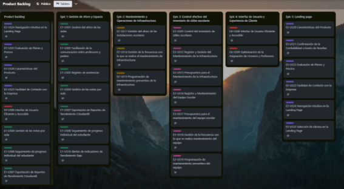

|**Id**|**Title**|**Description**|**Estimation (Hours)**|**Assigned To**|**Status**|
| :-: | :-: | :-: | :-: | :-: | :-: |
|E3-US05|Control del inventario de útiles escolares|Implementación de un sistema de gestión de inventario para los útiles escolares, incluyendo seguimiento y actualización.|8|Abraham|Done|
|E1-US07|Exportación de Reportes de Rendimiento Estudiantil|Desarrollo de la funcionalidad de exportación de reportes de rendimiento estudiantil en formatos adecuados.|6|Jose|Done|
|E1-US08|Seguimiento de progreso individual del estudiante|Creación de herramientas para monitorear y registrar el progreso individual de cada estudiante en la plataforma.|10|Ariana|Done|
|E4-US09|Optimización de la Asignación de Horarios y Profesores|Mejora en la asignación de horarios y profesores para una distribución más eficiente y equitativa.|12|Abraham|Done|
|E3-US10|Alertas de Indicadores de Rendimiento Bajo|Configuración de alertas automáticas para identificar y notificar indicadores de bajo rendimiento académico.|6|Mateo|Done|
|E2-US11|Gestión del aforo de las instalaciones escolares|Implementación de herramientas para gestionar y controlar el aforo de las instalaciones escolares de manera efectiva.|8|Jose|Done|
|E2-US13|Presupuestos para el Mantenimiento de la Infraestructura|Creación de presupuestos detallados para el mantenimiento óptimo de la infraestructura escolar.|10|Ariana|Done|
|E2-US14|Gestión de la frecuencia con la que se realiza el mantenimiento de infraestructuras|Optimización de los cronogramas de mantenimiento para una gestión eficiente de recursos.|6|Belen|Done|
|E2-US15|Programación de mantenimiento preventivo de la infraestructura|Planificación y configuración de rutinas de mantenimiento preventivo para la infraestructura escolar.|8|Jose|Done|
|E3-US16|Registro y Mantenimiento del Equipo Escolar|Mantenimiento de un registro actualizado y detallado del equipo escolar, incluyendo inventario y estado de cada ítem.|10|Jose|Done|
|E3-US17|Presupuestos para el mantenimiento del equipo escolar|Desarrollo de presupuestos específicos para el mantenimiento adecuado del equipo y material escolar.|8|Mateo|Done|
|E3-US18|Gestión de la frecuencia con la que se realiza mantenimiento del equipo|Revisión y ajuste de la frecuencia de mantenimiento del equipo según las necesidades y recursos disponibles.|6|Abraham|Done|
|E3-US19|Programación de mantenimiento preventivo del equipo|Planificación y establecimiento de rutinas de mantenimiento preventivo para prolongar la vida útil del equipo.|8|Mateo|Done|
|TS01|API para gestionar estudiantes|Desarrollo de una API robusta para gestionar información de estudiantes, incluyendo CRUD y autenticación.|12|Abraham|Done|
|TS02|Endpoint para gestionar profesores|Implementación de una API completa para gestionar información y roles de profesores en el sistema.|12|Abraham|Done|
|TS03|Endpoint para programar mantenimientos|Creación de una API para la programación y seguimiento de actividades de mantenimiento en la infraestructura escolar.|15|Jose|Done|
|TS04|Endpoint para registrar actividades de mantenimiento completadas|Desarrollo de una API para el registro y seguimiento de actividades de mantenimiento completadas.|12|Abraham|Done|
|TS05|Endpoint para consultar y reportar sobre mantenimientos|Creación de una API para consultar y generar informes detallados sobre actividades de mantenimiento.|15|Ariana|Done|
|TS06|Endpoint para gestionar cursos|Desarrollo de una API para la gestión completa de cursos, incluyendo asignación de profesores y horarios.|12|Belen|Done|
|TS07|Endpoint para asignación de aulas y horarios|Implementación de una API para la asignación dinámica de aulas y horarios según las necesidades del plan de estudios.|15|Jose|Done|

5\.2.3.3. Development Evidence for Sprint Review.

<table><tr><th valign="top">Repository</th><th valign="top">Branch</th><th valign="top">Commit Id</th><th valign="top">Commit Message</th><th valign="top">Commit Message Body</th><th valign="top">Committed on (Date)</th></tr>
<tr><td rowspan="8" valign="top">rocket-backend</td><td rowspan="8" valign="top">main</td><td valign="top">cc5380539e518b5e012ed34152437fd8bba924a0</td><td valign="top">[Merge pull request](https://github.com/upc-pre-202401-si729-sw53-rocket/rocket-backend/commit/b921036f64d49fc87d59b387b6c775caf8296c02) [#5](https://github.com/upc-pre-202401-si729-sw53-rocket/rocket-backend/pull/5) [from upc-pre-202401-si729-sw53-rocket/develop](https://github.com/upc-pre-202401-si729-sw53-rocket/rocket-backend/commit/b921036f64d49fc87d59b387b6c775caf8296c02)</td><td valign="top">-</td><td valign="top">03/06/2024</td></tr>
<tr><td valign="top">8818cf531925a90229cfec6d133bdaab573d74f5</td><td valign="top">[Merge pull request](https://github.com/upc-pre-202401-si729-sw53-rocket/rocket-backend/commit/cbd874360b1ad18acadc526b027146f444034e9c) [#4](https://github.com/upc-pre-202401-si729-sw53-rocket/rocket-backend/pull/4) [from upc-pre-202401-si729-sw53-rocket/fix/v0.1.0](https://github.com/upc-pre-202401-si729-sw53-rocket/rocket-backend/commit/cbd874360b1ad18acadc526b027146f444034e9c)</td><td valign="top">-</td><td valign="top">03/06/2024</td></tr>
<tr><td valign="top">790f3da162596de33f97547c880b6f2b3b445738</td><td valign="top">[fix: resolve all the incorrect endpoints](https://github.com/upc-pre-202401-si729-sw53-rocket/rocket-backend/commit/bdc571254d7fbe1325332df25a94fae4a02b9e22)</td><td valign="top">-</td><td valign="top">03/06/2024</td></tr>
<tr><td valign="top">b1c4ab4d07a2c3e74e0f4542b23e226124b2e7f4</td><td valign="top">[Merge pull request](https://github.com/upc-pre-202401-si729-sw53-rocket/rocket-backend/commit/4488f0310c3d4c01fd752f6cc2de3bf8e45cc9c6) [#3](https://github.com/upc-pre-202401-si729-sw53-rocket/rocket-backend/pull/3) [from upc-pre-202401-si729-sw53-rocket/develop](https://github.com/upc-pre-202401-si729-sw53-rocket/rocket-backend/commit/4488f0310c3d4c01fd752f6cc2de3bf8e45cc9c6)</td><td valign="top">-</td><td valign="top">02/06/2024</td></tr>
<tr><td valign="top">6c1df31b3142b8af5582cf16e6d7e31a77d4febe</td><td valign="top">[Merge pull request](https://github.com/upc-pre-202401-si729-sw53-rocket/rocket-backend/commit/6c1df31b3142b8af5582cf16e6d7e31a77d4febe) [#2](https://github.com/upc-pre-202401-si729-sw53-rocket/rocket-backend/pull/2) [from upc-pre-202401-si729-sw53-rocket/feature/teacher](https://github.com/upc-pre-202401-si729-sw53-rocket/rocket-backend/commit/6c1df31b3142b8af5582cf16e6d7e31a77d4febe)</td><td valign="top">-</td><td valign="top">02/06/2024</td></tr>
<tr><td valign="top">b921036f64d49fc87d59b387b6c775caf8296c02</td><td valign="top">[feat: add administrator command services](https://github.com/upc-pre-202401-si729-sw53-rocket/rocket-backend/commit/790f3da162596de33f97547c880b6f2b3b445738)</td><td valign="top">-</td><td valign="top">02/06/2024</td></tr>
<tr><td valign="top">cbd874360b1ad18acadc526b027146f444034e9c</td><td valign="top">[feat: add the teacher bounded](https://github.com/upc-pre-202401-si729-sw53-rocket/rocket-backend/commit/8818cf531925a90229cfec6d133bdaab573d74f5)</td><td valign="top">-</td><td valign="top">03/06/2024</td></tr>
<tr><td valign="top">bdc571254d7fbe1325332df25a94fae4a02b9e22</td><td valign="top">[chore: add the main structure](https://github.com/upc-pre-202401-si729-sw53-rocket/rocket-backend/commit/cc5380539e518b5e012ed34152437fd8bba924a0)</td><td valign="top">-</td><td valign="top">03/06/2024</td></tr>
</table>

5\.2.3.4. Testing Suite Evidence for Sprint Review.

En el alcance del sprint 3 no se ha desarrollado el funcionalidades referente a testing en el backend API web por lo que no se evidencia testing.

|**Repository**|**Branch**|**Commit Id**|**Commit Message**|**Commit Message Body**|**Commited on (Date)**|
| :- | :- | :- | :- | :- | :- |
|||||||

5\.2.3.5. Execution Evidence for Sprint Review.

En este sprint logramos como tercera fase de nuestro producto final, desarrollar el resto de vistas de nuestra aplicación web usando Angular y Angular Material, en conjunto con una API hecha con C#.  Muestra de todas  vistas restantes programadas en Vue para este sprint: 

Pantalla de muestra de la respuesta de nuestras pruebas a la API hecha con C#:

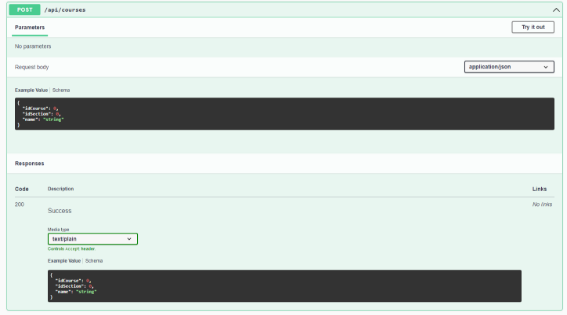

Video que ilustra y explica la visualización y navegación logrados en este Sprint.

Video:

5\.2.3.6. Services Documentation Evidence for Sprint Review.

Para este sprint utilizamos los servicios de la API que nosotros mismos hicimos con Java en Spring Boot. A continuación, mostramos todos los endpoints realizados por nuestro equipo por cada Bounded Context correctamente documentados en Swagger.

|**Bounded Context**|Classroom||
| :- | :- | :- |
|**Entity**|**Endpoint URL**|**Swagger**|
|Administrator|api/v1/administrator||
|Classroms|api/v1/classrooms||
|Courses|api/v1/courses||

|**Bounded Context**|Teacher||
| :- | :- | :- |
|**Entity**|**Endpoint URL**|**Swagger**|
|Attendances|api/v1/attendances|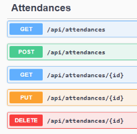|
|Grades|api/v1/grades||
|InfrastructureReport|api/v1/infrastructure-report||
|Inventory|api/v1/inventory||
|Teacher|api/v1/teacher||

5\.2.3.7. Software Deployment Evidence for Sprint Review.

Primero ingresamos a railway.com y nos logueamos para después poder llegar a esta sección en la que haremos click en start a new project.

Después en la siguiente pantalla presionaremos en la opción “Deploy MySQL”.

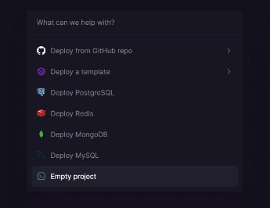

En la siguiente sección nos saldrán una serie de opciones de configuración para nuestro archivo ‘appsettings.json’ que tendremos que actualizar.

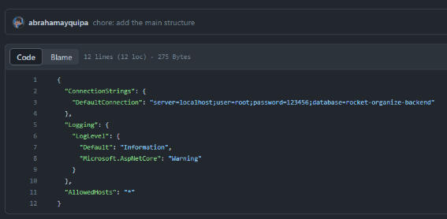

Tras haber hecho eso solo presionaremos en ‘Run Code’ en Rider y se desplegará la base de datos y la lógica de backend en 2 servicios que estarán interconectados.

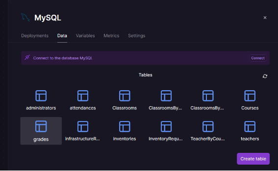

Cabe recalcar que llegados a este punto como resultado obtendremos una url que nos servirá para poder usarla desde el FrontEnd y así poder interactuar con la data que necesitemos.

5\.2.3.8. Team Collaboration Insights during Sprint.

Durante este sprint, al igual que para el desarrollo de la landing page, para proteger la rama “main” creamos una rama “develop” de la que cada integrante de nuestro grupo creó su propia sub-rama “feature“ para subir un capítulo del reporte siguiendo las convenciones antes señaladas(conventional commit y git flow).

**Github analytics de nuestro tercer sprint:**

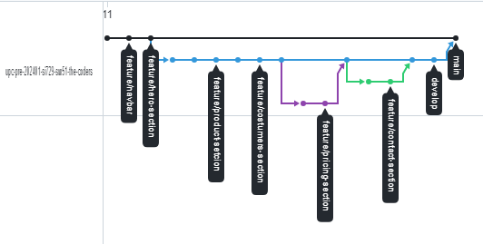

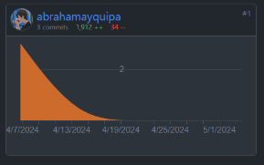

**5.2.4. Sprint 4**

**5.2.4.1. Sprint Planning 4**

A continuación, se mostrará el cuarto sprint planning, en el cual se exhibirán la planificación e implementación de la sección backend del proyecto. Además, de los progresos y los insights sobre la colaboración del equipo utilizando Github.

|Sprint #|Sprint 4|
| - | - |
|Sprint Planning Background||
|Date|22 de junio de 2024|
|Time|12:43 horas (GMT -5)|
|Location|Modalidad remota a través de WhatsApp|
|Prepared By|Vilchez Rios Mateo Alejandro,|
|Attendees (to planning meeting)|
Ayquipa Ubaldo, Abraham Israel/

Mayurí Armas, Jose Carlo/

Ramos Rios, Belen del Rocio/

Vilchez Rios, Mateo Alejandro/

Vargas Revollé, Ariana 
|
|Sprint 3 Review Summary|En el Sprint anterior, se logró una integración exitosa entre el frontend y el backend, agregando autenticación mediante JWT. Esto marcó un avance significativo en la seguridad y manejo de sesiones de la aplicación.|
|Sprint 3 Retrospective Summary|Se identificó la necesidad de realizar pruebas para verificar que todos los endpoints están funcionando correctamente. La retroalimentación del equipo apuntó hacia la mejora en los procesos de testing y validación para evitar fallos en producción.|
|Sprint Goal & User Stories||
|Sprint 4 Goal|Finalizar todas las conexiones entre el frontend y el backend, asegurando su correcta funcionalidad y rendimiento.|
|Sprint 4 Velocity|70 Story Points|
|Sum of Story Points|69 Story Points|

**5.2.4.2. Sprint Backlog 4**

El Sprint #4 se centra en robustecer la experiencia de usuario en nuestra plataforma mediante la mejora y expansión de las funcionalidades de registro y sesión de usuario, la integración de videos informativos sobre el equipo y el producto, así como la implementación de soporte multilingüe. Este sprint ha sido crucial para asegurar una interacción fluida y accesible para nuestros usuarios, abordando desde el registro y la autenticación hasta la personalización del contenido según las preferencias lingüísticas del usuario.

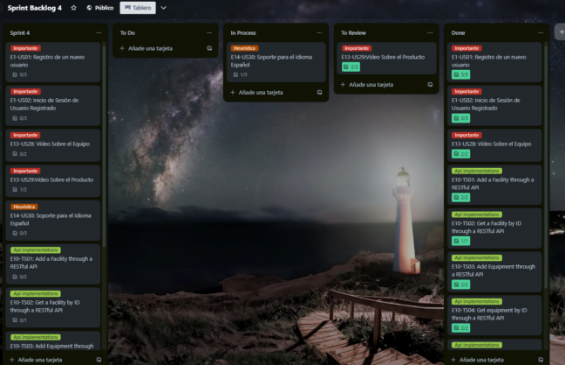

**Trello: <https://trello.com/b/uNj2D9JW>**

<table><tr><th colspan="2" valign="top"><b>Sprint #4</b></th><th colspan="6" valign="top"><b>Sprint 4</b></th></tr>
<tr><td colspan="2" valign="top"><b>User Story</b></td><td colspan="6" valign="top"><b>Work-Item / Task</b></td></tr>
<tr><td valign="top"><b>Id</b></td><td valign="top"><b>Title</b></td><td valign="top"><b>Id</b></td><td valign="top"><b>Tittle</b></td><td valign="top"><b>Description</b></td><td valign="top"><b>Estimation (Hours)</b></td><td valign="top"><b>Assigned To</b></td><td valign="top"><b>Status</b></td></tr>
<tr><td rowspan="3" valign="top">E1-US01</td><td rowspan="3" valign="top">Registro de un nuevo usuario</td><td valign="top">T01</td><td valign="top">Registro exitoso de un nuevo usuario</td><td valign="top">Desarrollar un formulario para registrar un nuevo usuario exitosamente.</td><td valign="top">3</td><td valign="top">Abraham</td><td valign="top">Done</td></tr>
<tr><td valign="top">T02</td><td valign="top">Intento de registro con un correo electrónico ya registrado</td><td valign="top">Desarrollar la funcionalidad para manejar intentos de registro con un correo electrónico ya registrado.</td><td valign="top">4</td><td valign="top">
José

</td><td valign="top">Done</td></tr>
<tr><td valign="top">T03</td><td valign="top">Registro con datos incompletos</td><td valign="top">Desarrollar un formulario para manejar intentos de registro con datos incompletos.</td><td valign="top">3</td><td valign="top">Belen</td><td valign="top">Done</td></tr>
<tr><td rowspan="3" valign="top">E1-US02</td><td rowspan="3" valign="top">Inicio de Sesión de Usuario Registrado</td><td valign="top">T01</td><td valign="top">Inicio de sesión exitoso</td><td valign="top">Desarrollar un formulario para un inicio de sesión exitoso.</td><td valign="top">3</td><td valign="top">Ariana</td><td valign="top">Done</td></tr>
<tr><td valign="top">T02</td><td valign="top">Inicio de sesión con credenciales incorrectas</td><td valign="top">Desarrollar un formulario para manejar intentos de inicio de sesión con credenciales incorrectas.</td><td valign="top">4</td><td valign="top">
Mateo

</td><td valign="top">Done</td></tr>
<tr><td valign="top">T03</td><td valign="top">Intento de inicio de sesión con campos vacíos</td><td valign="top">Desarrollar un formulario para manejar intentos de inicio de sesión con campos vacíos.</td><td valign="top">3</td><td valign="top">
Mateo

</td><td valign="top">Done</td></tr>
<tr><td rowspan="2" valign="top">E13-US28</td><td rowspan="2" valign="top">Vídeo Sobre el Equipo</td><td valign="top">T01</td><td valign="top">About us Section</td><td valign="top">Desarrollar la Sección About us</td><td valign="top">3</td><td valign="top">
Abraham

</td><td valign="top">Done</td></tr>
<tr><td valign="top">T02</td><td valign="top">Integrar vídeo en la sección</td><td valign="top">Implementar la funcionalidad para mostrar el vídeo en la sección "About US" de la página web.</td><td valign="top">3</td><td valign="top">
José

</td><td valign="top">Done</td></tr>
<tr><td rowspan="2" valign="top">E13-US29</td><td rowspan="2" valign="top">Vídeo Sobre el Producto</td><td valign="top">T01</td><td valign="top">About the product  Section</td><td valign="top">Desarrollar la Sección About the product</td><td valign="top">3</td><td valign="top">
Ariana

</td><td valign="top">Done</td></tr>
<tr><td valign="top">T02</td><td valign="top">Integrar vídeo en la sección</td><td valign="top">Implementar la funcionalidad para mostrar el vídeo en la sección "Sobre el Producto" de la página web.</td><td valign="top">1</td><td valign="top">
Ariana

</td><td valign="top">Done</td></tr>
<tr><td rowspan="3" valign="top">E14-US30</td><td rowspan="3" valign="top">Soporte para el Idioma Español</td><td valign="top">T01</td><td valign="top">Implementar selector de idioma en la aplicación</td><td valign="top">Desarrollar la funcionalidad para seleccionar el idioma español desde un selector de idioma en la página de inicio.</td><td valign="top">1</td><td valign="top">
José

</td><td valign="top">In-Process</td></tr>
<tr><td valign="top">T02</td><td valign="top">Traducir contenido al español</td><td valign="top">Traducir todos los elementos de navegación, contenido, etiquetas, mensajes y texto de ayuda al español.</td><td valign="top">3</td><td valign="top">Belen</td><td valign="top">In-Process</td></tr>
<tr><td valign="top">T03</td><td valign="top">Integrar traducciones en la aplicación</td><td valign="top">Integrar las traducciones en la aplicación para que el contenido se muestre en español cuando se seleccione.</td><td valign="top">3</td><td valign="top">
Ariana

</td><td valign="top">In-Process</td></tr>
<tr><td rowspan="2" valign="top">E10-TS01</td><td rowspan="2" valign="top">
Add a Facility through a RESTful API

</td><td valign="top">T01</td><td valign="top">Implementar un API Endpoint para Añadir Instalaciones</td><td valign="top">Implementar el endpoint RESTful /api/v1/facilities que permita la adición de nuevas instalaciones</td><td valign="top">4</td><td valign="top">
Mateo

</td><td valign="top">Done</td></tr>
<tr><td valign="top">T02</td><td valign="top">Conectar el Formulario de Frontend con el API Endpoint</td><td valign="top">Integrar el formulario de registro de instalaciones con el nuevo API Endpoint.</td><td valign="top">4</td><td valign="top">
Mateo

</td><td valign="top">Done</td></tr>
<tr><td valign="top">E10-TS02</td><td valign="top">Get a Facility by ID through a RESTful API</td><td valign="top">T01</td><td valign="top">Implementar API Endpoint para Obtener Instalaciones por ID</td><td valign="top">Desarrollar el endpoint RESTful /api/v1/facilities/{id} para obtener información específica de una instalación existente o responder con un error si la instalación no existe.</td><td valign="top">3</td><td valign="top">
Abraham

</td><td valign="top">Done</td></tr>
<tr><td rowspan="2" valign="top">E10-TS03</td><td rowspan="2" valign="top">Add Equipment through a RESTful API</td><td valign="top">T01</td><td valign="top">API Endpoint para Añadir Equipos</td><td valign="top">Desarrollar el endpoint RESTful /api/v1/equipments para permitir el registro de nuevos equipos</td><td valign="top">4</td><td valign="top">
Jose

    
</td><td valign="top">Done</td></tr>
<tr><td valign="top">T02</td><td valign="top">Conectar el Formulario de Frontend para Añadir Equipos</td><td valign="top">Integrar el formulario de añadir equipos en el frontend con el nuevo endpoint API, manejar la validación y errores de duplicidad.</td><td valign="top">3</td><td valign="top">
José

</td><td valign="top">Done</td></tr>
<tr><td rowspan="2" valign="top">E10-TS04</td><td rowspan="2" valign="top">Get equipment by ID through a RESTful API</td><td valign="top">T01</td><td valign="top">Implementar API Endpoint para Obtener Equipos por ID</td><td valign="top">` `Desarrollar el endpoint RESTful /api/v1/equipments/{id} para obtener información específica de un equipo existente.</td><td valign="top">3</td><td valign="top">
Belen

</td><td valign="top">Done</td></tr>
<tr><td valign="top">T02</td><td valign="top">Conectar la Funcionalidad de Consulta de Equipos en el Frontend</td><td valign="top">` `Integrar la funcionalidad de consulta de equipos por ID en el frontend, asegurando que se muestren adecuadamente los datos del equipo o un mensaje de error cuando el equipo no exista.</td><td valign="top">3</td><td valign="top">
Belen

</td><td valign="top">Done</td></tr>
<tr><td valign="top">E13-TS22</td><td valign="top">Add Profile through a RESTful API</td><td valign="top">T01</td><td valign="top">Implementar un API Endpoint para Añadir Perfiles</td><td valign="top">Desarrollar el endpoint RESTful /api/v1/profiles que permita añadir nuevos perfiles de usuario</td><td valign="top">4</td><td valign="top">
Mateo

</td><td valign="top">Done</td></tr>
<tr><td valign="top">E13-TS23</td><td valign="top">Get Profile by ID through a RESTful API</td><td valign="top">T01</td><td valign="top">Implementar un API Endpoint para Obtener Perfiles por ID</td><td valign="top">Implementar el endpoint RESTful /api/v1/profiles/{profileId} que permita obtener la información de perfiles específicos por su ID.</td><td valign="top">4</td><td valign="top">
Mateo

</td><td valign="top">Done</td></tr>
</table>

**5.2.4.3. Development Evidence for Sprint Review.**

En esta sección incluiremos el registro de los últimos commits realizados en las ramas main y develop respectivamente de los repositorios de nuestra landing page, web application y API en Github.

**Nuestros repositorios:**

- **Landing page: <https://github.com/upc-pre-202401-si729-sw53-rocket/rocket-landing-page>**
- **Web application: <https://github.com/upc-pre-202401-si729-sw53-rocket/rocket-frontend>**
- **RESTful API: <https://github.com/upc-pre-202401-si729-sw53-rocket/rocket-backend>**

<table><tr><th valign="top">Repository</th><th valign="top">Branch</th><th valign="top">Commit Id</th><th valign="top">Commit Message</th><th valign="top">Commit Message Body</th><th valign="top">Committed on (Date)</th></tr>
<tr><td rowspan="8" valign="top">rocket-backend</td><td rowspan="8" valign="top">main</td><td valign="top">cc5380539e518b5e012ed34152437fd8bba924a0</td><td valign="top">[Merge pull request](https://github.com/upc-pre-202401-si729-sw53-rocket/rocket-backend/commit/b921036f64d49fc87d59b387b6c775caf8296c02) [#5](https://github.com/upc-pre-202401-si729-sw53-rocket/rocket-backend/pull/5) [from upc-pre-202401-si729-sw53-rocket/develop](https://github.com/upc-pre-202401-si729-sw53-rocket/rocket-backend/commit/b921036f64d49fc87d59b387b6c775caf8296c02)</td><td valign="top">-</td><td valign="top">17/06/2024</td></tr>
<tr><td valign="top">8818cf531925a90229cfec6d133bdaab573d74f5</td><td valign="top">[Merge pull request](https://github.com/upc-pre-202401-si729-sw53-rocket/rocket-backend/commit/cbd874360b1ad18acadc526b027146f444034e9c) [#4](https://github.com/upc-pre-202401-si729-sw53-rocket/rocket-backend/pull/4) [from upc-pre-202401-si729-sw53-rocket/fix/v0.1.0](https://github.com/upc-pre-202401-si729-sw53-rocket/rocket-backend/commit/cbd874360b1ad18acadc526b027146f444034e9c)</td><td valign="top">-</td><td valign="top">17/06/2024</td></tr>
<tr><td valign="top">790f3da162596de33f97547c880b6f2b3b445738</td><td valign="top">[fix: resolve all the incorrect endpoints](https://github.com/upc-pre-202401-si729-sw53-rocket/rocket-backend/commit/bdc571254d7fbe1325332df25a94fae4a02b9e22)</td><td valign="top">-</td><td valign="top">14/06/2024</td></tr>
<tr><td valign="top">b1c4ab4d07a2c3e74e0f4542b23e226124b2e7f4</td><td valign="top">[Merge pull request](https://github.com/upc-pre-202401-si729-sw53-rocket/rocket-backend/commit/4488f0310c3d4c01fd752f6cc2de3bf8e45cc9c6) [#3](https://github.com/upc-pre-202401-si729-sw53-rocket/rocket-backend/pull/3) [from upc-pre-202401-si729-sw53-rocket/develop](https://github.com/upc-pre-202401-si729-sw53-rocket/rocket-backend/commit/4488f0310c3d4c01fd752f6cc2de3bf8e45cc9c6)</td><td valign="top">-</td><td valign="top">13/06/2024</td></tr>
<tr><td valign="top">6c1df31b3142b8af5582cf16e6d7e31a77d4febe</td><td valign="top">[Merge pull request](https://github.com/upc-pre-202401-si729-sw53-rocket/rocket-backend/commit/6c1df31b3142b8af5582cf16e6d7e31a77d4febe) [#2](https://github.com/upc-pre-202401-si729-sw53-rocket/rocket-backend/pull/2) [from upc-pre-202401-si729-sw53-rocket/feature/teacher](https://github.com/upc-pre-202401-si729-sw53-rocket/rocket-backend/commit/6c1df31b3142b8af5582cf16e6d7e31a77d4febe)</td><td valign="top">-</td><td valign="top">12/06/2024</td></tr>
<tr><td valign="top">b921036f64d49fc87d59b387b6c775caf8296c02</td><td valign="top">[feat: add administrator command services](https://github.com/upc-pre-202401-si729-sw53-rocket/rocket-backend/commit/790f3da162596de33f97547c880b6f2b3b445738)</td><td valign="top">-</td><td valign="top">12/06/2024</td></tr>
<tr><td valign="top">cbd874360b1ad18acadc526b027146f444034e9c</td><td valign="top">[feat: add the teacher bounded](https://github.com/upc-pre-202401-si729-sw53-rocket/rocket-backend/commit/8818cf531925a90229cfec6d133bdaab573d74f5)</td><td valign="top">-</td><td valign="top">09/06/2024</td></tr>
<tr><td valign="top">bdc571254d7fbe1325332df25a94fae4a02b9e22</td><td valign="top">[chore: add the main structure](https://github.com/upc-pre-202401-si729-sw53-rocket/rocket-backend/commit/cc5380539e518b5e012ed34152437fd8bba924a0)</td><td valign="top">-</td><td valign="top">09/06/2024</td></tr>
</table>

5\.2.4.4. Testing Suite Evidence for Sprint Review.

En el alcance del sprint 3 no se ha desarrollado el funcionalidades referente a testing en el backend API web por lo que no se evidencia testing.

|**Repository**|**Branch**|**Commit Id**|**Commit Message**|**Commit Message Body**|**Commited on (Date)**|
| :- | :- | :- | :- | :- | :- |
|||||||

5\.2.4.5. Execution Evidence for Sprint Review.

Para esta entrega, se realizaron algunos cambios en el frontend según las vistas pendientes. Se puede acceder a la aplicación web mediante el siguiente enlace:<https://github.com/upc-pre-202401-si729-sw53-rocket/rocket-landing-page>. Además, se ha avanzado con el desarrollo del backend de la aplicación web.

En la landing page se agregaron los videos de About-the-product y About-the-team, para que los visitantes puedan conocer mejor nuestro producto mostrando un video promocional y un video de equipo.

Muestra de nuestra API hecha con C# y .Net:

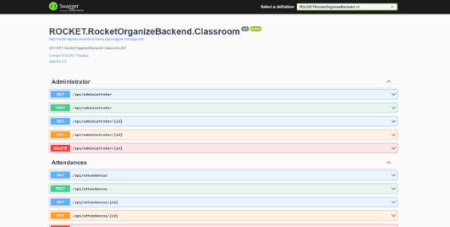

5\.2.4.6. Services Documentation Evidence for Sprint Review.

Para el desarrollo de este sprint tuvimos que arreglar la forma como estaban llamados 2 de nuestros endpoints, pues estos no representaban buenas prácticas de desarrollo además de su debido testeo. Se adjunta el link de nuestro backend correctamente desplegado usando el servicio gratuito Railway: <https://rocket-organize-backend.up.railway.app/swagger/index.html>

|**Bounded Context**|Classroom||
| :- | :- | :- |
|**Entity**|**Endpoint URL**|**Swagger**|
|Administrator|api/v1/administrator|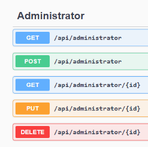|
|Classroms|api/v1/classrooms|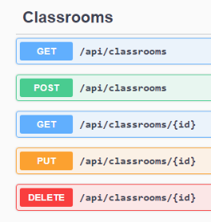|
|Courses|api/v1/courses|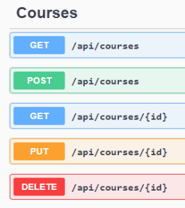|

|**Bounded Context**|Teacher||
| :- | :- | :- |
|**Entity**|**Endpoint URL**|**Swagger**|
|Attendances|api/v1/attendances||
|Grades|api/v1/grades|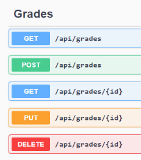|
|InfrastructureReport|api/v1/infrastructure-report|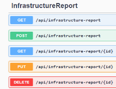|
|Inventory|api/v1/inventory|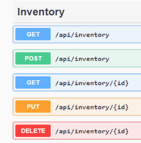|
|Teacher|api/v1/teacher||

5\.2.4.7. Software Deployment Evidence for Sprint Review.

Primero ingresamos a railway.com y nos logueamos para después poder llegar a esta sección en la que haremos click en start a new project.

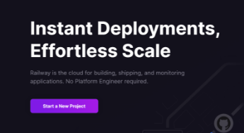

Después en la siguiente pantalla presionaremos en la opción “Deploy MySQL”.

En la siguiente sección nos saldrán una serie de opciones de configuración para nuestro archivo ‘appsettings.json’ que tendremos que actualizar.

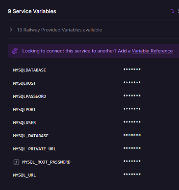

Tras haber hecho eso solo presionaremos en ‘Run Code’ en Rider y se desplegará la base de datos y la lógica de backend en 2 servicios que estarán interconectados.

5\.2.4.8. Team Collaboration Insights during Sprint.

Durante este sprint, al igual que para el desarrollo de la landing page, para proteger la rama “main” creamos una rama “develop” de la que cada integrante de nuestro grupo creó su propia sub-rama “feature“ para subir un capítulo del reporte siguiendo las convenciones antes señaladas(conventional commit y git flow).

**Github analytics de nuestro tercer sprint:**

**5.3. Validation Interviews**

Después de haber actualizado nuestras secciones de frontend y backend, vamos a llevar a cabo una serie de entrevistas para validar cómo se comporta nuestro software cuando lo usan nuestros usuarios objetivo.

**5.3.1. Diseño de entrevistas**

**Preguntas Generales para Profesores y Equipo Administrativo:**

- ¿Cuál es su nombre completo?
- ¿Cuál es su edad?
- En el caso de los profesores: ¿Qué materia(s) imparte y en qué nivel educativo?
- Para el equipo administrativo: ¿Cuál es su rol dentro de la institución?

**Preguntas Principales tras operar la aplicación**

- ¿Qué le parece el diseño de nuestra página de inicio?
- ¿El contenido de la aplicación es relevante para su labor educativa/administrativa? ¿Hay algo que sugiere para mejorar?
- ¿Qué opinión tiene sobre las funcionalidades específicas de la aplicación para su segmento (profesores/administrativos)?
- ¿Encuentra la aplicación fácil de usar? ¿Hay algo que considere que podríamos mejorar para facilitar su uso?
- ¿Los mensajes de ayuda y los avisos de error le son útiles en la aplicación?

**Preguntas Complementarias**

- ¿Qué tipo de dispositivo utiliza con más frecuencia en su labor educativa/administrativa?
- ¿Hay algún navegador que prefiera usar para nuestras futuras optimizaciones de la aplicación?

**5.3.2. Registro de Entrevistas**

En esta sección, se proporciona el registro detallado de las entrevistas realizadas de cada segmento objetivo. Para acceder a todas las entrevistas completas, se facilita el enlace correspondiente para su visualización en Microsoft Stream: <https://lc.cx/upc-pre-202401-si730-SW57-RocketNotes-validation-sprint-3> 

**Segmento objetivo #1: Profesores**

**Entrevista #1:**

**Nombres y apellidos:** Andrés Segovia Maya

**Edad:** 39 años

**Ubicación:** Paiján, provincia de Ascope, en la Libertad

**Ocupación:** Profesor de matemáticas en una institución privada de Paiján

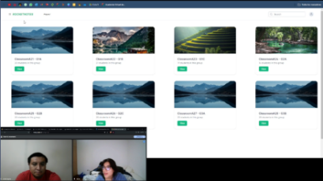

**URL: <https://lc.cx/upc-pre-202401-si730-SW57-RocketNotes-validation-sprint-3>**

**Tiempo de la Entrevista:** Comienzo: 00:00 - Fin: 10:27

**Resumen:**

El profesor Andrés encontró la página de inicio atractiva y profesional, aunque sugirió agregar más información sobre la aplicación. Valoró la integración de redes sociales y la presentación de planes de adquisición. En la aplicación, sugirió incluir funciones para subir tareas en formato PDF y que haya una manera de compartir las notas de los alumnos a los padres para que puedan tener un seguimiento de la asistencia y las calificaciones.

En cuanto a la usabilidad, consideró la interfaz intuitiva y fácil de usar, especialmente en la gestión de notas y asistencia. Recomienda agregar un botón para registrar automáticamente los días de dictado de clases y recomienda la inclusión de mensajes de confirmación para guardar o borrar acciones, para evitar errores en el ingreso de notas.

**Necesidades y Mejoras Identificadas**

Para mejorar la interacción y comunicación, el profesor sugirió optimizar la forma en que los profesores pueden ingresar los días de dictado de clases y añadir funcionalidades para que los padres puedan ver las calificaciones y la asistencia de sus hijos. También destacó la importancia de incluir mensajes de confirmación para acciones críticas como guardar y borrar notas.

En términos de optimización técnica, recomendó adaptar la aplicación para ser compatible con diferentes navegadores, aunque su preferido es Google Chrome.

**Conclusión**

La entrevista revela la necesidad de mejoras en la usabilidad y funcionalidad de la aplicación RocketNotes, con énfasis en la comunicación con los padres y la optimización del registro de asistencia. 

**Entrevista #2:**

**Nombre:** Tatiana Cabrera Goicoechea

**Edad:** 33 años

**Ubicación:** Vive en el distrito de Paiján, provincia de Ascope, departamento de la Libertad

**Ocupación:** Docente del nivel secundario

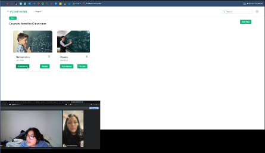

**URL: <https://lc.cx/upc-pre-202401-si730-SW57-RocketNotes-validation-sprint-3>**

**Tiempo de la Entrevista:** Comienzo: 10:28 - Fin: 19:02

**Resumen:**

La profesora Tatiana encontró la página de inicio llamativa y bien organizada, mostrando la información deseada de manera correcta. Respecto al contenido de la aplicación, lo considera relevante para su labor educativa. Sugiere mejorar la funcionalidad de las calificaciones, añadiendo una opción para mostrar las notas en formato literal, además del numérico, acorde con los requerimientos del Ministerio de Educación.

En términos de usabilidad, considera que la aplicación es fácil de usar y que las funcionalidades presentadas serían de gran ayuda en su trabajo diario. También sugirió la inclusión de mensajes de ayuda y confirmación para acciones como guardar y subir reportes, para asegurar que se realiza correctamente.

**Necesidades y Mejoras Identificadas**

Para mejorar la funcionalidad y la usabilidad de la aplicación, la profesora Tatiana sugiere:

- **Calificaciones en Formato Literal:** Implementar la opción de mostrar las notas en formato literal además del numérico.
- **Mensajes de Confirmación:** Incluir mensajes de ayuda y confirmación para guardar y subir reportes, para evitar errores y asegurar la correcta realización de estas acciones.

**Conclusión**

La entrevista con la profesora Tatiana Cabrera Goicoechea destaca la necesidad de incorporar mejoras específicas en la funcionalidad de las calificaciones y la inclusión de mensajes de confirmación. 

**Nombres y Apellidos:** Juan Carlos Rodríguez Carrion

**Edad:** 35 años

**Ubicación:** La Libertad, Casa Grande, provincia de Ascope

**Ocupación:** Docente en un colegio particular de Paiján

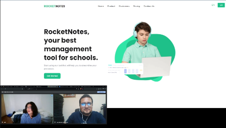

**URL: <https://lc.cx/upc-pre-202401-si730-SW57-RocketNotes-validation-sprint-3>**

**Tiempo de la Entrevista:** Comienzo: 19:03 - Fin: 26:58

**Resumen:**

Juan Carlos Rodríguez Carrión, de 35 años, es docente del área de matemáticas en nivel secundario y preuniversitario. Utiliza principalmente dispositivos con sistema operativo Android, alternando entre celular y laptop para su labor educativa. Prefiere el navegador Google Chrome para sus tareas diarias. Durante la entrevista, se le presentó la landing page de RocketNotes y luego la aplicación, accesible desde dicha landing page.

El profesor encontró la página de inicio interesante y bien organizada, destacando la opción de visualización en dos idiomas (español e inglés). Respecto al contenido de la aplicación, consideró que las funciones y características presentadas son útiles y relevantes para su labor educativa. Apreció la posibilidad de enviar información directamente a los padres de familia y destacó la utilidad de las funcionalidades de notas y asistencia.

**Necesidades y Mejoras Identificadas**
Juan Carlos no identificó mejoras específicas en las funcionalidades presentadas, pero confirmó que la capacidad de editar notas y agregar descripciones específicas para participación, cuadernos y exámenes es muy útil. Considera que la aplicación es clara y fácil de usar, con íconos suficientemente grandes para ser observados fácilmente.

**Segmento objetivo #2: Equipo Administrativo**

**Entrevista #1:**

**Nombre:** Graciela del Rocío Ríos Alza

**Edad:** 51 años

**Ubicación:** La Libertad, Trujillo

**Ocupación:** Promotora de una institución educativa

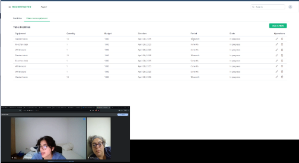

**URL: <https://lc.cx/upc-pre-202401-si730-SW57-RocketNotes-validation-sprint-3>**

**Tiempo de la Entrevista:** Comienzo: 26:59 - Fin: 35:57

**Resumen:**

Graciela encontró la página de inicio creativa y bien diseñada, aunque sugirió un poco más de color. Respecto al contenido de la aplicación, lo considera relevante para la labor administrativa y cree que las funcionalidades presentadas son completas y bien pensadas.

Recomienda diferenciar los niveles educativos (inicial, primaria y secundaria) para una mejor organización y visualización de los salones. También considera importante agregar mensajes de ayuda y confirmación para acciones críticas como la edición de datos, para asegurar que se realizan correctamente.

**Necesidades y Mejoras Identificadas**

Para mejorar la funcionalidad y la usabilidad de la aplicación, Graciela sugiere:

- **Diferenciación de Niveles Educativos:** Implementar la diferenciación de niveles educativos para facilitar la organización y visualización de los salones.
- **Mensajes de Confirmación:** Incluir mensajes de ayuda y confirmación para acciones como la edición de datos, para evitar errores y asegurar la correcta realización de estas acciones.

**Conclusión**

La entrevista con Graciela Rocío Ríos Alza destaca la necesidad de incorporar mejoras específicas en la diferenciación de niveles educativos y la inclusión de mensajes de confirmación.

**Entrevista #2:**

**Nombre:** Paul Ramos Chumpitazi

**Edad:** 54** años

**Ubicación:** La Libertad, Paijan

**Ocupación:** Docente del nivel secundario, además de desempeñarse en la parte administrativa de una institución educativa

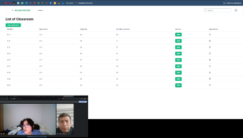

**URL: <https://lc.cx/upc-pre-202401-si730-SW57-RocketNotes-validation-sprint-3>**

**Tiempo de la Entrevista:** Comienzo: 35:59 - Fin: 48:36

**Resumen:**

Paul encontró la página de inicio interesante y llamativa. Respecto al contenido de la aplicación, habló de varias mejoras: sugirió que cuando se asigna un profesor, debería ser posible especificar a qué grado va a enseñar, lo cual facilitaría a los padres obtener el horario y la información sobre los profesores asignados a cada grado, además de ayudar a organizar mejor la planificación de horarios dentro de la institución. Propuso la implementación de una bitácora electrónica manejada por el tutor del aula para registrar y monitorear el comportamiento de los alumnos, lo que permitiría a los padres estar informados sobre el comportamiento de sus hijos y tomar medidas correctivas cuando sea necesario. Los tutores podrían registrar comportamientos como mal comportamiento, inasistencia y problemas durante las clases. Además, sugirió que los padres puedan acceder a cierta información relevante a través de la plataforma, como los horarios, los profesores asignados y el tutor del aula, lo cual facilitaría la comunicación entre padres y escuela y proporcionaría a los padres una herramienta para seguir de cerca el progreso y comportamiento de sus hijos.

**Necesidades y Mejoras Identificadas**

Para mejorar la funcionalidad y la usabilidad de la aplicación, Paul sugiere:

- **Asignación de Profesores por Grado:** Implementar la asignación de profesores a grados específicos para facilitar la organización y la comunicación con los padres.
- **Bitácora Electrónica:** Crear una bitácora electrónica para que los tutores puedan registrar y monitorear el comportamiento de los alumnos, proporcionando información de estos registros a los padres para que puedan ver el comportamiento de sus hijos.

**Conclusión**

La entrevista con Ramón Chumpitazi, Max Paul, destaca la necesidad de incorporar mejoras específicas en la asignación de profesores por grado, la implementación de una bitácora electrónica, y el acceso para padres a información relevante. 

**Entrevista #3:**

**Nombre:** Juliana Gisela Chávez Pozo

**Edad:** 31 años

**Ubicación:** Distrito de Paiján, provincia de Ascope, La Libertad

**Ocupación:** Docente y directora de un colegio privado

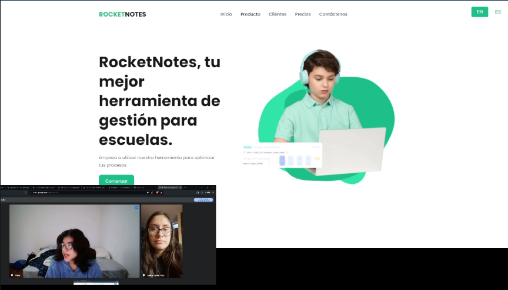

**URL: <https://lc.cx/upc-pre-202401-si730-SW57-RocketNotes-validation-sprint-3>**

**Tiempo de la Entrevista:** Comienzo: 48:38 - Fin: 58:33

**Resumen:**

Julián encontró la página de inicio clara y alineada con el propósito de la aplicación. Respecto al contenido de la aplicación, consideró que las funciones y características presentadas son interesantes, pero sugirió varias mejoras importantes: añadir un apartado específico para el coordinador de disciplina, lo cual permitiría monitorear mejor el comportamiento de los alumnos; permitir a los padres acceder a cierta información relevante a través de la plataforma, como comunicados y el comportamiento diario de sus hijos, facilitando así la comunicación entre padres y escuela y proporcionando a los padres una herramienta para seguir de cerca el progreso y comportamiento de sus hijos; e incluir notificaciones o alarmas para que el director pueda recibir información en tiempo real sobre eventos importantes, evitando la necesidad de buscar al director físicamente dentro del colegio.

**Necesidades y Mejoras Identificadas**

Para mejorar la funcionalidad y la usabilidad de la aplicación, Julián sugiere:

- Coordinador de Disciplina: Implementar un apartado específico para el coordinador de disciplina.
- Acceso para Padres: Permitir a los padres acceder a información relevante sobre el comportamiento y progreso de sus hijos.
- Notificaciones y Alertas: Incluir notificaciones y alertas para mantener al director informado en tiempo real.
- Compatibilidad Móvil: Asegurar que la aplicación sea compatible con computadoras y dispositivos móviles.

**Conclusión**

La entrevista con Julián Chávez Pozo destaca la necesidad de incorporar mejoras específicas en la coordinación de disciplina, acceso para padres y notificaciones en tiempo real. 

**5.3.3. Evaluaciones según heurísticas**

**UX Heuristics & Principles Evaluation**

**Usability – Inclusive Design – Information Architecture**

**CARRERA:** Ingeniería de Software

**CURSO:** Aplicaciones Web

**SECCIÓN:** SW53

**PROFESORES:** Todos

**AUDITOR:** Rocket

**CLIENTE(S):** Profesores y personal administrativo

-----
**SITE o APP A EVALUAR: Rocket Notes**

**TAREAS A EVALUAR:**

El alcance de esta evaluación incluye la revisión de la usabilidad de las siguientes tareas:

1. **Registro de un usuario nuevo:** Tanto profesores como personal administrativo deben poder registrarse fácilmente.
1. **Gestión de Profesores:** Incluye registro, edición y eliminación de profesores.
1. **Gestión de Estudiantes:** Registro y gestión de información de estudiantes.
1. **Gestión de Salones:** Registrar y editar salones, asignar secciones y monitorear capacidad.
1. **Envío de Correos:** Capacidad de enviar correos a los padres.
1. **Mantenimiento de Infraestructura**: Registra el mantenimiento de infraestructuras como el auditorio, indicando el costo, fecha de creación y estado del progreso.
1. **Registro de Asistencia y Notas:** Capturar y mostrar asistencia y rendimiento de los estudiantes.
1. **Reportes de Infraestructura y Estudiantes:** Generación de reportes por parte de los profesores.

**ESCALA DE SEVERIDAD:**

Los errores serán puntuados tomando en cuenta la siguiente escala de severidad

| **Nivel**|**Descripción**|
|:--------| :- |
| 1       |Problema superficial: puede ser fácilmente superador por el usuario ó ocurre con muy poco frecuencia. No necesita ser arreglado a no ser que exista disponibilidad de tiempo.|
| 2       |Problema menor: puede ocurrir un poco más frecuentemente o es un poco más difícil de superar para el usuario. Se le debería asignar una prioridad baja resolverlo de cara al siguiente reléase|
| 3       |Problema mayor: ocurre frecuentemente o los usuarios no son capaces de resolverlos. Es importante que sean corregidos y se les debe asignar una prioridad alta.|
| 4       |Problema muy grave: un error de gran impacto que impide al usuario continuar con el uso de la herramienta. Es imperativo que sea corregido antes del lanzamiento.|

**TABLA RESUMEN:**

|#|Problema|Escala de severidad|Heurística/Principio violado|
| :-: | :-: | :-: | :-: |
|1|Gestión ineficiente de datos de profesores|3|Usability: Flexibilidad y eficiencia de uso|
|2|Falta de confirmación en eliminación de datos críticos|4|Usability: Prevención de errores|
|3|Inconsistencia en la interfaz entre secciones de profesores y estudiantes|2|Usability: Consistencia y estándares|
|4|Proceso de registro complejo para nuevos usuarios|3|Usability: Simplicidad y naturalidad de uso|

**DESCRIPCIÓN DE PROBLEMAS:**

**PROBLEMA #1: Gestión ineficiente de datos de profesores**

- **Severidad:** 3
- **Heurística violada:** Usabilidad - Flexibilidad y eficiencia de uso
- **Problema:** La gestión de datos de profesores en la plataforma RocketNotes es lenta y poco práctica, lo que dificulta la búsqueda rápida, edición y organización eficiente de la información del personal docente. Este problema puede retrasar operaciones diarias como la programación de clases o la comunicación.
- **Recomendación:** Optimizar la interfaz de usuario relacionada con la gestión de profesores mediante la incorporación de herramientas de filtrado avanzado, búsqueda rápida y atajos de teclado que permitan a los administrativos y profesores manejar la información más eficientemente.

**PROBLEMA #2: Falta de confirmación en eliminación de datos críticos**

- **Severidad:** 4
- **Heurística violada:** Usabilidad - Prevención de errores
- **Problema:** La aplicación permite la eliminación de datos críticos como perfiles de estudiantes o registros académicos sin requerir una confirmación explícita del usuario, lo que puede llevar a la pérdida accidental de información importante.
- **Recomendación:** Implementar cuadros de diálogo de confirmación antes de realizar acciones de eliminación de datos, asegurando que los usuarios sean conscientes de las consecuencias y tengan una oportunidad de cancelar la operación si fue seleccionada por error.

**PROBLEMA #3: Inconsistencia en la interfaz entre secciones de profesores y estudiantes**

- **Severidad:** 2
- **Heurística violada:** Usabilidad - Consistencia y estándares
- **Problema:** La experiencia de usuario varía significativamente entre las secciones de gestión de profesores y estudiantes, causando confusión y aumentando la curva de aprendizaje para los nuevos usuarios que necesitan interactuar con ambas secciones.
- **Recomendación:** Uniformizar el diseño y la funcionalidad de todas las interfaces dentro de RocketNotes para garantizar una experiencia coherente, utilizando los mismos estilos, tipografías, y esquemas de navegación a través de toda la plataforma.

**PROBLEMA #4: Proceso de registro complejo para nuevos usuarios**

- **Severidad:** 3
- **Heurística violada:** Usabilidad - Simplicidad y naturalidad de uso
- **Problema:** Los nuevos usuarios enfrentan un proceso de registro que puede ser confuso y tedioso debido a la cantidad de pasos necesarios y la falta de instrucciones claras, lo que puede desalentar la continuación del proceso y afectar la adquisición de usuarios.
- **Recomendación:** Simplificar el formulario de registro, reduciendo el número de campos requeridos y proporcionando una guía paso a paso en pantalla o asistencia contextual que ayude a los usuarios a completarlo fácilmente.

**5.4. Video About-the-Product**

En este video que se presenta a continuación, nosotros, el equipo de Rocket, describimos el contenido de nuestra aplicación Rocket Notes. Este video está dirigido tanto a los visitantes de nuestra landing page, que desean conocer sobre nuestro modelo de negocio y las características principales de nuestro software, como a los usuarios de las aplicaciones que buscan realizar tareas relacionadas con los procesos soportados por nuestra solución.

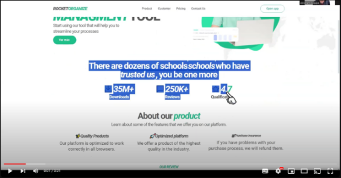

**URLs de las versiones publicadas**

- **YouTube:<https://youtu.be/7zsjHnD4HE8>**
- **Microsoft Stream: <https://lc.cx/t-SmDA>**

**Conclusiones:**

- Realizar un producto de esta magnitud significó un desafío para todo el equipo debido a la alta competitividad en otros sectores. Sin embargo, logramos hacer un producto destacable e interesante en la industria. Gracias a la landing page que captará la atención de gente interesada en ver nuestro producto, hay altas posibilidades de contactarnos para trabajar en equipo y así aumentar nuestra visibilidad en la industria. Por supuesto, para ello se investigó y analizó la competencia más destacable para nosotros y así ofrecer funciones interesantes o cuanto menos, prácticas para lograr destacarse y hacer un negocio rentable.

- A lo largo de este proceso, hemos empleado técnicas avanzadas de mapeo de experiencia del usuario como son el As-is y To-be Scenario Mappings, así como User Journey Mapping, para profundizar en las necesidades y desafíos enfrentados por nuestros usuarios ideales. Estas herramientas han sido fundamentales para identificar y abordar puntos críticos, facilitando la iteración y mejora continua de plataformas de gestión escolar. Permitiéndonos diseñar soluciones más efectivas y centradas en el usuario, mejorando significativamente la interacción con las herramientas digitales en el ámbito educativo.

- Para concluir, este proyecto de "RocketNotes" ha demostrado ser una amalgama de innovación, colaboración y compromiso, resultando en una herramienta significativamente transformadora para la gestión educativa. La aplicación no solo aborda los desafíos contemporáneos de las instituciones educativas mediante la automatización y optimización de procesos, sino que también empodera a profesores y administradores al simplificar las tareas administrativas y académicas. La validación a través de pruebas de usabilidad ha confirmado la eficacia de la interfaz y la experiencia del usuario, reflejando una mejora notable en la eficiencia y satisfacción de los usuarios finales. Este proyecto no solo ha cumplido con las expectativas establecidas, sino que ha sentado un precedente sobre cómo la tecnología aplicada inteligentemente puede revolucionar el entorno educativo, anticipando una adopción más amplia en futuras aplicaciones educativas.

**Video about the team:**

En esta sección, se elaborará un resumen de los aspectos más relevantes del video "About-The-Team". A continuación, se presenta la pauta de secuencias de contenido, incluyendo el tiempo de inicio de cada sección dentro del video (hh:mm:ss), un cuadro de video representativo, y los enlaces a las versiones publicadas en Microsoft Stream y YouTube.

1. **[00:00:01 - 00:00:42]**
   1. **Mateo Alejandro Vilchez Rios (Líder del equipo)**: Mateo introduce el proyecto, resaltando el uso de tecnologías como Vue y C#. Donde enfatiza la dedicación y profesionalidad del equipo, superando diversos desafíos.
1. **[00:00:44 - 00:01:42]**
   1. **Abraham Ayquipa Ubaldo**: Abraham explica que está enfocado en optimizar procesos en instituciones educativas para profesores y miembros administrativos. Describe su rol como desarrollador, trabajando tanto en el frontend como en el back-end.
1. **[00:01:45 - 00:02:42]**
   1. **Jose Carlo Mayuri Armas:** José detalla su responsabilidad en el desarrollo web, utilizando frameworks modernos y creando APIs robustas. Habla sobre la efectiva comunicación y colaboración del equipo a través de WhatsApp y Discord.
1. **[00:02:43 - 00:03:30]**
   1. **Belén del Rocío Ramos Ríos**: Belén comenta sobre su contribución en el desarrollo del frontend y algunas funcionalidades clave de la aplicación, además de la integración de la base de datos. Menciona cómo la comunicación constante con el equipo fue esencial para su crecimiento profesional.
1. **[00:03:32 - 00:04:01]**
   1. **Ariana Vargas Revollé:** Ariana describe su papel en la documentación del proyecto y el desarrollo de pantallas frontend y elementos backend. Destaca la experiencia positiva y el producto final como funcional e interesante.

**URLs de las versiones publicadas**

- **Microsoft Stream**: <https://upcedupe-my.sharepoint.com/:v:/g/personal/u202210059_upc_edu_pe/EajSOaCfssNKoVucu5F4CxoBpxe_KdjYZ9Gy46Dds4g-0w?e=1oXNNq&nav=eyJyZWZlcnJhbEluZm8iOnsicmVmZXJyYWxBcHAiOiJTdHJlYW1XZWJBcHAiLCJyZWZlcnJhbFZpZXciOiJTaGFyZURpYWxvZy1MaW5rIiwicmVmZXJyYWxBcHBQbGF0Zm9ybSI6IldlYiIsInJlZmVycmFsTW9kZSI6InZpZXcifX0%3D> 
- **YouTube:[** ](https://www.youtube.com/watch?v=BBK-fJ7rDvoLWWiebhDi0Djb-LZJNoVNhn4LXPbQS8Y)**https://youtu.be/f2sWz2a53yA

**Bibliografía**

Smith, J., & Doe, J. “Enhancing Efficiency in Education through Learning Management Systems: A Case Study of the Blackboard System.” Educational Technology Research and Development, vol. 65, no. 4, 2017, pp. 1023-1039. 

Vernon, V. (2013). *Implementing Domain-Driven Design*. Addison-Wesley. ISBN: 978-0321834577.

Cohn, M. (2004). *User Stories Applied: For Agile Software Development*. Addison-Wesley Professional. ISBN: 978-0321205681.

Gothelf, J., & Seiden, J. (2016). *Lean UX: Designing Great Products with Agile Teams* (2nd ed.). O'Reilly Media. ISBN: 978-1491953600.

Postman, Inc. (2020). *Postman API Platform*. Retrieved from[ https://www.postman.com/](https://www.postman.com/)

Lindsay, J. (2013). *The JSON Data Interchange Format*. ECMA International. Retrieved from <https://www.ecma-international.org/publications-and-standards/standards/ecma-404/>

**Anexos**

**Anexo A: Videos de Exposiciones**

- TB1: <https://upcedupe-my.sharepoint.com/:v:/g/personal/u202216246_upc_edu_pe/EREQPmYR2BxBkGc52WayfAMBBkCHIl8dyeu_t1q48w0TNA?nav=eyJyZWZlcnJhbEluZm8iOnsicmVmZXJyYWxBcHAiOiJTdHJlYW1XZWJBcHAiLCJyZWZlcnJhbFZpZXciOiJTaGFyZURpYWxvZy1MaW5rIiwicmVmZXJyYWxBcHBQbGF0Zm9ybSI6IldlYiIsInJlZmVycmFsTW9kZSI6InZpZXcifX0%3D&e=a6uCG0>
- TP:

  <https://upcedupe-my.sharepoint.com/:v:/g/personal/u202210059_upc_edu_pe/EalYVFLT_u9Foh-h3DSs1vEBuWAwCWUApKzeBxTWFZOGmA?e=JEZ8BG&nav=eyJyZWZlcnJhbEluZm8iOnsicmVmZXJyYWxBcHAiOiJTdHJlYW1XZWJBcHAiLCJyZWZlcnJhbFZpZXciOiJTaGFyZURpYWxvZy1MaW5rIiwicmVmZXJyYWxBcHBQbGF0Zm9ybSI6IldlYiIsInJlZmVycmFsTW9kZSI6InZpZXcifX0%3D>
- TF:

  <https://upcedupe-my.sharepoint.com/:v:/g/personal/u202210059_upc_edu_pe/EXo0yNySfRxLmSryFFnBPnwBv7ZdhhLw-dU1ZbY2-eY_yg?e=CAowD8&nav=eyJyZWZlcnJhbEluZm8iOnsicmVmZXJyYWxBcHAiOiJTdHJlYW1XZWJBcHAiLCJyZWZlcnJhbFZpZXciOiJTaGFyZURpYWxvZy1MaW5rIiwicmVmZXJyYWxBcHBQbGF0Zm9ybSI6IldlYiIsInJlZmVycmFsTW9kZSI6InZpZXcifX0%3D>

**Anexo B:** C4 MODEL: <http://c4model.com>

**Anexo C:** LINK FIGMA: <https://www.figma.com/file/pBcefWno0VR16AEy7elc2m/Open-Source?type=design&node-id=0%3A1&mode=design&t=BmgtN82Ieketfpvn-1>

**Anexo D:** LINK LANDING PAGE: <https://upc-pre-202401-si729-sw53-rocket-land.netlify.app/>

**Anexo E:** LINK TRELLO: <https://trello.com/b/fHKD9Uys/product-backlog>

**Anexo F:**LINK LEAN UX CANVAS: <https://miro.com/welcomeonboard/NEdsWTNwa0FKdWVGUmlFUEJ6R3dldkpBRHNxRmNIeEdhNWVDNHhoRnBlZENuSElYbm1hN3JjNFNwOUJpdUIzWHwzNDU4NzY0NTIzMzkyNDUwNjk1fDI=?share_link_id=776423401253>

**Anexo G :** Link de la aplicación web:<https://rocket-organize.netlify.app>
